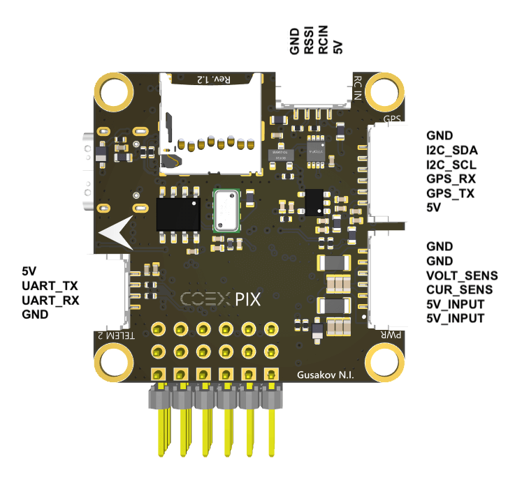

# COEX Pix

Полетный контроллер **COEX Pix** является модифицированным аналогом полетного контроллера [Pixracer](https://docs.px4.io/v1.9.0/en/flight_controller/pixracer.html). Этот полетный контроллер поставляется с наборами **Клевер 4** и далее.

> **Hint** Исходные файлы полетного контроллера COEX Pix [выложены](https://github.com/CopterExpress/hardware/tree/master/COEX%20Pix) в открытый доступ под лицензией CC BY-NC-SA.

## Ревизия 1.1

### Характеристики

* Размеры платы – 35x35 мм.
* Диаметр монтажных отверстий – 3.2 мм.
* Расстояние между центрами монтажных отверстий – 30.5 мм.
* Масса платы (без проводов) – 9 г.
* Диапазон рабочих температур – -5...+65 ºC.
* Диапазон входного напряжения – 4.8...5.5 В.

### Основные элементы

* Основной SOC – *STM32F427VIT6*.
* Память FRAM – *FM25V02A*.
* Датчики:
  * *MPU9250* (9 DOF) – 3-х осевой магнитометр, 3-х осевой гироскоп, 3-х осевой акселерометр.
  * *MS5607* – датчик атмосферного давления.

### Разъемы

* *TELEM 1* (JST-GH 4 pin) – разъем для подключения телеметрии, порт 1, протокол UART.
* *TELEM 2* (JST-GH 4 pin) – разъем для подключения телеметрии, порт 2, протокол UART.
* *GPS* (JST-GH 6 pin) – разъем для подключения ГПС модуля (UART) с компасом (I2C).
* *I2C* (JST-GH 4 pin) – разъем для подключения поддерживаемых I2C устройств.
* *PWR* (JST-GH 6 pin) – разъем для подключения питания с платы COEX PDB или аналогичной, датчиков напряжения и тока.
* *RC IN* (JST-GH 4 pin) – разъем для подключения радиоприемника аппаратуры радиоуправления, канала для * снятия показаний RSSI. Поддерживаемые RC протоколы – PPM и SBUS.
* Разъем Micro USB – для подключения к ПК для настройки и коммуникации по протоколу USB 2.0/1.1
* Слот для карты памяти MicroSD, до 32 ГБ.
* Серворазъемы – для подключения контроллеров моторов и других устройств.

### Схемы расположения контактов

> **Note** На плате ревизии 1.0 RC IN разъем располагался на месте разъема Micro SD. Распиновка самого разъема осталась такой же.

### Установка на Клевере

**Важно**: плата спроектирована для удобной установки на Клевере с поворотом на 180º по крену и 90º по рысканью (стрелка на плате находится снизу и указывает направо). Таким образом, параметр ориентации автопилота PX4 устанавливается в значение `SENS_BOARD_ROT` = `ROLL 180, YAW 90`.

### Рекомендации

Во время установки полетного контроллера, учитывайте возможные влияния магнитных полей от силовых проводов и платы распределения питания на магнитометр. В случае установки данной платы над платой распределения питания, рекомендуется (в случае использования внутреннего магнитометра) поднять плату на высоту не менее 15 мм от платы распределения питания и силовых проводов. Силовой провод от аккумуляторной батареи старайтесь зафиксировать соответственно.

В случае использования внешнего GPS модуля со встроенным магнитометром, внутренний магнитометр рекомендуется отключать.

В случае, если на дроне не предусмотрен защитный кожух, рекомендуется изолировать барометр поролоновой губкой (достаточно подложить губку между полетным контроллером и нижней частью корпуса (платой распределения питания), либо зафиксировать иным способом.

При подключении питания в разъем PWR, на разъеме **+** будет напряжение 5 вольт, его можно использовать для питания сервомашинок. Не рекомендуется подключать дополнительные источники питания в разъем **+**, если питание подается в разъем PWR. Питать полетный контроллер одновременно от USB и PWR\AUX разъемов допускается.

### Особенности платы

Для повышения надежности и стабильности, плата оснащена низкошумящими понижающими преобразователями. Установлен входной LC фильтр, а также ферритовые фильтры в цепях питания.

## Ревизия 1.2

### Нововведения

* Заменен разъем USB Micro-B на разъем USB Type-C.
* Изменен слот для MicroSD карт, на более глубокий.
* Изменены назначения пинов на разъеме I2C.
* Добавлены ферритовые фильтры в цепи питания.

### Схемы расположения контактов

