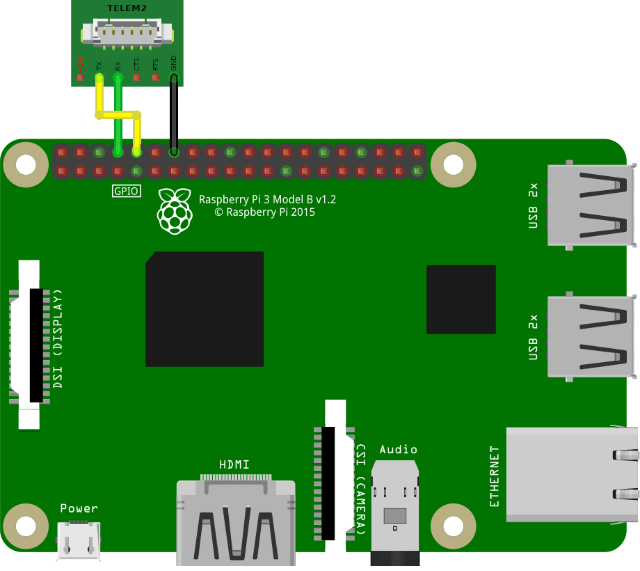

# Подключение Raspberry Pi к полетному контроллеру

Для программирования [автономных полетов](simple_offboard.md), [работы с Pixhawk (Pixracer) по Wi-Fi](gcs_bridge.md), использования [телефонного пульта](rc.md) и других функций необходимо соединение Raspberry Pi и полетного контроллера.

## Подключение по USB

Основным способом подключения является подключение по интерфейсу USB.


1. Соедините Raspberry Pi и полетный контроллер micro-USB to USB кабелем.
2. [Подключитесь в Raspberry Pi по SSH](ssh.md).
3. Убедитесь в работоспособности подключения, [выполнив команду на Raspberry Pi](cli.md):

    ```bash
    rostopic echo /mavros/state
    ```

    Поле `connected` должно содержать значение `True`.

> **Hint** Для корректной работы подключения Raspberry Pi и Pixhawk по USB необходимо установить значение [параметра](parameters.md) `CBRK_USB_CHK` на 197848.

## Подключение по UART

Дополнительным способом подключения является подключение по интерфейсу UART.



Если обозначенный пин GND занят, можно использовать другой свободный, используя [распиновку](https://pinout.xyz).

1. Подключите Raspberry Pi к полетному контроллеру по UART. Для этого соедините кабелем порт TELEM 2 на полетном контроллере к пинам на Raspberry Pi следующем образом: черный провод (GND) к Ground, зеленый (*UART_RX*) к *GPIO14*, желтый (*UART_TX*) к *GPIO15*. Красный провод (*5V*) подключать не нужно.
2. В PX4 версии v1.9.0 и выше измените значения параметров PX4: `MAV_1_CONFIG` на TELEM 2, `SER_TEL2_BAUND` на 921600 8N1. В PX4 [до версии v1.9.0](https://github.com/mavlink/qgroundcontrol/issues/6905#issuecomment-464549610) необходима установка параметра `SYS_COMPANION` в значение `Companion Link (921600 baud, 8N1)`, для его корректной установки используйте старую версию QGC [v3.3.1](https://github.com/mavlink/qgroundcontrol/releases/tag/v3.3.1).
3. [Подключитесь в Raspberry Pi по SSH](ssh.md).
4. Проверьте наличие параметров `enable_uart=1` и `dtoverlay=pi3-disable-bt` в файле `/boot/config.txt`, [выполнив команду на Raspberry Pi](cli.md):

    ```bash
    cat /boot/config.txt | grep -E "^enable_uart=.|^dtoverlay=pi3-disable-bt"
    ```

    Если параметры в файле отличаются или отсутствуют, то отредактируйте файл и перезагрузите Raspberry Pi.

5. Поменяйте в launch-файле Клевера (`~/catkin_ws/src/clover/clover/launch/clover.launch`) тип подключения с `usb` на `uart`:

    ```xml
    <arg name="fcu_conn" default="uart"/>
    ```

    При изменении launch-файла необходимо перезапустить сервис `clover`:

    ```bash
    sudo systemctl restart clover
    ```

6. Убедитесь в работоспособности подключения:

    ```bash
    rostopic echo -n1 /mavros/state
    ```

    Поле `connected` должно содержать значение `True`.

Дополнительная информация: https://docs.px4.io/main/en/peripherals/serial_configuration.html.

**Далее**: [Подключение QGroundControl по Wi-Fi](gcs_bridge.md).
