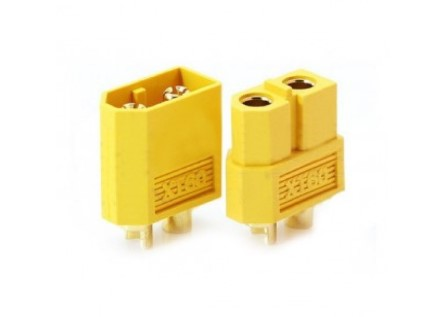
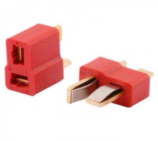
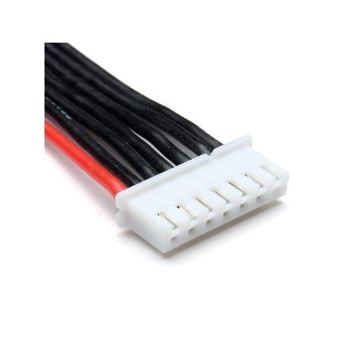
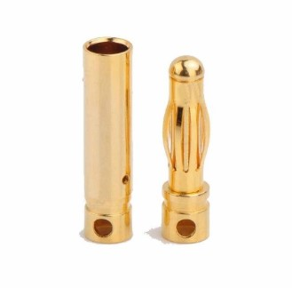

# Типы силовых разъемов

## XT-60

Один из самых надёжных силовых разъёмов, которые стараются применять на силовых аккумуляторах. Именно такие аккумуляторы используются на Li-Po аккумуляторах для коптеров.

## T-plug

Аналог XT-60. Имеет различные вариации для упрощения разъединения.

## JST-XH или балансировочный разъем

Разъёмы данного типа часто применяются для балансировки отдельных элементов в составе сборки из нескольких литий-полимерных (Li-Pol), литий-ионных (Li-ion) или литий-фосфатных (LiFePO4) аккумуляторов.
Подобные разъёмы с разным количеством штырьков устанавливаются в большинство современных зарядных устройств для балансировки литиевых элементов при заряде.
Может использоваться в сочетании с Buzzer (пищалкой) для контроля заряда аккумулятора.

## Gold Bullet Connector или "Бананы"

Существует великое множество штырьковых разъёмов типа Gold Bullet Connector. Разъёмы данного типа отличаются друг от друга диаметром и размером. Наиболее распространены разъёмы с диаметром коннектора 2 мм, 3 мм и 4 мм.
Часто используется для создания беспаечных соединений на PDB и моторах.

