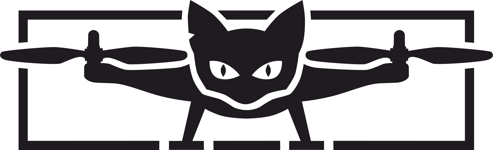
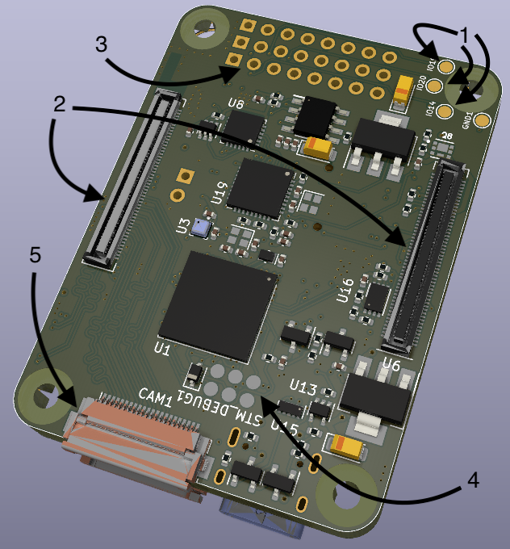
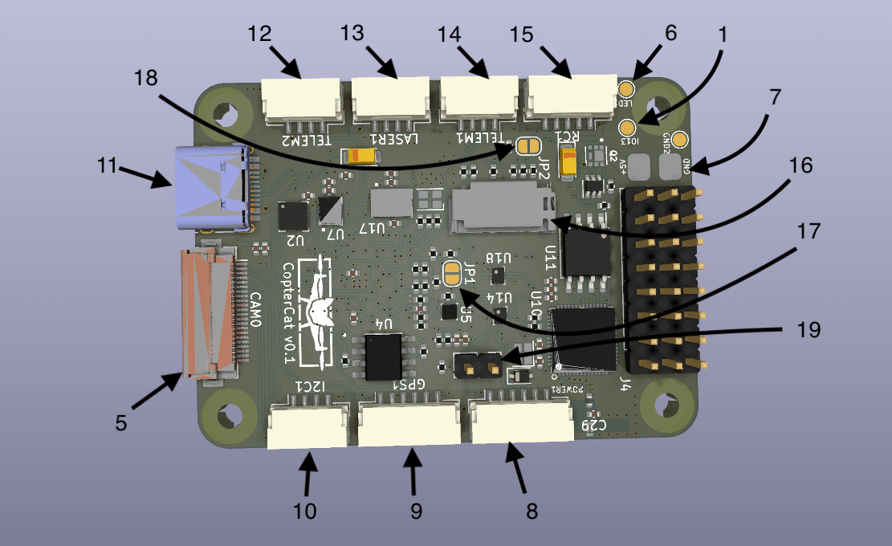

# CopterCat_cm4

[CopterHack-2022](copterhack2022.md), команда **CopterCat**.

## Информация о команде

Состав команды:

* Лапин Матвей (https://t.me/l_motya), инженер/программист.
* Коновалов Евгений (https://t.me/egnknvlv), инженер/друг.
* Скандаков Егор (https://t.me/hjbaa), друг.
* Джалилов Эмиль, друг.

## Описание проекта

Разработка современной платы под прошивку PX4 FMUv6U, разерами 55x40 мм и дополнительным модулем WiFi для реализации классных штук, например, распределённой сети.

### Идея проекта

Полётник на stm32h7 с местом для RPi CM4 и встроенной ESP32 для создания распределённой сети.

### Планируемые результаты

Плата полётного контроллера FMUv6U и API для взаимодействия с распределённой сетью через RPi.

### Использование платформы "Клевер"

На этапе проекта: отладка и демонстрация возможностей. После: использования CopterCat в качестве основного.

## Спецификация

### FMU

* STM32H753IIK6 480Mhz Cortex-M7
* 2Mb + 256Kb FLASH
* 1Mb RAM
* ICM20602, ICM42605, BMI088, BMP388, BMM150
* Полностью совместима со стандартом FMU-v6u

### Raspberry Pi

* Поддержка платы RPi CM4.
* Слот для SD-карты.
* Возможность прошивки встроенной eMMC.
* CAT24C256 EEPROM.
* Поддержка 2-х камер (CAM0-две линия, CAM1-четыре линии).
* Поддержка USB-OTG.

### ESP32

* 16MB внешней FLASH (W25Q128JVS).
* 8MB внешней PSRAM (LY68L6400SLIT).
* Встроенная антенна.
* USB-TTL конвертор.

### Остальное

* USB-HUB USB2514B.
* USB-PD с физическим переключением.
* Связь ESP32 и STM32 через UART.
* 3 варианта питания.
* 4 универсальных GPIO от ESP32.
* USB Type-C.
* Размеры 40x55 мм, плата 4 слоя.

## Разъёмы и перемычки

1. GPIO ESP32 4 порта ввода вывода для подключения внешнего оборудования.
2. Коннекторы RPi CM4.
3. Выводы ESC 8 шт.
4. Контакты программирования и отладки JTAG STM32.
5. Коннекторы камер (шлейф 22 контакта с 0.5 мм расстояния между проводниками).
6. Контакт подключения адресной ленты.
7. Контакты основного питания 5В.
8. JST-6 стандартного шлейфа питания PX4.
9. JST-6 GPS+компас+5В.
10. JST-4 I2C+5В.
11. USB Type-C.
12. JST-4 UART7+5В.
13. JST-4 I2C RPi+3.3B для подключения дальномера.
14. JST-4 UART5+5В.
15. JST-5 Стандартный разъём для подключения приёмника управления.
16. Слот SD карты (для RPi).
17. Джампер BOOT для STM32.
18. Джампер RPIBOOT для прошивки eMMC модуля RPi CM4.
19. Джампер переключения режима работы USB разъёма (при замкнутой перемычке, USB работает как вход HUB и при подключении к компьютеру будут отображаться STM32, ESP32 и RPi CM4 в режиме OTG; при разомкнутой перемычке, USB будет работать для подключения внешних устройств к RPi, например стереокамеры).

## Загрузка прошивки

### FMU

При первом запуске, в микроконтроллер придётся загрузить PX4-bootloader через порт JTAG. Подробная инструкция [здесь](https://docs.px4.io/master/en/software_update/stm32_bootloader.html#stm32-bootloader).

Для подключения к компьютеру:

1. Замкните перемычку 19.
2. Подключите USB Type-C к компьютеру.
3. Устройство должно появиться в [QGC](http://qgroundcontrol.com).

Также прошивку можно произвести через RPi:

1. Установите RPi CM4 в коннектор на плате.
2. Разомкните перемычку 19.
3. Устройство появиться в папке `/dev` на RPi.

### ESP32

Написать программу можно либо в [Arduino IDE](https://www.arduino.cc/en/software), либо в [VS Code](https://code.visualstudio.com) с плагином [esp-idf](https://habr.com/ru/post/530638/). Далее скомпилировать и загрузить в микроконтроллер. Загрузить можно двумя способами.

С компьютера:

1. Замкните перемычку 19
2. В подключённых устройствах появиться CP2104
3. Загрузите прошивку в соответствии с инструкцией к выбранной IDE

С RPi CM4:

1. Установите RPi CM4 в коннектор на плате.
2. Разомкните перемычку 19.
3. Скомпилируйте ваш код в .bin формат.
4. Загрузите полученный файл на RPi.
5. Загрузите прошивку в микроконтроллер с помощью esptool.py ([описание+установка](https://docs.espressif.com/projects/esptool/en/latest/esp32/index.html)).

### RPi CM4

Слот SD карты работает как на стандартной RPi. Для плат с eMMC порядок загрузки операционной системы не отличается от CM4 IO Board ([инструкция](https://www.jeffgeerling.com/blog/2020/how-flash-raspberry-pi-os-compute-module-4-emmc-usbboot)).

## Общая информация

* Все требуемые для заказа файлы находятся в папке `/gerbers`.
* Проект выполнен в программе [KiCAD v6](https://www.kicad.org).
* Библиотеки компонентов взяты с сайта [snapeda](https://www.snapeda.com).
