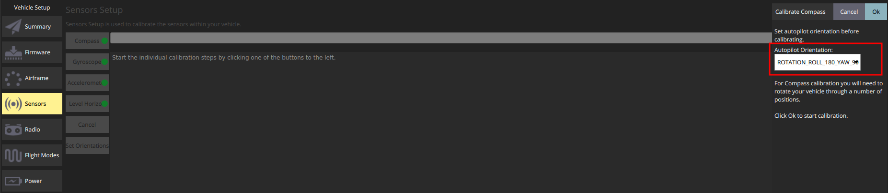

# Copter Hack 2019

Хакатон [Copter Hack 2019](https://copterexpress.timepad.ru/event/1017592/) проходит 11–13 октября в Технополисе "Москва".

Официальный сайт: https://ru.coex.tech/copterhack.

Чат хакатона: https://t.me/CopterHack.

Timepad: https://copterexpress.timepad.ru/event/1017592/.

## Информация для участников

### Особенности настройки полетного контроллера COEX PIX

При использовании полетного контроллера *COEX Pix* перед калибровкой датчиков вам стоит обратить внимание, что в графе *Autopilot orientation* вы должны выбрать параметр `ROTATION_ROLL_180_YAW_90`. Данную настройку требуется проводить при калибровке каждого из датчиков.



Этот параметр устанавливается для того, чтобы на программном уровне настроить ориентацию вашего *IMU* датчика находящегося на полетном контроллере.

### Рекомендуемая версия образа

Для Raspberry Pi версий до 3B+: [v0.18](https://github.com/CopterExpress/clover/releases/tag/v0.18)

Для Raspberry Pi версии 4: [v0.19-alpha.1](https://github.com/CopterExpress/clover/releases/tag/v0.19-alpha.1)

### Ориентация камеры

На многих дронах камера ориентирована шлейфом вперёд. Это следует отразить в файле `main_camera.launch` в пакете `clever`.

Подробнее см. статью [Ориентация камеры](camera_setup.md).

### Полет с использованием Optical Flow

Для включения optical flow установите параметры `optical_flow` и `rangefinder_vl53l1x` в файле `clever.launch` в `true`.

Также необходимо в QGroundControl в параметре `LPE_FUSION` включить галочку `pub agl as lpos down`.

Необходимо также убедиться, что лазерный дальномер корректно установлен и работает (см. [конфигурирование дальномера](laser.md)).

Подробнее: [Использование Optical Flow](optical_flow.md).

### Использование карты маркеров

Для настройки большой карты маркеров используйте карту с названием `cmit.txt`. Далее используйте [инструкцию](aruco_map.md).

### Аккумуляторы

**При полетах обязательно использование датчика напряжения ("пищалки"). В случае выхода из строя аккумулятора новый не предоставляется!**

### Съемка видео

Снимайте **ВСЕ** ваши полеты на видео! В случае поломки дрона на защите сможете показать видео, что будет учтено при оценке.

### Проблема с yaw

При полете по маркерам (VPE) в прошивке v1.8.2-clever.7 возможно есть ошибка, которая проявляется в том, что дрон не держит yaw по маркерам. Если у вас есть такая проблема, попробуйте залить более старую прошивку v1.8.2-clever.6, доступную по ссылке https://github.com/CopterExpress/Firmware/releases/tag/v1.8.2-clever.6. Для COEX Pix необходимо скачивать файл `px4fmu-v4_default.px4`.

### Проблема с navigate

В образе 0.18 обнаружился баг из-за которого дрон может летать по точкам слишком быстро. Если у вас это происходит, поставьте в файле `~/catkin_ws/src/clever/clever/launch/clever.launch` параметр `nav_from_sp` в значение `false` таким образом:

```xml
<!-- simplified offboard control -->
<node name="simple_offboard" pkg="clever" type="simple_offboard" output="screen" clear_params="true">
    <param name="reference_frames/body" value="map"/>
    <param name="reference_frames/base_link" value="map"/>
    <param name="reference_frames/navigate_target" value="map"/>
    <param name="reference_frames/navigate_target" value="map"/>
    <param name="nav_from_sp" value="false"/>
</node>
```

## Лекции

Лекция 1: введение – https://www.youtube.com/watch?v=cjtmZNuq7z0.

Лекция 2: настройка полетного контроллера – https://www.youtube.com/watch?v=PJNDYFPZQms.

Лекция 3: архитектура полетного контроллера PX4 – https://www.youtube.com/watch?v=_jl7FImq3jk.

Лекция 4: автономные полеты: https://www.youtube.com/watch?v=ThXiNG1IzvI.

См. также другие видео на канале COEX на YouTube: https://www.youtube.com/channel/UCeCu93sLBkcgbIkIC7Jaauw/featured.

## Результаты

Команды-победители:

1. Бульболет – доставка картошки с помощью умной лебедки.
2. Copter don't hurt me – управление дроном с помощью нейроинтерфейса.
3. import torch – active track на нейронках.
4. Автобот – freeze light через бота ВКонтакте.
5. Stardust Crusaders – AR среда симуляции для дронов.
