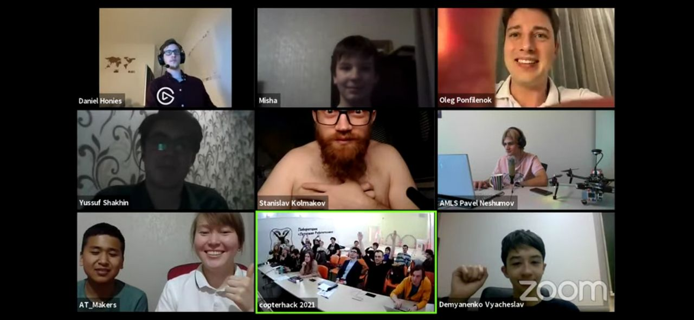
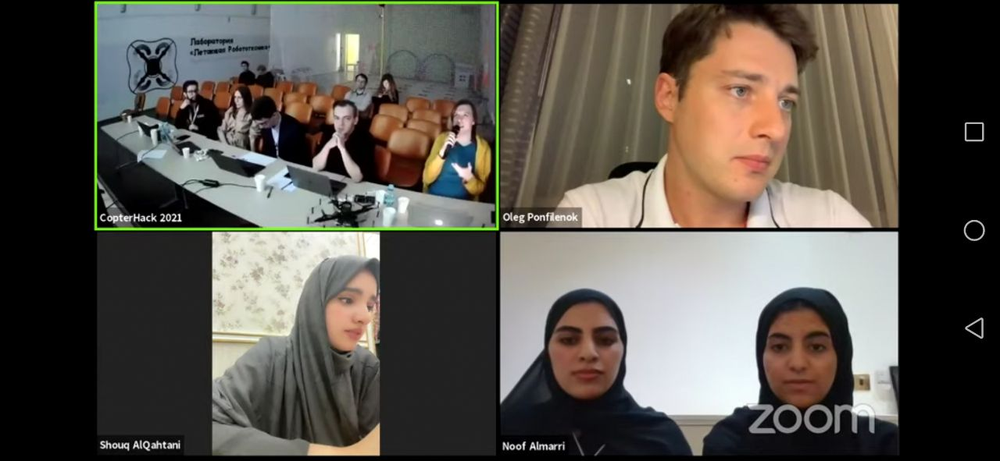

# CopterHack 2021

CopterHack 2021 – это командный конкурс по разработке проектов с открытым исходным кодом для платформы квадрокоптера "Клевер". В конкурсе приняло участие 54 команды из 12 стран.

Все информацию о мероприятии смотрите на официальном сайте: https://ru.coex.tech/copterhack.

Полная запись трансляции финала: https://www.youtube.com/watch?v=Z06vxuAHmuE.

    
    

## Видео

<iframe width="560" height="315" src="https://www.youtube.com/embed/YpMT6ab8Exw" frameborder="0" allow="accelerometer; autoplay; encrypted-media; gyroscope; picture-in-picture" allowfullscreen></iframe>

## Отчетные статьи команд-участников

|Место|Команда|Проект|Балл|
|-|-|-|-|
|1|🇧🇾 FTL|[AdvancedClover](advanced_clover.md)|18.8|
|2|🇷🇺 EasyToFly|[EasyToFly](easytofly.md)|18.5|
|3|🇩🇪 ADDI|[3D-printed generative design frame](../en/generative_design_frame.html)|17.8|
|4|🇰🇬 AT Makers|[Граффити-коптер D-drone](ddrone.md)|16.7|
|5|🇶🇦 DroMap|[The Indoor Mapping Drone](../en/dromap.html)|16.5|
|6|🇰🇬 MINIONS|[Дрон для высаживания семян](seeding_drone.md)|15.5|
|7|🇷🇺 Хардатон|[Хардатон Квиддич](hardaton_quidditch.md)|15.48|
|8|🇷🇺 Atomic Ferrets|[Система засечки для дронов](race_timing_sys_copterhack.md)|15|
|9|🇷🇺 Drones to fight Corona|[Drones to fight Corona](../en/anticorona_drones.html)|14.6|
|10|🇷🇺 AMLS|[Система автоматической посадки](amls.md)|12.8|
|11|🇷🇺 PаD30DЖ|[Октокоптер со специфичным расположением пропеллеров](oktazodg.md)|11.6|
|12|🇷🇺 Зауральский Викинг|[Программируемый летающий автомобиль](zaural_viking.md)|11.4|
|13|🇨🇦 Bennie and the Jetson TX2|[Retail Drone](../en/bennie.html)|9.8|
|14|🇳🇱 Blue Jay Eindhoven|[Designing a drone and a path planning algorithm](../en/blue_jay_eindhoven.html)|9.6|
|15|🇷🇺 ProCleVeR|[Разработка системы для управления БПЛА с помощью шлема виртуальной реальности](remote-control-with-oculusvr.md)|8.5|
|16|🇷🇺 Quadrotor|[Дрон-Агроном](drone-agronom.md)|7.7|

Смотрите оценки по критериям в [полной таблице](https://docs.google.com/spreadsheets/d/1L9NDrw4c4vTCIVR3aC8ErAjxnuBg-Afil9AwUQZVJ5I/edit?usp=sharing).
