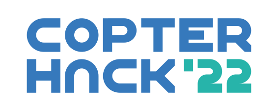
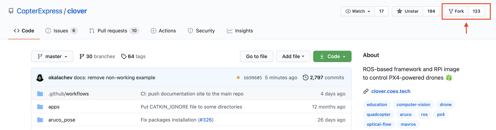
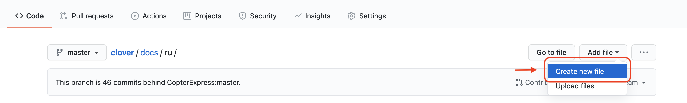
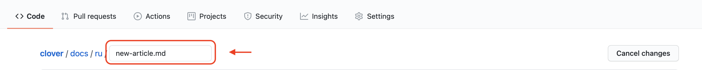
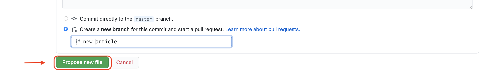
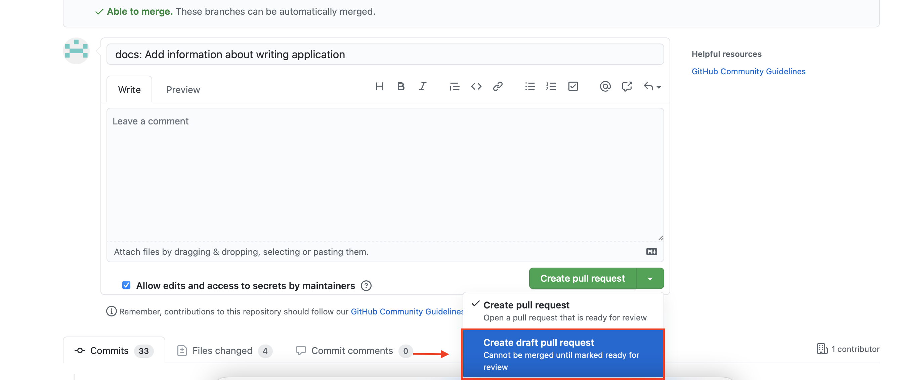

# CopterHack 2022



CopterHack 2022 — это международный конкурс по разработке проектов по летающей робототехнике с открытым исходным кодом. CopterHack 2022 имеет основное направление со свободным выбором темы проекта, а также отдельную номинацию "кейсы компании". Основным языком конкурса является английский.

Ознакомиться со статьями команд-финалистов предыдущего года можно в статье о [CopterHack 2021](copterhack2021.md).

На конкурс принимаются проекты с открытым исходным кодом и совместимые с платформой квадрокоптера "Клевер". На протяжении конкурса команды работают на собственными идеями и разработками, приближая их к состоянию готового продукта. В этом участникам помогают эксперты отрасли через лекции и регулярную обратную связь.

## Проекты участников конкурса {#participants}

|Место|Команда|Проект|Балл|
|:-:|-|-|-|
||🇰🇬 Alatoo University Team|[Облачная платформа для симулятора Клевера](https://github.com/pteacher/clover/blob/clover_simulator/docs/ru/clover-development-studio.md)||
||🇧🇾 FTL|[Advanced Clover 2](https://github.com/FTL-team/clover/blob/FTL-advancedClover2/docs/ru/advanced_clover_simulator.md)||
||🇷🇺 Stereo|[Neural obstacle avoidance](https://github.com/den250400/clover/blob/neural-obstacle-avoidance/docs/en/neural-obstacle-avoidance.md)||
||🇷🇺 Space clowns|[Copter For Space](https://github.com/slavikyd/clover/blob/patch-3/docs/ru/c4s.md)||
||🇷🇺 R.S.|[Drone Hawk](https://github.com/slavaroot/clover/blob/droneHawkSecurity/docs/ru/drone-hawk-security.md)||
||🇲🇾 Moopt|[IoT Water Monitoring & Optimization](https://github.com/kafechew/clover/blob/master/docs/en/moopt-uav.md)||
||🇧🇷 Atena - Grupo SEMEAR|[Swarm in Blocks](https://github.com/Grupo-SEMEAR-USP/clover/blob/Swarm_in_Blocks/docs/en/swarm_in_blocks.md)||
||🇷🇺 Clevertron|[Clevertron](https://github.com/Daniel-drone/clover/blob/Clevertron-1/docs/ru/clevertron.md)||
||🇷🇺 Clover Rescue Team|[Rescue Clover](https://github.com/DevMBS/clover/blob/CloverRescueTeam/docs/ru/clover-rescue-team.md)||
||🇵🇱 Edgenoon|[Neural and vision-based landing method](https://github.com/edgenoon-ai/clover/blob/neural_vision_based_landing_method/docs/en/neural_vision_based_landing_method.md)||
||🇷🇺 CopterCat|[CopterCat](https://github.com/matveylapin/clover/blob/CopterCat/docs/ru/сopter_сat.md)||
||🇷🇺 Дрой Ронов|[Clover Swarm](https://github.com/stinger000/clever/blob/clover_swarm_request/docs/ru/clover-swarm.md)||
||🇩🇪 Inondro|[Inondro Pix](https://github.com/Inondro/clover/blob/inondro-pix/docs/en/inondro_copterhack22_pix.md)||
||🇮🇳 DJS Phoenix|[Autonomous valet parking drone assistance](https://github.com/DJSPhoenix/clover/blob/DJSPhoenix-Ikshana/docs/en/djs_phoenix_ikshana.md)||
||🇷🇺 SPECTRE|[SPECTRE](https://github.com/alakhmenev/clover/blob/spectre_team/docs/ru/spectre_team.md)||
||🇷🇺 SolidEye|[Разработка лидара без движущихся частей](https://github.com/feanorgg/clover/blob/solideye/docs/ru/solid_eye.md)||
||🇰🇬 AI_U_CLOVER|[AIU_CLOVER](https://github.com/zhibekm/clover/blob/zhibekm-patch-1/docs/en/aiu-article.md)||
||🇷🇺 С305|[Система мониторинга воздуха](https://github.com/Ruslan2288/clover/blob/master/docs/ru/air_monitor.md)|&nbsp;|
|✕|🇻🇳 Dragon&Tanker|[Dragon&Tanker](https://github.com/uml4/clover/blob/drone_observe_autonomous_car/docs/en/dragon_and_tanker_team.md)||
|✕|🇷🇺 V-NAV|[Visual Navigation](https://github.com/v-nav/clover/blob/v-nav_article/docs/ru/v-nav.md)||
|✕|🇷🇺 Джедаи 1581|[Ретранслятор на базе Клевера](https://github.com/JJNIK/clover/blob/patch-1/docs/ru/1581.md)||
|✕|🇷🇺 Lucky flight|[Swarm of Improved Clover](https://github.com/bessiaka/clover/blob/Lucky-flight/docs/ru/lucky_flight.md)||
|✕|🇺🇸 EnviroFleet|[EnviroFleet](https://github.com/gueyman/clover/blob/envirofleet/docs/en/enviro_fleet.md)||
|✕|🇷🇺 Бизнес-гуси|[Drone Rover Climbing System](https://github.com/HexaHEX/clover/blob/CopterHack2022_Business_Geese-1/docs/ru/business_geese.md)||
|✕|🇷🇺 fuall|[Доставка дронами](https://github.com/Silly4s/clover/blob/master/docs/ru/dostavka.md)||
|✕|🇷🇺 Scout_Drone|[Создание поисково-спасательного беспилотного летательного аппарата](https://github.com/MustafaNatur/clover/blob/Scout_Drone.md/docs/ru/scout_drone.md)|&nbsp;|

✕ – команды, не дошедшие до финала.

## Направление "кейс компании"

Команды приглашаются принять участие в работе над следующими кейсами компании:

1. Разработка платы полетного контроллера Pixhawk FMUv6U размером 55*40 мм и возможностью установки Raspberry Pi CM4.
2. Облачная платформа для [симулятора Клевера](https://clover.coex.tech/ru/simulation.html) по аналогии или на основе [ROS Development Studio](https://app.theconstructsim.com/).

Список кейсов может быть расширен.

## Этапы CopterHack 2022

Отборочный и проектный этапы конкурса проходят в онлайн-формате, формат проведения финала – гибридный (оффлайн + онлайн). Конкурс подразумевает ежемесячные апдейты от команд с получением регулярной обратной связи от жюри. Для участия в заключительном этапе необходимо подготовить финальное видео и презентацию о результатах проекта.

1. Отборочный этап. Подача заявок (10 июня — 31 октября 2021).
2. Проектный этап. Менторство проектов (10 июня 2021 — 28 февраля 2022).
3. Подготовка финального видео (1 — 31 марта 2022).
4. Заключительный этап. Финальная защита проектов на английском языке (9 — 10 апреля 2022).

## Условия и критерии оценки

Условия, предъявляемые к проектам:

1. Открытый исходный код/модели/схемы/чертежи.
2. Совместимость с платформой "Клевер".

Критерии оценивания жюри в финале:

1. Готовность и статья (макс. 10 баллов): степень готовности проекта; доступное и понятное описание проекта в статье; прикреплены код с комментариями, схемы, чертежи. По статье должно быть возможно повторить проект, получить результат.
2. Объем проделанной работы (макс. 6 баллов): объем проделанной командой работы в рамках CopterHack 2022, ее сложность и технический уровень.
3. Полезность для Клевера (макс. 6 баллов): актуальность применения на практике в платформе Клевер и PX4, потенциальный уровень спроса на разработку со стороны других пользователей Клевера.
4. Презентация на финале (макс. 3 балла): качество и зрелищность финальной презентации; полнота освещения проекта; демонстрация; ответы на вопросы жюри.

## Призовой фонд

Основное направление конкурса предполагает следующие призы от компании COEX по результатам оценивания жюри на финале:

* I место: $3000.
* II место: $2000.
* III место: $1000.
* IV место: $500.
* V место: $500.

Партнеры конкурса могут поощрить команды по дополнительным критериям, выявленным в результате оценки проектов в ходе финала.

Номинация "кейс компании" предоставляет приз от компании COEX для дальнейшего развития проекта в размере $2500 для команды с лучшим результатом по каждому из кейсов.

## Как подать заявку?

> **Note** Для подачи заявки необходимо иметь аккаунт на [GitHub](https://github.com).

Подготовьте вашу заявку и пришлите ее в виде Draft Pull Request в [репозиторий Клевера](https://github.com/CopterExpress/clover).

1. Сделайте форк репозитория Клевера:

    

2. На странице вашего форка зайдите в раздел `docs/ru` и создайте новый файл в формате [Markdown](https://ru.wikipedia.org/wiki/Markdown):

    

3. Введите название вашей статьи. Например, `new-article.md`

    

4. Оформите вашу заявку в соответствии с рекомендуемым шаблоном:

   ```markdown
   # Название проекта
   
   [CopterHack-2022](copterhack2022.md), команда **Название команды**.
   
   ## Информация о команде
   
   Состав команды:
   
   (Опишите состав команды: имя и фамилия, контакты (e-mail/имя пользователя в Telegram), роль в команде).
   
   * Александр Соколов, @aleksandrsokolov111, инженер.
   * Елена Смирнова, @elenasmirnova111, программист.
   
   ## Описание проекта
   
   ### Идея проекта
   
   Опишите кратко идею и стадию проекта.
   
   ### Планируемые результаты
   
   Опишите как вы видите результат проекта.
   
   ### Использование платформы "Клевер"
   
   Опишите как в вашем проекте будет использоваться платформа "Клевер".
   
   ### Дополнительная информация по желанию участников
   
   Например, информация об опыте работы команды над проектами, прикрепить ссылку на статьи, видео.
   ```

5. Перейдите вниз страницы и создайте новую ветку с названием вашей статьи:

    

    > **Note** Не добавляйте ваши изменения непосредственно в ветку `master`, создайте новую ветку.

6. При необходимости поместите дополнительные визуальные материалы в папку `docs/assets` и оформите на них ссылки в вашей статье.

7. Сделайте Draft Pull Request вашей ветки в master Клевера:

    

8. В комментариях Pull Request вам будет дана обратная связь по заявке. На страничке конкурса в разделе "Проекты участников конкурса" будет опубликована ссылка на вашу заявку в вашем форке.

9. Обратите внимание на блок *Checks*, в графе Documentation должна стоять галочка. Если там стоит крестик, перейдите по ссылке *Details*, чтобы увидеть список проблем с оформлением статьи. При необходимости изменения добавляемых файлов, меняйте их в вашей ветке – изменения будут появляться в Pull Request автоматически. **Не создавайте новый Pull Request для одной и той же заявки**.

10. На протяжении конкурса вы будете работать над этим документом, приближая его к состоянию статьи. В документе будет видна история разработки и ежемесячные апдейты. К финалу конкурса вы сможете опубликовать вашу статью, это и будет результат вашей работы в CopterHack.

Как только ссылка на заявку будет добавлена на эту страничку в раздел "Проекты участников конкурса", ваша команда стала официальным участником CopterHack 2022!

Участники конкурса будут добавлены в Telegram-группу, куда можно отправлять первый апдейт и получить обратную связь от Жюри. Для команд-участников предусмотрена скидка 50% на конструктор программируемого квадрокоптера "Клевер".

> **Info** Ограничения по возрасту, образованию и количеству человек в команде отсутствуют.

---

По всем вопросам: [CopterHack 2022](https://t.me/CopterHack).
