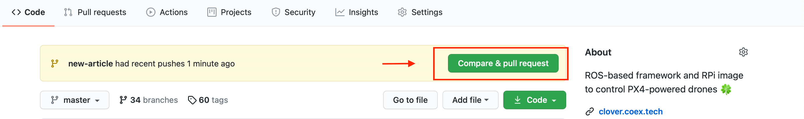

# CopterHack 2022

CopterHack 2022 – это международный конкурс по разработке проектов по летающей робототехнике с открытым исходным кодом. CopterHack 2022 имеет основное напрвление со свободным выбором темы проекта, а также отдельную номинацию "Кейсы компании". Основным языком конкурса является английский язык.

Ознакомиться со статьями команд-финалистов CopterHack 2021 можно по ссылке: https://clover.coex.tech/ru/copterhack2021.html

На конкурс принимаются  проекты с открытым исходным кодом и совместимые с платформой квадрокоптера "Клевер". На протяжении конкурса команды работают на собственными идеями и разработками, приближая их к состоянию готового продукта. В этом участникам помогают эксперты отрасли через лекции и регулярную обратную связь.

## Направление "Кейс компании"

Команды приглашаются принять участие в работе над следующими кейcами компании:

1. Модификация прошивки PX4 версии v1.12.0 под Клевер.
2. Разработка платы полетного контроллера PX4 v.4 на основе COEX Pix размером 55*40 мм и возможностью установки Raspberry Pi CM4.

     * Список кейсов будет расширяться.
 
## Этапы CopterHack 2022

Отборочный и проектный этапы конкурса проходят в онлайн-формате, формат проведения финала - гибридный (оффлайн+онлайн). Конкурс подразумевает ежемесячные апдейты от команд с получением регулярной обратной связи от жюри. Для участия в заключительном этапе необходимо подготовить финальное видео и презентацию о результатах проекта.

1. Отборочный этап. Подача заявок (1 июня – 31 октября 2021).
2. Проектный этап. Менторство проектов (1 июня 2021 – 28 февраля 2022).
3. Подготовка финального видео (1 – 31 марта 2022).
4. Заключительный этап. Финальная защита проектов на английском языке (9 – 10 апреля 2022).

## Условия и критерии оценивания финального результата

Условия, предъявляемые к проектам:
1. Открытый исходный код/модели/схемы/чертежи.
2. Совместимость с платформой "Клевер".

Критерии оценивания жюри на финале: 
1. Готовность и статья (макс. 10 баллов): степень готовности проекта; доступное и понятное описание проекта в статье на GitBook; прикреплены код с комментариями, схемы, чертежи. По статье можно повторить проект, получить результат.
2. Объем проделанной работы (макс. 6 баллов): объем проделанной командой работы в рамках CopterHack и для CopterHack, ее сложность и технический уровень.
3. Полезность для Клевера (макс. 6 баллов): актуальность применения на практике в платформе Клевер и PX4, потенциальный уровень спроса на разработку со стороны других пользователей Клевера.
4. Презентация на финале (макс. 3 балла): качество, зрелищность и интересность финальной презентации; полнота освещения проекта; демонстрация; ответы на вопросы.

## Призовой фонд

Основное направление конкурса предполагает следующие призы от компании COEX по результатам оценивания жюри на финале:  
  I место – $3000   
  II место – $2000   
  III место – $1000   
  IV место – $500   
  V место – $500 

     * Партнеры конкурса могут поощрить команды по дополнительным критериям, выявленным в результате оценки проектов в ходе финала;

Номинация "Кейс компании" предоставляет приз от компании COEX для дальнейшего развития проекта в размере $2500 для команды с лучшим результатом по каждому из кейсов.

## Как подать заявку?

> **Note** Для подачи заявки необходимо иметь аккаунт на [GitHub](https://github.com).

Подготовьте вашу заявку и пришлите Draft Pull Request с ней в [репозиторий Клевера](https://github.com/CopterExpress/clover).

1. Сделайте форк репозитория Клевера:

    

2. Откройте консоль и склонируйте форк на компьютер. Вместо <USERNAME> введите имя пользователя:

    ```bash
    git clone https://github.com/<USERNAME>/clover.git
    ```

3. Перейдите в директорию с форком (```cd clover```) и создайте новую ветку с названием вашей статьи (например `new-article`):

    ```bash
    git checkout -b new-article
    ```

4. Напишите новую статью в разделе `docs/ru` или `docs/en` в формате [Markdown](https://ru.wikipedia.org/wiki/Markdown) (путь `docs/ru/new_article.md` или `docs/en/new_article.md`). В качестве шаблона статьи необходимо воспользоваться следующей формой:

    ```markdown
    # Название проекта
    
    ## Информация о команде

    Название команды: напишите название вашей команды
    
    Состав команды:
    Опишите состав команды: имя и фамилия, контакты (e-mail/имя пользователя в Telegram), роль в команде. Например:

      * Александр Соколов, @aleksandrsokolov111, тимлид;
      * Елена Смирнова, @elenasmirnova111, Full-stack разработчик.

    ## Описание проекта

    Идея проекта: 
    Опишите кратко идею и стадию проекта. 

    Планируемые результаты:
    Опишите как вы видите результат проекта.

    Использование платформы "Клевер":
    Опишите как в вашем проекте будет использоваться платформа "Клевер". 
   
    Дополнительная информация по желанию участников:
    Например, информация об опыте работы команды над проектами, прикрепить ссылку на статьи, видео.
    ```


5. При необходимости поместите дополнительные визуальные материалы в папку `docs/assets` и оформите на них ссылки в вашей статье.

6. Сохраните состояние ваших изменений локально:

    ```bash
    git add docs/
    git commit -m "Add new article for Clover"
    ```

7. Загрузите вашу новую ветку с изменениями на ваш GitHub репозиторий с форком Клевера:

    ```bash
    git push -u origin new-article
    ```

8. Перейдите на web страницу вашего форка и сделайте `draft pull request` вашей ветки в master Клевера:

    

    

9.  В комментариях `pull request` вам будет дана обратная связь по заявке. На страничке конкурса в разделе "Проекты участников конкурса" будет опубликована ссылка на вашу заявку в вашем форке.
10. На протяжении конкурса вы будете работать над этим документом, приближая его к состоянию статьи. В документе будет видна история разработки и ежемесячные апдейты. К финалу конкурса вы сможете опубликовать вашу статью, это и будет результат вашей работы в CopterHack.

Как только ссылка на заявку будет добавлена на эту страничку в раздел "Проекты участников конкурса", ваша команда стала официальным участником CopterHack 2022! Участники конкурса будут добавлены в Telegram группу, куда можно отправлять первый апдейт и получить обратную связь от Жюри.

     * Ограничений по возрасту, образованию и количеству человек в команде не предъявляется.

## Проекты участников конкурса

     * Заявки будут публиковаться по мере поступления.

Присоединяйтесь к сообществу единомышленников: [DroneCode](https://t.me/DroneCode), [COEX: техподдержка](https://t.me/COEXHelpdesk), [участники прошлых лет](https://t.me/CopterHack).


