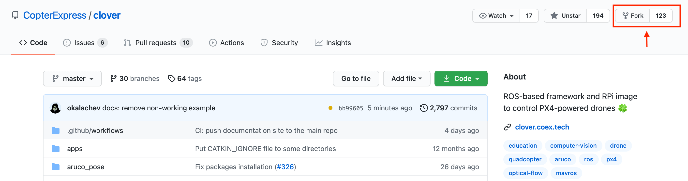
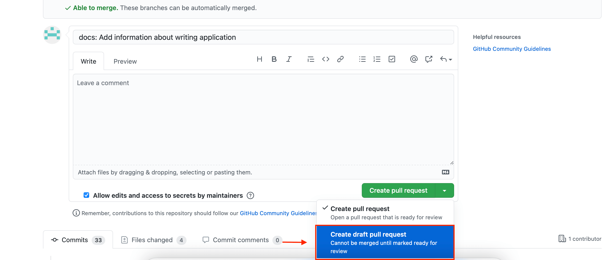

# CopterHack 2023


CopterHack 2023 — это международный конкурс по разработке проектов по летающей робототехнике с открытым исходным кодом. Основным языком конкурса является английский.

Ознакомиться со статьями команд-финалистов предыдущих лет можно в статьях о [CopterHack 2021](copterhack2021.md), [CopterHack 2022](copterhack2022.md).

На конкурс принимаются проекты с открытым исходным кодом и совместимые с платформой квадрокоптера "Клевер". На протяжении конкурса команды работают на собственными идеями и разработками, приближая их к состоянию готового продукта. В этом участникам помогают эксперты отрасли через лекции и регулярную обратную связь.

## Этапы CopterHack 2023

Отборочный и проектный этапы конкурса проходят в онлайн-формате, формат проведения финала – гибридный (оффлайн + онлайн). Конкурс подразумевает ежемесячные апдейты от команд с получением регулярной обратной связи от жюри. Для участия в заключительном этапе необходимо подготовить финальное видео и презентацию о результатах проекта.

1. Отборочный этап. Подача заявок (до 31 октября 2022).
2. Проектный этап. Менторство проектов (1 ноября 2022 — 28 февраля 2023).
3. Подготовка финального видео (1 — 31 марта 2023).
4. Заключительный этап. Финальная защита проектов на английском языке (23 апреля 2023).

## Условия и критерии оценки

Условия, предъявляемые к проектам:

1. Открытый исходный код/модели/схемы/чертежи.
2. Совместимость с платформой "Клевер".

Критерии оценивания жюри в финале:

1. Готовность и статья (макс. 10 баллов): степень готовности проекта; доступное и понятное описание проекта в статье; прикреплены код с комментариями, схемы, чертежи. По статье должно быть возможно повторить проект, получить результат.
2. Объем проделанной работы (макс. 6 баллов): объем проделанной командой работы в рамках CopterHack, ее сложность и технический уровень.
3. Полезность для Клевера (макс. 6 баллов): актуальность применения на практике в платформе Клевер и PX4, потенциальный уровень спроса на разработку со стороны других пользователей Клевера.
4. Презентация на финале (макс. 3 балла): качество и зрелищность финальной презентации; полнота освещения проекта; демонстрация; ответы на вопросы жюри.

## Призовой фонд

Призы от компании COEX по результатам оценивания жюри на финале:

* I место: $3000.
* II место: $2000.
* III место: $1000.
* IV место: $500.
* V место: $500.

Партнеры конкурса могут поощрить команды по дополнительным критериям, выявленным в результате оценки проектов в ходе финала.

## Как подать заявку?

> **Note** Для подачи заявки необходимо иметь аккаунт на [GitHub](https://github.com).

Подготовьте вашу заявку и пришлите ее в виде Draft Pull Request в [репозиторий Клевера](https://github.com/CopterExpress/clover).

1. Сделайте форк репозитория Клевера:

    

2. На странице вашего форка зайдите в раздел `docs/ru` и создайте новый файл в формате [Markdown](https://ru.wikipedia.org/wiki/Markdown):

    

3. Введите название вашей статьи. Например, `new-article.md`

    

4. Оформите вашу заявку в соответствии с рекомендуемым шаблоном:

   ```markdown
   # Название проекта
   
   [CopterHack-2023](copterhack2023.md), команда **Название команды**.
   
   ## Информация о команде
   
   Состав команды:
   
   (Опишите состав команды: имя и фамилия, контакты (имя пользователя в Telegram), роль в команде).
   
   * Александр Соколов, @aleksandrsokolov111, инженер.
   * Елена Смирнова, @elenasmirnova111, программист.
   
   ## Описание проекта
   
   ### Идея проекта
   
   Опишите кратко идею и стадию проекта.
   
   ### Планируемые результаты
   
   Опишите как вы видите результат проекта.
   
   ### Использование платформы "Клевер"
   
   Опишите как в вашем проекте будет использоваться платформа "Клевер".
   
   ### Дополнительная информация по желанию участников
   
   Например, информация об опыте работы команды над проектами, прикрепить ссылку на статьи, видео.
   ```

5. Перейдите вниз страницы и создайте новую ветку с названием вашей статьи:

    

    > **Note** Не добавляйте ваши изменения непосредственно в ветку `master`, создайте новую ветку.

6. При необходимости поместите дополнительные визуальные материалы в папку `docs/assets` и оформите на них ссылки в вашей статье.

7. Сделайте Draft Pull Request вашей ветки в master Клевера:

    

8. В комментариях Pull Request вам будет дана обратная связь по заявке.

9. Обратите внимание на блок *Checks*, в графе Documentation должна стоять галочка. Если там стоит крестик, перейдите по ссылке *Details*, чтобы увидеть список проблем с оформлением статьи. При необходимости изменения добавляемых файлов, меняйте их в вашей ветке – изменения будут появляться в Pull Request автоматически. **Не создавайте новый Pull Request для одной и той же заявки**.

10. На протяжении конкурса вы будете работать над этим документом, приближая его к состоянию статьи. В документе будет видна история разработки и ежемесячные апдейты. К финалу конкурса вы сможете опубликовать вашу статью, это и будет результат вашей работы в CopterHack.

Участники конкурса будут добавлены в Telegram-группу, куда можно отправлять первый апдейт и получить обратную связь от жюри. Для команд-участников предусмотрена скидка 40% на конструктор программируемого квадрокоптера "Клевер".

> **Info** Ограничения по возрасту, образованию и количеству человек в команде отсутствуют.

## Конкурс статей участников проектов CopterHack 2023 

Наши участники уже 2 года работают над передовыми проектами в области летающей робототехники. В этом году мы хотим ввести новый конкурс, стимулирующий участников презентовать результаты исследований, выполняющихся в рамках конкурса на престижных международных конференциях, а также публиковать их в российских и международных журналах по тематике конкурса.
                                                                                             
На конкурс принимаются оригинальные статьи в следующих номинациях: 
                                                                                                  
* $2000 за статью в журнале первого квартиля (Q1), индексируемом в Scopus, Web of Science.
* $1000 за статью журнале, индексируемом в Scopus, Web of Science.
* $500 за статью, опубликованную в сборнике материалов конференции (Conference Proceedings), индексируемые в Scopus, Web of Science. 

> **Note** [Как узнать квартиль журнала в Scopus и WOS](http://russian-science.info/kak-uznat-kvartil-i-protsentil-zhurnala-v-scopus-i-wos).                                                                                                 
                                                                                               
Правила:

1.	Статья должна отражать результаты проекта, разработанного в рамках CopterHack 2023.
2.	Статья должна быть принята к печати к моменту подачи заявки на участие в конкурсе статей.
3.	В acknowledgment следует указать, что работа выполнена в рамках конкурса.

**Прием заявок**: до 10 декабря 2023 года. Прием заявок осуществляется через [Google Форму](https://docs.google.com/forms/d/e/1FAIpQLSf52x0CTur-wUCG2URwY-p85gEUBUvgC0mPVNot0RHVjqcLZA/viewform).

**Объявление результатов**: 24 декабря 2023 года.
                                                                                                  
---

По всем вопросам: [группа CopterHack в Telegram](https://t.me/CopterHack).
                                                 
> **Info** Если вы хотите стать партнером конкурса или членом жюри, обращайтесь к [Олегу Понфиленку в Telegram](@ponfilenok).
