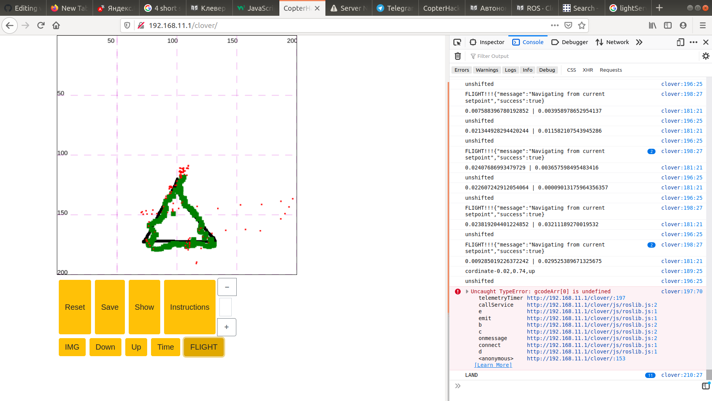

# Граффити коптер D-drone

## Введение
Люди стремятся научить искусственный интеллект всему, что могут делать сами. Рисовать нас учат с детства. И почему бы не научить дрона рисовать? На данный момент коптеры и граффити набирают свою популярность. Поэтому мы решили совместить их.

## Модели и сборка

## Веб-интерфейс
Запуск нашего дрона осуществляется с помощью веб-сайта. Веб интерфейс позволяет рисовать и кодировать нарисованное в gcode. Данные координат будут переданы для дальнейшей обработки и исполнением коптером.
