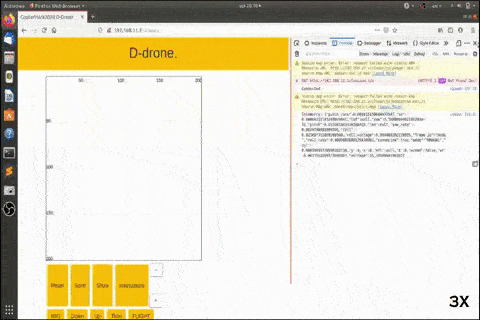
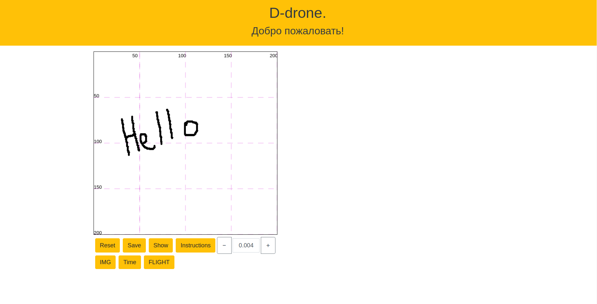
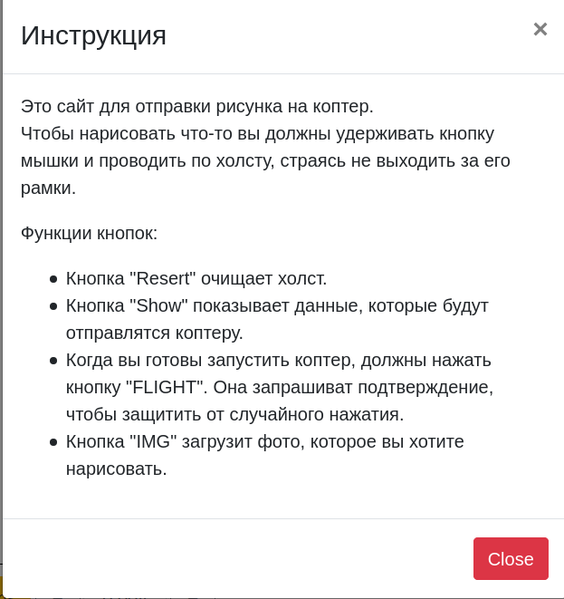

# Граффити коптер D-drone

[CopterHack-2021](copterhack2021.md), команда **AT Makers**.



## Введение

Люди стремятся научить искусственный интеллект всему, что могут делать сами. Рисовать нас учат с детства. И почему бы не научить дрона рисовать? На данный момент коптеры и граффити набирают свою популярность. Поэтому мы решили совместить их.

## Модели и сборка


Для выполнения проекта вам нужно иметь в наличии:

- аэрозольная краска
- сервопривод MG90S;
- 3D-принтер;
- удлинитель распылителя;
- лента с липучкой (желательно);
- 4 длинных винта M4 или;
- 2-4 коротких самореза M4 или M3.

[Скачать](https://github.com/PerizatKurmanbaeva/D-drone/tree/master/details) и распечатать детали:

- держатель;
- винт;
- держатель стоек с гайкой;
- стойки (2 шт.);
- держатель для серво.

**Держатель баллончика.** Держатель баллончика прикрепляется к деке 4 винтами и гайками. Чтобы закрепить баллончик к держателю мы использовали ленту с липучкой. С помощью 4 гаек и винтов закрепляем деку с держателем сверху дрона.

Вес держателя: 90 г.


Если диаметр баллончика меньше диаметра держателя, мы используем деталь в виде дуги, размером разницей между ними. Это помогает нам устойчиво закрепить баллончик.

**Схема нажатия.** Для нажатия клапана будем использовать винтовую передачу с неподвижной гайкой. К сервоприводу будут прикреплена планка с отверстиями, в которых будут входить стойки, закрепленные к гайке. Это помогает сервоприводу двигаться только по одной оси, вверх вниз. Также мы смоделировали крышку для кнопки баллончика, так как поверхность насадки не ровная.


## Перед запуском

### Настройка работы сервопривода

Перед запуском коптера нужно скачать [servo.py](https://github.com/PerizatKurmanbaeva/D-drone/blob/master/examples/servo.py) и перенести его на RPi. Можно просто скопировать и вставить используя буфер обмена. Или скопировать используя команду scp. Например, так:

```bash
scp servo.py pi@192.168.11.1:/home/pi
```

Затем выполнить удаленно на Raspberry Pi следующие команды:

```bash
sudo pigpiod
python servo.py
```

### Настройка веб-интерфейса

Нужно скачать [репозиторий](https://github.com/PerizatKurmanbaeva/visual_ddrone) в формате .zip. Копируем на RPi и распаковываем с помощью следующих команд:

```bash
scp visual_ddrone-master.zip pi@192.168.11.1:/home/pi
cd catkin_ws/src/clover/clover/www
unzip /home/pi/visual_ddrone-master.zip .
mv visual_ddrone-master ddrone
```

Теперь чтобы открыть веб-интерфейс нужно перейти по ссылке [http://192.168.11.1/clover/ddrone](http://192.168.11.1/clover/ddrone).

## Веб-интерфейс

Запуск нашего дрона осуществляется с помощью [веб-сайта](https://perizatkurmanbaeva.github.io/visual_ddrone). Веб-интерфейс позволяет рисовать и кодировать нарисованное в G-code. Данные координат будут переданы для дальнейшей обработки и исполнением коптером.



Мы выбрали веб-интерфейс для управления коптера, потому что он легче и ближе для пользователя.



## Полеты

<iframe width="560" height="315" src="https://www.youtube.com/embed/ErtioCj5iMw" frameborder="0" allow="accelerometer; autoplay; clipboard-write; encrypted-media; gyroscope; picture-in-picture" allowfullscreen></iframe>

## Благодарность

Хотим выразить благодарность Международному университету Ала-Тоо за предоставленную финансовую помощь в осуществлении данного проекта.


