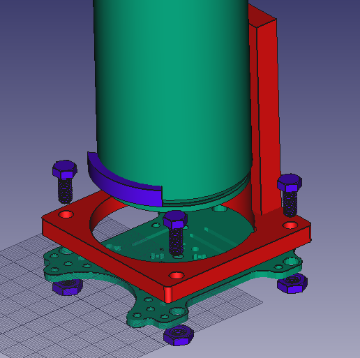

# Граффити коптер D-drone

<iframe width="560" height="315" src="https://youtu.be/ErtioCj5iMw" frameborder="0" allow="accelerometer; autoplay; encrypted-media; gyroscope; picture-in-picture" allowfullscreen></iframe>

## Введение

Люди стремятся научить искусственный интеллект всему, что могут делать сами. Рисовать нас учат с детства. И почему бы не научить дрона рисовать? На данный момент коптеры и граффити набирают свою популярность. Поэтому мы решили совместить их.

## Модели и сборка

**Держатель баллончика.** Держатель баллончика прикрепляется к деке 4 винтами и гайками. Чтобы закрепить баллончик к держателю мы использовали ленту с липучкой. С помощью 4 стоек и винтов закрепляем деку с держателем сверху дрона.

Вес держателя: 90 г.

Если диаметр баллончика меньше диаметра держателя, мы используем деталь в виде дуги, размером разницей между ними. Это помогает нам устойчиво закрепить баллончик.

**Схема нажатия.** Для нажатия клапана будем использовать винтовую передачу с неподвижной гайкой. К сервоприводу будут прикреплена планка с отверстиями, в которых будут входить стойки, закрепленные к гайке. Это помогает сервоприводу двигаться только по одной оси, вверх вниз. Также мы смоделировали крышку для кнопки баллончика, так как поверхность насадки не ровная.

## Веб-интерфейс

Запуск нашего дрона осуществляется с помощью [веб-сайта](https://perizatkurmanbaeva.github.io/visual_ddrone). Веб-интерфейс позволяет рисовать и кодировать нарисованное в G-code. Данные координат будут переданы для дальнейшей обработки и исполнением коптером.

Мы выбрали веб-интерфейс для управления коптера, потому что он легче и ближе для пользователя.

## Полеты
