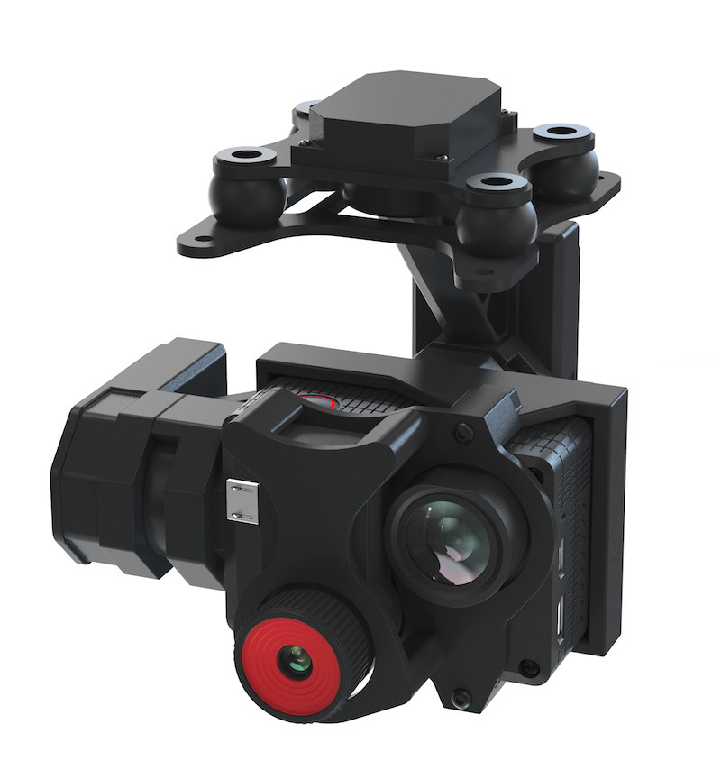
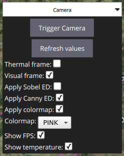

# COEX DuoCam

"COEX DuoCam" – это программно-аппаратный комплекс, позволяющий получать комбинированное визуально-тепловизионное изображение.



В качестве источника визуальной картинки теоретически можно использовать любую камеру, имеющую CSI или HDMI-выход.

В качестве источника тепловизионной картинки можно использовать тепловизоры Seek Compact или Seek Compact Pro.

В качестве платформы для запуска обрабатывающего софта рекомендуется использовать одноплатный компьютер Raspberry Pi 4B.

## Подключение устройств

Тепловизор подключается в один из портов USB 3.0 на RPi4. Во второй USB 3.0-порт подключается Wi-Fi адаптер для осуществления связи с наземной станцией.

Визуальная камера подключается в CSI порт напрямую или через HDMI-CSI-конвертер.

В порт USB 2.0 следует подключить USB-flash устройство, на которое будет производиться сохранение фото и видеофайлов.

## Принцип работы

Программная часть осуществляет наложение тепловизионной картинки на визуальную. С помощью конфигурационного файла или виджета управления свойствами камеры в QGroundControl можно изменять результирующее изображение.

### Выбор модели тепловизора

Первоначально надо определиться, какая у вас модель тепловизора (простая или Pro) и выставить соответствующую настройку в конфиг-файле (`enable: yes` у seek_thermal_pro или seek_thermal в разделе thermal_camera_models. Важно не забыть выставить `enable: no` у камеры, которую не предполагается использовать).

### Управление наложением

При включенном визуальном (`show_visual: yes`) и термическом (`show_thermal: yes`) изображениях, термическое будет налагаться на визуальное в регион, заданный в свойстве `overlay_thermal_on_visual` (начальная точка с координатами `(x_start, y_start)`, ширина региона - `thermal_region_width`, высота - `thermal_region_height`).

Если отключить визуальное изображение (`show_visual: no`), то термическое развернется на весь экран.

Если отключить термическое (`show_thermal: no`), то будет транслироваться только визуальное.

Если отключить оба – изображение перестанет транслироваться.

### Центровка

Для центровки результирующего изображения (из-за физического сдвига объективов камер термическое будет сдвинутого относительно центра визуального) следует использовать свойства раздела `final_frame_cropping`. Принцип аналогичен предыдущему разделу.

### Детекторы контуров (edge detectors)

Для облегчения понимания термического изображения, есть возможность включения наложения на него соответствующих контуров визуального изображения. В программе реализована поддержка двух алгоритмов детектирования контуров: [Sobel](https://docs.opencv.org/3.4/d2/d2c/tutorial_sobel_derivatives.html) и [Canny](https://docs.opencv.org/3.4/da/d5c/tutorial_canny_detector.html). В соответствующих разделах конфига (`apply_sobel` и `apply_canny`) можно поэкспериментировать с некоторыми свойствами детекторов.

### Колоризация

Для большей наглядности, тепловизионное изображение можно колорифицировать. Для этого необходимо выставить свойство `apply_colormap: yes`.

Конкретную схему колорификации можно выбрать из [списка](https://docs.opencv.org/2.4/modules/contrib/doc/facerec/colormaps.html), указав порядковый номер схемы в свойстве `colormap`.

### Свойства транслируемого видео и сохраняемых файлов

Свойства транслируемого видео можно изменять в разделе `output_video`. Делать это стоит с четким пониманием того, что делаешь - неправильные настройки могут сломать трансляцию. Например, разрешение видео должно совпадать с настройками gstreamer'а, который осуществляет последующее кодирование.

Для настройки сохраняемого на флеш-накопитель видео следует пользоваться группой свойств `encode_video`.

Каталоги для сохранения фото и видеофайлов можно указать в свойствах `path_to_save`.

### Настройки дополнительной отображаемой информации

Скрывать\показывать частоту кадров в секунду визуального и термического изображений можно при помощи свойства `show_fps`.

Показывать\скрывать перекрестие с температурой центрального пикселя можно при помощи свойства `draw_temp`.

### Подстройка температуры

В зависимости от используемого тепловизора, может потребоваться корректировка температурного диапазона. В секции `temperature_calibration` Доступны две настройки:

* Сдвиг (`offset`) - линейный сдвиг температурного диапазон на указанное число.
* Масштаб (`scale`) - пропорциональное изменение шкалы.

### Выравнивание градиента температуры от центра к краям

Если на тепловизионном изображении наблюдается "рамка", вызванная увеличением определяемой температуры к краям, то следует применить выравнивающий фильтр (виньетирование). Настройки располагаются в секции `vignette`:

* `enable` - включить-выключить наложение фильтра.
* `show_center` - показать точку "центра" для отладки ее положения.
* `center_x` - X-координата "центра".
* `center_y` - Y-координата "центра".
* `max_decrement_relative` - максимальное уменьшение температуры к краям.

## Виджет управления камерой для QGroundControl



### Где взять

QGC c необходимый функционалом для управления "COEX DuoCam" можно скачать в нашем [репозитории](https://github.com/CopterExpress/qgroundcontrol/releases). Скачивать следует тот релиз, в названии которого присутствует слово `duocam` с максимальным порядковым номером.

### Как использовать

При открытии виджета QGC пошлет MAVLink-сообщения с запросом текущих значений свойств. Необходимо дождаться, пока они все до конца загрузятся. Если загрузка не завершается в течение минуты, необходимо нажать кнопку "Refresh values".

При изменении значений свойств QGC осуществляет коммуникацию с DuoCam посредством протокола MAVLink, поэтому нет смысла очень часто нажимать контролы - наоборот, после нажатия следует дождаться изменения картинки и только потом переходить к следующему свойству.

[Подробнее об архитектуре DuoCam и программе `duocam-mavlink`](duocam_mavlink.md).

## Конфигурационный файл

Для более глубокой настройки DuoCam можно использовать конфигурационный файл.

### Как добраться

Для редактирования конфигурационного файла необходимо извлечь microSD-карту из RPi4, вставить в кард-ридер своего компьютера (от операционной системы требуется возможность читать файловую систему ext4), открыть файл по адресу `<microSD>/etc/duocam/camera.yaml`.

Также можно зайти по SSH на работающую RPi4 и отредактировать конфигурационный файл внутри системы по тому же пути.

### Образец конфигурационного файла

```yaml
show_visual: yes
show_thermal: yes
flip_thermal: no
apply_sobel:
  enable: yes
  sobel_scale: 3
  sobel_delta: 0
apply_canny: no
draw_temp: yes

output_video:
  device: /dev/video1
  width: 1280
  height: 720
  bytes_per_pixel: 3
  framerate: 20

path_to_save_photos: /media/usb0/
path_to_save_videos: /media/usb0/

encode_video:
  width: 720
  height: 480
  framerate: 10

thermal_camera_models:
  seek_thermal_pro:
    enable: no
    sensor_resolution:
      width: 320
      height: 240
    overlay_thermal_on_visual:
      # These values are for GitUp3
      x_start: 282
      y_start: 102
      thermal_region_width: 600
      thermal_region_height: 400
      transparency: 0.3
      # These values are for Raspicam
      #  x_start: 425
      #  y_start: 155
      #  thermal_region_width: 900
      #  thermal_region_height: 600
    final_frame_cropping:
      enable: yes
      x_start: 0
      y_start: 0
      width: 1160
      height: 610

  seek_thermal:
    enable: yes
    sensor_resolution:
      width: 206
      height: 156
    overlay_thermal_on_visual:
      x_start: 282
      y_start: 102
      thermal_region_width: 600
      thermal_region_height: 400
      transparency: 0.3
    final_frame_cropping:
      enable: yes
      x_start: 0
      y_start: 0
      width: 1160
      height: 610

# Colormaps are taken from: https://docs.opencv.org/2.4/modules/contrib/doc/facerec/colormaps.html
# COLORMAP_AUTUMN = 0,
# COLORMAP_BONE = 1,
# COLORMAP_JET = 2,
# COLORMAP_WINTER = 3,
# COLORMAP_RAINBOW = 4,
# COLORMAP_OCEAN = 5,
# COLORMAP_SUMMER = 6,
# COLORMAP_SPRING = 7,
# COLORMAP_COOL = 8,
# COLORMAP_HSV = 9,
# COLORMAP_PINK = 10,
# COLORMAP_HOT = 11
apply_colormap:
  enable: yes
  colormap: 4
```
