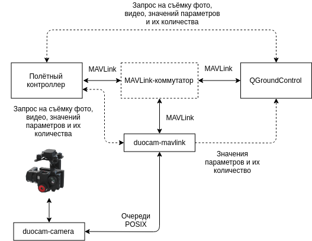

# Виртуальная MAVLink-камера COEX DuoCam

Полётные контроллеры поддерживают разные способы взаимодействия с внешними камерами, включая протокол MAVLink. Обычно коммуникация с помощью данного протокола требует использования UART-порта на полётном контроллере, но есть возможность работать с камерой в основном потоке MAVLink-телеметрии с БПЛА.

Утилита `duocam-mavlink` отвечает за работу виртуальной MAVLink-камеры и встраивается в общую телеметрию между полётным контроллером и QGroundControl.



На блок-схеме прямыми линиями обозначены взаимодействия между блоками, пунктирными линиями уточняется характер взаимодействия.

> **Warning** Протокол взаимодействия находится в процессе модификации. В новых версиях планируется избавиться от прямой отправки значений параметров и их количества от `duocam-mavlink` к QGroundControl.

<!-- markdownlint-disable MD044 -->

`duocam-camera` и `duocam-mavlink` обмениваются данными с помощью очередей POSIX. Имена очередей и формат сообщений доступен в репозитории [duocam-common](https://github.com/CopterExpress/duocam-common).

<!-- markdownlint-enable MD044 -->

Для объединения блоков, взаимодействующих через MAVLink, можно использовать любой MAVLink-коммутатор/маршрутизатор, который либо позволяет отключить таблицу коммутации, либо заполняет её по схеме *MAVLink ID:Component ID* (например, `cmavnode`, `mavlink-fast-switch`, `mavlink-switch`).

> **Warning** При использовании `mavlink-fast-switch` требуется использовать `mavlink-serial-bridge`, либо любой другой мост для передачи MAVLink из последовательного порта в UDP, так как `mavlink-fast-switch` работает только с UDP.

## Конфигурационный файл

Для редактирования конфигурационного файла необходимо извлечь microSD-карту из RPi4, вставить в кард-ридер своего компьютера (от операционной системы требуется возможность читать файловую систему ext4), открыть файл по адресу `<microSD>/etc/duocam/mavlink.yaml`.

Также можно зайти по SSH на работающую RPi4 и отредактировать конфигурационный файл внутри системы по тому же пути.

Для корректной работы `duocam-mavlink` требуется *MAVLink ID* полётного контроллера (параметр `vehicle_id`) и `MAVLink ID` QGroundControl (параметр `qgc_vehicle_id`). `duocam-mavlink` ожидает телеметрию на UDP (параметры `ip` и `port`) и отправляет сообщения HEARTBEAT с частотой, согласно параметру `heartbeat_frequency`, представляясь, как компонент полётного контроллера `MAV_COMP_ID_CAMERA`.

Максимальная задержка от `duocam-camera` задаётся параметром `command_timeout`.

Если система DuoCam используется для полётов внутри помещений, то должен быть включен параметр `no_gps`.

## Пример конфигурационного файла

```yaml
# MAVLink vehicle ID that owns the camera
vehicle_id: 1
# Enable this flag for indoor use
no_gps: False
# QGC vehicle ID
qgc_vehicle_id: 255
mavlink:
  # IP address of the interface to listen port on (0.0.0.0 for all interfaces)
  ip: 127.0.0.1
  # UDP port
  port: 14540
  # Heartbeat frequency (Hz)
  heartbeat_frequency: 1.0
# Camera driver command timeout (s)
command_timeout: 3.0
```

## Пример конфигурационного файла для `mavlink-fast-switch`

```yaml
# MAVLink endpoints
endpoints:
  # UAV endpoint
  - name: "uav"
    local:
      port: 14588
  # DuoCam MAVLink endpoint
  - name: "duocam-mavlink"
    remote:
      ip: "127.0.0.1"
      port: 14540
  # GCS endpoint
  - name: "gcs"
    remote:
      ip: "127.0.0.1"
      port: 14550
# Enable MAVLink ID table
# HINT: Can't use this feature with duocam
id-table: False
```

## Пример конфигурационного файла для `mavlink-serial-bridge`

```yaml
# Serial device settings
serial:
  # Device file
  device: "/dev/ttyS0"
  # Baudrate
  baudrate: 57600
  # Flow control (hardware, none)
  flow: none
  # Software serial TX buffer (bytes) (2048 by default)
  tx-buffer: 2048
# UDP port settings
udp:
  # Remote host settings (optional, listening mode if not presented)
  remote:
    ip: 127.0.0.1
    port: 14588
    # Lock remote host on the initial value (optional, False by default)
    lock: True
    # Broadcast mode (optional, False by default)
    broadcast: False
  # Local settings (optional, all interfaces and a random port by default)
  local:
    # Local IP address (0.0.0.0 to listen on all interfaces) (optional, all interfaces by default)
    ip: 127.0.0.1
    # Local UDP port (0 to select a random free port) (optional, 0 by default)
    port: 0
```
