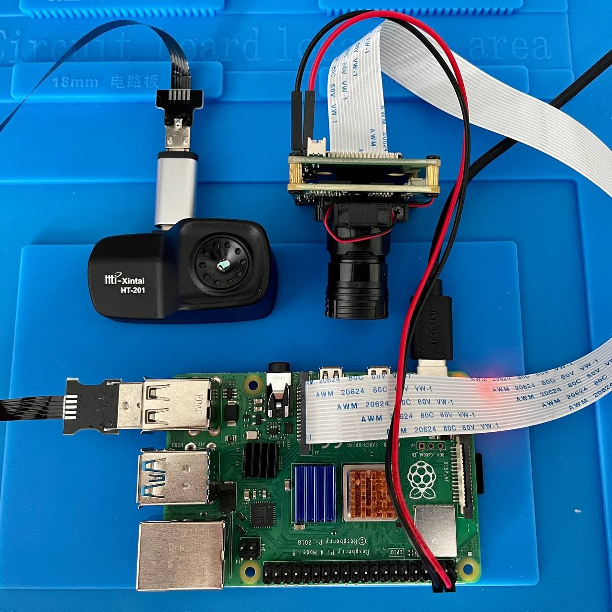

# Трансляция изображения с DuoCam в ROS-топики

Для задач связанных с машинным зрением удобно работать с изображением с камер через ROS-топики.
DuoCam включает в себя две камеры: визуальная камера VEYE-MIPI-327E ([MIPI Camera](http://www.veye.cc/en/product/mipi-camera/veye-mipi-327e/)) и тепловизор HT-201 ([HTI Thermal Camera HT-201](https://hti-instrument.com/products/ht-201-mobile-phone-thermal-imager)). В этой статье рассмотрим как настроить получение с них ображения и вывод его в ROS-топики.

Для начала подготовьте Raspberry Pi 4 с образом `Clover`. Подключите Raspberry к WiFi-роутеру с интернетом по инструкции в статье "[Настройка Wi-Fi](network.md)"

> **Hint** Есть альтернативный, устаревший, но более простой способ подключения к WiFi-роутеру. Для этого в файл `/etc/network/interfaces` нужно добавить строчки: 
> ```
> auto wlan0
> allow-hotplug wlan0
> iface wlan0 inet dhcp
> wpa-ssid "Your Wi-Fi's Name"
> wpa-psk "Your Wi-Fi's Password"
> ```

Подлючите к Raspberry Pi камеры VEYE-MIPI-327E и тепловизора HT-201:


## Установка драйвера VEYE-MIPI-327E:

> **Info** Основаная статья: http://wiki.veye.cc/index.php/V4L2_mode_for_Raspberry_Pi

Для начала обновите все пакеты в системе и ядро линукса командой 
```
sudo apt update && sudo apt upgrade -y
```

После этого обязательно перезагрузите Raspberry Pi командой `sudo reboot`.

Далее выполните команды для установки драйвера:
```
git clone https://github.com/veyeimaging/raspberrypi_v4l2.git
cd raspberrypi_v4l2/release/
chmod +x *
sudo ./install_driver.sh veye327
```

Перезагрузите Raspberry Pi.
После перезагрузки проверьте, что драйвер установился корректно с помощью команд:
```
dmesg | grep veye
v4l2-ctl --list-devices
v4l2-ctl --list-formats-ext
v4l2-ctl -d /dev/video0 -V --info --list-formats --list-formats-ext
```


## Установка драйвера Seek Thermal CompactPRO:
Драйвер для тепловизора HT-201 такой же, как и для тепловизора Seek Thermal CompactPRO.

Сначала установите необходимые пакеты командой:
```
sudo apt install cmake libopencv-dev libusb-1.0-0-dev v4l2loopback-utils
```

Далее выполните команды для установки драйвера:
```
sudo apt install cmake libopencv-dev libusb-1.0-0-dev v4l2loopback-utils
git clone https://github.com/OpenThermal/libseek-thermal.git
cd libseek-thermal
mkdir build
cd build
cmake ..
make
sudo make install
sudo ldconfig
```

Далее ....
```
sudo vim /etc/udev/rules.d/seekpro.rules
```

```
SUBSYSTEM=="usb", ATTRS{idVendor}=="289d", ATTRS{idProduct}=="0011", MODE="0666", GROUP="users"
```

```
sudo udevadm control --reload-rules && sudo udevadm trigger

seek_test_pro
seek_create_flat_field -tseekpro
seek_viewer --camtype=seekpro --colormap=2 --rotate=0 -F flat_field.png

sudo modprobe v4l2loopback devices=1
seek_viewer --camtype=seekpro --colormap=2 --rotate=0 --mode=v4l2 --output=/dev/video2 &

v4l2-ctl --list-devices
v4l2-ctl --list-formats-ext
v4l2-ctl -d /dev/video0 -V
v4l2-ctl -d /dev/video1 -V --info --list-formats --list-formats-ext
```


## Создание ROS-топиков с изображениями с камер

vim catkin_ws/src/clover/clover/launch/front_camera.launch
```
<launch>

    <arg name="direction_z" default="forward"/> <!-- direction the camera points: forward, backward -->
    <arg name="device2" default="/dev/video1"/> <!-- v4l2 device -->
    <arg name="simulator" default="false"/>

    <node if="$(eval direction_z == 'forward')" pkg="tf2_ros" type="static_transform_publisher" name="front_camera_frame" args="0.03 0 0.05 -1.5707963 0 -1.5707963 base_link front_camera_optical"/>
    <node if="$(eval direction_z == 'backward')" pkg="tf2_ros" type="static_transform_publisher" name="front_camera_frame" args="-0.03 0 0.05 1.5707963 0 -1.5707963 base_link front_camera_optical"/>

    <!-- Template for custom camera orientation -->
    <!-- Camera position and orientation are represented by base_link -> main_camera_optical transform -->
    <!-- static_transform_publisher arguments: x y z yaw pitch roll frame_id child_frame_id -->
    <!-- <node pkg="tf2_ros" type="static_transform_publisher" name="main_camera_frame" args="0.05 0 -0.07 -1.5707963 0 3.1415926 base_link main_camera_optical"/> -->

    <!-- camera nodelet manager -->
    <node pkg="nodelet" type="nodelet" name="front_camera_nodelet_manager" args="manager" output="screen" clear_params="true" respawn="true">
        <param name="num_worker_threads" value="2"/>
    </node>

    <!-- camera node -->
    <node pkg="nodelet" type="nodelet" name="front_camera" args="load cv_camera/CvCameraNodelet front_camera_nodelet_manager" launch-prefix="rosrun clover waitfile $(arg device2)" clear_params="true" unless="$(arg simulator)" respawn="true">
        <param name="device_path" value="$(arg device2)"/>
        <param name="frame_id" value="front_camera_optical"/>

        <param name="rate" value="100"/> <!-- poll rate -->
        <param name="cv_cap_prop_fps" value="40"/> <!-- camera FPS -->
        <param name="capture_delay" value="0.02"/> <!-- approximate delay on frame retrieving -->

        <!-- camera resolution -->
        <param name="image_width" value="640"/>
        <param name="image_height" value="480"/>
    </node>

</launch>
```
