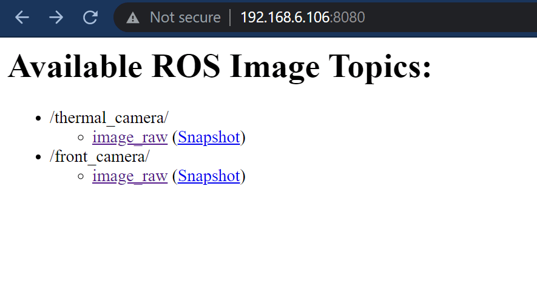

# Настройка и трансляция изображения с DuoCam

DuoCam включает в себя две камеры: визуальная камера VEYE-MIPI-327E ([MIPI Camera](http://www.veye.cc/en/product/mipi-camera/veye-mipi-327e/)) и тепловизор HT-201 ([HTI Thermal Camera HT-201](https://hti-instrument.com/products/ht-201-mobile-phone-thermal-imager)). В этой статье мы рассмотрим, как установить их драйвера, настроить RTSP-трансляцию и вывести изображение с камер в ROS-топики.

Для начала подготовьте Raspberry Pi 4 со свежим [образом Клевера](image.md). Подключите Raspberry к Wi-Fi роутеру с интернетом по инструкции в статье "[Настройка Wi-Fi](network.md)".

> **Hint** Есть альтернативный, устаревший, но более простой способ подключения к Wi-Fi-роутеру. Для этого в файл `/etc/network/interfaces` нужно добавить строчки:
>
> ```
> auto wlan0
> allow-hotplug wlan0
> iface wlan0 inet dhcp
> wpa-ssid "Your Wi-Fi's Name"
> wpa-psk "Your Wi-Fi's Password"
> ```

Подключите к Raspberry Pi камеры VEYE-MIPI-327E и тепловизора HT-201:


## Установка драйвера камеры VEYE-MIPI-327E

> **Info** Основная статья: http://wiki.veye.cc/index.php/V4L2_mode_for_Raspberry_Pi

Для начала обновите информацию о пакетах командой:

```bash
sudo apt update
```

Далее выполните команды для установки драйвера камеры:

```bash
git clone https://github.com/veyeimaging/raspberrypi_v4l2.git
cd raspberrypi_v4l2/release/
chmod +x *
sudo ./install_driver.sh veye327
```

> **Info** Важно, чтобы версия ядра Linux поддерживалась разработчиками драйвера камеры. Узнать свою версию ядра можно командой `uname -r`. Список поддерживаемых версий ядра Linux можно посмотреть в [репозитории драйвера для камеры VEYE-MIPI-327E](https://github.com/veyeimaging/raspberrypi_v4l2/tree/main/release/driver_bin). Откатиться на более старую версию ядра можно командой `sudo rpi-update commit-id` где вместо `commit-id` нужно подставить ID коммита с нужной версией ядра, список всех коммитов можно посмотреть [тут](https://github.com/Hexxeh/rpi-firmware/commits/master). Например, команда `sudo rpi-update 1fad1d2beceaaf96e84e3f5caa79f52b87332e89` откатывает ядро Linux к версии 5.10.52.

Перезагрузите Raspberry Pi командой `sudo reboot`. После перезагрузки проверьте, что драйвер установился корректно с помощью команд:

```bash
dmesg | grep veye
v4l2-ctl --list-devices
v4l2-ctl -d /dev/video0 -V --info --list-formats-ext
```

## Установка драйвера тепловизора Seek Thermal CompactPRO

Драйвер для тепловизора HT-201 такой же, как и для тепловизора Seek Thermal CompactPRO.

Сначала установите необходимые пакеты командой:

```bash
sudo apt install cmake libopencv-dev libusb-1.0-0-dev v4l2loopback-utils -y
```

Далее выполните следующие команды для установки драйвера тепловизора:

```bash
git clone https://github.com/OpenThermal/libseek-thermal.git
cd libseek-thermal
mkdir build
cd build
cmake ..
make
sudo make install
sudo ldconfig
```

Далее создайте файл `/etc/udev/rules.d/seekpro.rules` и добавьте в него одну строчку:

```
SUBSYSTEM=="usb", ATTRS{idVendor}=="289d", ATTRS{idProduct}=="0011", MODE="0666", GROUP="users"
```

Далее в файл `/etc/modules` добавьте строчку:

```
v4l2loopback
```

Далее создайте файл `/etc/modprobe.d/v4l2loopback.conf` и добавляем в него одну строчку:

```
options v4l2loopback devices=1 exclusive_caps=1 video_nr=5 card_label="Thermal-camera"
```

Далее выполните апдейт системы и перезагрузитесь:

```
sudo update-initramfs -c -k $(uname -r)
sudo reboot
```

После перезагрузки проверьте, что в системе появился интерфейс `/dev/video5`:

```
v4l2-ctl --list-devices
```

Далее нам нужно настроить автозапуск видео с тепловизора при включении Raspberry Pi. Для этого в домашней директории создайте файл `duocam_autostart.sh` и добавьте в него команду для запуска видео с тепловизора Seek Thermal CompactPRO:

```
seek_viewer --camtype=seekpro --colormap=1 --rotate=0 --mode=v4l2 --output=/dev/video5
```

> **Hint** Чтобы изображение с тепловизора имело красно-синюю раскраску используйте значение параметра `--colormap=2`.

Чтобы корректно запускать файл, необходимо присвоить ему соответствующие флаги доступа.

```bash
chmod a+x duocam_autostart.sh
```

Для того, чтобы видео с тепловизора запускалась каждый раз при включении системы, необходимо создать стартап-скрипт с помощью менеджера systemd. Создайте файл `/etc/systemd/system/duocam.service` и запишите в него соответствующие строки:

```
[Unit]
Description=DuoCam

[Service]
ExecStart=/bin/bash /home/pi/duocam_autostart.sh

[Install]
WantedBy=multi-user.target
```

Осталось только инициализировать ваш скрипт в системе и он будет запускаться при каждом ее включении.

```bash
sudo systemctl enable duocam.service
```

Перезагрузите Raspberry Pi командой `sudo reboot`. Проверьте, что видео с тепловизора доступно в интерфейсе `/dev/video5`:

```
v4l2-ctl -d /dev/video5 -V --info --list-formats-ext
```

## Трансляция видео по RTSP

Чтобы запустить RTSP-трансляцию сначала нужно установить утилиту `gst-rtsp-launch`:

```
sudo apt install gst-rtsp-launch -y
```

Трансляция с тепловизора, разрешение 320x240:

```
gst-rtsp-launch "( v4l2src device=/dev/video5 ! video/x-raw,width=320,height=240 ! videoconvert ! v4l2h264enc output-io-mode=4 extra-controls=\"encode,frame_level_rate_control_enable=1,h264_profile=4,h264_level=13,video_bitrate=500000,h264_i_frame_period=5;\" ! rtph264pay name=pay0 pt=96 )"
```

Трансляция с камеры VEYE-MIPI-327E, разрешение 1920x1080:

```
gst-rtsp-launch "( v4l2src device=/dev/video0 ! video/x-raw,format=UYVY,width=1920,height=1080,framerate=30/1 ! v4l2h264enc output-io-mode=4 extra-controls=\"encode,frame_level_rate_control_enable=1,h264_profile=4,h264_level=13,video_bitrate=6000000,h264_i_frame_period=5;\" ! rtph264pay name=pay0 pt=96 )"
```

Трансляция с камеры VEYE-MIPI-327E, разрешение 1280x720:

```
gst-rtsp-launch "( v4l2src device=/dev/video0 ! video/x-raw,format=UYVY,width=1920,height=1080,framerate=30/1 ! videoscale ! video/x-raw, width=1280, height=720 ! v4l2h264enc output-io-mode=4 extra-controls=\"encode,frame_level_rate_control_enable=1,h264_profile=4,h264_level=13,video_bitrate=4000000,h264_i_frame_period=5;\" ! rtph264pay name=pay0 mtu=1024 pt=96 )"
```

Трансляция с обеих камер, "картинка в картинке", разрешение 1280x720:

```
gst-rtsp-launch "( v4l2src device=/dev/video0 ! video/x-raw,format=UYVY,width=1920,height=1080,framerate=(fraction)30/1 ! videoscale ! video/x-raw,width=1280,height=720 !  queue ! mix. v4l2src device=/dev/video5 ! video/x-raw,width=320,height=240 ! queue ! videomixer name=mix ! v4l2h264enc output-io-mode=4 extra-controls=\"encode,frame_level_rate_control_enable=1,h264_profile=4,h264_level=13,video_bitrate=4000000,h264_i_frame_period=5;\" ! rtph264pay name=pay0 pt=96 )"
```

Трансляция с обеих камер, "картинка в картинке", с обрезкой изображения тепловизора по краям, разрешение 1280x720:

```
gst-rtsp-launch "( v4l2src device=/dev/video0 ! video/x-raw,format=UYVY,width=1920,height=1080,framerate=(fraction)30/1 ! videoscale ! video/x-raw,width=1280,height=720 ! queue ! mix. v4l2src device=/dev/video5 ! video/x-raw,width=320,height=240 ! videoscale ! video/x-raw, width=640, height=480 ! videocrop top=60 left=180 right=140 bottom=100 ! queue ! videomixer name=mix ! v4l2h264enc output-io-mode=4 extra-controls=\"encode,frame_level_rate_control_enable=1,h264_profile=4,h264_level=13,video_bitrate=4000000,h264_i_frame_period=5;\" ! rtph264pay name=pay0 pt=96 )"
```

Смотреть трансляцию можно, например, в QGroundControl указав в настройках:


> **Hint** Для того, чтобы трансляция запускалась автоматически при включении Raspberry Pi добавьте нужную команду запуска трансляции в файл `duocam_autostart.sh`.

## Создание ROS-топиков с изображениями с камер

Чтобы доступ к изображению с камер был доступен через ROS-топики, нужно создать для обоих камер launch-файлы для запуска в пакете `clover`.

Для камеры VEYE-MIPI-327E создайте файл `~/catkin_ws/src/clover/clover/launch/front_camera.launch` и добавьте в него следующий текст:

```xml
<launch>
    <!-- camera nodelet manager -->
    <node pkg="nodelet" type="nodelet" name="front_camera_nodelet_manager" args="manager" output="screen" clear_params="true" respawn="true">
        <param name="num_worker_threads" value="2"/>
    </node>

    <!-- camera node -->
    <node pkg="nodelet" type="nodelet" name="front_camera" args="load cv_camera/CvCameraNodelet front_camera_nodelet_manager" clear_params="true" respawn="true">
        <!-- v4l2 device -->
        <param name="device_id" value="0"/>

        <!-- camera FPS -->
        <param name="cv_cap_prop_fps" value="30"/>

        <!-- camera resolution -->
        <param name="image_width" value="1920"/>
        <param name="image_height" value="1080"/>
    </node>
</launch>
```

Для тепловизора создайте файл `~/catkin_ws/src/clover/clover/launch/thermal_camera.launch` и добавьте в него следующий текст:

```xml
<launch>
    <!-- v4l2 device -->
    <arg name="thermal_device" default="/dev/video5"/>

    <!-- camera nodelet manager -->
    <node pkg="nodelet" type="nodelet" name="thermal_camera_nodelet_manager" args="manager" output="screen" clear_params="true" respawn="true">
        <param name="num_worker_threads" value="2"/>
    </node>

    <!-- camera node -->
    <node pkg="nodelet" type="nodelet" name="thermal_camera" args="load cv_camera/CvCameraNodelet thermal_camera_nodelet_manager" launch-prefix="rosrun clover waitfile $(arg thermal_device)" clear_params="true" respawn="true">
        <param name="device_path" value="$(arg thermal_device)"/>

        <!-- camera FPS -->
        <param name="cv_cap_prop_fps" value="30"/>

        <!-- camera resolution -->
        <param name="image_width" value="320"/>
        <param name="image_height" value="240"/>
    </node>
</launch>
```

Далее отредактируйте файл `~/catkin_ws/src/clover/clover/launch/clover.launch`. Установите параметры `main_camera` и `optical_flow` в значение `false`:

```xml
    <arg name="main_camera" default="false"/>
    <arg name="optical_flow" default="false"/>
```

Добавьте два новых параметра для новых камер:

```xml
    <arg name="front_camera" default="true"/>
    <arg name="thermal_camera" default="true"/>
```

После секции `<!-- main camera -->` добавьте включение новых камер:

```xml
    <!-- front camera -->
    <include file="$(find clover)/launch/front_camera.launch" if="$(arg front_camera)"/>

    <!-- thermal camera -->
    <include file="$(find clover)/launch/thermal_camera.launch" if="$(arg thermal_camera)"/>
```

Теперь осталось только перезагрузить сервис `clover` командой:

```bash
sudo systemctl restart clover
```

И новые топики с камерами появятся в списке:



## Обработка изображения с камер с помощью GStreamer

Изображение с камер можно обрабатывать как методами OpenCV, так и GStreamer. С помощью GStreamer можно, например, обрезать или изменить размер кадра. В этом разделе расскажем, как изменить разрешение передней камеры с 1920х1080 на 1280х720, а также вырезать из изображения с тепловизора (обрезать края кадра) в центральной части квадрат размером 120х120 и растянуть его до 240х240.

Для начала нам нужно создать еще 2 виртуальных видеоустройства, куда мы направим вывод с GStreamer. В файле `/etc/modprobe.d/v4l2loopback.conf` измените содержимое на:

```
options v4l2loopback devices=3 exclusive_caps=1 video_nr=5,6,7 card_label="Thermal-camera,Thermal-scale,Front-scale"
```

Теперь нам нужно добавить непосредственно команды GStreamer, которые делают то, что нам нужно. Для этого в файле `duocam_autostart.sh` измените содержимое на:

```bash
seek_viewer --camtype=seekpro --colormap=1 --rotate=0 --mode=v4l2 --output=/dev/video5 &

sleep 10

gst-launch-1.0  v4l2src device=/dev/video5 ! video/x-raw,width=320,height=240 ! videoconvert ! videocrop top=30 left=90 right=70 bottom=50 ! videoscale ! video/x-raw, width=240, height=240 ! tee ! v4l2sink device=/dev/video6 &

gst-launch-1.0  v4l2src device=/dev/video0 ! video/x-raw,format=UYVY,width=1920,height=1080,framerate=30/1 ! videoscale ! video/x-raw, width=1280, height=720 ! tee ! v4l2sink device=/dev/video7
```

В заключение измените содержимое файла `~/catkin_ws/src/clover/clover/launch/front_camera.launch` на следующий текст:

```xml
<launch>
    <!-- v4l2 device -->
    <arg name="front_device" default="/dev/video7"/>

    <!-- camera nodelet manager -->
    <node pkg="nodelet" type="nodelet" name="front_camera_nodelet_manager" args="manager" output="screen" clear_params="true" respawn="true">
        <param name="num_worker_threads" value="2"/>
    </node>

    <!-- camera node -->
    <node pkg="nodelet" type="nodelet" name="front_camera" args="load cv_camera/CvCameraNodelet front_camera_nodelet_manager" clear_params="true" respawn="true">
        <!-- v4l2 device -->
        <param name="device_path" value="$(arg front_device)"/>
    </node>
</launch>
```

А также измените содержимое файла `~/catkin_ws/src/clover/clover/launch/thermal_camera.launch` на следующий текст:

```xml
<launch>
    <!-- v4l2 device -->
    <arg name="thermal_device" default="/dev/video6"/>

    <!-- camera nodelet manager -->
    <node pkg="nodelet" type="nodelet" name="thermal_camera_nodelet_manager" args="manager" output="screen" clear_params="true" respawn="true">
        <param name="num_worker_threads" value="2"/>
    </node>

    <!-- camera node -->
    <node pkg="nodelet" type="nodelet" name="thermal_camera" args="load cv_camera/CvCameraNodelet thermal_camera_nodelet_manager" launch-prefix="rosrun clover waitfile $(arg thermal_device)" clear_params="true" respawn="true">
        <param name="device_path" value="$(arg thermal_device)"/>
    </node>
</launch>
```

После перезагрузки Raspberry Pi в топиках с камерами будут обработанные изображения.
