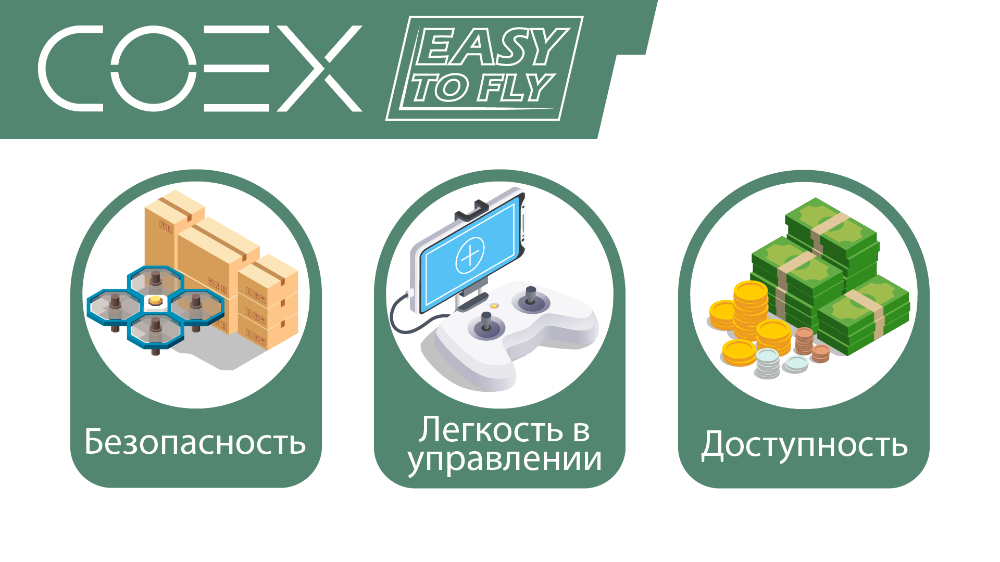
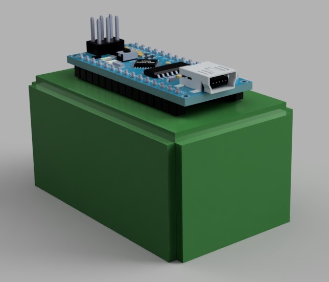
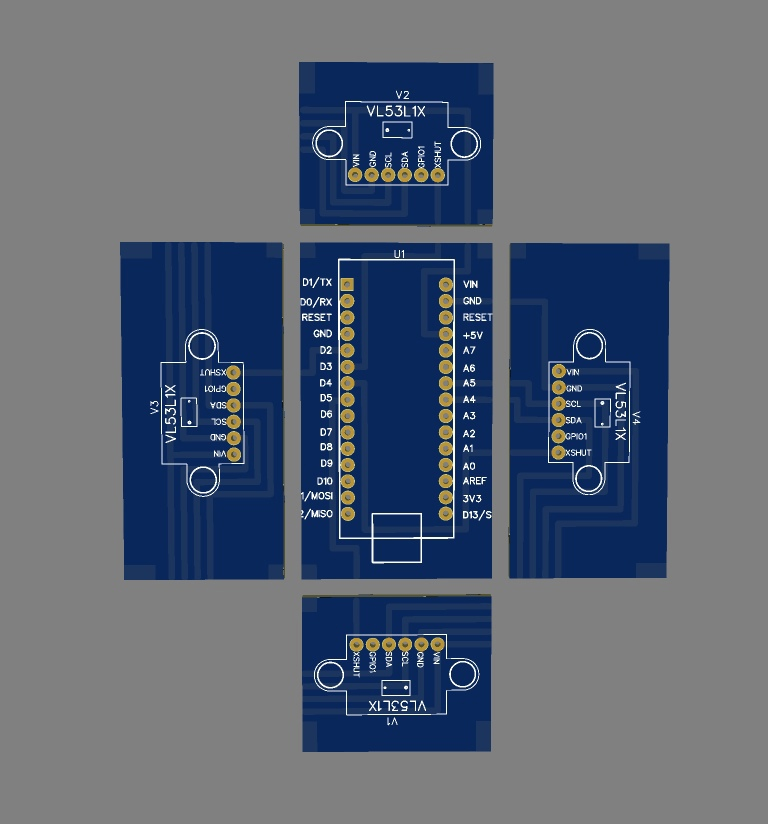

# EasyToFly

## Информация о команде

[CopterHack-2021](copterhack2021.md), название команды: **EasyToFly**.

В команде 5 человек:

- Игорь Сидорин [@maerans12](https://github.com/maerans12) (TeamLead)
- Артём Баталов [@bart02](https://github.com/bart02) (Full-Stack разработчик)
- Карина Янышевская [@fanot](https://github.com/fanot) (Веб-разработчик)
- Никита Локтев [@nikilokser](https://github.com/nikilokser) (Специалист отдела Hard)
- Даниил Руфин (Специалист отдела Hard)

E-mail: a@batalov.me<br>
Telegram: [@bart02](https://t.me/bart02), [@maerans](https://t.me/maerans)

## Введение

В работе рассматривается процесс разработки образовательного аппаратно-программного комплекса (далее – АПК, система) для безопасного обучения специалистов по профилю "Летающая робототехника".

Основной **проблемой данной сферы** является недостаточная безопасность открытых систем беспилотных летательных аппаратов (далее – БПЛА), а также сложность в их управлении и программировании для использования в обучении, промышленности и т.д.

**Объектом проектной работы** являются учебные комплексы для изучения процессов автоматизации. **Предметом** является АПК для безопасного обучения специалистов по профилю "Летающая робототехника".

**Цель**: Разработка АПК для простого и безопасного обучения специалистов по профилю "Летающая робототехника".

**Задачи**:

1. Проведение исследования среди потенциальных потребителей об их необходимостях при обучении специалистов.
2. Проведение анализа существующих решений.
3. Разработка технического задания (далее – ТЗ) на АПК.
4. Изучение литературы, необходимой для реализации проекта.
5. Формирование команды исполнителей на основании технического задания.
6. Разработка программной подсистемы АПК «Предотвращение столкновений».
7. Разработка программной подсистемы АПК «Мастер первоначальной настройки БПЛА».
8. Разработка программной подсистемы АПК «Монитор состояния БПЛА».
9. Разработка аппаратной составляющей АПК.



## Выбор платформы

Платформа Clover 4 позволяет подключать дополнительные устройства и обеспечивать связь между ними и оборудованием на борту; а также тем, что программная архитектура данного набора основана на открытом полетном стеке PX4 и операционной системе для роботов ROS (далее – ROS), что предоставляет возможность ее использования в том числе и на других беспилотных летательных аппаратах, в которых используется такие же программные компоненты. После изучения рынка образовательных дронов в России, мы пришли к выводу, что данная платформа станет хорошим стартом разработки проекта.

## Опрос потенциальных заказчиков. Разработка ТЗ

По результатам опроса потенциальных потребителей системы – педагогов детского технопарка «Кванториум» и других ОУ, было выяснено, что многие учреждения не имеют специально оборудованных зон для полетов, вследствие чего обучающиеся проводят настройку БПЛА и, в редких случаях, полет только под присмотром руководителя, на котором лежит ответственность за аппарат и окружающие предметы, жизнь и здоровье обучающихся.

Также нам стало известно о сложностях при настройке автономного полета, из-за частого использования консоли операционной системы Linux в процессе настройки, а также необходимости установки дополнительных программ.

Помимо этого, одним из запросов была компактная аппаратная составляющая системы, которая представляет собой защищенный корпус БПЛА, с возможностью быстрой установки используемого оборудования.

В качестве рассмотрения возможного места пилотного запуска системы, были проведены переговоры с Кванториумом г. Томска, об использовании АПК в обучающем процессе Аэроквантума.

## Процесс разработки

### Программная подсистема «Предотвращение столкновений»

Первым приоритетом стала программная подсистема «Предотвращение столкновений». Создав систему автономной защиты от “влетания” БПЛА в предметы, стоящие в учебной аудитории как во время ручного управления, так и тестировании программ автономного полета, а, при необходимости, и облета препятствий, мы сможем организовать более безопасное и продуктивное обучение.

Для разработки данной подсистемы, нами была изучена документация полетного стека PX4. Было выяснено, что полетный контроллер поддерживает эту функцию при передаче физически и геометрически обработанных данных с компьютера на борту. На борту Clover 4 установлен микрокомпьютер Raspberry Pi (далее – микрокомпьютер, компьютер на борту), мощности которого будут использоваться для этих целей.

Далее встал вопрос об использовании датчиков для разработки данной подсистемы.

#### LIDAR

Первое, что приходит в голову при разработке подобной системы – круговые LIDAR-датчики (далее – лидар). Самым популярным похожим решением на сегодняшний день является RPLIDAR A1.

Датчик основан на принципе лазерной триангуляции и использует высокоскоростное оборудование для получения и обработки изображений, система измеряет данные о расстоянии более 8000 раз в секунду. Лидар вращается по часовой стрелке для выполнения всенаправленного лазерного сканирования окружения на 360 градусов.

Результатом является облако точек, которое можно использовать при дальнейшей работе с пакетами ROS, позволяющими производить действия с этой структурой данных (такие как: перевод в другие структуры данных, построение карты, передача данных на другое оборудование).

Для установки датчика на Clover 4 было разработано и подготовлено для печати на 3D принтере специальное крепление, которое для экономии высоты было совмещено с креплением для аккумулятора.

Далее предстояла разработка программного обеспечения, которое выполняло все преобразования, как типов данных, так и геометрии (соглашения о системах координат полетного контроллера и ROS отличаются). После этого обработанные данные направляются в полетный контроллер, который отвечает за принятие решения: остановить летящий БПЛА или продолжать полет.

#### Аппаратное решение из 4-х лазерных дальномеров

Помимо лидара, было принято решение использовать статические дальномеры для удешевления системы. Нами было разработано аппаратное решение на базе Arduino Nano и дальнедистанционных датчиков времени пролета VL53L1X. Изделие совместимо с разработанным нами креплением.

Далее было написано программное обеспечение для работы с оборудованием. Было необходимо передать данные с микроконтроллера, установленного на Arduino Nano на микрокомпьютер, представить показания с датчиков в том же виде, в котором они представлены при получении данных с лидара. И после этого произвести те же действия, что и с лидаром.

### Программная подсистема «Мастер первоначальной настройки БПЛА»

Нами была запланирована разработка еще одной программной подсистемы, которая позволит настроить БПЛА, используя единый пользовательский веб-интерфейс, который «проведет» пользователя через весь процесс настройки. Также в данный веб-интерфейс должен быть встроен монитор текущего состояния БПЛА и редактор настроек.

В первую очередь нами был сделан каркас будущего интерфейса.

Также на данный момент реализован интерфейс калибровки датчиков БПЛА со встроенной анимацией для удобной работы с ним. Работу интерфейса калибровки можно увидеть на видео.

<iframe width="560" height="315" src="https://www.youtube.com/embed/7pV9BsczxMY" frameborder="0" allow="accelerometer; clipboard-write; encrypted-media; gyroscope; picture-in-picture" allowfullscreen></iframe>

### Аппаратная составляющая АПК

Также перед нами стояла задача разработать защищенный корпус БПЛА, с возможностью быстрой установки используемого оборудования, который не будет готов к полету и обучающимся не будет необходимости его собирать. На данный момент готова конструкторская документация изделия, а само изделие проходит апробацию.

## Использование нашего продукта

Репозиторий проекта доступен по ссылке https://github.com/easy-to-fly/easy-to-fly.

### Сборка крепления для датчиков

Вам понадобится:

- **4x** стойки M3x26
- **1x** [крепление для батареи](https://github.com/easy-to-fly/easy-to-fly/blob/master/hard/3d_models/case.stl)
- **1x** [платформа для крепления](https://github.com/easy-to-fly/easy-to-fly/blob/master/hard/dwgs/sensors_mount.dwg)

Соедините всё как показано на [модели](https://a360.co/2ZfKyW8).

### Сборка системы из 4-х лазерных дальномеров



Вам понадобится:

- **4x** дальнедистанционный датчик времени пролета VL53L1X
- **1x** Arduino Nano

1. Разведите платы согласно развертке из [файлов](https://github.com/easy-to-fly/easy-to-fly/raw/master/hard/pcb/sensors_4.zip) (вы можете использовать http://gerbv.geda-project.org/ для открытия)  
2. Припаять пины для установки Arduino Nano и датчиков на каждую из плат.
3. Расположить платы как показано на развёртке.

    

4. Составить из плат параллелепипед.
5. Спаять все платы между собой по соответствующим контактным группам.
6. Установить в пины датчики и Arduino nano.
7. Убедиться в отсутствии короткого замыкания.

### Установка ПО на Raspberry Pi

В первую очередь необходимо подключить ваш коптер к Интернету, один из способов это сделать - [перевести его в режим клиента](network.md#переключение-адаптера-в-режим-клиента) и подключить в Wi-Fi, имеющему доступ в Интернет.

Склонируйте репозиторий проекта в `catkin_ws` и перейдите в него:

```bash
cd ~/catkin_ws/src
git clone https://github.com/easy-to-fly/easy-to-fly
cd easy-to-fly
```

Установите необходимые зависимости

```bash
./install/ros_deps.sh
./install/arduino_deps.sh  # только если собираетесь использовать систему из 4-х лазерных дальномеров
```

### Запуск предотвращения столкновений

Для работы с лидаром необходимо изменить параметр `CP_DIST` PX4. Рекомендуется установить 0.5 м.

Теперь полетный контроллер будет получать сообщения от компьютера о расстоянии вокруг в специальном формате (читать доп. [https://mavlink.io/en/messages/common.html#OBSTACLE_DISTANCE](https://mavlink.io/en/messages/common.html#OBSTACLE_DISTANCE)).

Теперь задача заключается в передаче сообщения такого типа на полетный контроллер.

В библиотеке MAVROS есть специальный плагин для этих целей: [https://github.com/mavlink/mavros/tree/master/mavros_extras#obstacle_distance](https://github.com/mavlink/mavros/tree/master/mavros_extras#obstacle_distance).

Таким образом, достаточно ее включить в `<rosparam param="plugin_whitelist">` в файле `mavros.launch`.

Далее, запускаем один из `.launch` файлов.

## Заключение

В ходе выполнения проекта были проанализированы существующие разработки в области образовательной «Летающей робототехники», описаны их достоинства и недостатки. Выбрана платформа для старта проекта.

Реализована и протестирована основная часть проекта – программная подсистема «Предотвращение столкновений». Веб-интерфейс, согласно плану, находится в разработке до конца марта 2021 года.

Для реализации аппаратной составляющей был выполнен сборочный чертеж в системе автоматизированного проектирования Fusion 360. Полученные чертежи позволят производить БПЛА для реализации проекта. В будущем на основе конструкторской документации будут изготовлены дополнительные БПЛА.

В следующие два года планируется совершенствование проекта и выход на рынок. Некоторые из основных задач на 2021-2023 год: более подробное исследование рынка для выделения основных задач дальнейшей разработки системы, апробация системы в целом в Кванториуме, разработка системы навигации БПЛА по карте с использованием оборудования, которое будет установлено на аппаратной составляющей.
