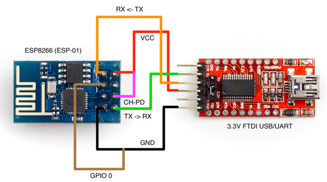

# Модуль ESP8266

> **Note** Более подробную информацию можно найти в [основной статье](https://docs.px4.io/en/telemetry/esp8266_wifi_module.html) в официальной документации и в [репозитории с прошивкой](https://github.com/dogmaphobic/mavesp8266) для ESP8266


Полётные контроллеры семейства Pixracer поддерживают подключение Wi-Fi модулей ESP8266. Эти модули можно использовать для подключения к полётному контроллеру с компьютера или планшета, даже если бортовой компьютер (например, [Raspberry Pi](raspberry.md)) отсутствует или неисправен.

## Подготовка модуля

Перед началом работы в модуль ESP8266 следует загрузить прошивку с поддержкой MAVLink. Для этого потребуется:

* [Сама прошивка](http://www.grubba.com/mavesp8266/firmware-1.2.2.bin);
* Компьютер с ОС на базе GNU/Linux;
* USB-UART адаптер;
* Утилита [esptool](https://github.com/espressif/esptool).

> **Warning** Убедитесь в том, что на вашем USB-UART адаптере установлено напряжение **3.3 В**!

Подключите ваш модуль к USB-UART, как показано на схеме:



Скачайте [прошивку для модуля](http://www.grubba.com/mavesp8266/firmware-1.2.2.bin). Подключите USB-UART к компьютеру и посмотрите, какое устройство соответствует переходнику. Убедитесь, что у вас установлена утилита esptool (её можно поставить командой `pip install esptool`). Запустите процесс загрузки прошивки командой:

```bash
esptool.py --baud 921600 --port /dev/ttyUSB0 write_flash 0x00000 firmware-1.2.2.bin
```

, где вместо `/dev/ttyUSB0` укажите устройство, соответствующее вашему переходнику, а вместо `firmware-1.2.2.bin` - путь к прошивке.

> **Hint** Если в процессе загрузки прошивки возникли проблемы, вы можете запустить процесс заново.

## Работа с ESP8266


Подключите ESP8266 к Pixracer так, как показано на схеме, и включите