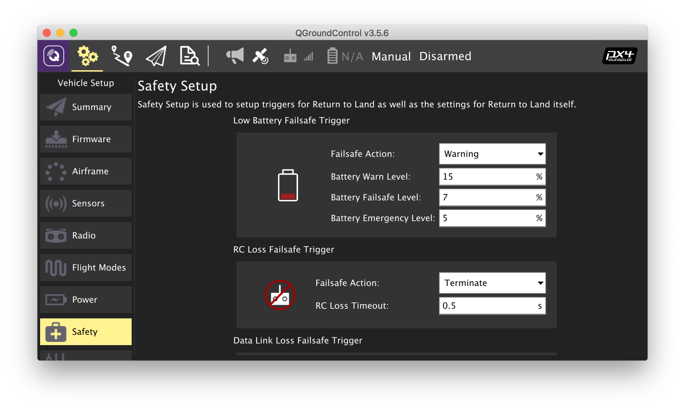

# Настройка failsafe

Основная статья: https://docs.px4.io/master/en/config/safety.html.

Во вкладке *Safety* настраиваются реакции квадрокоптера на различные нештатные ситуации. Рекомендуется включить как минимум реакцию на потерю связи с пультом управления:

1. Откройте вкладку *Safety*.
2. В блоке *RC Loss Failsafe Trigger* выберите один из рекомендуемых вариантов реакции на потерю связи с пультом:
   * *Land mode* – переход в режим посадки;
   * *Terminate* – аварийное отключение моторов.
3. В поле *RC Loss Timeout* выберите значение таймаута, по истечении которого связь с пультом считается потерянной. Рекомендуемое значение – 0.5 s.

