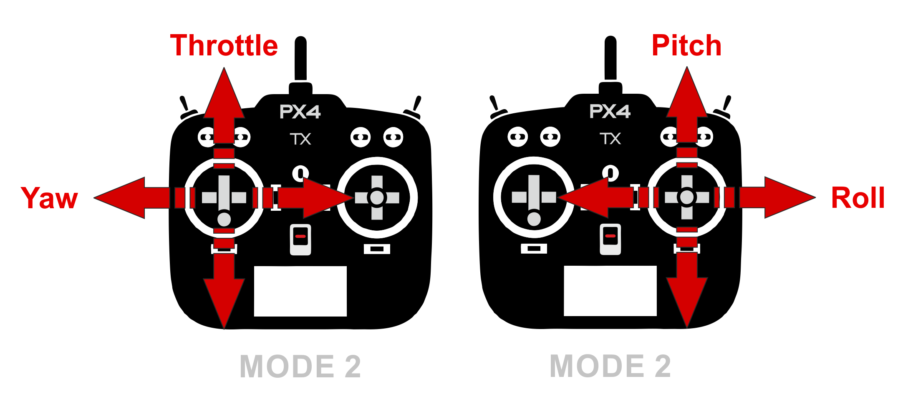
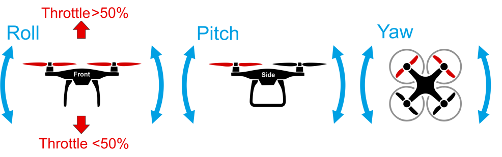

# Полет

После сборки и настройки вашего коптера вам необходимо освоить основы управления коптером. В данном разделе приведены основные понятия управления коптером в помощью радиоаппаратуры.

## Радиоаппаратура и ее команды

Прежде чем запускать ваш коптер, необходимо разобраться, как работает пульт радиоуправления ("аппаратура" в общепринятой терминологии авиамоделизма).

Управление дроном происходит с помощью двух стиков на аппаратуре. По умолчанию левый стик отвечает за газ и рысканье, а правый за крен и тангаж.

Данные термины используюся для всех летательных судов, от самолетов, до квадрокоптеров.

TODO: Скрин с коптером и осями координат

* Газ(throttle) - Отвечает за скорость вращения двигателей.
* Рысканье(yaw) - Отвечает за повороты вокруг вертикальной оси (Z), по часовой (при наклоне вправо) и против часовой (при наклоне влево) стрелки.
* Тангаж(Pitch) - Отвечает за наклон вперёд/назад (поворот вокруг оси X).
* Крен(Roll) - Отвечает за наклон влево/вправо (поворот вокруг оси Y).

> **Info** Данные описания предполагают, что коптер находится хвостом к вам и носом от вас

## Полетные режимы

Коптеры могут летать в различных полетных режимах, каждый из которых определяет степени свободы, которыми вы будете управлять, а соответственно отличаются значения стиков. Далее приведены основные режимы:

> **Hint** Различные прошивки полетных контроллеров могут иметь различные наименования полетных режимов. Ниже используется именование режимов, принятые в *PX4*.

* `Stabilize`- Режим стабилизации, в данном режиме коптер сам будет удерживать горизонт, если им не управлять.
  * Газ(throttle) - Отвечает за силу развиваемую моторами.
  * Рысканье(yaw) - Отвечает за повороты вокруг своей оси, по часовой и против часовой стрелки.
  * Тангаж(Pitch) - Отвечает за угол, на который будет наклонен коптер вперед или назад. Без управления угол примерно равет 0 и паралелен горизонту.
  * Крен(Roll) - Отвечает за угол, на который будет наклонен коптер вправо или влево. Без управления угол примерно равет 0 и паралелен горизонту.

* `Position` - Режим удержания позиции(если имеется система навигации), в данном режиме, как и в режиме `Stabilize` коптер будет удерживать горизонт, но также он будет сохранять свою позицию и возвращаться в определенную вами точку.
  * Газ(throttle) - Отвечает за скорость с которой коптер будет подниматься вверх или вниз. >50% подъем вверх, <50% спуск вниз, 50% коптер не меняет высоту.
  * Рысканье(yaw) - Отвечает за повороты вокруг своей оси, по часовой и против часовой стрелки.
  * Тангаж(Pitch) - Отвечает за скорость, с которой коптер будет лететь вперед или назад.
  * Крен(Roll) - Отвечает за скорость, с которой коптер будет лететь вправо или влево.

* `Acro` - Режим удержания угла наклона коптера, в данном режиме, будет удерживаться только угол, в котором оказался ваш коптер, а управляете вы угловыми скоростями вокруг каждой из осей. Используется только опытными пилотами
  * Газ(throttle) - Отвечает за скорость вращения моторов.
  * Рысканье(yaw) - Отвечает за повороты вокруг своей оси, по часовой и против часовой стрелки.
  * Тангаж(Pitch) - Отвечает за угловую скорость, с которой коптер будет вращаться вокруг оси X, вперед или назад.
  * Крен(Roll) - Отвечает за угловую скорость, с которой коптер будет вращаться вокруг оси Y, вправо или влево.

* `Offboard` - Режим автономного управления. В данном режиме коптер не обрабатывает сигналы с пульта, а все управление происходит с помощью команд, посылаемых бортовым компьютером. Перевод в данный режим осуществляется вашей программой.

TODO: Ссылка на статью про настройки режимов и рекомендации по настройке

## Подготовка к полету

### Установка пропеллеров и АКБ

1. Установите ремешок для аккумулятора.

    

2. Установите пропеллеры в соответствии со [схемой направления движения моторов](#prop_rotation).

    

3. Установите аккумулятор.

TODO: Рендер настройки пищалки и установки ее на акб

    

### Режимы готовности к полету

Прежде чем начинать полет необходимо подготовить его к полету, для этого существует 2 режима:

* `Arm` - Раскручивает моторы на минамальных оборотах, передает сигналы с пульта на них.
* `Disarm` - Моторы не работает, коптер не передает сигналы с пульта на них.

По умолчанию коптер находится в режиме `Disarm` и переходит в него в случае если вы долго не взлетаете.

Для перевода коптера в режим `Arm` есть несколько способов:

* С помощью стика - переведите левый стик вниз вправо и подождите пару секунд.
* С помощью тумблера - режимы `Arm`/`Disarm` можно настроить на 1 из тумблеров, подробнее о настройке в статье про [полетные режимы](modes.md)
* С помощью QGC - вы можете заармить ваш дрон программно, с помощью наземной станции *GQC*, для этого нажмите на надпись `Disarm` в шапке и выберите другой режим.

### Режим Kill switch

Отдельное внимание необходимо уделить режиму `Kill Switch`, при активации данного режима на моторы перестают посылаться какие либо значения и соответственно моторы перестают вращаться. Данный режим используется в крайних случаях, к примеру, если вы потеряли управление над коптером.

> **Caution** Будьте внимательны, режим `Kill Switch` не переводит коптер в состояние `Disarm`, а только на время его работы прерывает подачу сигналов на моторы!

Каждый раз перед отключением режима `Kill Switch` убеждайтесь, что стик газа находится в нижнем положении и коптер в режиме `Disarm`. В случае, если стик газа не находится в нижнем положении, при отключении режима `Kill Switch` на моторы будет подан сигнал соответствующий положению стика в данный момент, что приведет к резкому рывку коптера.

## Упражнения для управления коптером

Далее описаны рекомендуемые упражнения для тех, кто учится летать на коптере в первый раз. Повторяйте кажое упражнение необходимое количество раз, пока не будете чувствовать себя уверенно в нем.

> **Hint** В случае, если рядом есть человек умеющий управлять коптером, [используйте режим тренера](trainer_mode.md).

> **Hint** Настоятельно рекомендуется первые полеты проводить за защитной сеткой, в случает отсутсвия таковой рекомендуемая полетная зона должна быть не менее 6х6 м.

### Включение, выключение моторов, изменение режимов

> **Hint** Для удобства подключитесь к коптеру с помощью [QGC через Wi-Fi](gcs_bridge.md) и включите звук, это позволит наблюдать за изменением полетных режимов. Если не имеется возможности подключиться через Wi-Fi, для проверки полетных режимов подключитесь по USB.

* Убедитесь, что настроили полетные режимы на один из тумблеров.
  * Переключите тумблер на который вы настроили полетные режимы в разные позиции и убедитесь, что они изменяются.

TODO: gif переключения тумблера и режимов в кжс

* Убедитесь, что настроили режим `Kill Switch`.
  * Переведите коптер в режим `Kill Switch`, проверьте, что в QGC появилась уведомление **. 
  * Переведите коптер в режим `Arm`, а затем в режим `Kill Switch`, убедитесь, что моторы выключились, затем переключите тумблер `Kill Switch` в изначальное положение, если коптер автоматически не перешел в режим `Disarm` из-за бездействия моторы снова начнуть вращаться.

Убедитесь, что режимы переключаются удобными для вас тумблерами, в противном случае, измените их в соответсвии со [статьей по настройке полетных режимов](modes.md). Повторите приведенные упражнения несколько раз, для того, чтобы запомнить какие тумблеры за что отвечают.

### Работа с газом

Первым делом необходимо почувствовать отзывчивость коптера на движение стика газа и научиться им управлять(левый стик, вертикальная ось). Каждый коптер имеет различные запасы мощности и соответственно отрывется от земли при разных положениях стика.

В данном упражнении необходимо использовать только 1 стик, стик газа. Во время выполнения рекомендуется не использовать остальные стики.

Основные задания упражнения:

1. Дрейф коптера по земле, без взлета в воздух
2. Дрейф коптера с "подпрыгиваниями"
3. Дрейф коптера и последующий переход к подпрыгиваниям

Перед взлетом выполняйте следующие действия:

1. Проверьте целосность коптера и возможность вращения пропеллеров
2. Убедитесь, что коптер находится хвостом к вам
3. Включите коптер путем подключения АКБ
4. Отойдите на безопасное расстояние. Рекомендуется соблюдать расстояние до коптера минимум 4-5м.
5. Убедитесь, что коптер находится в режиме `Stabilize`
6. Переведите коптер в состояние `Arm`

Не пытайтесь сразу оторвать коптер от земли, найдите минимально возможное положение стика в соответсвии с упражнением, в противном случае, это может привести к поломкам или травмам.

> **Caution** В случае потери контроля над коптером необходимо сразу переводить его в режим `Kill Switch`, настоятельно рекомендуется проверять его работу перед каждым взлетом, для наработки мышечной памяти. Лучше повредить коптер, чем окружающие вещи или людей находящихся вокруг.

**Упражнение №1** Медленно поднимайте стик газа вверх, пока коптер не начнет двигаться. В этот момент он начнет медленно дрейфовать по земле. Оставьте стик газа в таком положении и подождите пару секунд, затем переведите стик в изначальное положение, чтобы посадить коптер. После посадки коптера выключите моторы переведя в состояние `Disarm`. Повторите упражнение 10-15 раз, чтобы лучше чувствовать отзывчивость коптера на стик газа.

**Упражнение №2** Как в прошлом упражнении медленно поднимайте стик газа вверх, пока коптер на нечнет двигаться по земле, продолжайте увеличивать газ, пока коптер не начнет немного подлетать, это похоже на небольшие "подпрыгивания". Оставьте стик газа в таком положении и подождите пару секунд, затем посадите коптер аналогично **Упражнению №1**. Повторите упражнение 10-15 раз.

**Упражнение №2** Упражнение является совмещением первого и второго. Аналогично с первым упражнением поднимайте стик газа, пока коптер не начнет дрейфовать по земле, подождите секунду и продолжайте его увеличивать до "подпрыгиваний" коптера, снова подождите пару секунд, посадите коптер. Для закрепления повторяйте упражнения 10-15, при необходимости увеличивая количество повторений.

### Работа с креном и тангажом

После освоения управления газом коптера, необходимо научиться позиционировать его по осям X, Y. За это отвечает правый стик на радоаппаратуре, подробнее об этом выше.

Управление данными осями интуитивно понятно:

* Стик наклонен вперед(вверх) - коптер движется вперед
* Стик наклонен назад(вниз) - коптер движется назад
* Стик наклонен вправо - коптер движется вправо
* Стик наклонен влево - коптер движется влево

Чем сильнее стик будет наклонен в сторону, тем быстрее коптер будет к ней двигаться.

Основные задания упражнения:

1. Полет по оси X, вперед/назад
2. Полет по оси Y, влево/вправо
3. Стабилизация коптера на одном месте
4. Полет по квадрату по часовой стреле и против

> **Hint** Старайтесь всегда находится позади коптера, таким образом, чтобы его хвост был направлен на вас, иначе вы можете потерять управление над ним, перепутав стороны.

Как и в случае с управлением газом, перед полетом выполняйте [следующие действия](#preflight_checks).

> **Hint** Если коптер сильно вращается вокруг своей оси, посадите его и повторно откалибруйте магнитометр и гироскоп.

**Упражнение №1** Аналогично упражнениям по управлению газом поднимайте стик газа, пока коптер на начнет дрейфовать по земле или немного подпрыгивать, затем отпустите стик газа, оставив его в таком положении и поднимайте стик тангажа, сначала вверх, на протяжении секунды, затем вниз. При этом, коптер будет постепенно перемещаться сначала от вас, а затем к вам. Повторите упражнение 5-10 раз, пока не почувствуете отзывчивость коптера на движение стика.

**Упражнение №2** Поднимайте стак газа, пока коптер не начнет дрейфовать, затем оставьте его, и поднимайте стик крена сначала вправо, на протяжении секунды, затем влево. При этом, коптер будет постепенно перемещаться сначала вправо, а затем влево. Повторите упражнение 5-10 раз, пока не почувствуете отзывчивость коптера на движение стика.

**Упражнение №3** Поднимайте стак газа, пока коптер не начнет дрейфовать, затем оставьте его. Совместите знания из первого и второго упражнения и постарайтесь стабилизировать коптер в одной точке, компенсируя его дрейф с помощью стика. Удерживайте коптер 50-60 секунд.

**Упражнение №4** Поднимайте стак газа, пока коптер не начнет дрейфовать, затем оставьте его. Почувствовав отзывчивость коптера на изменения стиков выполните фигуру "квадрат" со стороной 1м, сначала по часовой стрелке, а затем против. Выполняйте фигуры по 2-3 раза.
