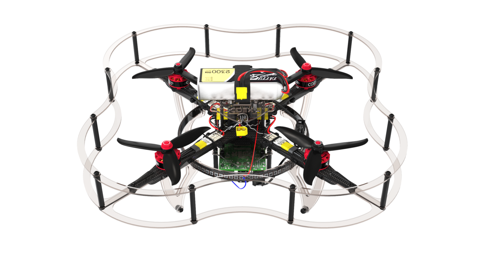

# Полет

Этот раздел объясняет основы управление квадрокоптером с использование пульта радиоуправления в различных режимах (для автономных полетов смотрите раздел "[Программирование](programming.md)").

## Радиоаппаратура и ее команды

Прежде чем запускать коптер, необходимо разобраться, как работает аппаратура.

Управление дроном происходит с помощью двух стиков на аппаратуре. По умолчанию левый стик отвечает за газ и рысканье, а правый за крен и тангаж. Данные термины используются для всех летательных судов, от самолетов до квадрокоптеров.

TODO: Скрин с коптером и осями координат

Назначение каналов управление в общем случае:

* Газ (*throttle*) – отвечает за скорость вращения двигателей.
* Рысканье (*yaw*) – отвечает за повороты вокруг своей оси, по часовой и против часовой стрелки. Измеряется в диапазоне от 0 до 1, начиная из 0.5.
* Тангаж (*pitch*) – отвечает за повороты вперед, назад, вокруг оси X. Измеряется в диапазоне от 0 до 1, начиная из 0.5.
* Крен (*roll*) – отвечает за повороты вправо, влево, вокруг оси Y. Измеряется в диапазоне от 0 до 1, начиная из 0.5.

Данные описания предполагают, что коптер находится задней частью к пилоту.

## Полетные режимы

Ручное полет с использованием полетного контроллера PX4 может происходит с использованием разных полетных режимов, которые определяют назначения стиков радиопульта и другие характеристики полета. Полный список полетных режимов приведен в статье "[Полетные режимы](modes.md)".

Основные ручные режимы разобраны далее.

**STABILIZED** - режим стабилизации горизонтального положения. В данном режиме коптер будет удерживать горизонт, если им не управлять. Назначение стиков:

* Газ – усредненная скорость вращения моторов.
* Рысканье – угловая скорость вокруг вертикальной оси.
* Тангаж – угол наклона вокруг поперечной оси (вперед/назад).
* Крен – угол наклон вокруг продольной оси (влево/вправо).

**POSCTL** – режим удержания позиции (требуется включенная система позиционирования). Назначение стиков:

* Газ - вертикальная скорость полета.
* Рысканье - угловая скорость вокруг вертикальной оси.
* Тангаж - линейная скорость полета дрона (вперед/назад).
* Крен - линейная скорость полета дрона (влево/вправо).

**ACRO** – режим управление средней скоростью вращения моторов и угловыми скоростями дрона. Этот режим является наиболее сложным для пилотирования и чаще всего применяется дрон-рейсерами и в шоу 3D-пилотирования для выполнения трюков. Назначение стиков:

* Газ – усредненная скорость вращения моторов.
* Рысканье – угловая скорость вокруг вертикальной оси.
* Тангаж – угловая скорость вокруг поперечной оси (вперед/назад).
* Крен – угловая скорость вокруг продольной оси (влево/вправо).

> **Info** В других полетных контроллерах аналогичные полетные режимы могут называться по-другому.

## Подготовка к полету

### Установка пропеллеров и АКБ

1. Установите ремешок для аккумулятора.

    

2. Установите пропеллеры в соответствии со [схемой направления движения моторов](#prop_rotation).

    

3. Установите аккумулятор.

    

TODO: Рендер настройки пищалки и установки ее на акб

### Режимы готовности к полету

Прежде чем начинать полет, необходимо перевести коптер в состояние *Armed*.

* Состояние *Armed* – раскручивает моторы на минимальных оборотах, коптер готов к полету.
* Состояние *Disarmed* – моторы не работают, коптер не передает сигналы с пульта на них.

По умолчанию коптер находится в состоянии *Disarmed* и переходит в него в случае если вы долго не взлетаете.

Для перевода коптера в состояние *Armed* есть несколько способов:

* С помощью стика – переведите левый стик вниз вправо и подождите пару секунд.
* С помощью тумблера – состояния Armed/Disarmed можно настроить на один из тумблеров. Подробнее о настройке в смотрите в статье про [полетные режимы](modes.md).
* С помощью QGC – вы можете заармить ваш дрон программно. Для этого нажмите на надпись *Disarm* в шапке и выберите другое состояние.

### Kill switch

При активации тумблера *Kill Switch* на моторы перестают посылаться какие либо значения и они перестают вращаться. Эта функция используется в крайних случаях, к примеру, если вы потеряли управление над коптером.

> **Caution** Будьте внимательны, *Kill Switch* не переводит коптер в состояние *Disarmed*!

Каждый раз перед отключением *Kill Switch* убеждайтесь, что стик газа находится в нижнем положении и коптер находится в состоянии *Disarmed*. В случае, если стик газа не находится в нижнем положении, при отключении *Kill Switch* на моторы будет подан сигнал соответствующий положению стика в данный момент, что приведет к резкому рывку коптера.

## Упражнения для управления коптером

Далее описаны рекомендуемые упражнения для тех, кто учится летать на коптере в первый раз. Повторяйте каждое упражнение необходимое количество раз, пока не будете чувствовать себя уверенно в нем.

> **Hint** В случае, если рядом есть человек умеющий управлять коптером, [используйте режим тренера](trainer_mode.md).

<!-- -->

> **Hint** Настоятельно рекомендуется первые полеты проводить за защитной сеткой. В случае отсутствия таковой рекомендуемая полетная зона должна быть не менее 6x6&nbsp;м.

### Включение, выключение моторов, изменение режимов

> **Hint** Для удобства подключитесь к коптеру с помощью [QGC через Wi-Fi](gcs_bridge.md) и включите звук. Это позволит наблюдать за изменением полетных режимов. Если не имеется возможности подключиться через Wi-Fi, для проверки полетных режимов подключитесь по USB.

Убедитесь, что настроили полетные режимы на один из тумблеров. Для этого переключите тумблер, на который вы настроили полетные режимы, в разные позиции и убедитесь, что они изменяются.

TODO: gif переключения тумблера и режимов в кжс

Убедитесь, что настроили *Kill Switch*:

* Включите *Kill Switch*, проверьте, что в QGC появилось уведомление.
* Переведите коптер в состояние *Armed*, а затем включите *Kill Switch*. Убедитесь, что моторы выключились. Затем переключите тумблер *Kill Switch* в изначальное положение. Если коптер автоматически не перешел в состояние *Disarmed* из-за бездействия, моторы снова начнут вращаться.

Убедитесь, что режимы переключаются удобными для вас тумблерами. В противном случае измените их в соответствии со [статьей по настройке полетных режимов](modes.md). Повторите приведенные упражнения несколько раз, для того, чтобы запомнить какие тумблеры за что отвечают.

### Работа с газом

Первым делом необходимо почувствовать отзывчивость коптера на движение стика газа и научиться им управлять (левый стик, вертикальная ось). Каждый коптер имеет немного различные запасы мощности и соответственно отрывается от земли при разных положениях стика.

В данном упражнении необходимо использовать только стик газа. Во время выполнения рекомендуется не использовать остальные стики.

Основные задания упражнения:

1. Дрейф коптера по земле, без взлета в воздух.
2. Дрейф коптера с "подпрыгиваниями".
3. Дрейф коптера и последующий переход к подпрыгиваниям.

#### Предполетные проверки

Перед взлетом выполняйте следующие действия:

1. Проверьте целостность коптера и возможность вращения пропеллеров.
2. Убедитесь, что коптер находится задней частью к вам.
3. Включите коптер путем подключения АКБ.
4. Отойдите на безопасное расстояние. Рекомендуется соблюдать расстояние до коптера минимум 4–5 м.
5. Убедитесь, что коптер находится в режиме *Stabilized*.
6. Переведите коптер в состояние *Armed*.

Не пытайтесь сразу оторвать коптер от земли, найдите минимально возможное положение стика в соответствии с упражнением. В противном случае это может привести к поломкам или травмам.

> **Caution** В случае потери контроля над коптером необходимо сразу включать *Kill Switch*. Настоятельно рекомендуется проверять его работу перед каждым взлетом, для наработки мышечной памяти.

**Упражнение №1**. Медленно поднимайте стик газа вверх, пока коптер не начнет двигаться. В этот момент он начнет медленно дрейфовать по земле. Оставьте стик газа в таком положении и подождите пару секунд, затем переведите стик в изначальное положение, чтобы посадить коптер. После посадки коптера выключите моторы переведя в состояние *Disarmed*. Повторите упражнение 10–15 раз, чтобы лучше чувствовать отзывчивость коптера на стик газа.

**Упражнение №2**. Как и в прошлом упражнении, медленно поднимайте стик газа вверх, пока коптер на начнет двигаться по земле. Продолжайте увеличивать газ, пока коптер не начнет немного подлетать, это похоже на небольшие "подпрыгивания". Оставьте стик газа в таком положении и подождите пару секунд, затем посадите коптер аналогично упражнению №1. Повторите упражнение 10-15 раз.

**Упражнение №2**. Упражнение является совмещением первого и второго. Аналогично с первым упражнением поднимайте стик газа, пока коптер не начнет дрейфовать по земле, подождите секунду и продолжайте его увеличивать до "подпрыгиваний" коптера, снова подождите пару секунд, посадите коптер. Для закрепления повторяйте упражнения 10-15 раз, при необходимости увеличивая количество повторений.

### Работа с креном и тангажом

После освоения управления газом коптера, необходимо научиться управлять его горизонтальным положением. За это отвечает правый стик на радоаппаратуре.

Управление данными осями интуитивно понятно:

* Стик наклонен вперед (вверх) – коптер движется вперед.
* Стик наклонен назад (вниз) – коптер движется назад.
* Стик наклонен вправо – коптер движется вправо.
* Стик наклонен влево – коптер движется влево.

Чем сильнее стик будет наклонен в сторону, тем быстрее коптер будет двигаться.

Основные задания упражнения:

1. Полет по оси X, вперед/назад.
2. Полет по оси Y, влево/вправо.
3. Стабилизация коптера на одном месте.
4. Полет по квадрату по часовой стреле и против.

> **Hint** Старайтесь всегда находится позади коптера, таким образом, чтобы его задняя часть была направлена к вам, иначе вы можете потерять управление над ним, перепутав стороны.

Как и в случае с управлением газом, перед полетом выполняйте [следующие действия](#предполетные-проверки).

> **Hint** Если коптер сильно вращается вокруг своей оси, посадите его и повторно откалибруйте магнитометр и гироскоп.

**Упражнение №1**. Аналогично упражнениям по управлению газом поднимайте стик газа, пока коптер на начнет дрейфовать по земле или немного подпрыгивать, затем отпустите стик газа, оставив его в таком положении, и поднимайте стик тангажа, сначала вверх, на протяжении секунды, затем вниз. При этом коптер будет постепенно перемещаться сначала от вас, а затем к вам. Повторите упражнение 5-10 раз, пока не почувствуете отзывчивость коптера на движение стика.

**Упражнение №2**. Поднимайте стик газа, пока коптер не начнет дрейфовать, затем оставьте его и перемещайте стик крена сначала вправо, на протяжении секунды, затем влево. При этом коптер будет постепенно перемещаться сначала вправо, а затем влево. Повторите упражнение 5-10 раз, пока не почувствуете отзывчивость коптера на движение стика.

**Упражнение №3**. Поднимайте стик газа, пока коптер не начнет дрейфовать, затем оставьте его. Совместите первое и второе упражнение и постарайтесь стабилизировать коптер в одной точке, компенсируя его дрейф с помощью стика. Удерживайте коптер 50-60 секунд.

**Упражнение №4**. Поднимайте стик газа, пока коптер не начнет дрейфовать, затем оставьте его. Почувствовав отзывчивость коптера на изменения стиков выполните фигуру "квадрат" со стороной 1 м, сначала по часовой стрелке, а затем против. Выполняйте фигуры по 2-3 раза.
