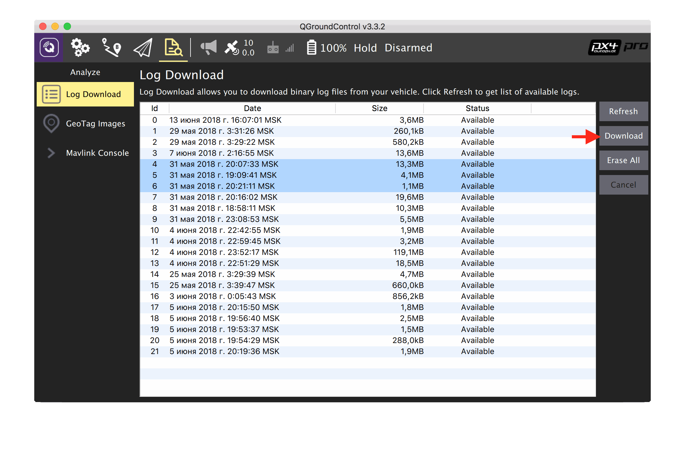
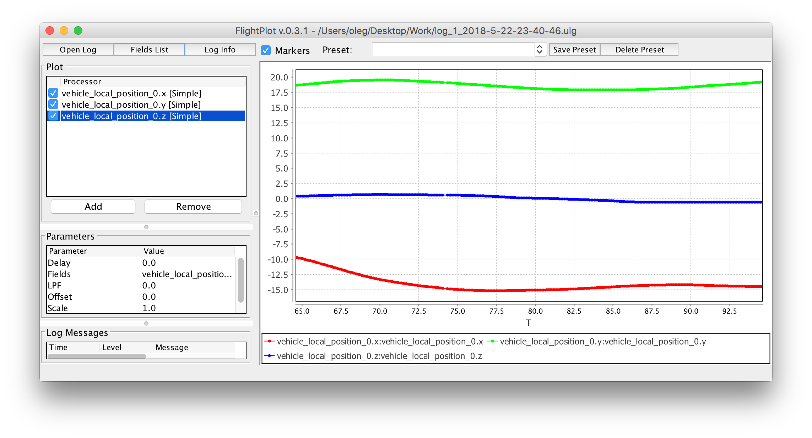
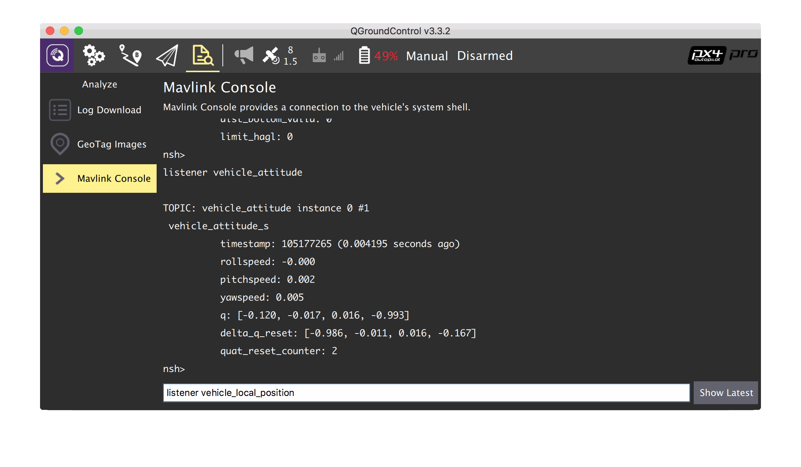

Логи и топики PX4
===

Для детального анализа поведения прошивки PX4 можно просмотреть полетные логи. Полетные логи представляют собой сообщения в [uORB-топиках](https://dev.px4.io/en/middleware/uorb.html), записанные в файл с расширением `.ulg`. Лог-файл можно скачать с помощью QGroundControl по Wi-Fi или USB во вкладке *Log Download*:

Также необходимые `.ulg`-файлы можно скопировать непосредственно с MicroSD-карты, находившейся в полетном контроллере.

Анализ
---

### logs.px4.io

Записанные лог-файлы можно загрузить на сайт https://logs.px4.io и анализировать их через веб-интерфейс.

### FlightPlot

Также лог-файл можно анализировать с помощью программы FlightPlot. Актуальную версию программы можно [скачать](https://github.com/PX4/FlightPlot/releases) на GitHub.

В программе можно просмотреть полный список записанных топиков (*Fields List*). В нем нужно выбрать необходимые топики, после чего они появятся на графике:

Основные топики в PX4
---

[uORB](https://dev.px4.io/en/middleware/uorb.html) представляет собой pub/sub механизм, аналогичный ROS-топикам, однако сильно упрощенный и подходящий для embedded-среды.

Полный список топиков можно узнать в исходном коде проекта [в каталоге `msg`](https://github.com/PX4/Firmware/tree/master/msg).

Список некоторых топиков:

* **vehicle_status** – состояние коптера (режим и т. д.);
* **vehicle_local_position** – локальная позиция коптера;
* **vehicle_attitude** – ориентация коптера;
* **vehicle_local_position_setpoint** – целевая точка (setpoint) коптера по позиции;
* **vehicle_global_position** – глобальная позиция коптера;
* **vehicle_vision_position** – полученная визуальная позиция коптера, аналог MAVLink пакета `VISION_POSITION_ESTIMATE` или MAVROS-топика `/mavros/vision_position_estimate/pose`;
* **att_pos_mocap** – полученная MOCAP-позиция коптера, аналог MAVLink пакета `ATT_POS_MOCAP` или MAVROS-топика `/mavros/mocap/pose`;
* **actuator_controls** – сигналы на моторы;
* **vehicle_land_detected** – статус Land-detector'а;
* **optical_flow** – данные с модуля optical flow.

Мониторинг топиков в режиме реального времени
---

Для более новых версий платы Pixhawk (`px4fmu-v3`), а также для плат Pixracer, в прошивку включен модуль `topic_listener`, который позволяет просматривать значения топиков в режиме реального времени (в том числе в полете).

Для ее использования нужно выбрать вкладку MAVLink Console в QGroundControl:

Команда `list_topics` выводит список топиков, доступных для просмотра (включена только в [SITL](sitl.md)).

Команда `listener <название топика>` выводит текущее значение в топике. Существует третий опциональный параметр, который определяет количество сообщений, которые необходимо вывести.

Примеры команд:

`listener vehicle_local_position`

`listener vehicle_attitude 5`
