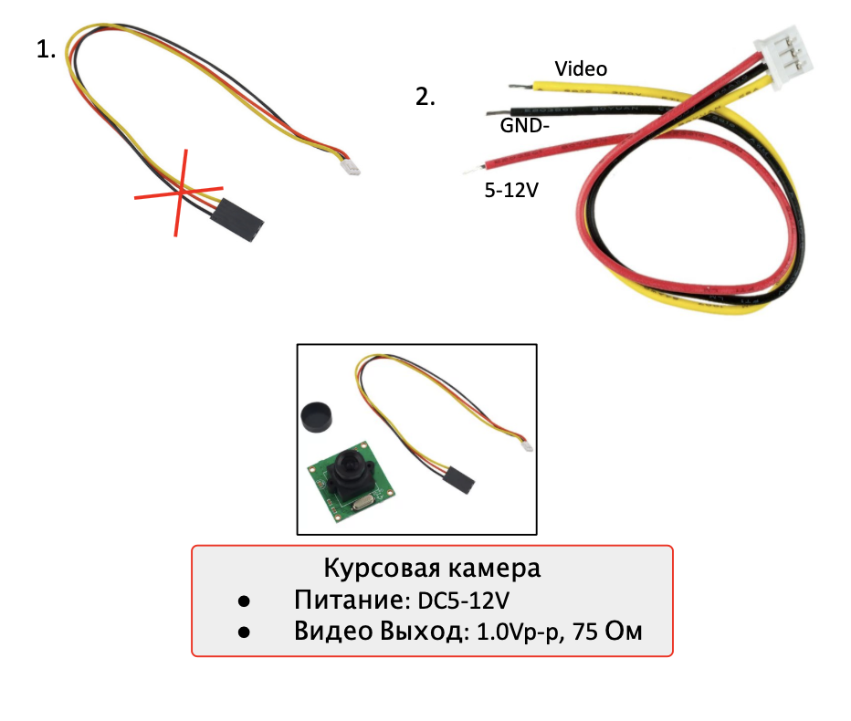
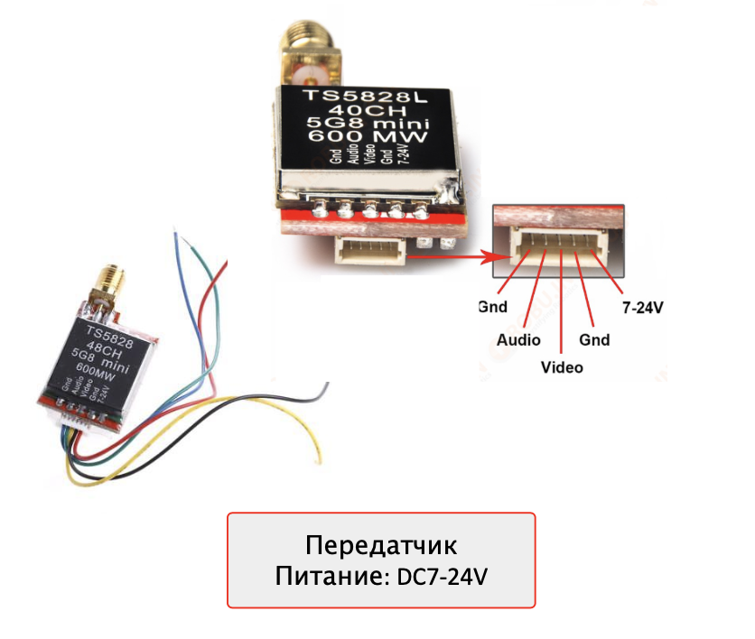

# Установка FPV

## Подготовка курсовой камеры

1. Взять провод-коннектор от камеры и откусить ЧЁРНУЮ сторону 3-х пинового разъема.
1. Подготовить провода провода к подключению:
   1. Укоротить провода до нужной длины *.
   1. Зачистить (снять 2мм термоизоляции с конца провода, не повредив жилы).
   1. Скрутить провода.
   1. Залудить, используя пинцет.

\* Длину нужно определить заранее, между платой распределения питания и предположительным место установки камеры!

## Подготовка передатчика

Аналогичную процедуру проводим и здесь:

1. Взять провод-коннектор от передатчика и откусить ЧЁРНУЮ сторону 5-ти пинового разъема.
2. Подготовить провода провода к подключению:
   1. Укоротить провода до нужной длины *.
   2. Зачистить (снять 2мм термоизоляции с конца провода, не повредив жилы).
   3. Скрутить провода.
   4. Залудить, используя пинцет.

* Длину нужно определить заранее, между платой распределения питания и предположительным место установки передатчика!

## Подключение FPV

Готовые коннекторы вставить в соответствующие разъёмы и запаять провода питания на плату распределения питания согласно схеме:

> **Warning** В данной схеме питание камеры идёт на 12V (Однако возможно использовать 5V).
> Питание передатчика идёт на питание регулятора (однако возможно использовать 12V).

## Установка компонентов FPV

В качестве крепежных материалов можно использовать:

1. Термоклей;
1. изоленту;
1. стяжки (хомуты);
1. двусторонний скотч.
