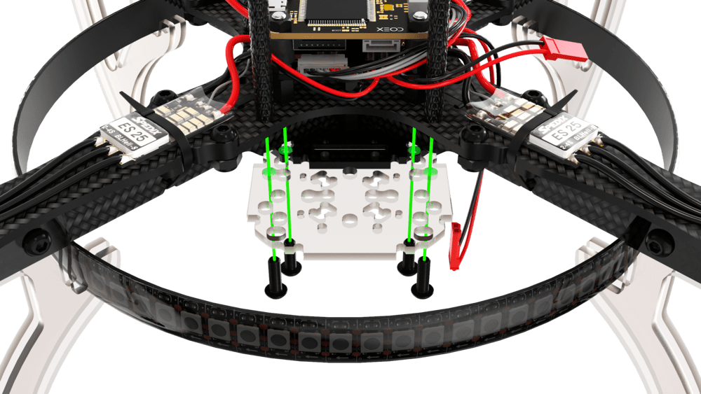
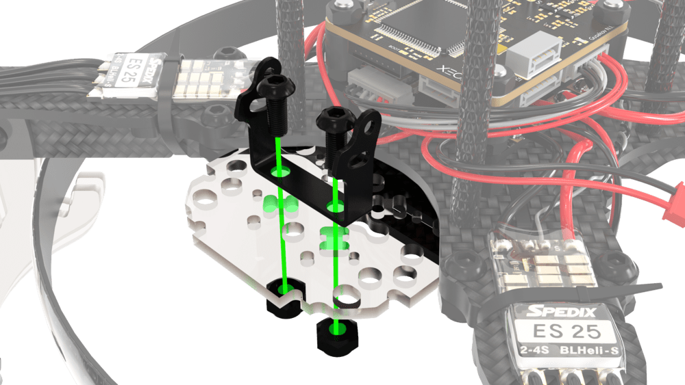
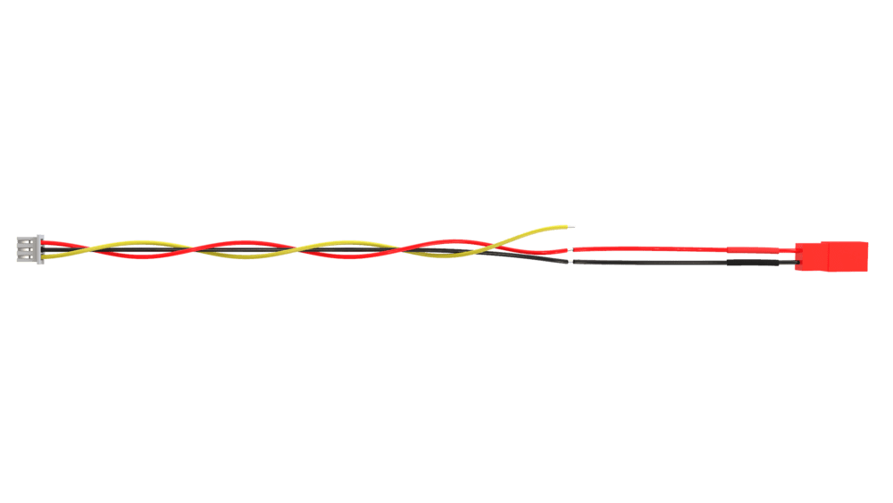
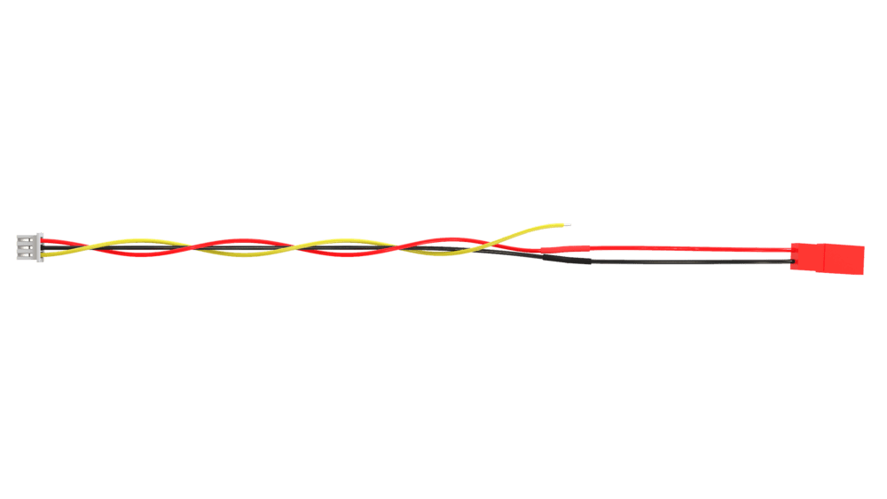
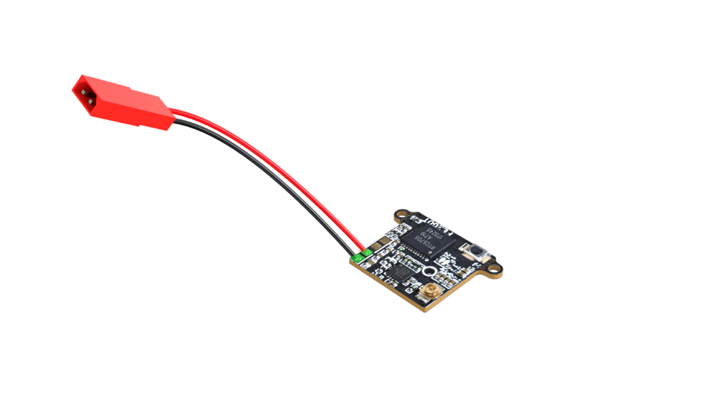
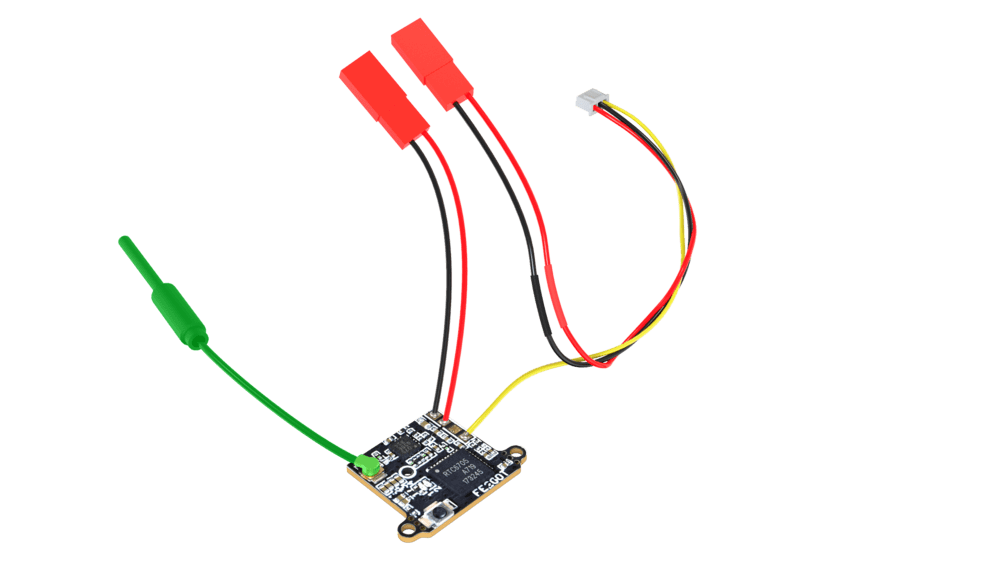
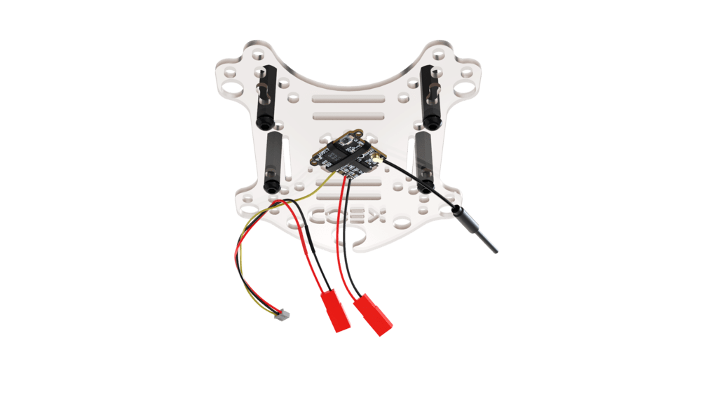
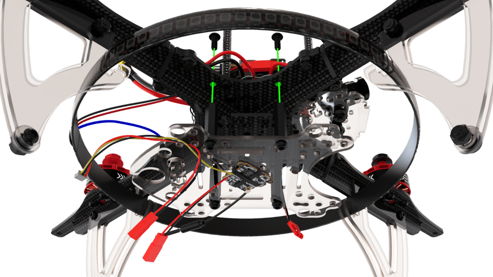
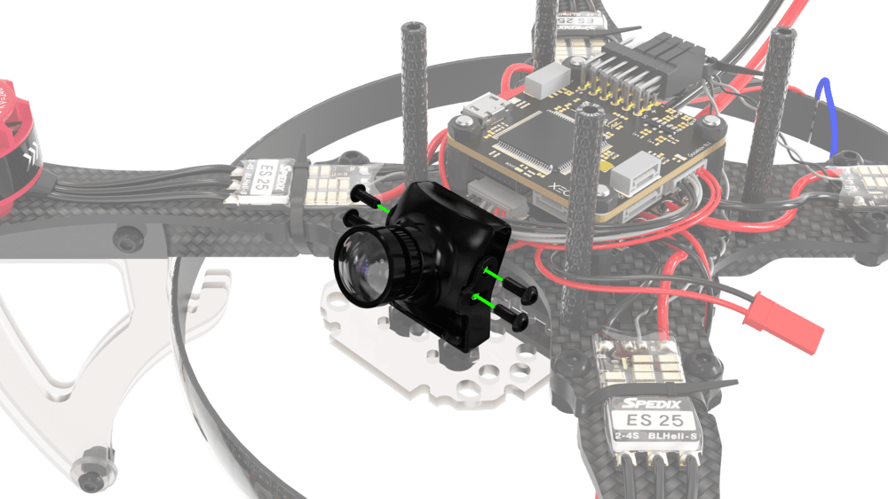

# Установка и настройка FPV-оборудования

## Подготовка и установка камеры и передатчика

1. Установите малую монтажную деку на основную раму.

    

        
        
    

2. Установите скобу для крепления камеры в соответствующие отверстия.

    

        
        
    

3. Обрежьте трехпиновый комплектный кабель камеры.

    

        
        
    

4. Залудите провода

    

5. К силовым проводам камеры припаяйте разъем JST-папа.

    

        
        
    

    > **Hint** Перед спаиванием проводов не забудьте надеть термоусадку на провода.

6. К передатчику припаяйте разъем JST-папа.

    

        
        
    

7. К передатчику припаяйте желтый сигнальный кабель камеры.

    

        
        
    

8. Подключите антенну к передатчику.

    

    > **Caution** Если на передатчик без антенны подать напряжение есть большая вероятность, что он сгорит.

9. На монтажную деку установите приемник, закрепив его стяжками.

    

10. Установите монтажную деку вместе с приемником снизу коптера.

    

11. Установите камеру в скобу и закрепите ее с помощью 4-х комплектных болтов. Камера должна быть под углом 15°-20° относительно плоскости коптера.

    

        
        
    

    

        
        
    

12. Подключите сигнальный кабель к камере.

    

13. Подключите кабель питания камеры к силовому JST, припаянному к площадкам *BAT+* и *GND* на плате распределения питания.

14. Подключите кабель питания передатчика к JST на 5В.

    

## Настройка и подключение FPV-очков

1. Установите на очки две комплектные антенны.
2. Включите очки удерживая кнопку питания 3–4 секунды.
3. Включите коптер и убедитесь, что светодиод передатчика светится синим цветом.
4. Нажмите на очках кнопку *Auto Search*, для автоматического поиска доступного радиоканала.
