# Быстрое подключение к виртуальной сети

Для удаленного подключения и управления дроном или получения видеоизображения можно подключить его к виртуальной сети VPN.

Вы можете подключить вашу систему к любой доступной вам сети, если у вас есть соответствующие правда доступа. В этой статье будет рассмотрен способ подключения к сети *LogMeIn*, как удобной и легкой в использовании.

## Создание виртуальной сети

Создайте аккаунт и войдите на сайте [LogMeIn](https://www.logmein.com/).

После входа вы увидите основное меню управления вашими сетями.

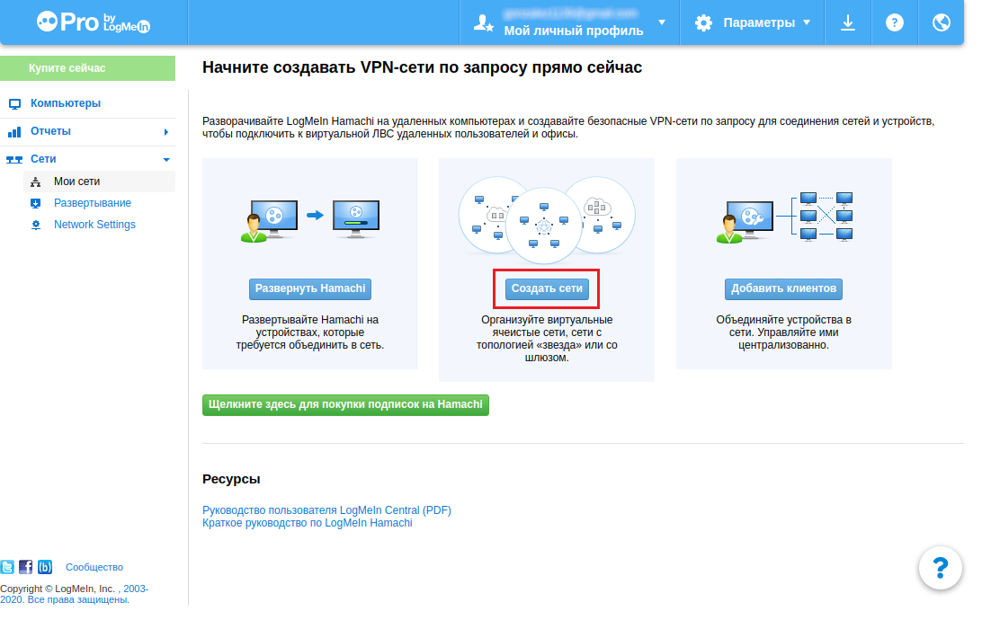

Выберите пункт *Создать сети*.

В открывшемся окне введите название сети и выберите тип *Ячеистая*.

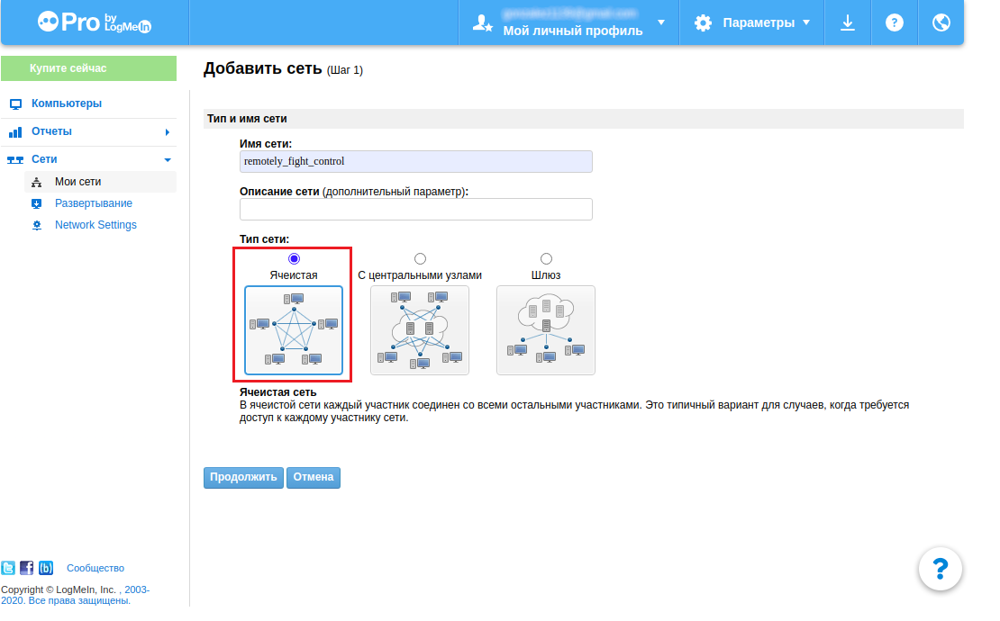

Далее меню *Запросы на подключение* выберите *Требовать подключение*.

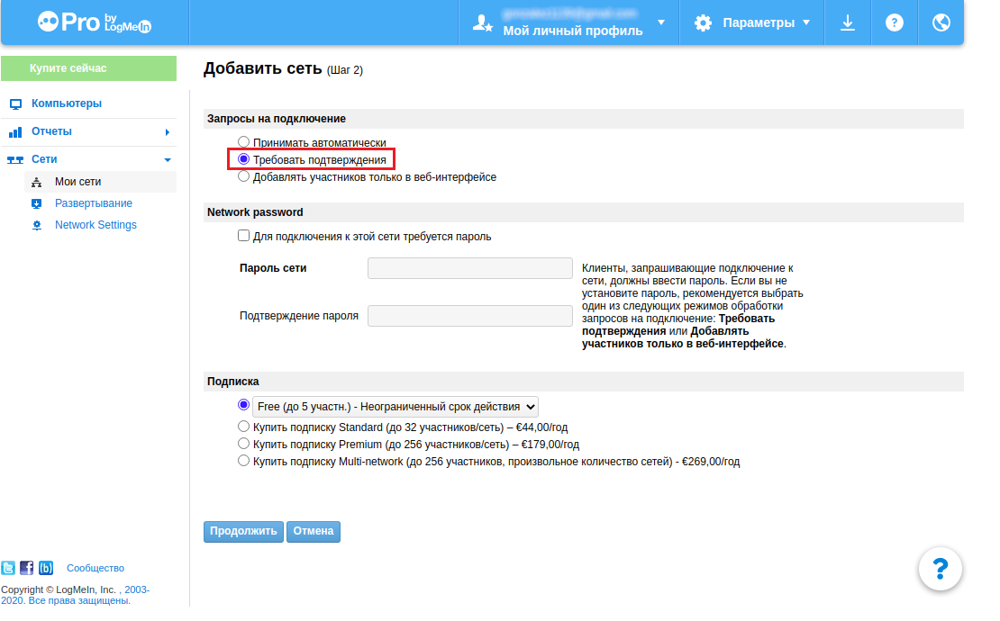

Нажмите *Готово* и перейдите к настройки сети.

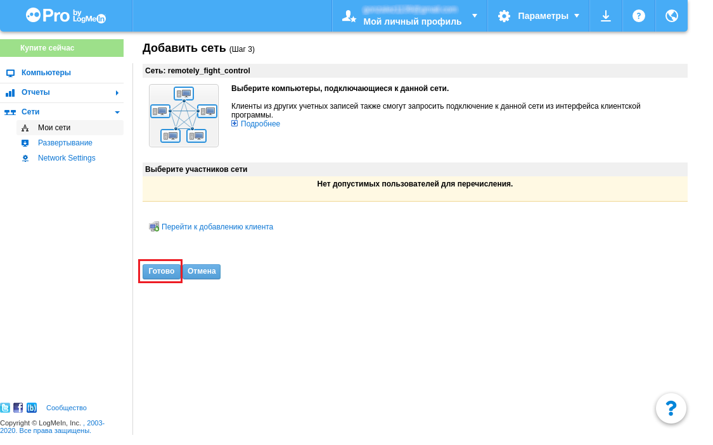

В открывшемся окне *Изменить сеть* необходимо запомнить значение поля *Идентификатор сети*, он будет использоваться в дальнейшем для подключения.

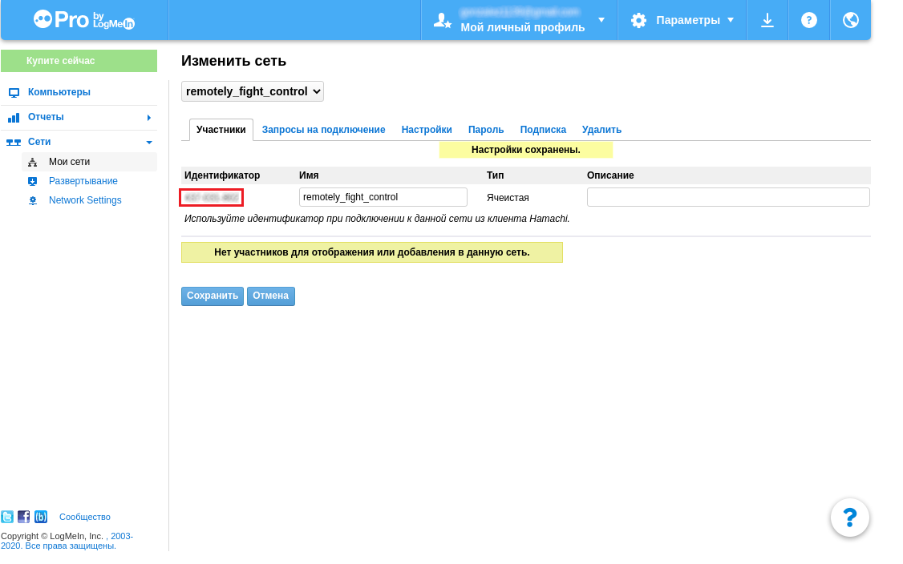

## Установка менеджера Hamachi и подключение к сети

1. Скачайте Debian-пакет `logmein_hamachi`.

    ```bash
    wget https://www.vpn.net/installers/logmein-hamachi_2.1.0.203-1_i386.deb
    ```

2. Установите пакет.

    ```bash
    sudo dpkg -i logmein-hamachi_2.1.0.203-1_i386.deb
    ```

3. Подключите установленный модуль к сети.

    ```bash
    hamachi login
    ```

4. Подключитесь к сети используя ее идентификатор.

    ```bash
    sudo hamachi do-join xxx-xxx-xxx
    ```

5. В поле ввода пароля нажмите *Enter*, если пароль не задан или введите его.

6. При успешном подключении вы увидите сообщение: *Joining 435-995-378 .. ok, request sent, waiting for approval*.
7. Подтвердите подключение к сети в меню *Изменить сеть*, во вкладке *Запросы на подключение*.

    

8. Можно проверить, удалось ли подключить пользователя в окне *Мои сети*.

    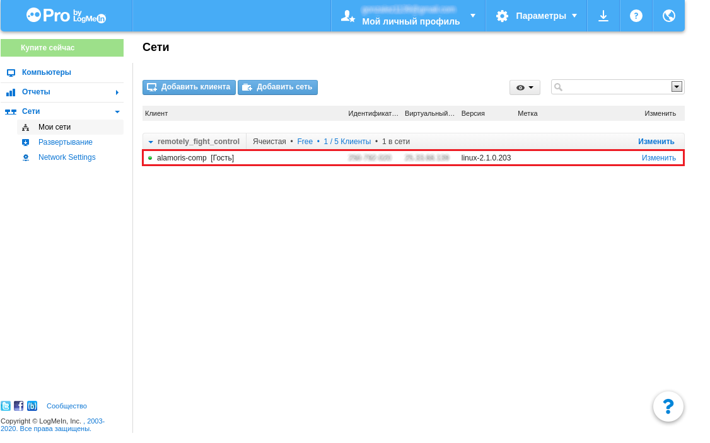

9. Повторите шаги 4–7 для подключения компьютера в случае, если вы пользуетесь операционной системой Linux, или обратитесь к инструкции для Windows.

## Подключение к сети с помощью Windows

1. Установите приложение Hamachi.

    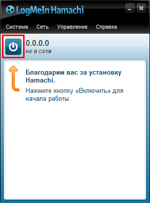

2. Запустите приложение Hamachi и нажмите кнопку включения. При необходимости введите свой логин.

    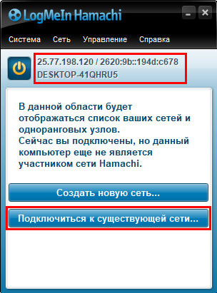

3. Если в шапке приложения отображается ваш виртуальный IP-адрес, подключитесь к сети, нажав соответствующую кнопку.

    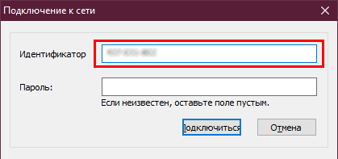

4. Введите идентификатор вашей сети.

    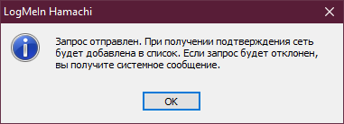

5. Если идентификатор введен верно, вы увидите соответствующее сообщение.

    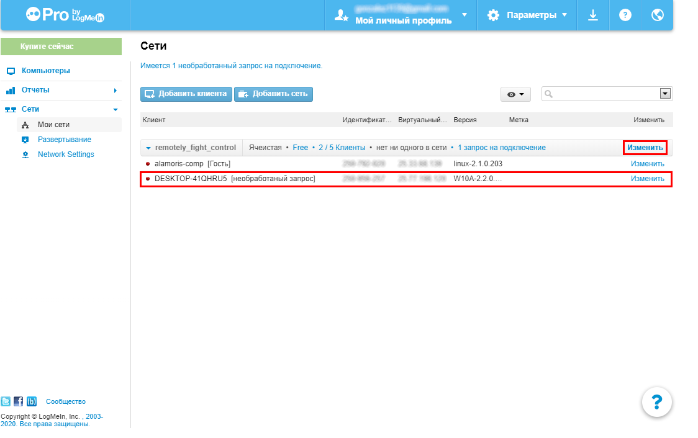

6. В меню вашей сети появится пользователь с префиксом "необработанный запрос".
7. Для подтверждения пользователя зайдите в меню *Изменить сеть* и во вкладке *Запросы на подключение* подтвердите подключение к сети.

    

См. также продолжение настройки для [удаленного управления коптером и настройки стрима видео](4g.md#управление-коптером-через-qgroundcontrol).
