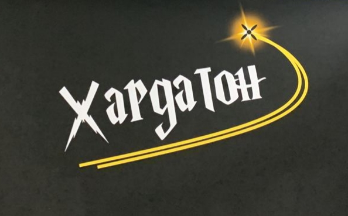
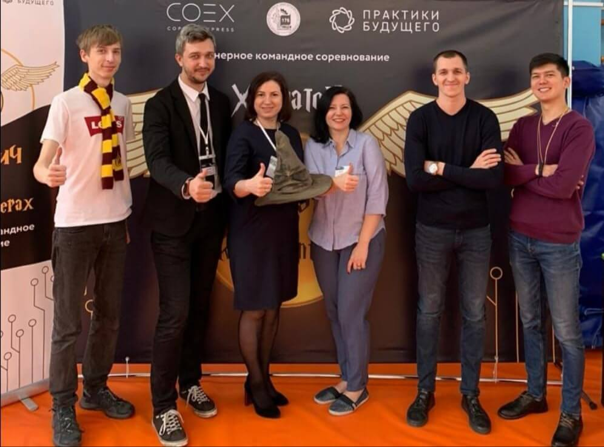
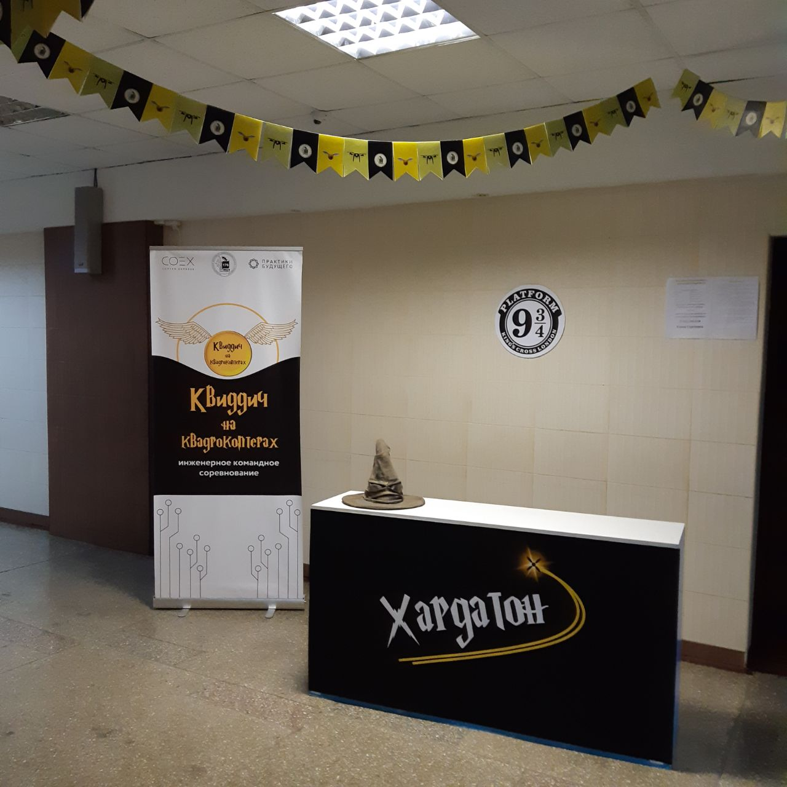
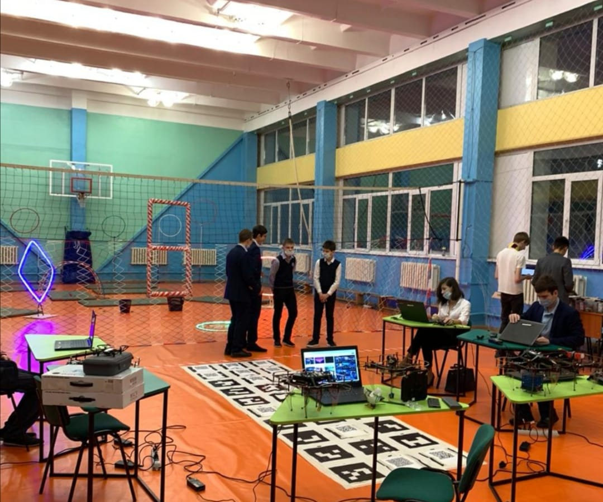
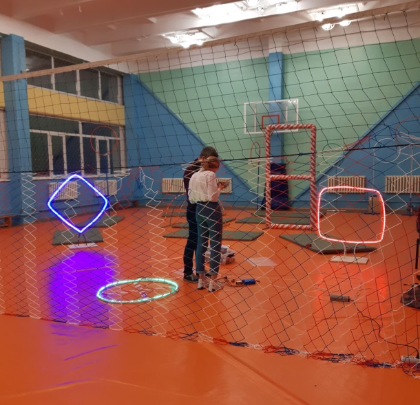
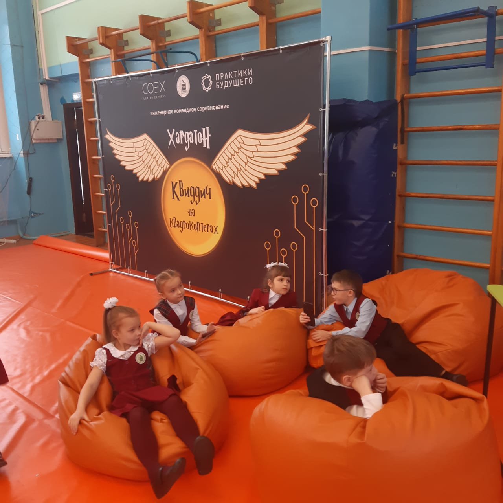
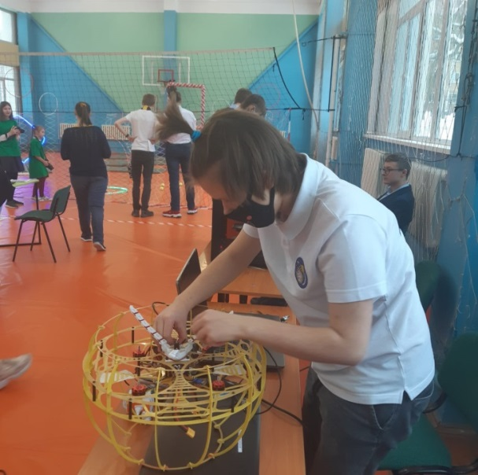
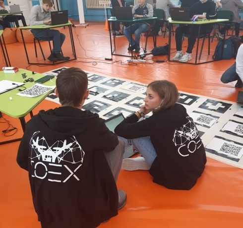
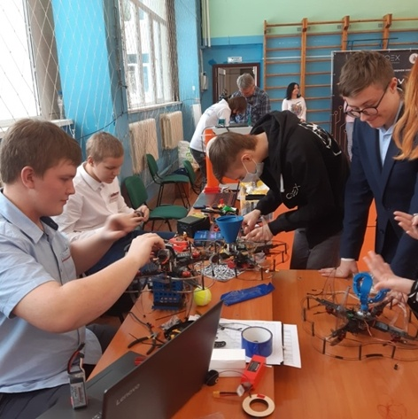
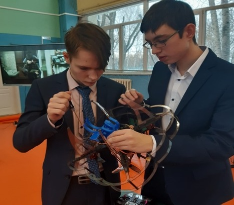

# Хардатон Квиддич

[CopterHack-2021](copterhack2021.md), команда **Хардатон**.

Название проекта: Инженерное командное соревнование - хардатон «Квиддич на квадрокоптерах».

## Команда проекта

* Бокта Оксана Александровна - лидер проекта, руководитель Центра по работе с одарёнными детьми МАОУ «Лицей № 176» г.Новосибирска.
* Шунаев Никита Александрович – проектный менеджер, куратор IT-направления.
* Алеков Иван Анатольевич - эксперт по программированию, преподаватель спецкурсов МАОУ «Лицей № 176».
* Жданов Олег Игоревич - эксперт по 3D-моделированию, преподаватель спецкурсов МАОУ «Лицей № 176».

## Цель проекта

Развитие инженерных hard-компетенций школьников 7-11 классов по направлению «Беспилотные авиационные системы» с использованием платформы «COEX Клевер 3, 4».

## Задачи проекта

1. Привлечение образовательных организаций, наставников, школьников, партнёров в направление «Беспилотные авиационные системы», к занятиям инженерным творчеством с использованием платформы «COEX Клевер 3,4».
2. Развитие hard-компетенций школьников (программирование, моделирование, пилотирование, в том числе автономно).
3. Развитие soft-компетенций (умение распределять роли, работать в команде, нестандартно мыслить, презентовать проект и др.).
4. Подготовка к инженерным соревнованиям, конкурсам и научно-практическим конференциям инженерно-технологической направленности (Олимпиада НТИ, WorldSkills и др.).
5. Создание условий для раннего выявления и сопровождения талантов НТИ.
6. Формирование среды, способствующей вовлечению в сообщества технологических энтузиастов, зарождению и развитию кружков НТИ по направлению «Беспилотные авиационные системы».

## Актуальность проекта

В России с зарождением Национальной технологической инициативы растёт число школьников, наставников, энтузиастов, вовлечённых в техническое творчество. Современным школьникам доступны соревнования, чемпионаты, конкурсы инженерно-технологической направленности. Набирают обороты по количеству участников  Олимпиада НТИ, чемпионат WorldSkills и другие. Профиль ОНТИ «Летающая робототехника», компетенция WorldSkills «Эксплуатация беспилотных авиационных систем» основаны на умениях осуществлять сборку, дефектовку, программирование, управление квадрокоптером с использованием платформы «COEX Клевер 3,4». Но сегодня  очень мало соревнований, подготавливающих школьников к участию в таких сложных инженерных олимпиадах и конкурсах, вовлекающих в техническое творчество с использованием программируемых квадрокоптеров. Мы предлагаем концепцию инженерного командного соревнования - хардатон «Квиддич на квадрокоптерах», в котором школьник с разным уровнем подготовки (начинающий, продолжающий, продвинутый), работая в команде, сможет проявить инженерное мышление, умение программировать, моделировать и управлять квадрокоптером. Вовлечению будет способствовать игровая модель, основанная на известном фильме «Гарри Поттер» и разные форматы проведения (очный и дистанционный).

## Концепция проекта

Хардатон «Квиддич на квадрокоптерах» представляет собой инженерное командное соревнование под руководством наставника (3 человека в команде, роли распределяются по компетенциям - моделист, программист, пилот), в котором необходимо максимально проявить свои умения в испытаниях (как личностных, так и командных).

Соревнование проходит с использованием следующего оборудования.

Для команды: конструктор программируемого квадрокоптера «COEX Клевер 3, 4» (либо другой с возможностью установления захвата и камеры), ресурсный набор для ремонта (по необходимости), оборудование для изготовления захвата (можно использовать оборудование площадки проведения), инструменты, запасные аккумуляторы не менее 3 штук с возможностью подзарядки, ноутбук, флешка с файлами.

Для площадки проведения: оборудование для изготовления захвата - материал и обработку команда выбирает самостоятельно (3D-принтер, станок с ЧПУ, ручная обработка, композитные материалы и др.). Площадка проведения финала - спортивный зал (другое помещение), распределённый на зоны (входная зона, зона моделирования, зона программирования, полётная зона, коворкинг-зона с панелью для защиты презентаций и просмотра фильмов о Гарри Поттере, защитная сетка, разметка, 6 колец (размер колец 70-90), 10 подставок для мячей, 2 маленьких квадрокоптера-сничи, открытые лаборатории, ремонтная зона (паяльники, провода, запасные части), метки, Raspberry Pi, FPV, камера, 10 теннисных мячей, ноутбуки, удлинители, интернет.

Пример оформления и зонирования площадки:

Дизайн помещений, названия и содержание испытаний схожи со сценами из знаменитого фильма «Гарри Поттер». Задания по компетенциям имеют дифференциацию по уровню подготовки участников (начальный, продолжающий, продвинутый). Ключевым испытанием является квиддич на квадрокоптерах. Победу одерживает команда, набравшая большее количество очков по всем испытаниям. К судейству могут привлекаться эксперты в компетенциях, не заинтересованные наставники команд, представители компаний-партнёров из реального сектора экономики, представители инженерных ВУЗов и др. Все участники, не прошедшие в финал хардатона, получают сертификаты участников; участники финала, не занявшие места, получают диплом участника финала; команды, занявшие места в квиддиче, получают дипломы победителей или призёров и ценные подарки.

## Этапы соревнования

1. Отборочный этап (командам необходимо разработать идею, изготовить захват и защиту на квадрокоптер).
2. Основной личный этап хардатона для команд начинающего, продолжающего и продвинутого уровня по моделированию, программированию и пилотированию.
3. Основной командный этап (квиддич на квадрокоптерах).
4. Заключительный этап (подведение итогов, награждение победителей).

## Задания хардатона

Разработаны разноуровневые задания для очного и дистанционного формата проведения мероприятия.

* [Ссылка на задания отборочного этапа](https://disk.yandex.ru/d/6obCbcUGKx74WQ?w=1).
* [Ссылка на задания по программированию](https://disk.yandex.ru/d/AzBWLAr0_AFDmg?w=1).
* [Ссылка на задания по моделированию](https://disk.yandex.ru/d/teqzvDy_3QQHJw?w=1).
* [Ссылка на задания квиддича на квадрокоптерах](https://disk.yandex.ru/d/hq--WyXn0QRcIQ?w=1).
* [Для оценивания выполнения заданий  разработаны критерии](https://disk.yandex.ru/d/5BUMq2tf1Wz6wA?w=1).

## Апробация проекта

Инженерное командное соревнование по беспилотным авиационным системам «Квиддич на квадрокоптерах»  было апробировано на площадке МАОУ «Лицей № 176» города Новосибирска:

1. Дистанционный отборочный этап со 2 ноября по 20 ноября 2020 года.
2. Очный подготовительный этап - организаторами мероприятия проведено установочное совещание с наставниками команд, экспертами организована подготовка команд с предоставлением оборудования лабораторий электроники и прототипирования, новых производственных технологий со станками с ЧПУ, лаборатории DronLab.
3. Финал прошел с 4 по 6 декабря 2020 года.

В очном мероприятии приняли участие 27 команд из города Новосибирска, 81 участник из образовательных организаций и организаций дополнительного образования детей города Новосибирска, 14 наставников, 5 волонтёров, 3 эксперта, 5 помощников эксперта, 3 организатора. Общий охват мероприятия – 111 человек.

Предложенные участниками хардатона [инженерные решения](https://disk.yandex.ru/d/2TbB8SSM4a6jsw?w=1) по разработке захвата и защиты на квадрокоптер:

[Видео](https://disk.yandex.ru/d/6kNI1smfWhWYXA?w=1) о команде и с полётной зоны.

<iframe width="560" height="315" src="https://www.youtube.com/embed/6R4tLkZVmcs" frameborder="0" allow="accelerometer; autoplay; clipboard-write; encrypted-media; gyroscope; picture-in-picture" allowfullscreen></iframe>

## Освещение мероприятия в СМИ

* https://nsknews.info/materials/kviddich-na-kvadrokopterakh-ustroili-v-novosibirskoy-shkole/ (городской новостной сайт).
* http://www.nios.ru/news/24302 (сайт департамента мэрии города Новосибирска).
* http://xn--176-qddohl3g.xn--p1ai/index.php/dostizheniya-litseistov/1627-kviddich-na-kvadrokopterakh (сайт МАОУ “Лицей №176”)
* https://www.facebook.com/633602557253181/posts/739165210030248/.

## Перспективы развития проекта

* Проведение мероприятий продолжающего и продвинутого уровня с целью подготовки школьников к олимпиадам, чемпионатам и инженерным конкурсам по направлению «Беспилотные авиационные системы» с использованием платформы «COEX Клевер 3,4» как в очном, так и в дистанционном формате.
* Привлечение партнёров, экспертного сообщества к доработке заданий, организации и совместному проведению инженерного командного соревнования «Квиддич на квадрокоптерах» на Всероссийском уровне.
* Трансляция опыта проведения мероприятия на различных уровнях с целью вовлечения школьников в занятия инженерным творчеством, технологические кружки, развитие hard и soft-компетенций.
