# Камера Hawk Eye

Камера Hawk Eye позволяет записывать видео в разрешении до 4K 30FPS, а также имеет аналоговый выход, что позволяет использовать её вместе с FPV-видеопередатчиком.

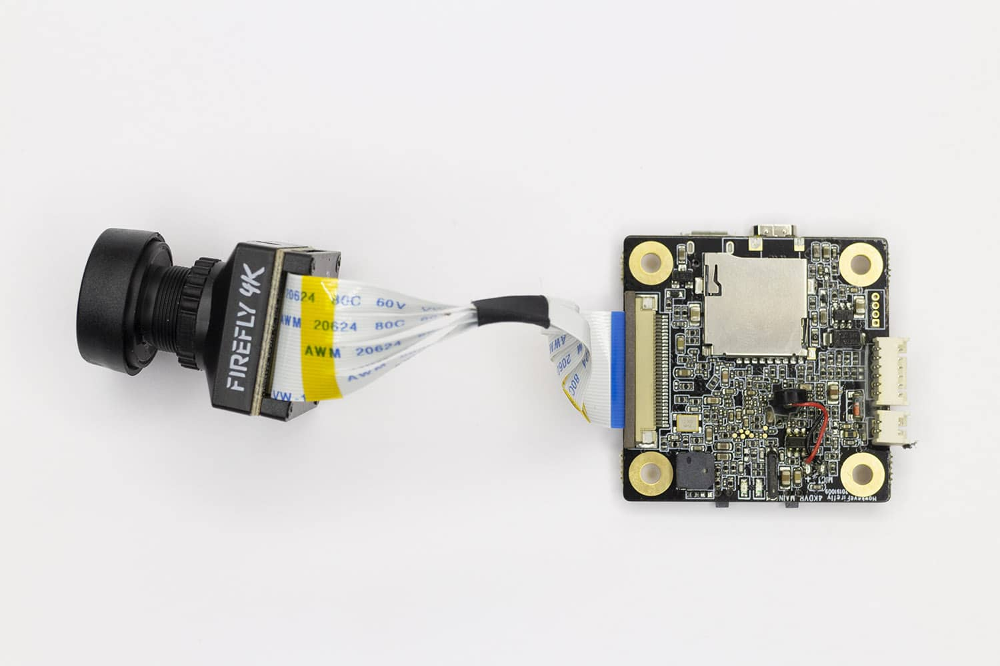

## Подключение

Установите плату на нейлоновые стойки сверху полетного контроллера. Для подключения камеры используйте кабель, идущий в комплекте.

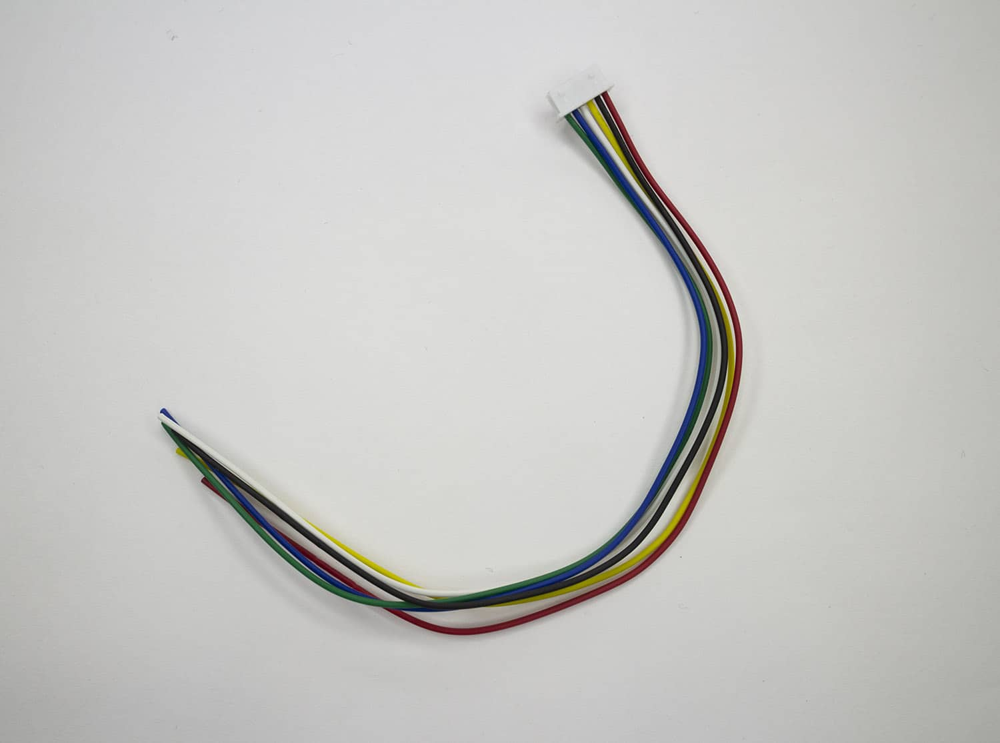

Красный провод необходимо припаять к контакту BAT+ на [плате распределения питания](coex_gps.md) (от напряжения 5 воль камера работать не будет), черный провод необходимо припаять к контакту GND.

Для настройки камеры вам потребуется видеопередатчик и FPV шлем или очки, однако производить запись полетов можно и без видеопередатчика.

Для настройки камеры и полетов в FPV подключите желтый провод кабеля камеры
к [видеопередатчику](fpv_clover_4_2.md), как показано на изображении:

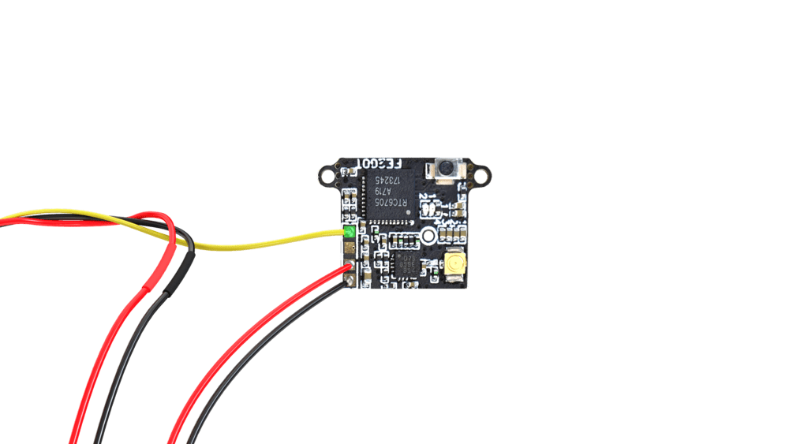

Белый, синий и зеленый провода в данном случае не используются и их можно не подключать.

> **Caution** Внимание! Необходимо соблюдать аккуратность при подключении питания.
> Камера работает от напряжения 7–25 вольт, а видеопередатчик – от напряжения 5 вольт.
> Неправильное подключение питания может привести к выходу из строя камеры или видеопередатчика.

## Настройка

Подключите пульт для настройки к камере.

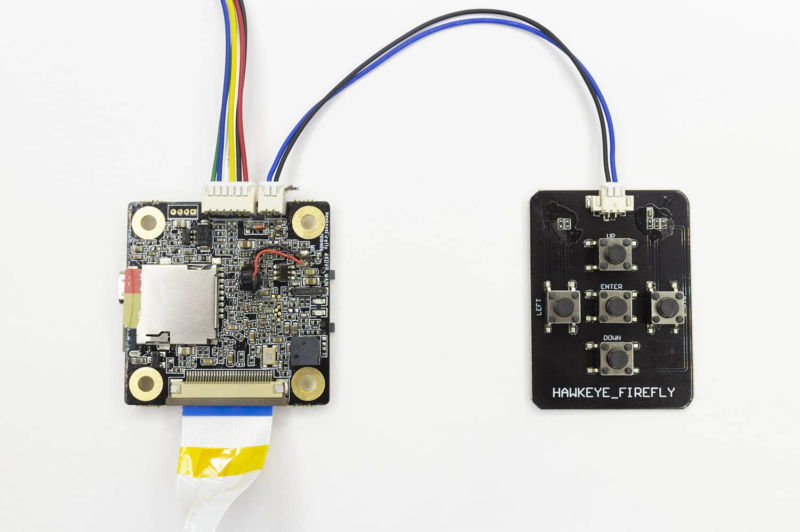

Установите SD-карту в разъем. Перед первым использованием её необходимо отформатировать.
Для этого нажмите кнопку Left на пульте, вы попадете в меню настроек.

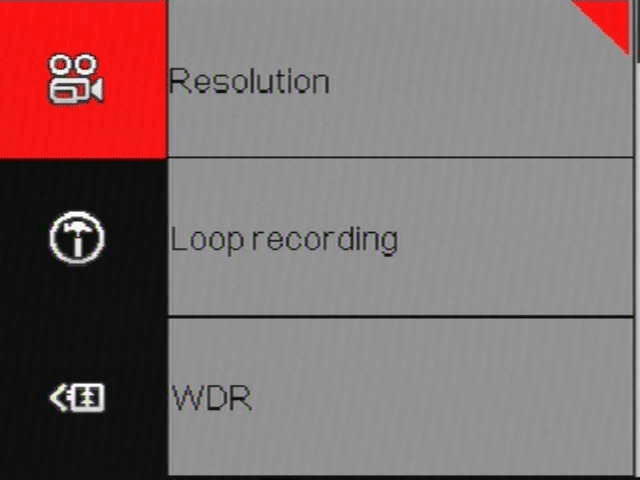

Нажмите кнопку left ещё раз.

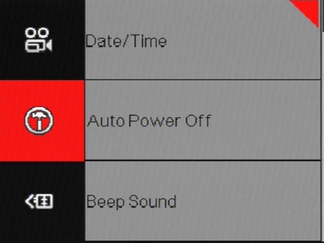

Нажимая на кнопку down, пролистайте список до пункта *Format*.

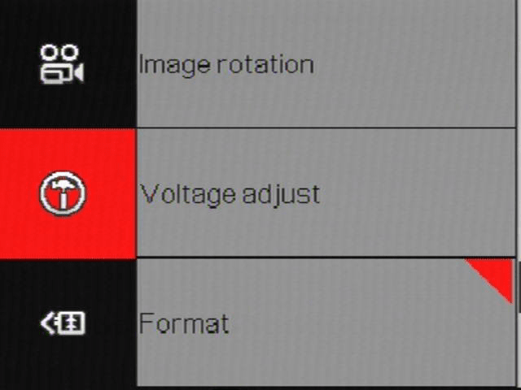

Нажмите enter. Появится предупреждение о том, что все данные с карты будут удалены.

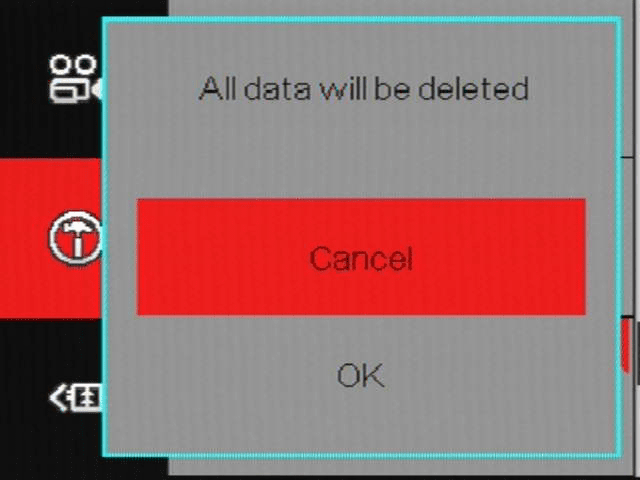

Нажмите на кнопку *OK*.

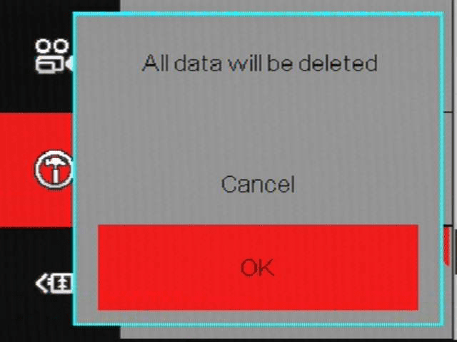

Карта памяти отформатирована и готова к записи. В этом же меню можно найти настройки разрешения, частоты кадров и другие.

## Использование

Для начала записи нажмите кнопку на плате камеры. Камера сообщит о начале записи звуковым сигналом, а также мигающей красной точкой в верхней части экрана. Для прекращения записи повторно нажмите на кнопку записи.

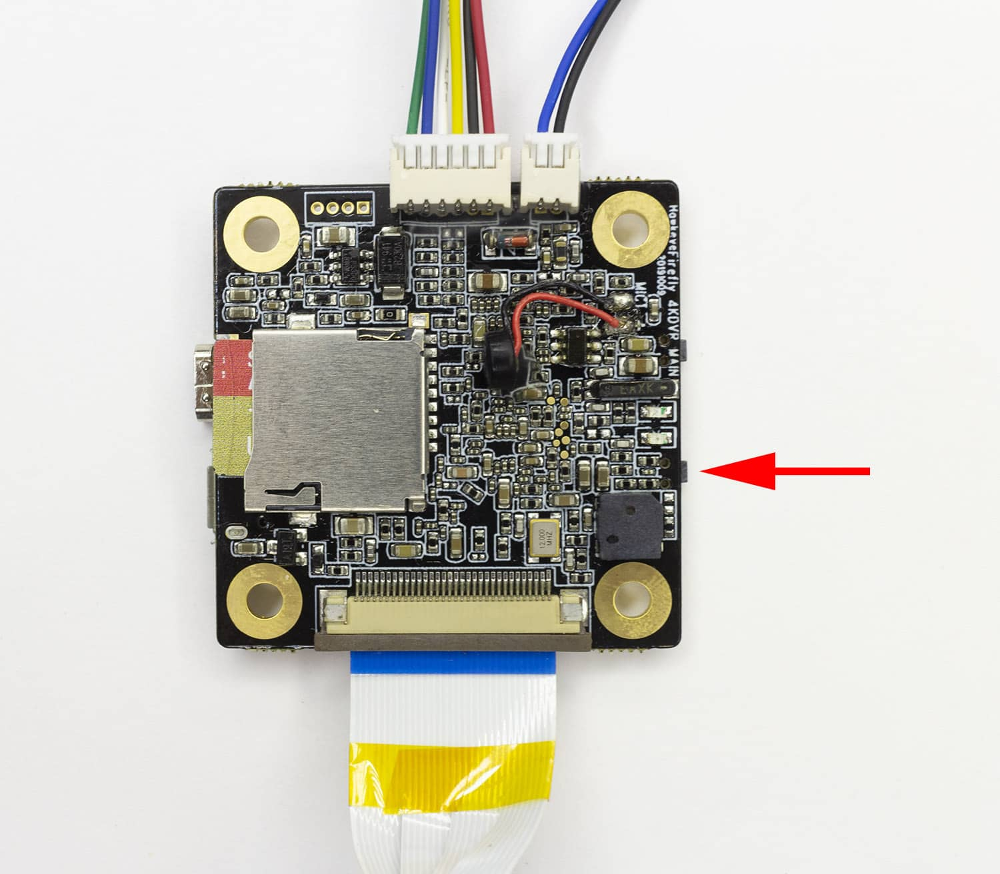

Для смены разрешения видео без использования видеопередатчика или пульта нажмите кнопку смены разрешения на две секунды.

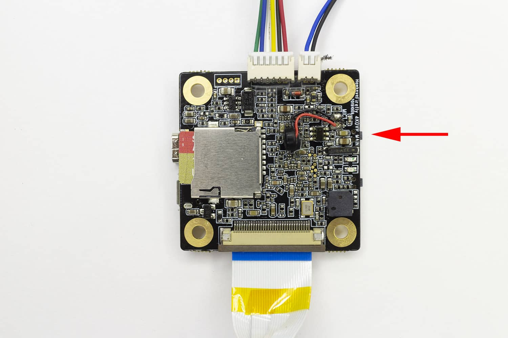
