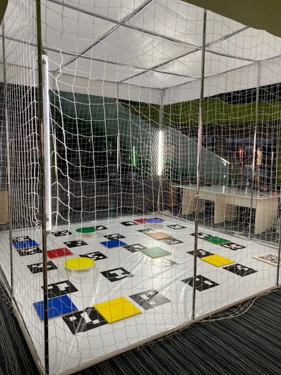
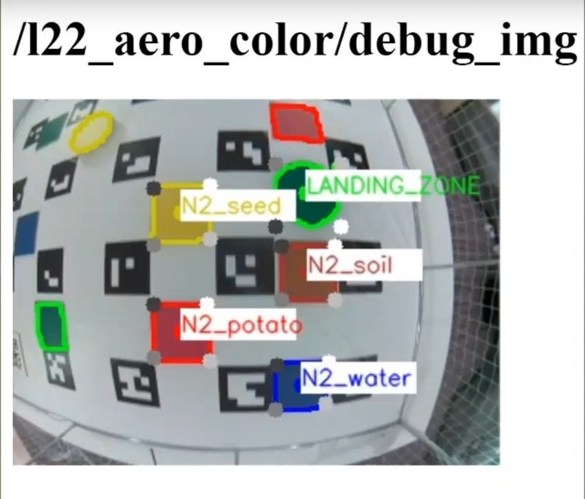
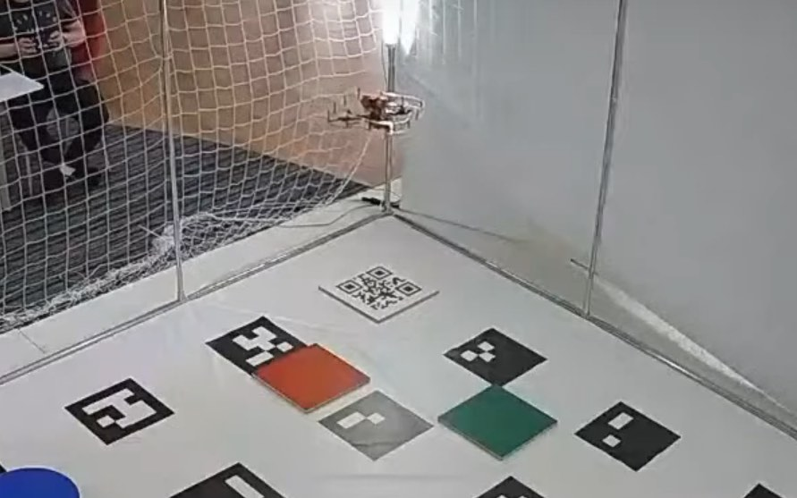
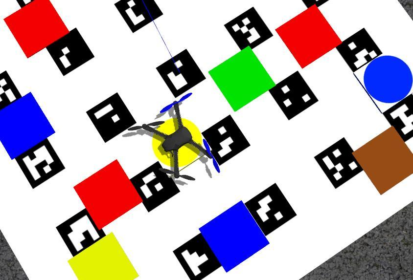
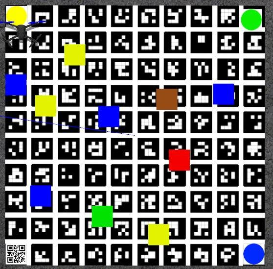

# Innopolis Open 2020 - команда L22_ÆRO

## Команда

* [Юрьев Василий](https://vk.com/vasily_0x59).
* [Оконешников Дмитрий](https://vk.com/okoneshdmitriy).

## Описание задачи финала

Внедрение новых технологий происходит в различных отраслях экономики, в том числе и в сельском хозяйстве. Дроны или БПЛА не стали исключением. Благодаря применению беспилотников оценка состояния сельскохозяйственных территорий и анализ компонентов ландшафта стали более доступными и эффективными.



Финальная задача Innopolis Open 2020 была посвящена мониторингу сельскохозяйственных территорий и состояла из следующих элементов:

* Взлет (с QR-кода) и посадка (на цветной маркер небольшого размера).
* Распознавание зашифрованного сообщения в QR-коде.
* Распознавание цвета объектов (цветных маркеров – условное обозначение сельхоз угодий).
* Определение их координат (расположение на поле изменяется).
* Отчет по полученным данным.

## Код

Код на GitHub: https://github.com/vas0x59/ior2020_uav_L22_AERO.

## Основной код

При реализации кода в первоначальной концепции использовались свои типы сообщений, множество нод и других возможностей ROS, для обеспечения этого функционала необходимо создавать пакет и компилировать его, но из-за специфики соревнований (использование одной SD-карты для все команд) весь код был объединен в один файл. Данный подход усложнил отладку, но упростил запуск на площадке.

Элементы программы:

1. Взлет.
2. Распознавание QR-кода.
3. Поиск цветных маркеров.
4. Посадка.
5. Генерация отчета и видео.

Итоговыми координатами маркеров являются автоматически сгруппированные и усредненные данные из системы распознавания полученных за весь полет. Для покрытия всей территории была выбрана траектория "Зиг-заг". Для отладки применен симулятор Gazebo.

## Цветные маркеры

`l22_aero_vision/src/color_r_c.py`

Для обработки изображения с камеры и детектирования объектов мы использовали функции из библиотеки OpenCV.

Алгоритм:

1. Получение изображения и параметров камеры.
2. Построение маски по определенному диапазону цветов (в формате HSV).
3. Детектирование контуров цветных объектов.
4. Определение типа объекта, получение ключевых точек объекта на изображении.
5. Определение положения квадратов и кругов с помощью solvePnP основываясь на реальных размерах объектов и точках на изображении ([OpenCV Docs](https://docs.opencv.org/3.4/d9/d0c/group__calib3d.html#ga549c2075fac14829ff4a58bc931c033d)).
6. Отправка результата в топики `/l22_aero_color/markers`  и  `/l22_aero_color/circles` (координаты относительно `main_camera_optical`).

Во время разработки были созданы свои типы сообщений, а также сервис для настройки параметров детектора во время посадки. (`ColorMarker`, `ColorMarkerArray`, `SetParameters`).

Для определения положения цветных объектов в системе координат поля была использована библиотека TF ([http://wiki.ros.org/tf](http://wiki.ros.org/tf))

Из-за искажений по краям изображения от fisheye-объектива все распознанные контуры находящийся рядом с краем изображения игнорируются. Во время посадки данный фильтр отключается. Определение типа объекта производиться с помощью функций анализа контуров (approxPolyDP - кол-во вершин; `minAreaRect`, `contourArea` - соотношение площади описанного квадрата и площади контура + соотношение сторон).



Примеры распознавание маркеров:

<iframe width="600" height="360" src="https://www.youtube.com/embed/kCW87RTA838" frameborder="0" allow="accelerometer; autoplay; encrypted-media; gyroscope; picture-in-picture" allowfullscreen></iframe>

## Визуализация в RViz

`l22_aero_vision/src/viz.py`

Для отладки распознавания объектов создан скрипт визуализирующий координаты маркеров в среде RViz.

<iframe width="560" height="315" src="https://www.youtube.com/embed/6xJ33UD-NfE" frameborder="0" allow="accelerometer; autoplay; encrypted-media; gyroscope; picture-in-picture" allowfullscreen></iframe>

## QR-код



Для выполнения задачи распознавания QR-кода была использована библиотека PyZbar. С целью повышения результативности и точности распознавания QR-кода полеты производились на небольшой высоте по точкам, расположенным вокруг данного объекта.

## Посадка

Посадка выполняется в 3 этапа:

1. Перелет к предполагаемой зоне посадки и зависание на высоте 1.5 м.
2. Спуск до высоты в 0.85 м с 3 корректировками по координатам маркера относительно `aruco_map`.
3. Спуск в течение нескольких секунд с постоянной корректировкой по координатам маркера посадки в системе координат `body` (так как ArUco-маркеры могут быть уже не видны), вместо `navigate` используется `set_position`.

<iframe width="560" height="315" src="https://www.youtube.com/embed/8nVGoWkdYcA" frameborder="0" allow="accelerometer; autoplay; encrypted-media; gyroscope; picture-in-picture" allowfullscreen></iframe>

## Gazebo

По причине отсутствия возможности тестирования кода на своем реальном дроне было принято решение воспользоваться симулятором Gazebo.

Для запуска пакета ПО Клевера в симуляторе можно использовать [набор скриптов](https://github.com/vas0x59/clever_sim) или [оригинальную инструкцию от PX4](https://dev.px4.io/v1.9.0/en/simulation/ros_interface.html).

Для Innopolis Open было создано несколько тестовых сцен. [ior2020_uav_L22_AERO_sim](https://github.com/vas0x59/ior2020_uav_L22_AERO_sim).

Также использование симулятора ускорило отладку полного выполнения кода, так как запуск производился с real time factor=2.5.





При тестировании выявлены некоторые проблемы (некорректное положение `aruco_map`) с использованием дисторсии в плагине камеры, поэтому в симуляторе использовалась камера типа Pinhole (без искажений от объектива).

## ROS

Созданные ноды, топики, сообщения и сервисы.

### Nodes

* `l22_aero_vision/color_r_c.py` - распознавание цветных объектов.
* `l22_aero_vision/viz.py` - визуализация в RViz.
* `l22_aero_code/full_task.py` - основной код.

### Topics

* `/l22_aero_color/markers` (`l22_aero_vision/ColorMarkerArray`) - список прямоугольных маркеров.
* `/l22_aero_color/circles` (`l22_aero_vision/ColorMarkerArray`) - список круглых маркеров.
* `/l22_aero_color/debug_img` (`sensor_msgs/Image`) - изображение для отладки.
* `/qr_debug` (`sensor_msgs/Image`) - изображение для отладки.

### Messages

#### `ColorMarker`

```
string color
int16 cx_img
int16 cy_img
float32 cx_cam
float32 cy_cam
float32 cz_cam
float32 size1
float32 size2
int16 type
```

#### `ColorMarkerArray`

```
std_msgs/Header header
l22_aero_vision/ColorMarker[] markers
```

### Services

#### `SetParameters`

```
float32 rect_s1
float32 rect_s2
float32 circle_r
int32 obj_s_th
int32 offset_w
int32 offset_h
---
```
