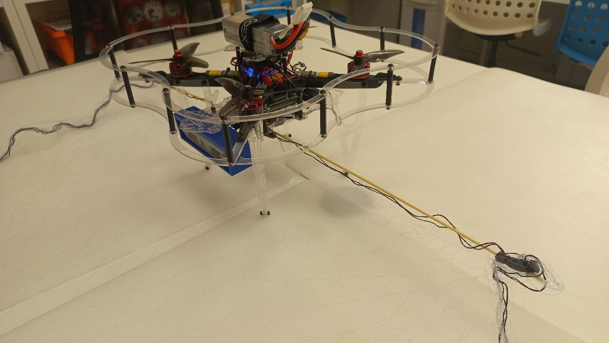

# Название проекта

[CopterHack-2023](copterhack2023.md), команда **FSOTM(Foremost Solutions for Observation, Topograpghy and Maintenance)**.

## Информация о команде

Состав команды:

* Шмаков Глеб, @croakey, лидер команды, программист, инженер.

## Описание проекта

### Идея проекта

В последнее время маломерные БПЛА всё чаще начинаю использоваться в военных и опасных целях: аэроразведка, сброс взрывчатки, разминирование (и потенциально, атака) лазером. Естественным образом возникает задача сбития или перехвата опасных и несанкционированных аппаратов. На данный момент основным методом для этого являются средства радиоэлектронной борьбы (РЭБ) (блокировка радиосигнала, блокировка сигнала GPS, перехват управления). Однако их большим минусом является негативное воздействие на многие виды связи в зоне в которой применяются эти средства, а также препятствия для работы собственных беспилотников. В результате применения этих средств дрон во многих случаях падает или садится на землю. И иногда может возникнуть потребность захватить дрон-нарушитель в целостности и сохранности, однако порой в силу некоторых обстаятельств это может быть трудно или опасно сделать в месте экстренной посадки. Именно в таких ситуациях лучшим решением будет дрон-перехватчик.
Дрон-перехватчик будет иметь подвешенную к низу сеть, в которую он будет ловить другие дроны. При соприкосновении с сетью винты перехватываемого дрона просто запутаются в сети без возможности самостоятельно распутаться.

### Планируемые результаты

При запуске программы дрона перехватчика задаются координаты патрулируемой области, и опционально, "база" на которую будут доставляться пойманные дроны, по умолчанию базой будет
считаться точка взлёта. После запуска программы перехватчик летит в патрулируемую зону, и начинает летать в ней по случайной траектории. При обнаружении другого дрона
перехватчик начинает его преследовать, постоянно отслеживая его камерой и пытаясь предсказать его траекторию. Перехватчик будет стараться пересечься с траекторией преследуемого
дрона в точке, выше положения преследуемого дрона примерно на половину превышающего длину висящей сети. После того как преследуемый дрон окажется под перехватчиком,
дрон сделает резкий рывок вперёд чтобы зацепить цель сетью. Факт поимки
дрона подтверждается с помощью тензор-датчика, на котором закреплена сеть. Затем перехватчик возвращается на базу, где совершает посадку.

### Использование платформы "Клевер"

Клевер станет непосредственной дроном-основой для перехватчика. К нему будет присоединено следующее оборудование:

* Камера глубин: крепится на носу коптера, используется для обнаружения другого дрона
* Прямоугольная сеть для ловли дронов: двумя задними углами крепится за заднюю часть дна коптера.
* Тензор-датчик: крепится на заднюю часть дрона. К этому датчику будет прикреплена сеть для перехвата. С помощью показаний датчика будет подтверждаться факт поимки дрона.

#### Опциональное оборудование

* Сервопривод: поддерживает сеть в свёрнутом состоянии, разворачивает её при заходе на цель
* GPS-модуль: позволяет перехватчику работать в реальных уличных условиях

### Текущее состояние проекта

Проект был реализован с базовым функционалом как дипломная работа бакалавриата
по специальности "Программная инженерия". [Исходный код для дрона](https://github.com/deadln/clover-interceptor), [исходный код нейросети](https://github.com/deadln/yolov5-clover-interceptor/tree/ros-integration), [дипломная работа](https://github.com/deadln/clover-interceptor/blob/master/090304_18И0180_Шмаков%20Г.И..pdf), [презентация защиты](https://github.com/deadln/clover-interceptor/blob/master/Диплом%20презентация%20финал.pdf).

### Дополнительная информация по желанию участников

#### Индивидуальные достижения участников

##### Глеб Шмаков

* В составе команды "Copter don't hurt me" занял второе место в Copterhack 2019.
* В качестве капитана команды "Канкан" стал победителем хакатона МФТИ "Первае командные игры дронов". [Видео](https://youtu.be/kdBKRd5v-Cc?t=4208) полёта.
* В качестве капитана команды "Полёт фантазии" занял первое место в хакатоне МФТИ "Командные игры дронов (осень 2021)". [Видео](https://youtu.be/W6v-cVKNbhQ?t=21721) выступления
