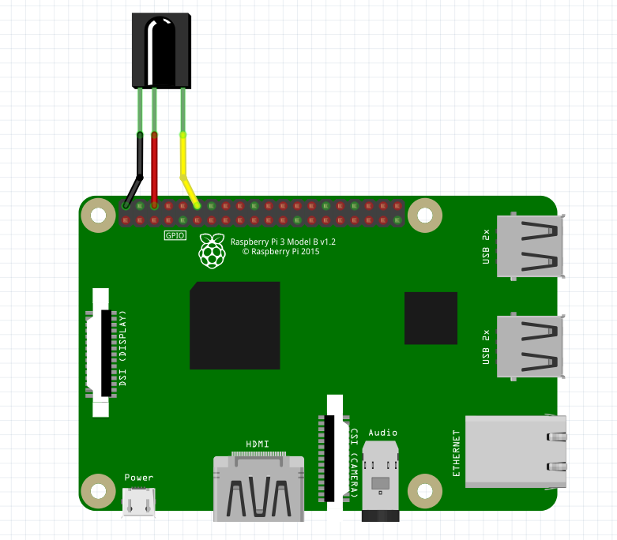
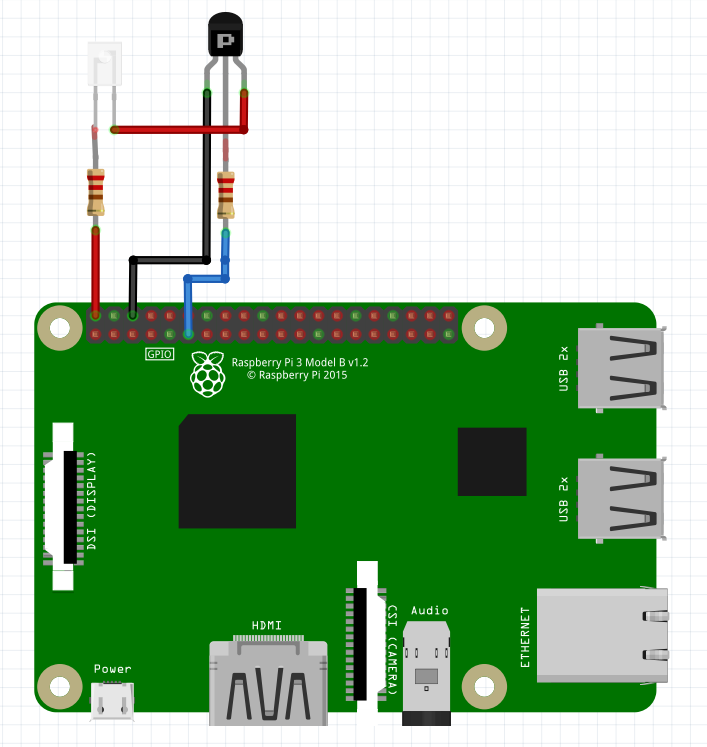

# Работа с ИК-датчиками на Raspberry Pi 3

> **Caution** Данная статья не актуальна для последних версий образа *clover* и работает только на версиях *clover_v0.16-clover_v0.17*.

Инфракрасные датчики – удобный инструмент для передачи каких-либо команд на коптер. Они гибки в настройке и взаимодействие с ними возможно из языка Python.

## Подключение ИК-приемника

Большинство ИК-приемников работают и подключаются одинаково. У таких приемников есть 3 пина для подключения: G/GND – земля, V/VCC – питание 5В, S/OUT – сигнал.



> **Hint** Сигнальный порт не обязательно должен подключаться к порту GPIO 17, данный пин можно изменить во время [настройки портов in/out](#in/out).

## Настройка ИК-приемника и работа с модулем LIRC

LIRC (Linux Infrared Remote Control) – стабильная и проверенная библиотека с открытым кодом, которая позволяет отправлять и получать команды по инфракрасному порту. LIRC поддерживается Raspbian.

Для установки LIRC и сопутствующих модулей нужно подключить вашу Raspberry Pi к интернету и выполнить консольные команды:

```bash
sudo apt-get update
sudo apt-get install lirc
sudo apt-get install python-lirc
pip install py-irsend

```

> **Hint** Для корректного редактирования системных файлов требуется иметь права доступа администратора, используйте `sudo` при вызове редактора текста.

<a name="in/out"></a>
После установки модуля нужно отредактировать файл `/etc/modules` и добавить в него строки:

```
lirc_dev
lirc_rpi gpio_in_pin=18 gpio_out_pin=17
```

Где:

+ `gpio_in_pin` – пин входа от приемника
+ `gpio_out_pin` – пин выхода для передатчика

Обновите следующую строку в файле `/boot/config.txt`:

```
dtoverlay=lirc-rpi,gpio_in_pin=18,gpio_out_pin=17
```

Добавьте следующие строки в файл `/etc/lirc/hardware.conf`. При отсутствии данного файла создайте его вручную.

```
LIRCD_ARGS="--uinput --listen"
LOAD_MODULES=true
DRIVER="default"
DEVICE="/dev/lirc0"
MODULES="lirc_rpi"
```

Обновите следующие строки в файле `/etc/lirc/lirc_options.conf`

```
driver    = default
device    = /dev/lirc0
```

Все требуемые настройки сделаны, теперь нужно перезагрузить ваше устройство Raspberry Pi для завершения установки. Для этого выполните:

```bash
sudo reboot
```

После перезагрузки проверьте его статус, вызвав команду:

```bash
sudo /etc/init.d/lircd status
```

Если вы все сделали правильно, то статус работы должен быть `active`.
Чтобы проверить, что установленный модуль LIRC работает, выключите демон `lircd` и вызовите соответствующую команду:

```bash
sudo /etc/init.d/lircd stop
mode2 -d /dev/lirc0
```

Теперь, направив ИК-передатчик на ваше устройство и нажав несколько кнопок, вы должны увидеть что-то похожее на это:

```
space 402351
pulse 135
space 7085
pulse 85
space 2903
pulse 560
space 1706
pulse 535
```

> **Hint** В ситуации, если вы используете ИК-передатчик (TV-пульт, пульт от кондиционеров, и т. д.) и во время проверки вы не получаете сигнал, возможно ваш пульт использует другую частоту передачи сигнала. При использовании приемников типа TSOP 22XX рабочая частота приема сигнала будет в диапазоне от 30 до 50 кГц.

## Запись своей конфигурации ИК-пульта

<a name="remote_control"></a>

В случае, если вы хотите использовать свой ИК-передатчик, вам нужно записать его характерные настройки с помощью прилагающегося модуля `irrecord`. Для этого вам нужно выключить демон `lircd` и вызвать соответствующую команду. Во время калибровки пульта точно выполняйте все написанные инструкции.

> **Hint** Обратите внимание, что на последнем шаге калибровки вам нужно будет задать наименования кнопок, которые вы захотите расшифровать программно. Для того чтобы посмотреть список доступных имен, вызовите команду `irrecord --list-namespace`.

```bash
irrecord -d /dev/lirc0 ~/lircd.conf
```

Если у вас успешно получилось записать конфигурацию вашего пульта, в папке `/home/pi/` должен был появиться файл `ваше-имя.lircd.conf`. Теперь вам нужно перенести записанный конфигурационный файл в рабочую папку `lirc` и перезагрузить демон:

```
sudo cp ~/ваше-имя.lircd.conf /etc/lirc/lircd.conf
sudo /etc/init.d/lircd restart
```

Для того чтобы проверить, распознается ли записанная вами конфигурация, вызовите соответствующий модуль. Теперь при нажатии на кнопки, которые вы записали в ранее созданной конфигурации, в терминал будет выводиться отладочная информация о том, какая кнопка была нажата.

```
irw
```

> **Caution** В случае работы с некоторыми пультами бывают ситуации, когда битовые описания кнопок являются излишними и в таком случае у вас может не работать команда `irw`. Что бы исправить эту ошибку откройте файл `etc/lirc/lircd.conf` и проверьте как выглядит описание ваших клавиш, если оно похоже на `KEY_1    0x00FF6897 0x7EE0CF2C` и во всех строках у вас второе число совпадает, то вам нужно его удалить, что бы строки с назначением кнопок выглядели таким образом `KEY_1    0x00FF6897` и все числа в них были уникальны. После выполнения этих действий закройте файл и перезагрузите демон.

Если вы все сделали правильно, то при нажатии кнопки вы увидите выход похожий на:

```
0000000000ff6897 00 KEY_1 pult
0000000000ff6897 01 KEY_1 pult
0000000000ff9867 00 KEY_2 pult
0000000000ff9867 01 KEY_2 pult
```

Это значит, что ваша конфигурация корректно распознается программой и теперь вы можете запрограммировать нужные вам действия в случае нажатия определенной клавиши.

## Работа с ИК-датчиками в Python

Чтобы иметь возможность использовать сигналы с ИК-приемника в Python программах, вам потребуется пакет `python-lirc`. [Установите его](#install) при необходимости.

Для корректного получения информации в собственном скрипте нужно создать файл `lircrc`, в котором будут храниться настройки ваших кнопок и программный ответ в случае их вызова.

Данный файл создается в той же папке, из которой будет вызван ваш скрипт, по умолчанию это `/home/pi/`.

Для того чтобы создать требуемый файл используйте любой текстовый редактор:

```bash
sudo nano .lircrc
```

Формат данного файла должен быть примерно таким:

```
begin
prog = myprogram
button = KEY_1
config = one
end

begin
prog = myprogram
button = KEY_2
config = two
end
```

Где:

+ `prog` – имя программы, которое вы будете вызывать в своем скрипте
+ `button` – наименование клавиши, которое вы вводили во время настройки пульта
+ `config` – информация, которая будет передана вашей программе в случае нажатия указанной клавиши

Все настройки выполнены и теперь можно переходить непосредственно к программированию ИК-сигналов.

Для этого нужно создать Python скрипт, который будет принимать значения нажатых клавиш и выполнять в соответствии с ними требуемые действия.
Пример такого скрипта:

```python
import lirc
import fly_module

# ...

sockid = lirc.init('myprogram')

inf = lirc.nextcode()
if inf[0] == 1:
    print('You pressed key 1')
elif inf[0] == 2:
    print('You pressed key 2')

lirc.deinit()
```

## Работа с ИК-передатчиком

Для того, что бы работать с ИК-передатчиком, подключите его к тем портам, которые указывали [при настройке](#in/out).




> **Hint** В случае, если вы используете готовую плату ИК-передатчика, подключите ее к нужным пинам Raspberry в соответствии с маркировкой пинов, точно так же как и с приемником.

Если все правильно подключено, то можно отправлять сигналы заданные на моменте [настройки пульта](#remote_control), используя команду:

```bash
irsend SEND_ONCE deviceName keyName
```

Где:

+ SEND_ONCE - параметр отвечающий за то, посылаете вы один сигнал или он передается как от зажатой кнопки
+ deviceName - имя пульта, которое вы давали во время его [настройки](#remote_control)
+ keyName - имя одной из кнопок, которые были вами заданы во время настройки пульта

Для того чтобы работать с `irsend` внутри вашего скрипта, вам потребуется модуль `python-irsend`, при необходимости [установите его](#install).

Чтобы использовать `irsend` импортируйте библиотеку и вызовите соответствующую команду:

```python
from py_irsend import irsend


irsend.send_once('YourRemote', ['YourKey'])
```

Где:

+ YourRemote - название вашего пульта указанное при настройке
+ YourKey - имя одной из заданных при настройке кнопок
