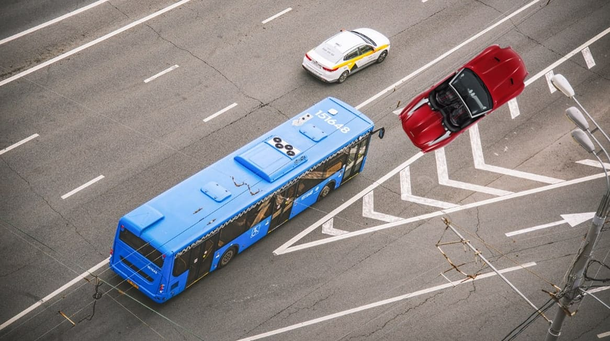
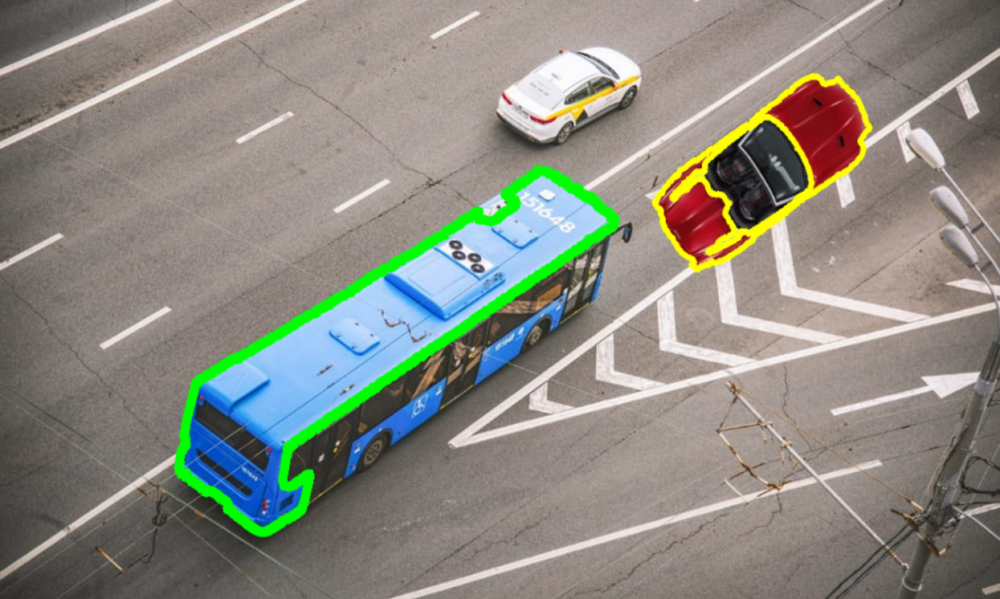

# Контроль соблюдения ПДД на выделенной полосе с дроном

## Автор

- [Смирнов Даниил](https://github.com/londrwus), Telegram: [londrwus](https://t.me/londrwus).

## Введение

Автобусная полоса — это часть дороги только для пассажирского транспорта. Выделяют ее специально, чтобы горожане без машин быстрее добирались на работу и обратно домой в час пик. Благодаря выделенным полосам общественный транспорт не стоит в дорожной пробке и удобен для пассажиров. Если водитель обычной легковушки объедет по ней пробку, он получит штраф за выделенную полосу для общественного транспорта

## Соблюдение контроля полосы

На данный момент, контроль соблюдения полосы происходит с стационарных камер дорожного движения. Однако, не на всех участках дорог можно расположить подобного вида камеры или камеры могут не работать или вообще не выделять автобусную полосу. Поэтому было создано решения контроля полосы с помощью беспилотника.

## Объяснение кода. Написание

Подключаем библиотеки:

```python
import rospy
import cv2 #OpenCV
from sensor_msgs.msg import Image
from cv_bridge import CvBridge
from std_srvs.srv import Trigger
from pyzbar import pyzbar
import numpy as np
```

Создаём некоторые переменные:

```python
rospy.init_node('flight')
bridge = CvBridge()
dict_flag = []
detect_flag = True
i = -1
```

Для реализации контроля полосы и нахождения машин, автобусов, нам понадобится библиотека OpenCV. Создаём скриншот с изображением с основной камеры для обработки с использованием OpenCV:

```python
def lane_control():
    global dict_flag, i, detect_flag, detected_blue_bus
    cv_image = bridge.imgmsg_to_cv2(rospy.wait_for_message('main_camera/image_raw', Image), 'bgr8')
    filtered_image = cv2.cvtColor(cv_image, cv2.COLOR_HSV2BGR)
```

На данный момент, автобусы производятся в синем цвете. Поэтому, автобус у нас будет синего цвета.



Прописываем диапазоны цветов для автобуса и машины:

```python
# Автобус
lower_blue = np.array([90, 60, 100])
upper_blue = np.array([119, 255, 255])
# Другие машины, допустим, цвет red
lower_red = np.array([160, 20, 50])
upper_red = np.array([190, 255, 255])
```

Данный скрипт требует больших вычислительных мощностей Raspberry Pi. Для ограничения работы скрипта, мы замедляем работу камеры до частоты 10 Гц (`main_camera.launch`):

```xml
<node pkg="topic_tools" name="cam_throttle" type="throttle" args="messages main_camera/image_raw 10.0 main_camera/image_raw_throttled"/>
```

Топик для камеры в этом случае необходимо поменять на `main_camera/image_raw_throttled` c `main_camera/image_raw`.

```python
# car
frame = cv2.inRange(filtered_image, lower_red, upper_red)
cnt = cv2.findContours(frame, cv2.RETR_EXTERNAL, cv2.CHAIN_APPROX_SIMPLE)
try:
    for c in cnt:
         moments = cv2.moments(c, 1)
         sum_pixel = moments['m01']
         
         if sum_pixel >= 100000:
             dict_flag[i][1] = [sum_pixel, int(moments['m10'] / sum_pixel), int(moments['m01'] / sum_pixel)]
             detected_red_car = True
             cv2.drawContours(image_src, [c], 0, (0,255,255), 6)
except:
    pass

# bus
frame = cv2.inRange(filtered_image, lower_blue, upper_blue)
cnt = cv2.findContours(frame, cv2.RETR_EXTERNAL, cv2.CHAIN_APPROX_SIMPLE)
try:
    for c in cnt:
         moments = cv2.moments(c, 1)
         sum_pixel = moments['m01']
         
         if sum_pixel >= 100000:
             dict_flag[i][0] = [sum_pixel, int(moments['m10'] / sum_pixel), int(moments['m01'] / sum_pixel)]
             detected_blue_bus = True
             cv2.drawContours(image_src, [c], 0, (0,255,0), 10)
except:
    pass

if detected_red_car == True:
    print("[DEBUG] detected car")
else:
    print("[DEBUG] No cars")
```

Данная программа будет определять машины по её оттенку. Вот что у нас в итоге получилось.



Вот примеры других цветовых диапазонов. Стоит подметить, что цветовые диапазоны вычисляются в HSV, а не в RGB:

```python
# Красный в одном диапазоне
red_low1 = np.array([0, 40, 20])
red_high1 = np.array([14, 255, 255])
# Красный в другом
red_low2 = np.array([165, 40, 20])
red_high2 = np.array([180, 255, 255])
# Голубой
lower_blue = np.array([90, 100, 31])
upper_blue = np.array([119, 255, 190])
# Желтый
lower_yellow = np.array([17, 55, 55])
upper_yellow = np.array([32, 200, 200])
#...
```

Иногда надо использовать два значения HSV красного, т. к. они попадают под начало и конец диапазона HSV.

Данная программа будет только обнаруживать, выдавать отчет об объекте, рисовать контуры объектов. Если же мы захотим, чтобы выводить на LED-ленту нарушило ли ПДД данный объект, то можно добавить переменные и добавить функцию:

```python
Led = { "red": [255, 0, 0], "blue": [0, 0, 255] }
count_led = 72 #Если же на вашей LED-ленте 72 светодиода, если 58 - ставьте значение 58
Led_full = [0]*count_led
def led_print():
    global count_led, Led_full
    set_effect(r=0, g=0, b=0)
    rospy.sleep(4)
    a = []
    for i in range(count_led):
        a.append(LEDState(i, Led[Led_full[i][0]][0], Led[Led_full[i][0]][1], Led[Led_full[i][0]][2]))
    set_leds(a)
```

Дополним функцию `lane_control`:

```python
S = sum([ dict_flag[i][0] for j in range (len(dict_flag[i]))])
j, k = 0, 0
print(dict_flag[i][0][0])
for k in range(int(dict_flag[i][0][0]/S * count_led)):
    Led_full[k+j] = ["red", dict_flag[i][0][1], dict_flag[i][0][2]]
j+=k
k = 0
print(j, k )
for k in range(int(dict_flag[i][1][0]/S * count_led)):
    Led_full[k+j] = ["blue", dict_flag[i][1][1], dict_flag[i][1][2]]
j+=k
k = 0
print(j, k)

if abs(Led_full[0][1] - Led_full[count_led/2][1]) > 50:
    Led_full.sort(key=lambda Led_full: Led_full[1]) # сортировка по x    
else:
    Led_full.sort(key=lambda Led_full: Led_full[2]) # сортировка по y

print(Led_full)
```

После этого наша светодиодная лента будет обозначать нарушил ли данный объект ПДД или нет.

Но даже после такого количества кода, наш дрон не будет следовать за нарушителем. Давайте сделаем так, чтобы дрон мог преследовать нарушителя постоянно, чтобы он не мог скрыться с места нарушения. Создадим базовые значения

```python
# Библиотеки
import tf
import tf2_ros
import geometry_msgs.msg
import tf2_geometry_msgs
import numpy as np
from geometry_msgs.msg import Vector3Stamped, Point, PointStamped

ar = "aruco_13" # ID нарушителя
tfBuffer = tf2_ros.Buffer()
listener = tf2_ros.TransformListener(tfBuffer)

l_z = 2 # Для будущего кода дальномера

def range_callback(msg):
    global l_z
    l_z = msg.range # Вывод Z по дальномеру

rospy.Subscriber('rangefinder/range', Range, range_callback)

def get_aruco_pose(frame_id): # Возвращает координаты, с помощью преобразование нового кадра
    global tfBuffer, listener
    try:
        trans = tfBuffer.lookup_transform(frame_id, ar, rospy.Time())
    except:
        return None
    pnt_l0 = tf2_geometry_msgs.do_transform_point(PointStamped(point=Point(x=0, y=0, z=0)), trans)
    l0 = np.array([pnt_l0.point.x, pnt_l0.point.y, pnt_l0.point.z])
    return l0

def get_body_pose(frame_id): # Возвращает координаты, с помощью преобразование нового кадра 
    global tfBuffer, listener
    try:
        trans = tfBuffer.lookup_transform(frame_id, "body", rospy.Time())
    except:
        return None
    pnt_l0 = tf2_geometry_msgs.do_transform_point(PointStamped(point=Point(x=0, y=0, z=0)), trans)
    l0 = np.array([pnt_l0.point.x, pnt_l0.point.y, pnt_l0.point.z])
    return l0

def remove_0_vel(vel): # Скорости полета в POSITION
    if np.linalg.norm(vel[:2]) < 0.045:
        vel[0] = 0
        vel[1] = 0
    return vel
```

Создадим функцию, которая будет производить весь этот полет. Для начала сделаем так, чтобы дрон находил нарушителя.

```python
def follow_violator():
    z = 1.5

    navigate_wait(z=1.5, speed=1, frame_id="body", auto_arm = True)
    rospy.sleep(2)
    set_effect(r=255, g=255, b=0)
    print("[DEBUG] started navigation")
    navigate_wait(x=0, y=0, z=z, speed=0.8, frame_id=ar, yaw=float('nan'), tolerance=0.2)
```

В итоге, мы написали код, но давайте сделаем так, чтобы он постоянно двигался за ним и улучшал его позиционирование.

```python
    FRQ = 5
    r = rospy.Rate(FRQ)
    prev_vel = None
    prev_pa = None
    prev_t = rospy.get_time()
    st_t = rospy.get_time()
    d = 10
    # Вычисляет на сколько надо перемещаться, за счет изменения кадров (прошлого и нынешнего)
    while d > 1 or (rospy.get_time() - st_t < 0.5): 
        pb = get_body_pose("aruco_map")
        pa = get_aruco_pose("aruco_map")
        now = rospy.get_time()
        if prev_pa is None:
            if pb is None:
                r.sleep()
                continue
            navigate(x=pb[0], y=pb[1], z=z, speed=1, frame_id="aruco_map") # Снижение высоты к подлету к маркеру
            set_effect(r=150, g=0, b=255, effect='blink')
            prev_pa = pa
            prev_t = now
        else:
            if pb is not None:
                d = np.linalg.norm(pb[:1]-pa[:1])
            if pa is not None:
                set_effect(r=150, g=0, b=255)
                vel = (pa-prev_pa)/(now-prev_t+0.0001)
                vel = np.clip(vel, -0.7, 0.7)
                
                vel = remove_0_vel(vel)
                if prev_vel is not None:
                    vel = vel*0.1 + prev_vel*0.1
                    
                t = pa[:1] + vel[:1]*(0.1/FRQ)*2.7
                set_position(x=t[0], y=t[1], z=z, frame_id="aruco_map")
                prev_pa = pa.copy()
                prev_vel = vel.copy()
                prev_t = now
            else:
                navigate(x=pb[0], y=pb[1], z=z, frame_id="aruco_map")
                set_effect(r=150, g=0, b=255, effect='blink_fast')
                print("NO pa and vel")
                
        r.sleep()

    set_effect(r=255, g=150, b=0)
    z_st = 1.5

    st_t = rospy.get_time()
    z_vel = 0.35

    Z = z_st
    r = rospy.Rate(20)
    # Вычисляет на сколько надо изменить координату Z, за счет изменения кадров (прошлого и нынешнего) и времени 
    while l_z > 0.09:
        pb = get_body_pose("aruco_map")
        pa = get_aruco_pose("aruco_map")
        now = rospy.get_time()
        if prev_pa is None:
            set_position(x=0, y=0, z=-0.01, frame_id="body")
            set_effect(r=255, g=150, b=0, effect='blink_fast')
            print("NO prev_pa")
            prev_pa = pa
            prev_t = now
        else:
            if pb is not None:
                d = np.linalg.norm(pb[:1]-pa[:1])
            if pa is not None:
                set_effect(r=255, g=150, b=0)
                if np.linalg.norm(pa - prev_pa) < 0.0001 and prev_vel is not None:
                    vel = prev_vel.copy()*0.97
                else:
                    vel = (pa-prev_pa)/(now-prev_t+0.0001)
                if l_z > 0.5:
                    vel = np.clip(vel, -0.7, 0.7)
                else:
                    vel = np.clip(vel, -0.5, 0.5)

                vel = remove_0_vel(vel)
                if np.linalg.norm(vel[:1]) < 0.02 and d <= 0.07:
                    Z = -(rospy.get_time()-st_t)*(0.1) + z_st
                else:
                    Z = -(rospy.get_time()-st_t)*z_vel + z_st
                    
                t = pa[:1] + vel[:1]*(0.1/FRQ)*2.2
                set_position(x=t[0], y=t[1], z=Z, frame_id="aruco_map")
                prev_pa = pa.copy()
                print("Z = ", Z)
                prev_vel = vel.copy()
                prev_t = now
            else:
                set_position(x=0, y=0, z=-0.01, frame_id="body")
                set_effect(r=255, g=150, b=0, effect='blink_fast')
                print("NO pa and vel")
                
        r.sleep()
```

Вывод: мы написали довольно короткий, для поставленных перед ним задач, код. Данный код фиксирует правонарушение, регулирует вариативность определения транспортного средства и совершает преследование нарушителя
