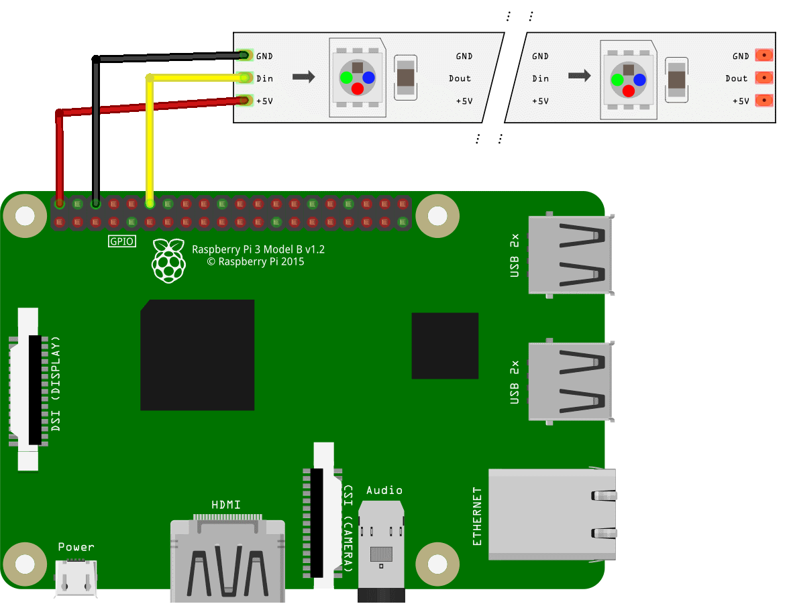

# Работа со светодиодной лентой на Raspberry 3

## Подключение и определение типа ленты

> **Note** Документация для версии образа, начиная с 0.14. Для более ранних версий см. [документацию для версий 0.13](https://github.com/CopterExpress/clover/blob/v0.13/docs/leds.md)

Подключите светодиодную ленту к питанию +5v - 5v, земле GND - GND и сигнальному порту DIN - GPIO30, **GPIO21**, GPIO18. По умолчанию нужно подключать к **GPIO21**.



> **Caution** Обратите внимание, что светодиодную ленту нужно питать от стабильного источника энергии. Если вы подключите питание напрямую к Raspberry, то это создаст слишком большую нагрузку на ваш микрокомпьютер. Для снятия нагрузки с Raspberry можно подключить питание к преобразователю `BEC`.

<!-- -->

> **Note** При работе с [GPIO](gpio.md) следует подключать ленту к пину GPIO21. В противном случае управление LED-лентой будет работать некорректно.

## Совместимость с ROS и Python

Чтобы корректно работать со светодиодной лентой вам нужно добавить в окружение необходимые пути к библиотекам Python и пакетам ROS, для этого необходимо добавить в файл `/etc/sudoers` следующие строки:

```
Defaults        env_keep += "PYTHONPATH"
Defaults        env_keep += "PATH"
Defaults        env_keep += "ROS_ROOT"
Defaults        env_keep += "ROS_MASTER_URI"
Defaults        env_keep += "ROS_PACKAGE_PATH"
Defaults        env_keep += "ROS_LOCATIONS"
Defaults        env_keep += "ROS_HOME"
Defaults        env_keep += "ROS_LOG_DIR"
```

## Пример программы для светодиодной ленты на RPI3

Для проверки работоспособности ленты можете использовать приведенный ниже код, данный код поочередно зажжет первые 10 диодов 3 цветами и в конце их погасит.

```python
import time

from rpi_ws281x import Adafruit_NeoPixel
from rpi_ws281x import Color


LED_COUNT      = 10      # Количество светодиодов в ленте
LED_PIN        = 21      # GPIO пин, к которому вы подсоединяете светодиодную ленту
LED_FREQ_HZ    = 800000  # Частота несущего сигнала (обычно 800 кГц)
LED_DMA        = 10      # DMA-канал для генерации сигнала (обычно 10)
LED_BRIGHTNESS = 255     # Яркость: 0 - наименьшая, 255 - наибольшая
LED_INVERT     = False   # True для инвертирования сигнала (для подключения через NPN транзистор)
LED_CHANNEL    = 0       # '1' для GPIO 13, 19, 41, 45 или 53

strip = Adafruit_NeoPixel(LED_COUNT, LED_PIN, LED_FREQ_HZ, LED_DMA, LED_INVERT)

strip.begin()


def colorWipe(strip, color, wait_ms=50):
    """Заполнение ленты цветом по одному светодиоду."""
    for i in range(strip.numPixels()):
        strip.setPixelColor(i, color)
        strip.show()
        time.sleep(wait_ms/1000.0)


print('Color wipe animations.')
colorWipe(strip, Color(255, 0, 0), wait_ms=100)  # Заполнение красным
colorWipe(strip, Color(0, 255, 0), wait_ms=100)  # Заполнение зелёным
colorWipe(strip, Color(0, 0, 255), wait_ms=100)  # Заполнение синим
colorWipe(strip, Color(0, 0, 0), wait_ms=100)    # Выключение ленты
```

> **Note** Вы так же можете использовать тестовый код разработчиков данного модуля. Вы можете его [скачать](https://github.com/rpi-ws281x/rpi-ws281x-python/tree/master/examples "Github разработчика") из репозитория разработчика.

Сохраните программу в ваш скрипт и запустите его используя права администратора:

```bash
sudo python YourScriptName.py
```

## Основные функции используемые для работы со светодиодной лентой

Для подключения библиотеки и её корректной работы требуется подключить следующие модули: `Adafruit_NeoPixel` и `Color` - для работы ленты и `time` – для управления задержками.

```python
from rpi_ws281x import Adafruit_NeoPixel
from rpi_ws281x import Color
import time
```

Для работы с лентой необходимо создать объект типа `Adafruit_NeoPixel` и инициализировать библиотеку:

```python
# Создание объекта NeoPixel c заданной конфигурацией
strip = Adafruit_NeoPixel(LED_COUNT, LED_PIN, LED_FREQ_HZ, LED_DMA, LED_INVERT)
# Инициализация библиотеки, должна быть выполнена перед другими функциями
strip.begin()
```

Основные функции, которые используются для управления лентой:

+ `numPixels()` - возвращает количество пикселей в ленте. Удобно для цикличного управления всей лентой целиком.
+ `setPixelColor(pos, color)` – устанавливает цвет пикселя в позиции `pos` в цвет `color`. Цвет должен быть 24 битным значением, где первые 8 бит - красный цвет \(red\), следующие 8 бит - зелёный цвет \(green\) и последние 8 бит - голубой \(blue\). Для получения значения `color` можно использовать функцию `Color(red, green, blue)`, которая составляет это значение из 3х компонент. Каждый компонент должен находиться в диапазоне 0-255, где 0 – отсутствие цвета, а 255 – наибольшая доступная яркость компонента в светодиодном модуле.
+ `setPixelColorRGB(pos, red, green, blue)` – устанавливает цвет пикселя в позиции pos в цвет, состоящий из компонент `red`, `green`, `blue`. Каждый компонент должен находиться в диапазоне 0–255, где 0 – отсутствие цвета, а 255 – наибольшая доступная яркость компонента в светодиодном модуле.
+ `show()` – обновляет состояние ленты. Только после её использования все программные изменения перемещаются на светодиодную ленту.

## Почему именно так и можно ли по-другому?

Основной тип ленты, который используется для Клевера 3 управляются по принципу: для массива светодиодов в ленте отправляется пакет данных по 24 бита на светодиод; каждый светодиод считывает первые 24 бита из пришедших к нему данных и устанавливает соответствующий цвет, остальные данные он отправляет следующему светодиоду в ленте. Нули и единицы задаются разными сочетаниями длительностей высокого и низкого уровня в импульсе.

Используемый тип ленты поддерживаются для управления библиотекой [rpi_ws281x](https://github.com/jgarff/rpi_ws281x), при этом для управления используется модуль DMA \(direct memory access\) процессора Raspberry Pi и один из каналов передачи данных: PWM, PCM или SPI, что гарантирует отсутствие задержек в управлении \(а управляется всё на многозадачной операционке, это важно\).

Есть некоторые особенности работы с каналами, например при передаче данных с помощью PWM \(ШИМ\) перестаёт работать встроенная аудиосистема Raspberry Pi, при передаче данных по PCM блокируется использование подключенных цифровых аудиоустройств \(при этом встроенная система работает\), а при использовании SPI \(кстати, требуется специальная настройка размера буфера и частоты GPU Raspberry Pi для правильной работы\) лента блокирует все остальные устройства, подключенные по этому каналу.

Есть некоторые особенности выбора канала DMA для управления лентой: некоторые каналы используются системой, поэтому их использование может привести к неприятным последствиям, например использование 5 канала рушит файловую систему Raspberry, т.к. этот канал используется при чтении-записи на SD карту. Безопасный канал – 10, он же установлен по умолчанию в приведённой выше библиотеке.

Поэтому сценарии использования LED-ленты следующие:

1. Если нам не важна работоспособность встроенного аудио на Raspberry Pi \(и мы его не используем, т. к. аудио и лента будут выдавать белиберду в этом случае\), то можно использовать PWM канал \(для этого требуется подключить вход ленты к одному из следующих GPIO портов Raspberry Pi: 12, 18, 40, или 52 для PWM0 канала и 13, 19, 41, 45 или 53 для PWM1 канала\).
2. Если нам не важно наличие на шине SPI других устройств, то можно управлять лентой по каналу SPI \(GPIO на Raspberry Pi 10 или 38\).
   Здесь требуется произвести следующие настройки \(только для Raspberry Pi 3\):
   + увеличить размер буфера передачи данных для поддержки длинных лент, добавив стройку `spidev.bufsiz=32768` в файл `/boot/cmdline.txt`;
   + установить частоту GPU для правильной частоты работы SPI, добавив строку `core_freq=250` в файл `/boot/config.txt`.
   + перезагрузить вашу Raspberry, используя команду `sudo reboot`
3. Если нам важна и работа аудио, и подключение к SPI устройств кроме лед ленты, то можно управлять лентой по каналу PCM \(GPIO 21 или 31\). При этом никаких дополнительных манипуляций с Raspberry не требуется.

Исходя из вышеперечисленных способов управления лентой, наилучшим вариантом, позволяющим управлять лентой, сохранить работоспособность встроенной аудиосистемы и возможность подключения всяческих устройств и датчиков по SPI, является управление по каналу PCM \(GPIO 21\) с использованием 10 канала DMA.
