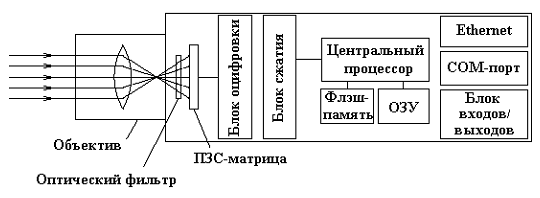

Урок №10 «Аналоговая и цифровая видеотрансляция. Применяемые камеры, радиопередатчики и приёмники»
==================================================================================================

Видеокамеры аналогового типа
-----------------------------

С использования аналоговых видеокамер начиналось все наше телевидение, а далее они прочно вошли во все системы видеонаблюдения, но на сегодняшний день существенно потеснены из этого сектора, современными цифровыми видеокамерами.

### Принцип работы аналоговых видеокамер

Он заключается в том, что световой поток, проходя сквозь линзы объектива, попадает на матрицу ПЗС, где он преобразуется в видеосигнал. Рынок аналоговых видеокамер обширный, и каждый из нас сможет сделать оптимальный для себя выбор, в соответствии с необходимыми характеристиками и вкусом.
Большим преимуществом камер аналогового типа является их взаимосовместимость, даже от разных производителей, а также простота монтажа и настройки через соответствующие меню.

### Работа цифровых камер

Цифровые видеокамеры (IP камеры), вошли в нашу жизнь совсем недавно, но с позиций их использования – на практике зарекомендовали себя достаточно хорошо с позиций существенного улучшения качества. Конечно же, они пока что, немного дороговаты по сравнению с камерами аналогового типа, но в перспективе развития цифровых технологий – альтернативы им нет.

***Принцип работы цифровых камер***

Здесь, также как и в камере аналоговой, световой поток, отраженный от предметов – попадает на чувствительную к свету матрицу устройства, которая преобразует его, но уже в сигнал электрический. Далее этот электрический сигнал, посредством процессора IP камеры обрабатывается, и лишь тогда кабелем «витая пара» или «коаксиальным кабелем», а возможно и средствами беспроводной связи (Wi – Fi), обработанный видеосигнал поступает на вход цифрового видеорегистратора. При данной технологии, видеорегистратор производит запись отснятого видео с IP камер сразу же на жесткий диск в цифровом формате.

***Возможности цифровых камер***

* Многие цифровые камеры имеют встроенный динамик и микрофон, посредством которых, также может осуществляться двухсторонняя связь с лицом, находящимся возле камеры, чего нет у камер аналогового типа.
* Видео и аудио файлы в одной цифровой камере, идут по одному и тому же каналу связи, притом, что в камерах аналогового типа даже при дополнительном микрофоне, обязательно наличие отдельного кабеля для аудиоканала связи.
* Большинство моделей IP камер обладают оперативной памятью, с фиксацией в ней программного обеспечения (ПО) и настроечных характеристик. Здесь также можно записать нужные вам, какие то циклические видеофайлы, что очень удобно!
* Каждая цифровая камера в соответствии с задачами стоящими именно перед ней настраивается индивидуально.
* цифровая камера может работать в паре с датчиком движения по принципу своего включения на период движения в зоне ее контроля с передачей соответствующего видео, привязанного ко времени, на центральный монитор системы видеонаблюдения.
* Текущие кадры, зафиксированные цифровой камерой, да и архив тоже, можно просматривать да и управлять системой тоже, посредством мобильного телефона или ноутбука через Интернет, находясь в любой точке Земли.
* Однако цифровая камера может не записать вам какое то нужное изображение, с длительностью долей секунды, и вы его не увидите на мониторе, поскольку в цифровом формате – данная запись округляется. Здесь преимущество за «аналоговым» форматом, который пишет на кассету все.

***Дальность полёта***

Как оказалось, дальность управляемого полета с трансляцией видеосигнала может достигать десятков километров для планеров и 3-7 км для вертолетов и мультикоптеров (быстрее расходуется батарея). То есть даже на небольшом коптере можно запросто улететь в облака (красивое видео для всех).

И все же надо представлять реальные ограничения:

* Дальность передачи видеосигнала сильно зависит от количества помех в зоне полета. В центре города помех значительно больше, чем где-нибудь в поле. Поэтому дальние полеты лучше совершать за городом, что, разумеется, менее интересно. Если поблизости есть высоковольтные линии, аэродромы, космические станции и прочие источники сигнала, это может существенно сократить дистанцию уверенного приема видео.
* Разные системы передачи сигнала имеют различную способность огибать препятствия, но надо понимать, что залететь к кому-нибудь в окно и полетать по квартире не выйдет — будет потерян сигнал.
* По-сути, дальность ограничивается лишь емкостью батареи, но для реализации всего потенциала современных технологий необходима наземная станция. То есть летать более чем на 500 метров с планшетом в руках не получится. Причем с радиоуправлением проблем нет, хороший пульт безо всяких его улучшений работает на расстоянии до 3 км, а вот с видео все не так просто. Передача данных по Wi-Fi или через сотовые сети для FPV  не годится. Слишком большие задержки и риски потери сигнала превращают модель в нечто опасное как для окружающих, так и для  пилота.
* Моделью довольно сложно управлять по камере. Нужны недели тренировок в безопасной зоне, прежде чем вы сможете приблизиться к живым или ценным объектам. Основные сложности, с которыми сталкиваются начинающие FPV-пилоты — это контроль высоты полета и ориентация в пространстве относительно места старта. Есть системы, выводящие эту информацию на экран, но данные могут запаздывать или быть неточными. Так что тренировки просто необходимы.
* Так или иначе вы будете зависеть от погоды. В холод быстрее разряжаются аккумуляторы, крайне некомфортно готовить полет и управлять моделью. В ветер летать в принципе можно, но управление становится не естественным. В дождь летать не принято, так как это увеличивает риск выхода из строя электроники

***Качество изображения***

Летать можно 2-мя способами. С помощью монитора или в очках.

Современный рабочий вариант очков имеет разрешение 800x600, чего более чем достаточно.

Даже на отличной камере детализация низковата. Атмосферу не чувствуешь, и какие-то шумы присутствуют. Насладиться красотой пейзажей можно потом, в записи со второй цифровой HD-камеры, а не в процессе полета.

### Контрольные вопросы

1) Опишите принцип работы аналоговой камеры
2) Опишите принцип работы цифровой камеры.
3) В чём основное отличие аналоговой и цифровой камеры?
4) На какой дистанции можно производить видеосъёмку.
5) Что позволит увеличить дистанцию приёма видеосигнала.
6) Что ещё может повлиять на дальность полёта?
