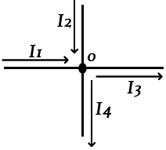
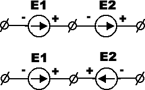

Урок №2 «Основы электричества»
==============================

Введение. Электродвижущая сила. Закон Ома
-----------------------------------------

Как известно все тела состоят из мельчайших частиц - молекул, молекулы из атомов, атомы ещё из более мелких протонов, нейтронов, электронов. Каждая частица, молекула, тело имеет свой энергетический заряд. Тела с положительным (+) зарядом притягиваются к телам с отрицательным (-) зарядом, а одноимённые (+) с (+) и (-) с (-) отталкиваются.  Наблюдается движение.

Интенсивность этого движения частиц в веществах зависит от многих факторов: деформация, воздействие света, нагревание, трение, химические реакции.

При  этом образуются небольшие источники двух полярностей (+) и (-). Каждая полярность имеет свою величину - потенциал. Чем больше потенциал, тем больше разница между (+) и (-).

Так вот, эта разница потенциалов (+) и (-), есть электродвижущая сила (далее ЭДС), то есть электрическое напряжение.

Итак, источник электроэнергии обладает разностью потенциалов, заряженные частицы которых, стремятся друг к другу. А так - же есть такие, которые ограничивают их движение.

Первые - это проводники, которыми является большинство металлов, вода, кислоты, щёлочи и прочие. Вторые - диэлектрики: дерево, воздух, пластмассы и т.д. Из хороших диэлектриков: фарфора, стекла, текстолита, резины и т.д. изготовляют изоляторы.
В качестве проводника электроэнергии используется медь, алюминий, бронза, латунь, серебро, золото и их сплавы. Если мы возьмём отрезок проводника и соединим им две полярности источника, то мы получаем движение заряженных частиц по проводнику от (+) к (-).

Это движение и есть электрический ток.

Любое тело обладает свойством сопротивляться движению заряженных частиц (электротоку). Это свойство зависит от вещества, из которого состоит тело, и называется сопротивлением. У проводников оно маленькое, у диэлектриков - большое. Источник электроэнергии тоже имеет своё сопротивление, называется оно внутренним сопротивлением источника.
Величина тока, протекающего по цепи будет зависеть от разницы потенциалов (мы помним: чем больше разница, тем больше притяжение) и от сопротивлений: проводника и внутреннего сопротивления источника, как правило, сопротивление источника очень мало и при изучении им можно пренебречь.

Зависимость такая:

Электрический ток будет равен тому, что мы получим, когда поделим разность потенциалов участка (величина напряжения) на сопротивляемость этого участка (сопротивление). Обозначаем:  I - электрический ток; U - напряжение; R - сопротивление;

С помощью треугольника, работая с формулой закона Ома,
легко написать формулу для любой входящей величины.

Нужно закрыть ту величину, которую необходимо определить.
Если две оставшиеся величины находятся на одном уровне – значит надо их перемножить.
Если одна над другой – значит надо разделить верхнюю на нижнюю.

Решим задачу используя закон ома.

Дано:

Напряжение тока 20B, сопротивление равно 10Om. Найти силу тока.

U = 20B, R=10Om, I-?

I = U\R

I=2 A

Первый закон Кирхгофа
---------------------

В цепях, состоящих из последовательно соединенных источника и приемника энергии, соотношения между током, ЭДС и сопротивлением всей цепи или , между напряжением и сопротивлением на каком-либо участке цепи определяется законом Ома.

На практике в цепях, токи, от какой-либо точки, идут по разным путям.
Точки, где сходятся несколько проводников, называются узлами, а участки цепи, соединяющие два соседних узла, ветвями.

В замкнутой электрической цепи ни в одной ее точке не могут скапливаться электрические заряды так, как это вызвало бы изменение потенциалов точек цепи. Поэтому электрические заряды притекающие к какому-либо узлу в единицу времени, равны зарядам, утекающим от этого узла за ту же единицу.

Разветвлённая цепь.

В узле А цепь разветвляется на четыре ветви, которые сходятся в узел В.

Обозначим токи в неразветвленной части цепи - I, а в ветвях соответственно

**I1, I2, I3, I4.**

У этих токов в такой цепи будет соотношение:

**I = I1+I2+I3+I4;**

Сумма токов, подходящих к узловой точке электрической цепи,
равна сумме токов, уходящих от этого узла.

При параллельном соединении резисторов ток проходит по четырем направлениям, что уменьшает общее сопротивление или увеличивает общую проводимость цепи, которая равна сумме проводимостей ветвей.

Обозначим силу тока в неразветвленной ветви буквой I.
Силу тока в отдельных ветвях соответственно I1, I2, I3 и I4.
Напряжение между точками A и B - U.
Общее сопротивление между этими точками — R.

По закону Ома напишем:

**I = U/R; I1 = U/R1; I2 = U/R2; I3 = U/R3; I4 = U/R4;**

Согласно первому закону Кирхгофа:

**I = I1+I2+I3+I4; или U/R = U/R1+U/R2+U/R3+U/R4.**

Сократив обе части полученного выражения на U получим:

**1/R = 1/R1+1/R2+1/R3+1/R4**, что и требовалось доказать.

Соотношение для любого числа параллельно соединенных резисторов.
В случае, если в цепи содержится два параллельно соединенных резистора
**R1** и **R2**, то можно написать равенство:

**1/R =1/R1+1/R2;**

Из этого равенства найдем сопротивление R, которым можно заменить два параллельно соединенных резистора:

Полученное выражение имеет большое практическое применение.
Благодаря этому закону производятся расчёты электрических цепей.

Второй закон Кирхгофа
---------------------

В замкнутом контуре электрической цепи сумма всех эдс равна
сумме падения напряжения в сопротивлениях того же контура.

**E1 + E2 + E3 +...+ En = I1R1 + I2R2 + I3R3 +...+ InRn.**

При составлении уравнений выбирают направление обхода цепи и произвольно задаются направлениями токов.

Если в электрической цепи включены два источника энергии, эдс которых совпадают по направлению, т. е. согласно изо1, то эдс всей цепи равна сумме эдс этих источников,
т. е.

**E = E1+E2.**

Если же в цепь включено два источника, эдс которых имеют противоположные направления, т. е. включены встречно изо2, то общая эдс цепи равна разности эдс этих источников

**Е = Е1—Е2.**

Закон Джоуля-Ленца
------------------

При прохождении электрического тока через металлический проводник электроны сталкиваются то с нейтральными молекулами, то с молекулами, потерявшими электроны.

При столкновении электронов с молекулами расходуется энергия, которая превращается в тепло.
Любое движение, при котором преодолевается сопротивление, требует затраты определенной энергии. Так, например, для перемещения какого-либо тела преодолевается сопротивление трения, и работа, затраченная на это, превращается в тепло.

Электрическое сопротивление проводника играет ту же роль, что и сопротивление трения.
Таким образом, для проведения тока через проводник источник тока затрачивает некоторую энергию, которая превращается в тепло.

Переход электрической энергии в тепловую отражает закон Ленца-Джоуля
или закон теплового действия тока.

Русский ученый Ленц и английский физик Джоуль одновременно и независимо один от другого установили, что при прохождении электрического тока по проводнику количество теплоты, выделяемое в проводнике, прямо пропорционально квадрату тока, сопротивлению проводника и времени, в течение которого электрический ток протекал по проводнику. Это положение называется законом Ленца-Джоуля.

Если обозначить количество теплоты, создаваемое током, буквой Q (Дж),  ток, протекающий по проводнику - I, сопротивление проводника - R и время, в течение которого ток протекал по проводнику - t, то закону Ленца-Джоуля можно придать следующее выражение:

Решим пример задачи:

### Контрольные вопросы

1. Что такое электродвижущая сила?
2. Как найти сопротивление в проводнике используя закон Ома.
3. Чем отличается проводник от диэлектрика?
4. Где применяется первый закон Кирхгофа?
5. Из-за чего в проводнике происходит выделение тепла при прохождении тока?

### Интересные факты

Когда немецкий электротехник Георг Симон См положил на стол ректора Берлинского университета свою диссертацию, где впервые был сформулирован этот закон, без
которого невозможен
ни один электротехнический расчет, он получил весьма резкую резолюцию. В ней говорилось,
что электричество не поддается никакому математическом описанию, так как электричество - это собственный гнев, собственное бушевание тела, его гневное Я, которое проявляется в каждом теле, когда его раздражают. Ректором Берлинского университета был в те годы
Георг Вильгельм Фридрих Гегель.

Имя Ома увековечено не только открытым им законом. В 1881 г. на Электротехническом съезде в Париже было утверждено название единицы сопротивления «Ом». Далеко не всем известно, что одному из кратеров на обратной стороне Луны присвоено имя Ома, наряду с именами таких великих физиков, как Планк, Лоренц, Ландау, Курчатов.

В 1833 г. Георг Ом был уже известен в Германии, и являлся профессором политехнической школы
в Нюрнберге. Однако во Франции и Англии работы Ома оставались неизвестными. Через 10 лет
после появления "закона Ома" один французский физик на основе экспериментов пришел
к таким же выводам. Но ему было указано, что установленный им закон еще в 1827 г. был открыт Омом. Оказывается, что французские школьники и поныне изучают закон Ома под другим именем - для них это закон Пулье.
