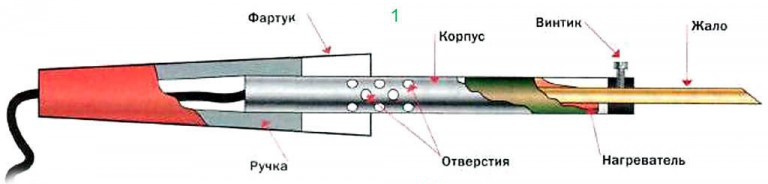

Урок №3 «Теория пайки»
======================

Пайка металлов припоем – довольно сложный физико-химический процесс, но в работе он сводится к достаточно простым приемам и операциям. Чтобы правильно паять, не блуждая в дебрях теории, правила производства спаечных работ нужно соблюдать в точности. Особенно это касается выбора метода пайки, припоя и флюса в зависимости от вида соединяемых деталей и требований к паяному стыку.

Что такое пайка?
----------------

Пайка своими руками в домашних условиях сводится к следующим технологическим операциям:

1. Паяемые поверхности очищают от загрязнений, коррозионных корок и т.п. Зачищают до блеска, т.е. до отсутствия видимых следов окислов;
2. Покрывают флюсом – веществом, удаляющим остатки окисла и не допускающим окисления поверхностей в дальнейшем процессе. Для флюсовки под лужение предпочтительно использовать не жидкие или твердые флюсы, а флюс-пасты;
3. Затем поверхности лудят – наносят на них расплавленный припой (специально предназначенный для пайки сплав), он при этом растекается тонкой пленкой и химически соединяется с основным металлом;
4. Детали предварительно соединяют механически: скруткой, сжатием пинцетом, пассатижами, в тисках, струбциной и пр. Наносят еще флюс, чтобы не допустить окисления припоя под нагревом;
5. Наносят с прогревом еще припой (возможно, уже другой) до получения спая заданного качества;
6. Если пайка велась паяльником с луженым жалом, по ее окончании его очищают и покрывают неактивным флюсом. Чтобы пайки были качественными, обычный паяльник должен храниться с зафлюсованным жалом!

Зачистка
--------

Зачистка после очистки – первая каверзная операция пайки. Использование для нее абразивов недопустимо! Их мельчайшие частички, въевшиеся в металл, полностью удалить невозможно. Впоследствии они становятся очагами процессов, разрушающих спай. Зачищают поверхности под пайку надфилем, напильником, шаберным инструментом (разные виды скребков) или просто ножом. Но лучше всего, особенно если готовятся для пайки токоведущие провода, сразу покрыть их активированным флюсом, а после пайки тщательно удалить его остатки. Это удобно делать зубной щеткой, смоченной спиртом.

Чем и как лудить/паять?
-----------------------

Для следующих операций понадобится уже специальный электронагревательный инструмент: паяльник, футорка или паяльная горелка. Паять в домашних условиях чаще всего приходится электропаяльником с медным луженым жалом.

Лудить необходимо следующим образом:

* Провод тонкий – легко, без нажима, двигают по оголенному концу жалом с одной и затем с противоположной стороны, пока припой не растечется. Провод держат кончиком вниз. Стекшую туда каплю излишка припоя снимают паяльником.
* Провод толстый – жало двигают по спирали взад-вперед.
* Плоская тонкая длинная деталь – припой наносят на конец и двигают жало вдоль. Когда за жалом покажутся незалуженные края детали, наносят на недолуженный участок еще флюса, набирают другую каплю припоя и продолжают лужение.
* Длинная более широкая деталь – то же, что и в пред. случае, но жало ведут змейкой.
* Широкая деталь – жало двигают по спирали от центра в краям.

Особенности пайки проводов
--------------------------

В предварительном соединении паяемых деталей больше всего проблем возникает с проводами: их для этого приходится трогать руками, отчего поверхность металла загрязняется, и спаям проводов чаще прочих паяных соединений приходится выдерживать механические нагрузки.

### Скрутки проводов

Прежде чем паять провода, их нужно правильно скрутить. Основные виды скруток проводов для пайки показаны на рис. У каждого из них свое предназначение:

* Бандажными скрутками соединяют жесткие (толстые одножильные) токоведущие провода, т.е. по которым передается электрическая мощность. Особенно – провода наружные. Бандажное соединение обеспечивает достаточный электрический контакт даже при непропае или перегреве окислившегося спая.
* Желобковые скрутки делают на проводах в легкоплавкой изоляции (простой ПВХ, полиэтилен), когда необходимо полное растекание припоя при минимальном прогреве. Греют желобковые скрутки только по желобку.
* Простыми скрутками можно соединять как одножильные, так и многожильные только что зачищенные от изоляции (блестящие) провода.
* Простая последовательная скрутка, т. наз. прямая британская, или просто британка, применима для соединения токоведущих проводов гибких кабелей сечением до 1,4 кв. мм, не испытывающих регулярных больших механических нагрузок, напр. электрических удлинителей или времянок.

Электрические провода, испытывающие регулярные и/или постоянные механические нагрузки, должны быть обязательно многожильными. Скручивают их, как показано внизу на рис: концы разметливают, «метлы» вдвигают друг в друга и скручивают по-британски. Паяют легкоплавким припоем повышенной прочности, напр. ПОСК-50 (см. ниже) с активированным флюсом, не требующим удаления остатков, также см. ниже. Параллельные (тупиковые) скрутки проводов сечением свыше 0,7 кв. мм желательно паять погружением в расплавленный припой, см. далее. В противном случае придется греть или долго, или слишком мощным паяльником, отчего изоляция ползет, а флюс преждевременно выкипает.

Что паяемо, но не паяется

Не предназначены для соединения пайкой гибкие коаксиальные кабели и кабели для компьютерных сетей типа витая пара («витуха»). Опытный кабельщик, имеющий полное представление об электродинамике линий передачи сигнала, в исключительных случаях сделать муфту на них может. Но при выполнении дилетантом, пусть он в остальном квалифицированный электронщик и монтажник, пропускная способность и помехозащищенности линии упадут ниже допустимого, вплоть до полной потери.

Как чистить и консервировать жало

Жало паяльника очищают от остатков припоя, потирая о мягкую пористую или волокнистую подкладку. Чаще всего используется поролон, но это вариант не из лучших: он подгорает и налипает на жало. Лучший материал для его чистки – натуральный войлок или базальтовый картон. Но еще лучше – 2-ступенчатая чистка, сначала о губку-путанку из металлической ленты, а затем уж о войлок. После чистки паяльник выключают, вводят еще горячее жало в твердую канифоль и ждут, пока она не перестанет пузыриться. Тогда жало вынимают и держат вниз концом, чтобы стекли излишки канифоли. По полном его остывании паяльник можно отправлять на хранение.

Припои и флюсы
--------------

Припои от ПОС-90 до Авиа-2 – мягкие для низкотемпературной пайки. Гарантированно обеспечивают только электрический контакт. ПОС-30 и ПОС-40 паяют медь, латунь, бронзу с неактивными флюсами, а их же со сталью и сталь со сталью – с активными. ПОССр-15 можно паять оцинковку с неактивными флюсами; другие припои при этом разъедают цинк до стали и пайка скоро отваливается. 34А, МФ-1 и ПСр-25 припои твердые, для высокотемпературной пайки. Припоем 34А можно паять алюминий в пламени (см. далее, о пайке алюминия) со специальными флюсами, см. там же. Припоем МФ1 припаивают медь к стали с активированным флюсом. «Невысокие требования к прочности» в данном случае значит, что прочность спая ближе к прочности меди, чем стали. ПСр-25 при пайке сухим паяльником пригоден для пайки ювелирных изделий, витражей тиффани и т.п.

### Флюсы

Паяльные флюсы делятся на нейтральные (неактивные, бескислотные), химически с основным металлом не взаимодействующие или взаимодействующие в ничтожной степени, активированные, химически действующие на основной металл при нагреве, и активные (кислотные), действующие на него и холодными. В отношении флюсов наш век принес больше всего нововведений; большей частью все же хороших, но начнем с неприятных. Первое – технически чистого ацетона для промывки паек в широкой продаже больше нет вследствие того, что он используется в подпольном производстве наркотиков и сам обладает наркотическим действием. Заменители технического ацетона – растворители 646 и 647.

Второе – хлористый цинк в активированных флюс-пастах часто заменяют тераборнокислым натрием – бурой. Соляная кислота – высокотоксичное химически агрессивное летучее вещество; хлорид цинка также токсичен, а при нагреве сублимирует, т.е. улетучивается не плавясь. Бура безопасна, но при нагреве выделяет большое количество кристаллизационной воды, что немного ухудшает качество пайки.

Пайки от СКФ нужно обязательно промывать: в состав канифоли входит янтарная кислота, при длительном контакте разрушающая металл. Кроме того, случайно пролитый СКФ мгновенно растекается по большой площади и превращается в очень долго сохнущую чрезвычайно липкую гадость, пятна от которой ничем не сводятся ни с одежды, ни с мебели, ни с пола со стенами. В общем СКФ для пайки хороший флюс, но не для ротозеев с растяпами. Полноценный заменитель СКФ, но не такой противный при небрежном обращении – флюс ТАГС. Стальные детали более массивные, чем допустимо для пайки паяльной кислотой, и более прочно, паяют флюсом Ф38. Универсальным флюсом можно паять практически любые металлы в любых сочетаниях, в т.ч. алюминий, но прочность спая с ним не нормируется. К пайке алюминия мы еще вернемся.

### Другие виды пайки

Любители мастерить также часто паяют сухим паяльником с бронзовым нелуженым жалом, т. наз. паяльным карандашом, поз. 1 на рис. Он хорош там, где недопустимо растекание припоя вне зоны пайки: в ювелирных изделиях, витражах, паяных предметах прикладного искусства. Иногда всухую паяют и микрочипы, монтируемые на поверхность, с шагом расположения выводов 1,25 или 0,625 мм, но это дело рискованное и для опытных специалистов: плохой тепловой контакт требует избыточной мощности паяльника и длительного нагрева, а обеспечить стабильность прогрева при ручной пайке невозможно. Для сухой пайки применяют гарпиус из ПОСК-40, 45 или 50 и флюс-пасты, не требующие удаления остатков.

### Мелкая пайка

В пайке печатных плат есть свои особенности. Лужение проводов отпадает, т.к. выводы радиокомпонент и чипов уже луженые. В любительских условиях, во-первых, нет особого смысла лудить все токоведущие дорожки, если устройство работает на частотах до 40-50 МГц. В промышленном производстве платы лудят низкотемпературными способами, напр. напылением или гальваническим. Прогрев дорожек паяльником по всей длине ухудшит их сцепление с основой и увеличит вероятность отслоения. После монтажа компонент плату лучше покрыть лаком. Медь от этого сразу потемнеет, но на работоспособность устройства это никак не повлияет, если только речь не идет об СВЧ.

### Пайка радиоэлектронных компонент на печатную плату

Затем, взгляните на нечто безобразное слева на след. рис. За такой брак и в недоброй
памяти советском МЭПе (министерстве электронной промышленности) монтажников
разжаловали в грузчики или подсобники. Дело даже не во внешнем виде или перерасходе
дорогого припоя, а, во-первых, в том, что за время остывания этих блямб перегрелись и
монтажные площадки, и детали. А большие тяжелые наплывы припоя – довольно
инертные для уже ослабленных дорожек грузики. Радиолюбителям хорошо знаком
эффект: спихнул нечаянно плату-«каракатицу» на пол – 1-2 или более дорожек
отслоились. Не дожидаясь и первой перепайки.

Паечные наплывы на печатных платах должны быть округлыми гладкими высотой не более 0,7 диаметра монтажной площадки, см. справа на рис. Кончики выводов должны немного выступать из наплывов. Кстати, плата полностью самодельная. Есть способ в домашних условиях сделать печатный монтаж таким же точным и четким, как фабричный, да еще и вывести там надписи, какие хочется. Белые пятнышки – блики от лака при фотосъемке. Наплывы вогнутые и тем более сморщенные – тоже брак. Просто вогнутый наплыв значит, что припоя недостаточно, а морщинистый, кроме того, что в пайку проник воздух. Если собранное устройство не работает и есть подозрение на непропай, смотрите в первую очередь такие места.

### Микросхемы, пайка

Микросхемы в DIP-корпусах паяются как прочие радиоэлектронные компоненты. Паяльник – до 25 Вт. Припой – ПОС-61; флюс – ТАГС или спиртоканифоль. Смывать его остатки нужно ацетоном или его заменителями: спирт берет канифоль туго, и между ножками отмыть им полностью не удается ни кисточкой, ни ветошью. Что до чипов и тем более микрочипов, то паять их вручную настоятельно не рекомендуется специалистам любого уровня: это лотерея в весьма проблематичным выигрышем и весьма вероятным проигрышем. Если уж у вас дело дойдет до таких тонкостей как ремонт телефонов и планшетов, то придется раскошелиться на паяльную станцию. Пользоваться ею не намного сложнее, чем ручным паяльником, см. видео ниже, а цены вполне приличных паяльных станций ныне доступны.

### Что еще?

Ах да, подставки для паяльников. Классическая, слева на рис., пригодна для любых стержневых. Где на ней быть ванночкам для припоя и канифоли – дело ваше, какой-либо регламентации нет. Для маломощных паяльников с фартуком пригодны упрощенные подставки-скобы, в центре.

Паяльные станции комплектуются преимущественно пружинными или трубчатыми ложементами-гнездами для паяльников. В них вся горячая часть инструмента недоступна для прикосновения, но и промазать паяльником мимо них, сосредоточившись на пайке мелкой «россыпи», вероятнее. Но чего уж точно не надо делать, и что прямо запрещено ТБ – это подставку из подручных материалов, в которой паяльник лежит на ванночках для расходных материалов, справа на рис.

### Контрольные вопросы

1. Какое вещество не допускает окисление?
2. Перечислите основные этапы пайки.
3. Что такое лужение?
4. В каких случаях пайку использовать нельзя?
5. Какой флюс лучше использовать при пайке микросхем.
