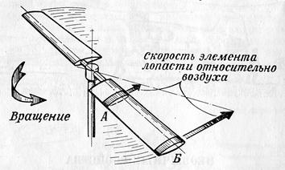
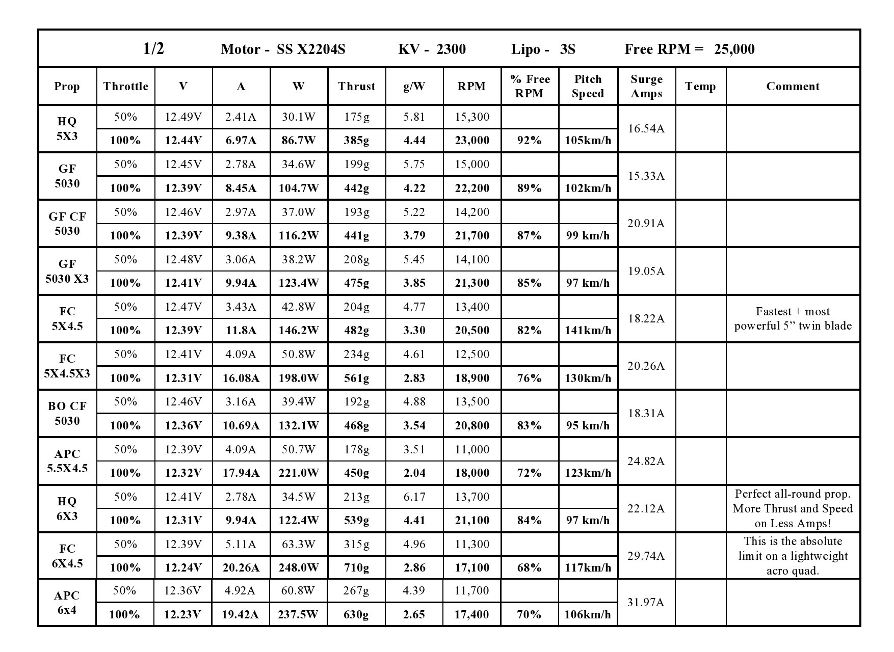

Урок №4 «Аэродинамика полета. Пропеллер»
========================================

Аэродинамика пропеллера
-----------------------

 Пропеллер — лопастной агрегат, приводимый во вращение двигателем и предназначенный для преобразования мощности (крутящего момента) двигателя в тягу.

Винт вращается на месте. При этом масса воздуха перемещается вертикально сверху вниз. Это один из режимов так называемого осевого обдува винта. На одной из лопастей выделены два небольших участка: один – «А» – ближе к оси вращения, другой – «Б» – у конца лопасти. В процессе вращения винта оба участка будут описывать концентрические окружности. Понятно, что длина окружности, описываемой элементом «Б», а значит, и его скорость относительно воздуха, будет больше, чем элемента «А». Иными словами, скорость элемента лопасти относительно воздуха зависит от того, на каком расстоянии он расположен от оси вращения. Чем это расстояние больше, тем большую скорость имеет элемент. Понятно, что на оси вращения скорость будет равна нулю, а на конце лопасти она будет наибольшей.

Поперечное сечение лопасти на этом участке имеет вид обтекаемого профиля. При обтекании этого профиля потоком воздуха под углом атаки возникают подъемная сила Y и сила сопротивления X, которые вычисляются по специальным формулам. Разбивая лопасть на множество мелких участков можно определить их подъемные силы и силы сопротивления, и, сложив вместе соответствующие силы по всем участкам, определить подъемную силу и силу лобового сопротивления одной лопасти. (С математической точки зрения такая операция именуется интегрированием по размаху лопасти). Подъемная сила (или сила тяги) всего винта получается умножением подъемной силы одной лопасти на число лопастей.
Концевой эффект. Величина силы тяги винта определяется описанным выше методом с некоторой ошибкой, обусловленной несколькими причинами. Одна их них состоит в не учете явления так называемого концевого эффекта. Концевой эффект проявляется в стремлении воздуха к выравниванию давлений над лопастью и под лопастью путем перетекания через края лопасти.

В данном случае перетекание происходит как на внешнем, так и на внутреннем краях лопасти. А так как подъемная сила появляется вследствие разности давлений на верхней и нижней поверхностях лопасти, то любое выравнивание этих давлений вызывает потери подъемной силы.

Параметры пропеллеров
---------------------

Существуют различные виды воздушных винтов, которые можно использовать, с разным успехом.
При подборе учитываются следующие параметры:

1. **Диаметр пропеллера.** Более крупные пропеллеры требуют большей мощности от мотора на свою раскрутку. Нужно убедиться, что мотор может развивать нужную мощность. Также, большие и тяжелые пропеллеры обладают большей инерцией, поэтому они не смогут мгновенно ускоряться, что отразится на маневренности коптера.
2. **Шаг пропеллера (prop pitch).** Указывается второй цифрой, после знака "х", в марке пропеллера; также может указываться просто как 3 и 4-я цифры марки - например, 1260 это пропеллеры с шагом 6,0 дюймов. Физически - это величина столба воздуха, который пропеллер передвигает вниз за один свой оборот. Чем больше шаг, тем выше подъемная сила. Естественно, до разумных пределов: например, пропеллеры 14х7 имеют большую подъемную силу, чем 14х5. Кстати, для идеального случая, шаг пропеллера, умноженный на число оборотов в секунду дает скорость воздушного потока от винта.
3. **Количество лопастей.** Классически - две лопасти. Однако пропеллеры с тремя лопастями имеют большую подъемную силу - примерно эквивалентную на 1 дюйм большему диаметру И на 1 дюйм большему шагу для двухлопастного пропеллера.
4. **Пропеллерная константа**, так называемый Prop Const - сильно влияет на подъемную силу и на требуемую для раскрутки пропеллера мощность мотора, поскольку физически эта константа означает величину потерь на воздушном сопротивлении при вращении пропеллера: чем тоньше материал, из которого сделан пропеллер, тем меньше эта константа, и тем меньше развиваемая на моторе мощность для раскрутки такого пропеллера.

### Схема расположения винтов

Для постройки квадрокоптера нужно две пары разнонаправленных винтов, для гексакоптера – три пары и т.д.

5\. **Направление вращения винтов** - классическое - против часовой стрелки 2 винта, по часовой стрелке другие 2 винта на квадрокоптерах.
6\. **Качество изготовления пропеллеров** тоже важно. На практике это означает, что обязательно нужно балансировать пропеллеры, чтобы минимизировать вибрацию, которая разрушает механические части (постепенно), а также сводит с ума гироскопы, ухудшая полетные свойства мультикоптера.

Для постройки квадрокоптера нужно две пары разнонаправленных винтов, для гексакоптера – три пары и т.д.

Выбор пропеллера
----------------

Трудно представить себе движитель более универсальный, чем воздушный винт.
Однако далеко не все четко представляют себе, как правильно рассчитать параметры воздушного винта. Действуя методом проб и ошибок, мы подчас теряем много времени и сил, подбирая десятки различных пропеллеров в надежде найти такой, который применительно к конкретному двигателю и транспортному средству обеспечивал бы оптимальную тягу.

Расчет и подбор воздушного винта к двигателю, а также к конкретному коптеру — сложная и тонкая задача.
Исходными данными для подбора винтов для самодеятельных конструкторов обычно являются мощность двигателя Nдв (Вт), частота вращения воздушного винта NВ (об/мин), максимальная скорость движения (полета) Vмакс (м/с).

Надо сразу же примириться с мыслью, что ни один расчет не позволит сразу и с высокой точностью определить все параметры винта фиксированного шага. Точный расчет таких винтов — дело крайне сложное. Даже самые тщательные расчеты не дают возможности получить идеальный для данного транспортного средства аэродвижитель. Лишь в процессе испытаний станет ясно, как видоизменить винт, уменьшить или же увеличить его шаг. Методика же, которая здесь предлагается, вполне позволяет подобрать исходный винт — если можно так выразиться, винт первого приближения. И уже испытания покажут, появится ли необходимость в следующем, более подходящем для созданного вами транспортного средства.

При вынужденном уменьшении диаметра винта иногда рекомендуют увеличивать шаг или ширину лопастей. Действительно, это позволяет снимать с двигателя всю мощность, но КПД аэродвижителя при этом неизбежно падает.
Очень важно запомнить: скоростному коптеру нужен высокооборотный пропеллер малого диаметра, тихоходному — малооборотный большой.
Разумной можно представить следующую методику подбора винта к любительскому аппарату. Вначале в соответствии с компоновочной схемой выбирается максимально возможный диаметр винта: здесь принимаются во внимание допустимые зазоры между концами лопастей и конструкцией, и другие параметры. Затем подбираются моторы, в соответствии с требованиями модели. Бывают так же ситуации, когда пропеллер подбирается под мотор.

Итак, нам необходимо подобрать мотор и пропеллер. Как это сделать, не используя громоздкие формулы и сложные вычисления? Ниже приведен подбор пропеллеров исходя из выбранных моторов. Но данный способ также подходит для подбора мотора под пропеллер, при выполнении от обратного.

Для примера возьмем мотор X2204S 2300kv компании SunnySky. Заходим на сайт производителя и находим наш мотор. В описании имеется табличка, с помощью которой можно подобрать пропеллер (prop).

### Контрольные вопросы

1. За счёт чего образуется сила тяги в пропеллере?
2. Как узнать шаг пропеллера по названию его марки?
3. Что такое пропеллерная константа?
4. Для чего в конструкции коптера одновременно используются пропеллеры, вращающиеся по и против часовой стрелки?
5. Что является исходными данными для подбора винта в коптере?
6. Какие характеристики пропеллера нужны для быстроходного и тихоходного коптера?
7. Определите по таблице к мотору X2204S 2300kv, с каким пропеллером будет развиваться максимальная скорость.
