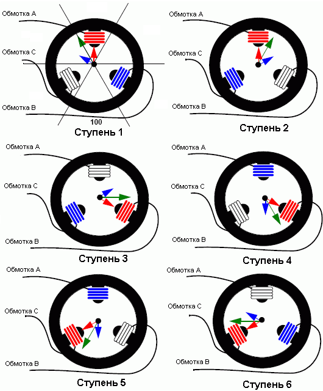

Урок №5 «Бесколлекторные двигатели и регуляторы их хода»
========================================================

Принцип работы бесколлекторного электродвигателя
------------------------------------------------

Бесколлекторные двигатели постоянного тока называют так же вентильными, в зарубежной литературе BLDCM (BrushLes Direct Current Motor) или PMSM (Permanent Magnet Synchronous Motor).

Конструктивно бесколлекторный двигатель состоит из ротора с постоянными магнитами и статора с обмотками, в отличие от коллекторного двигателя, где обмотки находятся на роторе. Из конструкции двигателя удаляется довольно сложный, требующий обслуживания тяжелый и искрящий узел – коллектор. Конструкция двигателя существенно упрощается. Двигатель получается легче и компактнее. Значительно уменьшаются потери на коммутацию, поскольку контакты коллектора и щетки заменяются электронными ключами. В итоге получаем электродвигатель с наилучшими показателями КПД и показателем мощности на килограмм собственного веса, с наиболее широким диапазоном изменения скорости вращения. На практике бесколлекторные двигатели греются меньше, чем их коллекторные братья. Переносят большую нагрузку по моменту. Применение мощных неодимовых магнитов сделали бесколлекторные двигатели еще более компактными. Конструкция бесколлекторного двигателя позволяет эксплуатировать его в воде и агрессивных средах (разумеется, только двигатель, регулятор мочить будет очень дорого). Бесколлекторные двигатели практически не создают радиопомех.

Единственным недостатком считают сложный дорогостоящий электронный блок управления (регулятор или ESC). Однако, если вы хотите управлять оборотами двигателя, без электроники никак не обойтись. Если вам не надо управлять оборотами бесколлекторного двигателя, без электронного блока управления все равно не обойтись. Бесколлекторный двигатель без электроники – просто железка. Нет возможности подать на него напряжение и добиться нормального вращения как у других двигателей.

Применение датчиков
-------------------

Двигатели с датчиками положения более предпочтительны с технической точки зрения. Алгоритм управления такими двигателями значительно проще. Однако есть и свои минусы: требуется обеспечить питание датчиков и прокладку проводов от датчиков в двигателе к управляющей электронике; в случае выхода со строя одного из датчиков, двигатель прекращает работу, а замена датчиков, как правило, требует разборки двигателя.

В тех случаях, когда конструктивно невозможно разместить датчики в корпусе двигателя, используют двигатели без датчиков. Конструктивно такие двигатели практически не отличаются от двигателей с датчиками. А вот электронный блок должен уметь управлять двигателем без датчиков. При этом блок управления должен соответствовать характеристикам конкретной модели двигателя.
Если двигатель должен стартовать с существенной нагрузкой на валу двигателя (электротранспорт, подъёмные механизмы и т.п.) – применяют двигатели с датчиками.

Если двигатель стартует без нагрузки на валу (вентиляция, воздушный винт, применяется центробежная муфта сцепления и т.п.), можно применять двигатели без датчиков. Запомните: двигатель без датчиков положения должен стартовать без нагрузки на валу. Если это условие не соблюдается, следует использовать двигатель с датчиками. Кроме того, в момент старта двигателя без датчиков возможны вращательные колебания оси двигателя в разные стороны. Если это критично для Вашей системы, применяйте двигатель с датчиками.

Три фазы
--------

Трехфазные бесколлекторные двигатели приобрели наибольшее распространение. Но они могут быть и одно, двух, трех и более фазными. Чем больше фаз, тем более плавное вращение магнитного поля, но и сложнее система управления двигателем. 3-х фазная система наиболее оптимальна по соотношению эффективность/сложность, поэтому и получила столь широкое распространение. Далее будет рассматриваться только трехфазная схема, как наиболее распространенная.  Фактически фазы – это обмотки двигателя. Поэтому если сказать “трехобмоточный”, думаю, это тоже будет правильно. Три обмотки соединяются по схеме “звезда” или “треугольник”. Трехфазный бесколлекторный двигатель имеет три провода – выводы обмоток.

Двигатели с датчиками имеют дополнительных 5 проводов (2-питание датчиков положения, и 3 сигналы от датчиков).

В трехфазной системе в каждый момент времени напряжение подается на две из трех обмоток. Таким образом, есть 6 вариантов подачи постоянного напряжения на обмотки двигателя, как показано на рисунке ниже.

Это позволяет создать вращающееся магнитное поле, которое будет проворачиваться “шагами” на 60 градусов при каждом переключении.

### Основные характеристики контроллеров

Для управления двигателем применяется электронный регулятор. В зарубежной литературе Speed Controller или ESC (Electronic speed control).

**Максимальный постоянный (сontinius) ток** – указывает, какой ток контроллер способен держать продолжительное время. Как правило, этот параметр входит в обозначение контроллера (например Jes -18, Phoenix -10). Иногда указывают величину "кратковременного" тока, допустимого в течении нескольких секунд.
"Кратковременный" ток способны держать выходные транзисторы контроллера, но рассеивать выделяемое при этом токе количество тепла контроллер не в состоянии.

**Максимальное рабочее напряжение** - указывается, с каким количеством NiCd или литий-полимерных банок можно использовать контроллер. Для контроллеров с ВЕС-ом, эта величина может быть разная, в зависимости от количества сервомашинок. Это связано с рассеиванием тепла стабилизатором схемы ВЕС - при большем числе банок максимальный ток нагрузки BEC и, следовательно, количество сервомашинок меньше. Как правило, если используется ВЕС, количество банок не превышает 12. Если вы хотите работать с большим количеством банок, то придется ставить или отдельную батарею питания приемника, или использовать внешний ВЕС. Но в любом случае нельзя превышать максимальное напряжение, допустимое для контроллера.

**Максимальные обороты (maximum rpm)** - программное ограничение максимальных оборотов. Всегда указывается для двухполюсного двигателя. Для многополюсных моторов это число надо разделить на количество пар полюсов. Например, если указано 63000 rpm, то для мотора с 12-ю магнитами максимальные обороты будут 63000/6=10500 rpm, а это уже не так много... Данная функция не дает мотору набрать большее, чем указано количество оборотов, некоторые контроллеры при превышении этого значения на холостом ходу начинают сбоить, вызывая значительные броски тока - мотор начинает резко дергаться. Этот эффект не является признаком неисправности мотора ли контроллера.

Внутреннее сопротивление – полное сопротивление силовых ключей контроллера, без учета проводов. Чем мощнее контроллер, тем меньше его внутреннее сопротивление. Как правило, сопротивление проводов сравнимо с внутренним сопротивлением контроллера и вносит до 30% потерь. Для примера, внутреннее сопротивление контроллера Castle Creations Phoenix-25 13 mOhm, а сопротивление 30 см провода сечением 1кв.мм – 6 mOhm, то есть почти треть потерь приходится на провода.

**Частота импульсов контроллера (PWM Frequency)** - как правило, составляет 7-8 Кгц. У "продвинутых" контроллеров частоту регулирования можно программировать на другие значения- 16 и 32 Кгц. Эти значения применяется в основном для высокооборотных 3-4-х витковых моторов с малой индуктивностью, при этом улучшается линейность регулирования частоты вращения.

Особенности подключения
-----------------------

Провода - не такое простое дело, как может показаться на первый взгляд. Есть несколько важных аспектов.

Самое главное - нельзя делать провода от контроллера до аккумулятора большой длины! Дело в том, что стартовые токи беколлекторных моторов намного больше, чем аналогичных коллекторных, и при работе моторов возникают большие броски тока. Конденсаторы, всегда стоящие на входе контроллера, должны быть специального типа, но многие производители ставят обычные.

При удлинении проводов от контроллера до батареи начинает сказываться их индуктивность, и может возникнуть ситуация, когда уровень помех по напряжению питания на входе контроллера станет настолько высок, что контроллер не сможет правильно определить положение ротора мотора (иногда при этом еще и "повисает" процессор контроллера). Известно несколько случаев полного "выгорания в дым" контроллеров, при удлинении проводов со стороны аккумулятора до 30см. Если необходимо увеличить длину проводов (например, двигатель стоит в хвосте модели), то надо увеличивать длину проводов от мотора до контроллера. Как правило, контроллеры поставляются с проводами до батареи длиной 13-16см. Такая длина вполне достаточна для надежной работы контроллера, и не следует ее увеличивать более чем на 5см.

Кроме того, длинные провода до батареи могут вызывать проблемы при резком старте мотора - контроллер может не перейти от режима старта к рабочему режиму при слишком резком прибавлении “газа”. Для предотвращения этого эффекта во многих контроллерах есть специальные настройки.

Настройки
---------

Практически все современные контроллеры имеют множество программных настроек. От них зависит режим работы, надежность, а иногда и работоспособность контроллера в паре с тем или иным мотором. Здесь мы попробуем перечислить основные настройки, и объяснить, как и на что они влияют.

**Напряжение выключения мотора (cut-off voltage)** – при каком минимальном напряжении на батарее мотор будет выключен. Эта функция предназначена для сохранения работоспособности аппаратуры при разряде батареи и для защиты самой батареи от переразряда (последнее особенно важно для литий- полимерных аккумуляторов). На некоторых контроллерах (например, Jeti серии “ Advansed ”) нет установки напряжения на конкретное число банок в случае использования литиевых батарей, количество банок при этом определяется автоматически.

**Тип выключения мотора (cut-off voltage)** – как правило имеет 2 значения - плавный (soft cut-off) и жесткий (hard cut-off).
При плавном выключении мотора контроллер сбрасывает обороты постепенно, не позволяя напряжению на батарее упасть ниже заданного, при этом контроль над моделью сохраняется до последнего.
При жестком - мотор немедленно останавливается если зафиксированно падение напряжения ниже заданного. Жесткое отключение может доставить некоторые неудобства при разряженном аккумуляторе: манипулируя газом, вместо небольшой прибавки оборотов иногда получается полный останов мотора.

**Тормоз (brake)** – торможение мотора после установки газа в "ноль". Может иметь значения включен/выключен, на некоторых контроллерах есть еще программируемая величина тормоза 50-100% и задержка включения тормоза после полного сброса газа. Это необходимо для защиты шестеренок редуктора в случае использования больших и тяжелых пропеллеров. В некоторых контроллерах, например том же Jeti серии "Advanced" тормоз и плавное выключения мотора – установки взаимоисключающие – для включения плавного отключения мотора надо выключить тормоз и наоборот... Намудрили чехи, однако.

**Опережение (Timing)** – параметр, от которого зависит мощность и КПД двигателя. Может находится в пределах от 0° до 30°. Физически это электрический угол опережения коммутации обмоток.

**Режим старта (start mode)** - не имеет как правило каких-то числовых значений, описывается только как мягкий, (soft) жесткий (hard), быстрый (fast) и пр. Быстрый старт рекомендуется для моторов без редукторов и для использования в соревнованиях. При использовании быстрого старта в моторах с редукторами возможно повреждение шестерен. Плавный старт обеспечивает меньшие пусковые токи в момент старта и позволяет избежать возможных перегрузок по току контроллера, но время раскрутки мотора до полных оборотов увеличивается.

**Время акселерации или задержка акселерации (acceleration time или acceleration delay)** – устанавливает время набора оборотов после старта до максимума. Устанавливается меньше для моторов с легкими пропеллерами без редукторов и больше для моторов с редукторами и в случае срабатывания защиты по току при резком прибавлении газа.

**Ограничение тока (Current limiting)** – уровень срабатывания защиты по току. Устанавливается более чувствительным в случае применения моторов с большим стартовым током и батарей с высоким внутренним сопротивлением. При этом желательно установить плавное отключение мотора, в противном случае при резких манипуляциях газом мотор будет останавливаться. Не рекомендуется отключать защиту по току, если вы не уверены ,что ток мотора не может превысить максимально допустимое значение для контроллера. Это может привести к повреждению контроллера большими стартовыми токами.

**Режим газа (throttle type или throttle mode)** – устанавливает зависимость оборотов мотора от ручки газа. Может иметь значения автокалибровки ( auto calibrating ) – при этом контроллер самостоятельно определяет положение малого и полного газа, а также фиксированный ( fixed ) - когда характеристика задана производителем.

Также в некоторых контроллерах присутствует режим "гувернер" (governor), он предназначен для вертолетов, когда положению ручки газа соответствуют определенные обороты, а не мощность двигателя, контроллер в данном режиме работает как автоматическая система поддержания оборотов, прибавляя мощность при увеличении нагрузки на двигатель.

**Реверс (reverse)** - смена направления вращения. Обычно для изменения направления вращения двигателя надо поменять местами любые два провода от мотора. Но в продвинутых контроллерах, возможно изменить направление вращения мотора программно.

Возможные проблемы
------------------

Как показывает практика - 70% проблем при использовании контроллеров связано со стартом двигателей. Если мотор у вас плохо стартует, то есть начинает вращаться, а потом останавливается - большинство причин кроется в больших бросках тока и как следствие, провалах питающего напряжения. В первую очередь проверьте провода до батареи. Пробную проверку лучше производить на той длине проводов, которые даны изготовителем, или короче.

Далее - попробуйте снять нагрузку с мотора и проверить его на холостом ходу. Если на хостом ходу все в порядке, а при установке пропеллера мотор упорно не желает крутится, только дергается в одном направлении, попробуйте поставить мягкий старт или увеличить время акселерации. Также здесь поможет установка плавного выключения мотора. Контроллеры, у которых есть ограничение тока, всегда имеют индикацию этого режима - опять же читайте инструкцию, чтобы установить, произошло срабатывание токовой защиты или нет...

Старые "золотые" Jeti серия Jes 18, отличаются, например одной особенностью - у них нет плавного выключения, и при попытке работы мотора с большими пусковыми токами от старых аккумуляторов, при резком движении ручкой газа мотор останавливается, если напряжение упало до 5.2 вольта. Это не неисправность контроллеров, это у них такой алгоритм выключения мотора: напряжение упало - мотор остановился...

Иногда бывает, что мотор стартует в другую сторону, набирает примерно 20-30% оборотов, потом "одумывается", и резко начинает крутится в нужном направлении. Останов и реверс сопровождаются резким броском тока, иногда срабатывает токовая защита. Данная ситуация происходит только с 2-3х витковыми двухполюсными спортивными моторами при наличии резкого старта. Причем мотор ведет так себя не всегда, примерно в 10% случаев. Выход из этой ситуации - опять же использование плавного старта.

### Контрольные вопросы

1) Зачем нужны датчики в бесколлекторных электродвигателях?
2) На что влияет количество фаз в бесколлекторном электродвигателе?
3) Перечислите основные характеристики контроллеров.
4) Какие ошибки при подключении контроллеров возможно допустить?
5) К каким последствиям могут привести эти ошибки?
6) Перечислите возможные настройки контроллера.
