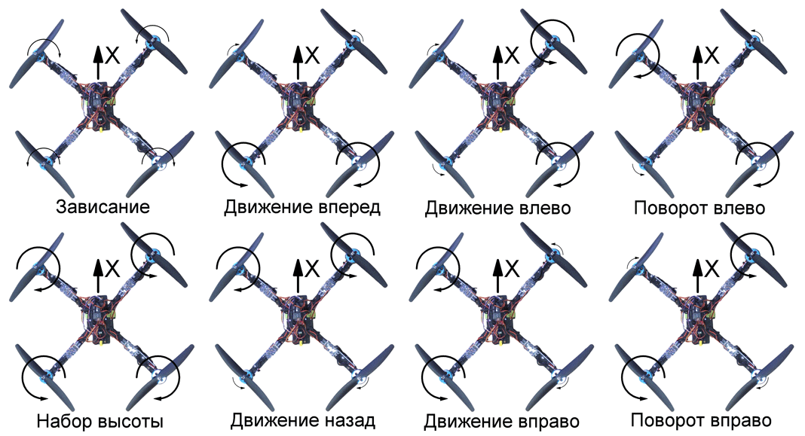
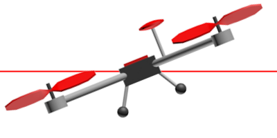

Урок №8 «Управление полётом мультикоптера. Принцип функционирования полётного контроллера. ПИД регуляторы»
===========================================================================================================

Управление полётом мультикоптера
--------------------------------

Отличие мультикоптера от других подобных роботов (ездящих, плавающих), заключается в том, что пилот не управляет напрямую мощностью мотора. С помощью джойстика, он передает сигнал полётному контроллеру, который делает расчеты и передает необходимую мощность на моторы.



Рис. Скорость вращения моторов, в зависимости от команды пилота.

Пилот управляет не скоростью вращения каждого пропеллера, а газом и углами наклона квадрокоптера через полётный контроллер. Пилот задает направление, в котором желал бы двигаться, а полётный контроллер делает остальную работу.

Принцип функционирования полётного контроллера
----------------------------------------------

Полётный контроллер - устройство, обеспечивающее полёт квадрокоптера, за счет управления газом,  углами крена, тангажа и рысканья (throttle, pitch, roll, yaw). Это своеобразные "мозги" мультикоптера. Обычно он содержит несколько датчиков (гироскопы, акселерометр, магнитометр, GPS датчик) и микроконтроллер, который производит расчеты. Именно полётный контроллер отвечает за то, чтобы при среднем положении всех стиков джойстика квадрокоптер стабилизировался,  висел в воздухе не отклоняясь ни в одну из сторон.


Полётный контроллер несколько десятков раз в секунду выполняет цикл управления в который входит: считывание показаний датчиков, считывание каналов управления, обработка информации и выдача управляющих сигналов моторам, чтобы выполнять команды пилота.

Полётный контроллер выполняет следующие задачи:

* Собирает информацию с датчиков (встроенные, либо внешние: гироскопы, акселерометры, GPS, магнитометр);
* Рассчитывает свое положение в пространстве, по показаниям датчиков;
* Собирает информацию о внешних воздействиях, таких как отклонения стиков пилотом,  алгоритм программы;
* Вносит корректировку с помощью коэффициентов ПИД (Пропорционально-Интегрально-Дифференциальные);
* Отправляет управляющие сигналы на регуляторы оборотов (ESC).

Полётный контроллер выдает ШИМ-импульсы (PWM) на регуляторы оборотов (ESC), в зависимости от команды стика джойстика, либо программы. Например, чтобы дать команду мотору вращаться с максимальной скоростью контроллер должен отправлять импульсы длительностью 2 миллисекунды, перемежающиеся логическим нулем длительностью 10 — 20 миллисекунд. Длительности импульса в 1 миллисекунду соответствует остановка мотора, 1.1 мс — 10% от максимальной скорости, 1.2 мс — 20% и т.п. Длительность нуля не играет никакой роли, важна только длительность самого импульса.


Но все не так просто, полетные контроллеры бывают разные с разными настройками, регуляторы бывают разные, минимум (1 мс) и максимум (2 мс) — не универсальны. В зависимости от множества факторов диапазон 1-2 мс может на деле оказаться 1.1 — 1.9 мс, либо другим. Чтобы регулятор и контроллер говорили абсолютно на одном языке существует процедура калибровки регуляторов.

ПИД-регуляторы
--------------

При работе с мультикоптерами, вам придется столкнуться с настройкой ПИД-регулятора, этот математический аппарат применяется почти во всех задачах стабилизации: стабилизация углов квадрокоптера в воздухе, полет и удержание позиции по GPS, удержание высоты по альтиметру.

Вы собираете мультикоптер, калибруете датчики, регуляторы, радио, все проверяете, пытаетесь взлететь, а его переворачивает даже легким ветерком. Или наоборот: он такой резкий, что внезапно срывается с места и крутит тройное сальто без разрешения. Причина все та же: параметры ПИД-регуляторов.

Для многих устройств, использующих ПИД-регуляторы, существуют инструкции по настройке. Но чтобы легче ориентироваться в этом многообразии полезно понимать, как же внутри устроены эти регуляторы. Предлагаю вместе со мной самим заново «изобрести» и «на пальцах» понять формулу ПИД-регулятора. Будем рассматривать квадрокоптер в двумерном пространстве, где у него есть только один угол — угол крена, и два мотора: левый и правый.


В полетный контроллер непрерывно поступают команды с земли: «крен 30 градусов», «крен -10 градусов», «крен 0 градусов (держать горизонт)»; его задача — как можно быстрее и точнее их выполнять с помощью моторов с учетом: ветра, неравномерного распределения веса квадрокоптера, неравномерного износа моторов, инерции квадрокоптера и т.п. Таким образом, полетный контроллер должен непрерывно решать задачу, какую скорость вращения подавать на каждый мотор с учетом текущего значения угла крена и требуемого

Уровень газа поступает из приемника в контроллер. Обозначим его ***throttle***. Если ***left*** и ***right*** — скорости вращения левого и правого моторов, то:

***left = throttle + force,
right = throttle - force,***

где ***force*** — реакция квадрокоптера (усилие), которое создает момент вращения за счет того, что левый мотор вращается на ***force*** быстрее, чем газ, а правый — на столько же медленнее. ***force*** может принимать и отрицательные значения, тогда правый мотор закрутится быстрее. Если мы научимся вычислять эту величину на каждой итерации цикла обработки, значит мы сможем управлять квадрокоптером. Понятно, что ***force*** как минимум должно зависеть от текущего угла крена (***roll***) и желаемого угла крена (***tar get_roll***), который поступает с пульта управления.

Представим ситуацию: поступает команда «держать горизонт» (***tar get_roll*** = 0), а квадрокоптер имеет крен влево:



Рис. Двухмерный квадрокоптер с креном влево.
***error*** — разность (ошибка) между ***tar get_roll*** и ***roll***, которую контроллер стремится минимизировать.

Чем больше разность между желаемым углом крена и текущим, тем сильнее должна быть реакция, тем быстрее левый мотор должен закрутиться относительно правого. Если это записать с использованием наших обозначений:

***force = P * error***

P — коэффициент пропорциональности. Чем он больше, тем сильнее будет реакция, тем резче квадрокоптер будет реагировать на отклонение от требуемого угла крена. Эта интуитивно понятная и простая формула описывает работу пропорционального регулятора. Чем сильнее квадрокоптер отклонился от требуемого положения, тем сильнее надо пытаться его вернуть. К сожалению, эту формулу придется усложнить. Главная причина — перерегулирование.

За несколько десятков миллисекунд (несколько итераций цикла обработки) под воздействием пропорционального регулятора квадрокоптер вернется в требуемое (в данном случае горизонтальное) положение. Все это время ошибка ***error*** и усилие ***force*** будут иметь один и тот же знак, хоть и становиться все меньше по модулю. Набрав какую-то скорость поворота (угловую скорость) квадрокоптер просто перевалится на другой бок, ведь никто его не остановит в требуемом положении. Все равно что пружина, которая всегда стремится вернуться в начальное положение, но если ее оттянуть и отпустить — будет колебаться, пока трение не возьмет верх.

По этой причине в пропорциональный регулятор нужно добавить еще одно слагаемое, которое будет тормозить вращение квадрокоптера и препятствовать перерегулированию (переваливанию в противоположную сторону) —имитация трения в вязкой среде: чем быстрее поворачивается квадрокоптер, тем сильнее надо пытаться его остановить, конечно, в разумных пределах. Скорость вращения (скорость изменения ошибки ) обозначим как ***spin***, тогда:

```
force = P * error + D * spin
```

D — настраиваемый коэффициент: чем он больше, тем сильнее останавливающее усилие.

Скорость изменения любой величины — производная этой величины по времени:


И вот пропорциональный регулятор превращается в пропорционально-дифференциальный (пропорциональное слагаемое и дифференциальное):


Ошибку ***error*** вычислить легко, ведь на каждой итерации мы знаем ***roll*** и ***tar get_roll***; P и D — настраиваемые перед запуском параметры. Для вычисления производной (скорости изменения ***error***) необходимо хранить предыдущее значение ***error***, знать текущее значение ***error*** и знать время, которое прошло между измерениями (период регулирования). И вот она — физика шестого класса школы (скорость = расстояние / время):


***dt*** — период регулирования; ***error previous***  — значение ошибки с предыдущей итерации цикла регуляции. Кстати, эта формула — простейший способ численного дифференцирования, и он нам здесь вполне подойдет.

Теперь у нас есть пропорционально-дифференциальный регулятор в плоском «бикоптере», но осталась еще одна проблема. Пусть левый край будет весить чуть больше правого, или, что то же самое, левый мотор работает чуть хуже правого. Квадрокоптер чуть наклонен влево и не поворачивается обратно: дифференциальное слагаемое равно нулю, а пропорциональное слагаемое хоть и принимает положительное значение, но его не хватает, чтобы вернуть квадрокоптер в горизонтальное положение, ведь левый край весит чуть больше правого. Как следствие — квадрокоптер будет все время тянуть влево.

Необходим механизм, который бы отслеживал такие отклонения и исправлял их. Характерной особенностью таких ошибок является то, что они прявляют себя со временем. На помощь приходит интегральное слагаемое. Оно хранит сумму всех ошибкок ***error*** по всем итерациям цикла обработки. Как же это поможет? Если пропорционального слагаемого не достаточно, чтобы исправить маленькую ошибку, но она все равно есть — постепенно, со временем, набирает силы интегральное слагаемое, увеличивая реакцию ***force*** и квадрокоптер принимает требуемый угол крена.

Тут есть нюанс. Предположим ***error*** равна 1 градусу, цикл регулирования — 0.1с. Тогда за одну секунду сумма ошибок примет значение 10 градусов. А если цикл обработки — 0.01с, то сумма наберет аж 100 градусов. Чтобы за одно и тоже время интегральное слагаемое набирало одно и тоже значение при разных периодах регулирования, полученную сумму будем умножать на сам период регулирования. Легко посчитать, что в обоих случаях из примера получается сумма в 1 градус. Вот оно — интегральное слагаемое (пока без настраиваемого коэффициента):


Эта формула — не что иное, как численный интеграл по времени функции ***error*** в интервале от нуля до текущего момента. Именно поэтому слагаемое называется интегральным:


где T — текущий момент времени.

Пришло время записать окончательную формулу пропорционально-интергрально-дифференциального регулятора:


где ***I*** — один из настраиваемых параметров, которых теперь трое: ***P,I,D***.
ПИД регуляторы - важная часть полётного контроллера, без их использования квадрокоптер летал бы непредсказуемо. Они настраиваются индивидуально для каждого квадрокоптера.

### Контрольные вопросы

1) По какому принципу работает полётный контроллер?
2) Перечислите основные задачи полётного контроллера.
3) Сформулируйте принцип работы ПИД-регулятора.
