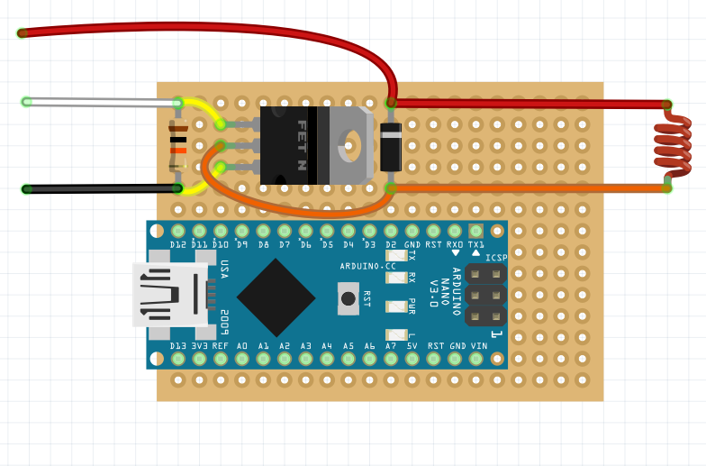
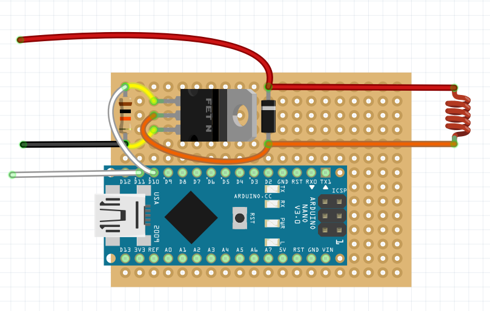

# Сборка и настройка электромагнитного захвата

Магнитный захват можно собрать различными способами в соответствии с электрической схемой.

Ниже представлен пример сборки схемы электромагнитного захвата на макетной плате.

> **Info** Рекомендуется делать проводку между элементами с обратной стороны платы (на дальнейших изображениях проводка сделана поверх схемы, для большей наглядности).

1. На паечной плате разместите диод Шоттки, резистор на 10 кОм и транзистор.

    

2. Припаяйте контакты с другой стороны платы и откусите оставшиеся ножки элементов.
3. Соедините контакты резистора и двух крайних ножек транзистора.

    

4. Соедините центральную ножку транзистора и ножку диода Шоттки (противоположную серой маркировочной полоске).

    

5. Обрежьте необходимое количество провода магнитного захвата и припаяйте его к контактам диода Шоттки.

    

6. Припаяйте провода *Dupont*-папа к ножке транзистора и диода (красный, черный провода), а также провод *Dupont*-мама на противоположную ножку транзистора (белый провод).

    

## Проверка работы электромагнитного захвата

Для того, чтобы проверить работу захвата, подайте на сигнальный провод напряжение 5В. Для этого можно использовать провод *Dupont* папа-папа.

После подачи напряжения магнит должен включиться.

## Подключение к Raspberry Pi

Для программной активации магнитного захвата его можно подключить к Raspberry Pi.

Пример кода, активирующего магнитный захват, можно посмотреть [тут](gpio.md#подключение-электромагнита).

## Подключение к Arduino

Для управления захватом в ручном режиме его можно подключить к плате Arduino Nano.

Удобно ее располагать на той же паечной плате. Для этого вставьте ее в подходящие отверстия и припаяйте с обратной стороны к плате.

Затем подключите сигнальный выход схемы к выбранному порту и припаяйте провод *Dupont*-мама к выбранному сигнальному порту на плате.

## Установка электромагнитного захвата

1. В центральное отверстие на деке захвата установите электромагнит.
2. Стяжкой притяните собранную схему к обратной стороне деки.
3. Сигнальный вывод Arduino *D11* вставьте в один из выводов *AUX* на полетном контроллере.
4. Силовой вывод электромагнитного захвата установите в JST 5В.
