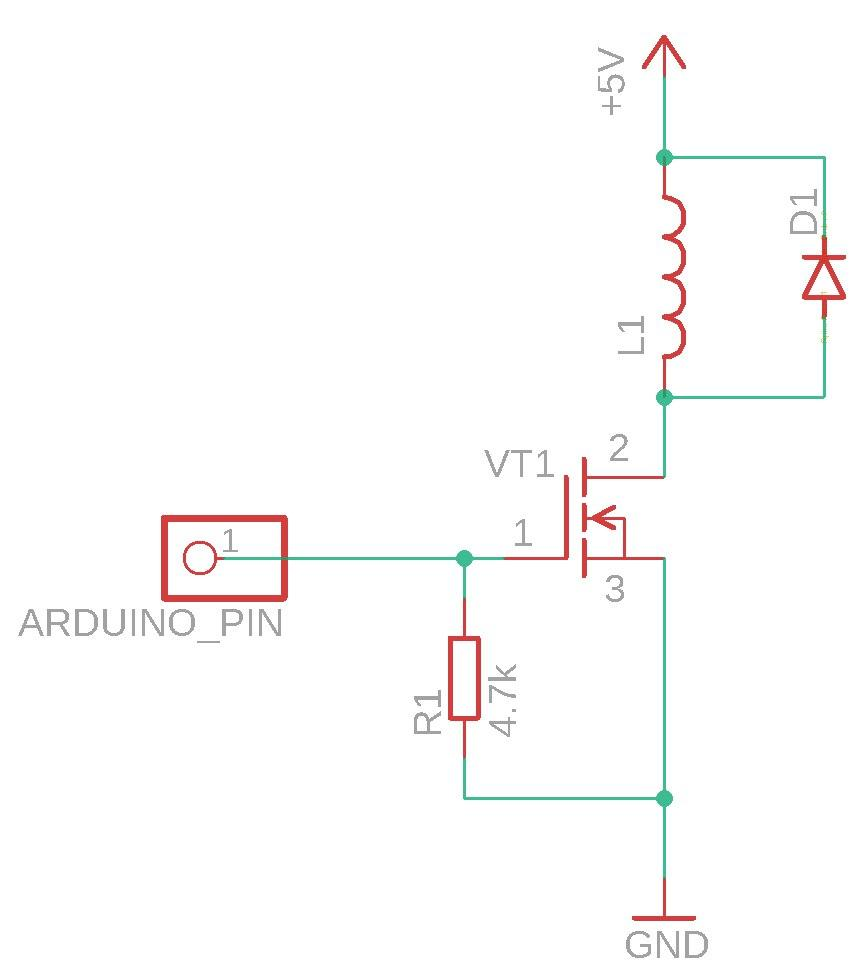
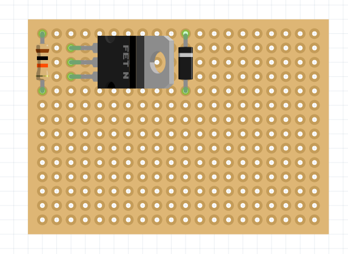
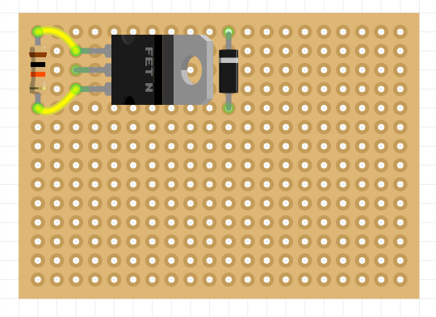
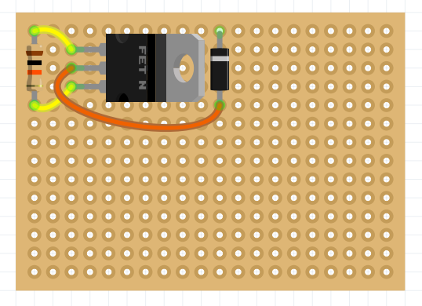
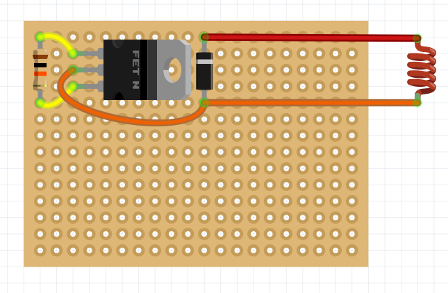
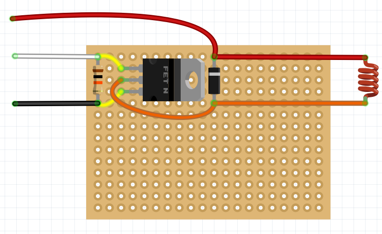
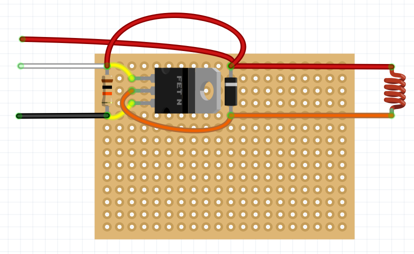
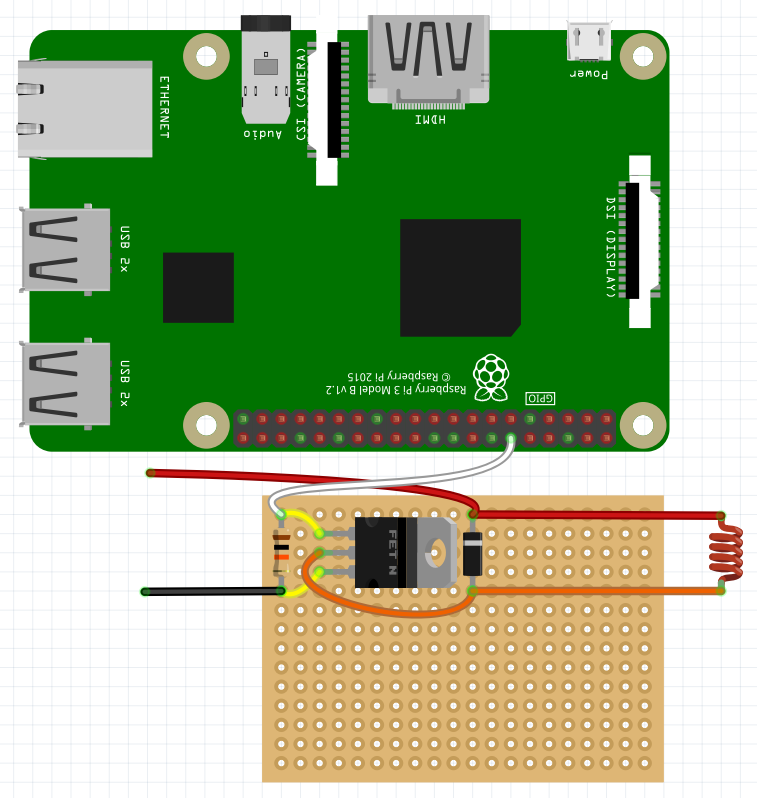

# Сборка и настройка элеткромагнитного захвата

Магнитный захват можно собрать различными способами в соответствии с электрической схемой.

Ниже представлен пример сборки схемы электромагнитного захвата на макетной плате.

> **Info** Рекомендуется делать проводку между элементами с обратной стороны платы (на дальнейших изображениях проводка сделана поверх схемы, для большей наглядности).

1. На паечной плате разместите *диод Шоттки*, *резистор 10кОм* и *транзистор*.

    

2. Припаяйте контакты с другой стороны платы и откусите оставшиеся ножки элементов.

3. Соедините контакты резистра и двух крайних ножек транзистра.

    

4. Соедините центральную ножку транзистра и ножку диода Шоттке (противоположеную серой маркеровочной полоске).

    

5. Обрежте необходимое количество провода магнитного захвата и припаяйте его к контактам диода Шоттке.

    

6. Припаяйте провода *Dupont* папа к ножке транзистра и диода (красный, черный провода), а также провод *Dupont* мама на противоположеную ножку транзистра (белый провод).

    

## Проверка работы электромагнитного захвата

Для того, чтобы проверить работу захвата, подайте на сигнальный провод напряжение 5в. Для этого можно использовать провод *Dupont* папа-папа.

После подачи напряжения магнит должен включиться.

## Подключение к Raspberry Pi

Для программной активации магнитного захвата его можно подключить к *Raspberry Pi*.

Пример кода активирующего магнитный захват, можно посмотреть [тут](gpio.md#подключение-электромагнита).

## Подключение к Arduino

Для управления захватом в ручном режиме его можно подключить к плате *Arduino Nano*.

Удобно ее располагать на той же паечной плате. Для этого вставьте ее в подходящие отверстия и припаяйте с обратной стороны к плате.

Затем подключите сигнальный выход схемы к выбраному порту и припаяйте провод *Dupont* мама к выбраному сигнальному порту.

## Установка электромагнитного захвата

1. В центральное отверстие на деке захвата установите электромагнит.

2. Стяжкой притяните собраную схему к обратной стороне деки.

3. Сигнальный вывод *Arduino* *D11* вставьте в один из выводов *AUX* на полетном контроллере.

4. Силовой вывод электромагнитного захвата установите в *JST* 5В.
