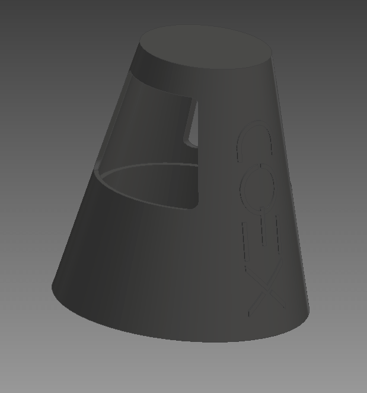

# Груз с подставкой для магнитного захвата

Груз с подставкой для использования в работе с квадрокоптером COEX Клевер 4 WorldSkills Russia.

Грузом для магнитного захвата является некая геометрическая фигура, которая имеет внутренний и внешний конус и имеет форму стакана с вырезами для облегчения.

## Технические характеристики

### Груз в сборе с подставкой и пластиной для зацепа магнитного захвата

Груз в сборе с подставкой и пластиной для зацепа магнитного захвата выглядит следующим образом:

### Подставка под груз для магнитного захвата

Подставка под груз для магнитного захвата имеет разборную конструкцию и состоит из двух частей.

Первая - это низ:

Вторая - это дополнение, чтобы добрать необходимую высоту для точного позиционирования груза на подставке:

В сборе это выглядит так:

### Груз для подставки

Сам груз отдельно от подставки выглядит следующим образом:

Вес при 100% заполнении из материала PETG при печати на 3D принтере составляет 35 грамм.

Высота груза 72.5 миллиметров.

## Фиксация груза на захвате

Для того, чтобы груз держался на магнитном захвате, на его верхнюю часть приклеивается комплектная пластина, и в сборке это выглядит следующим образом:

На дно подставки необходимо приклеить двусторонний скотч для дальнейшей фиксации подставки на используемой в дальнейшем поверхности:

В случае использования нижней части с механическим захватом также необходимо приклеить к её основанию двусторонний скотч, чтобы подставку не сдувало воздушным потоком от пропеллеров. В сборке с теннисным мячиком это выглядит следующим образом:

Ссылки для скачивания файлов для 3D-печати находятся в статье [CAD-модели](models.md).
