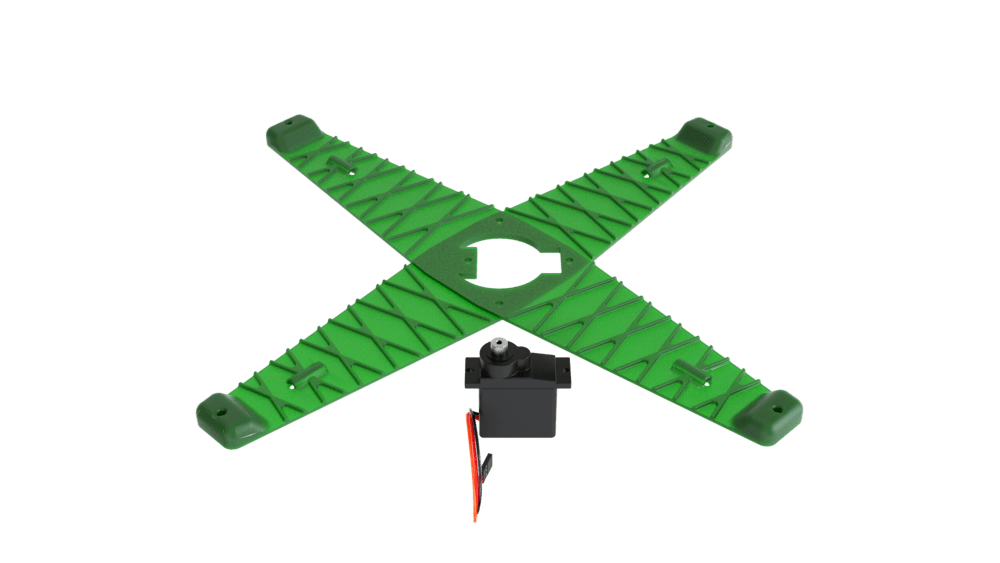
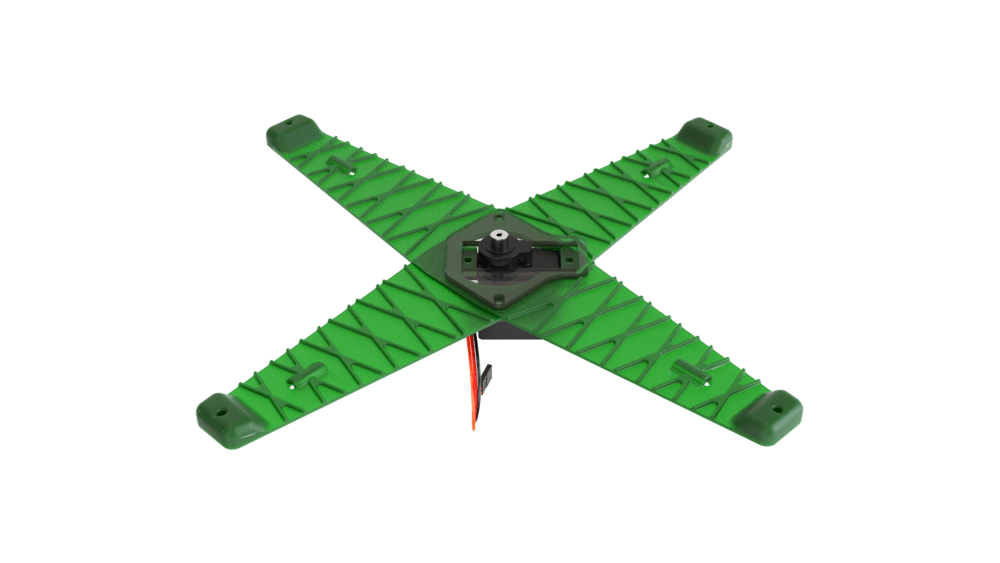
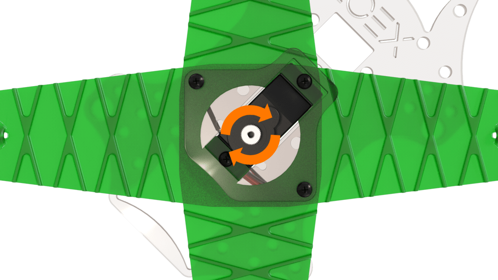
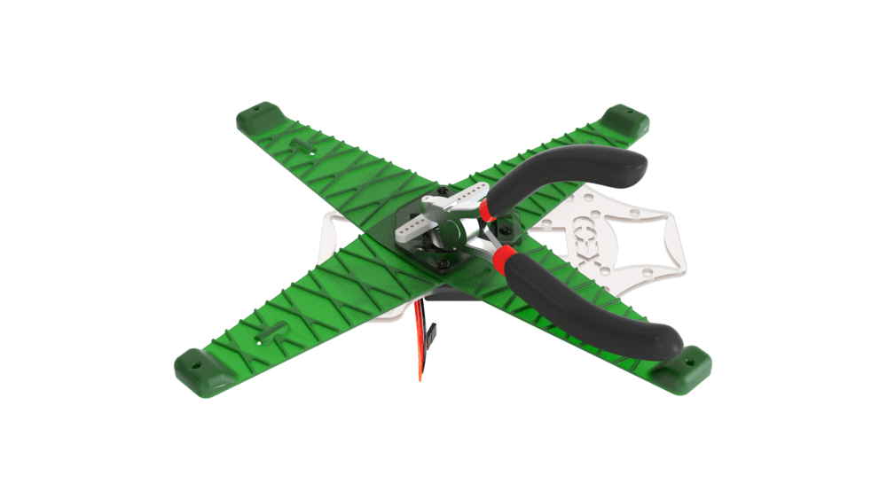
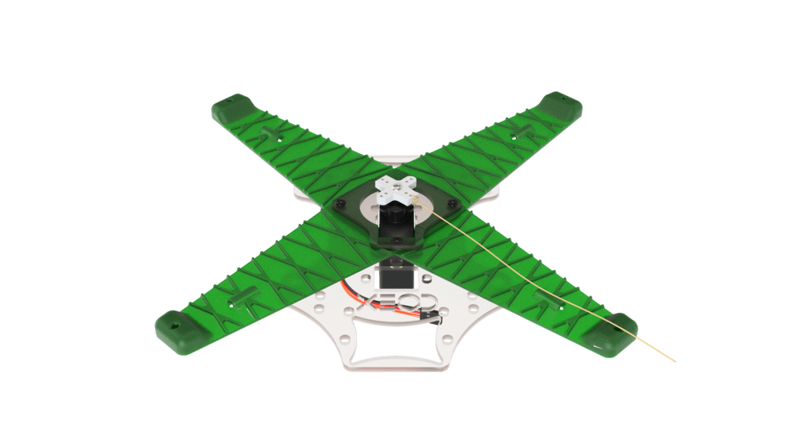
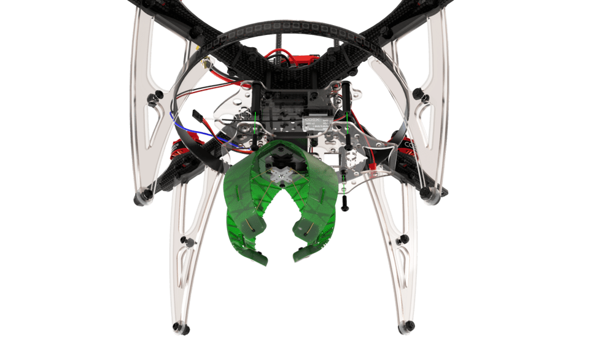
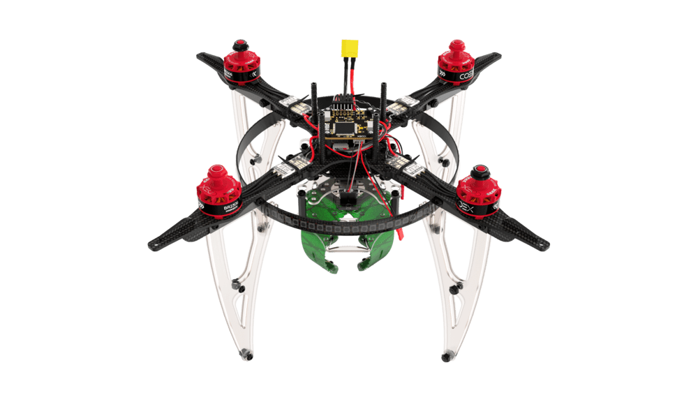

# Сборка и настройка механического захвата

1. Совместите главные пластины захвата.

    

2. Установите сервопривод в соответствующий паз в центре пластин, таким образом, чтобы осевая шестерня находилась посередине захвата.

    

3. Прижмите пластины захвата небольшими проставками.

    

        
        
    

4. Установите деку захвата таким образом, чтобы крепежные отверстия в захвате совпадали с отверстиями для саморезов в пластине.

    

5. Закрепите конструкцию захвата саморезами.

    

6. Поверните шестерню сервопривода в крайнее положение.

    

7. Установите на шестерню крестообразное крепление и закрепите его помощью винта, прилагающегося к сервоприводу.

    

8. Обрежьте крестообразное крепление.

    

        
        
    

9. Завяжите сервоприводную нить таким образом, чтобы оставалось 2-3 см запаса.

    

        
        
    

10. Проденьте сервоприводную нить в соответствующие натягивающие пазы.

    

11. Закрепите клешни захвата маленькими саморезами таким образом, чтобы их угол составлял 25°–40°.

    

12. Установите собранный захват на коптер снизу.

    

        
        
    

13. Протяните кабель сервопривода и вставьте его в выход *AUX* 1-2 на полетном контроллере.

    

14. Для того, чтобы настроить управление захватом с пульта, зайдите во вкладку *Radio*.
15. В параметре *AUX 1/2 Passthrough RC channel* укажите необходимый вам канал.
16. Теперь при переключении тумблера соответствующего канала захват будет закрываться или открываться.
