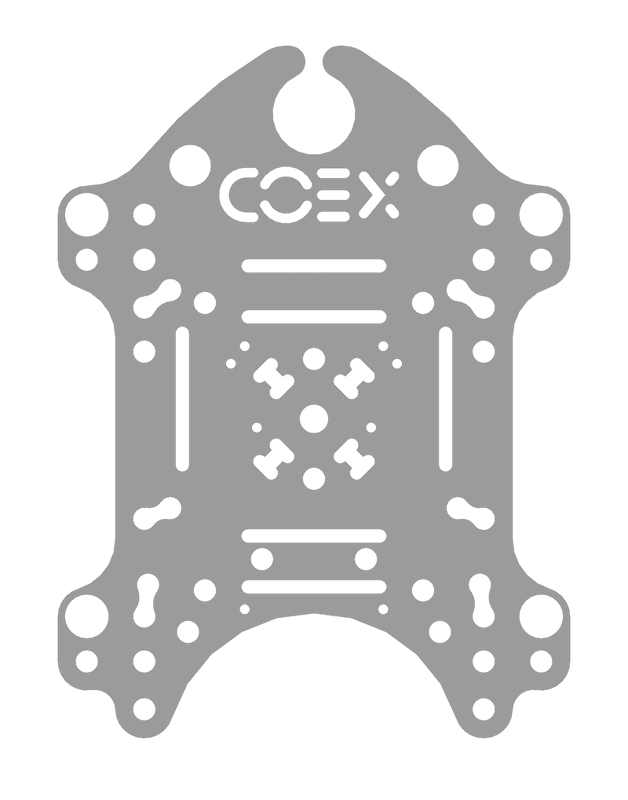
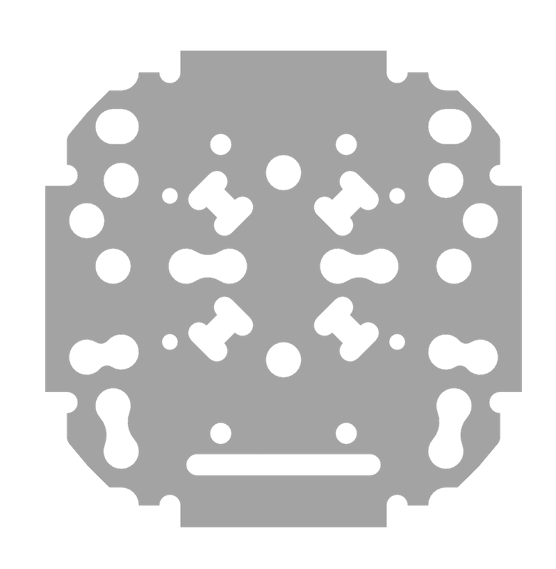
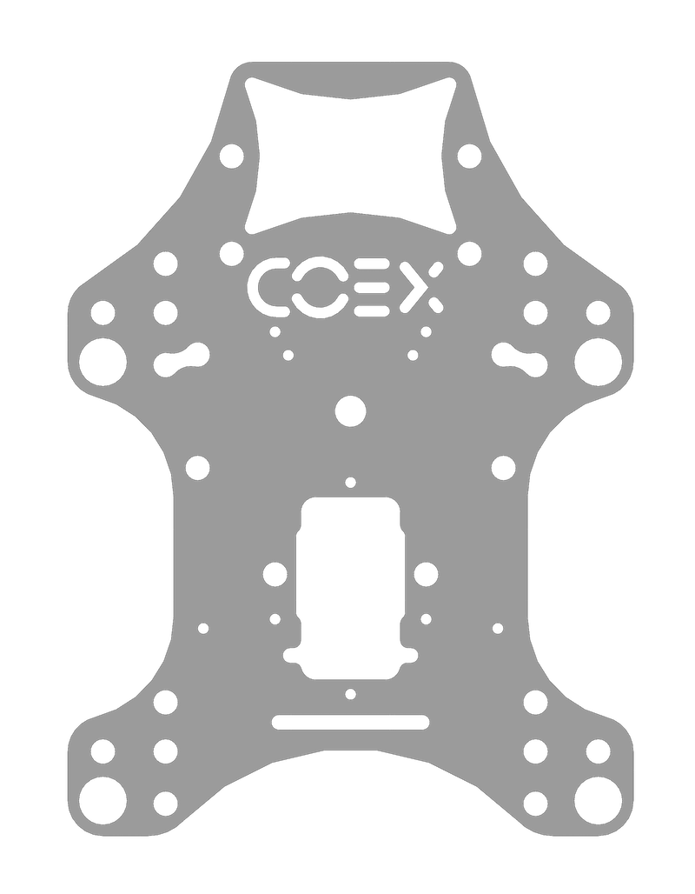
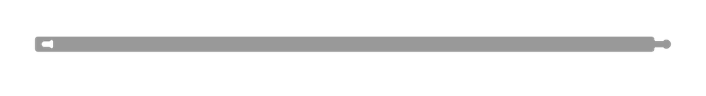
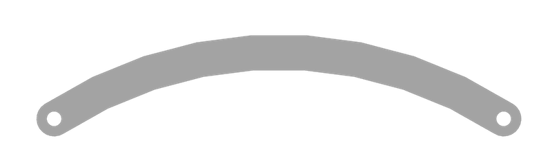
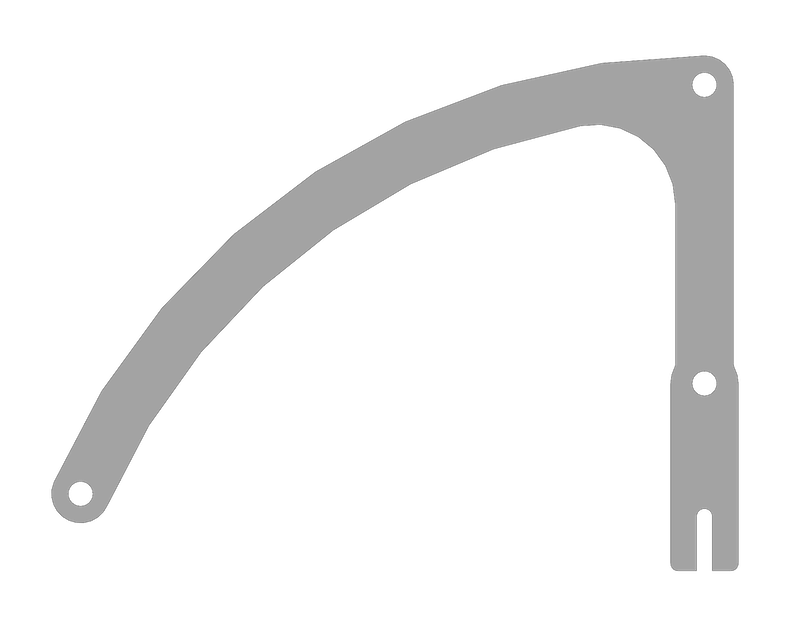
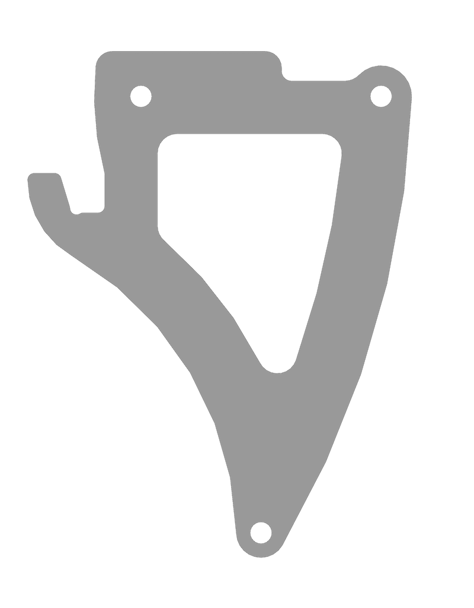
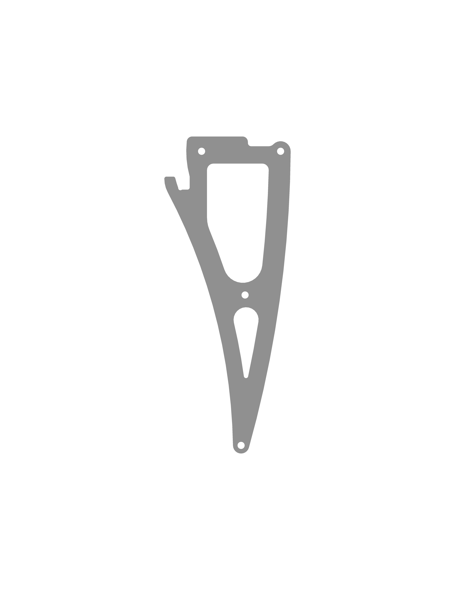
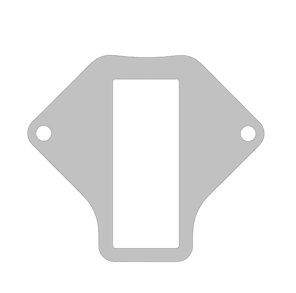

# CAD-модели

На этой странице представлены CAD-модели некоторых деталей квадрокоптеров Клевер.

## Клевер 4.2

### Фрезеровка

<table>
    <tr><th width=150>Изображение</th><th>Деталь</th><th width=1>Файлы</th></tr>
    <tr>
        <td></td>
        <td>
            <b>Дека монтажная</b>. 
            Функция: Дека для установки АКБ и Raspberry Pi. 
            Материал: Монолитный поликарбонат 2мм. 
            Количество: 1 шт.
        </td>
        <td>
            <a href="https://github.com/CopterExpress/hardware/raw/master/COEX%20Clover/4.2/PC/Deck%20Mount/Deck%20Mount.dxf"><code>Deck&nbsp;Mount.dxf</code></a> 
            <a href="https://github.com/CopterExpress/hardware/raw/master/COEX%20Clover/4.2/PC/Deck%20Mount/Deck%20Mount.ipt"><code>Deck&nbsp;Mount.ipt</code></a> 
            <a href="https://github.com/CopterExpress/hardware/raw/master/COEX%20Clover/4.2/PC/Deck%20Mount/Deck%20Mount.stp"><code>Deck&nbsp;Mount.stp</code></a>
        </td>
    </tr>
    <tr>
        <td></td>
        <td>
            <b>Дека монтажная малая</b>. 
            Функция: Дека для установки FPV камеры и крепления пластин жесткости. 
            Материал: Монолитный поликарбонат 2мм. 
            Количество: 1 шт.
        </td>
        <td>
            <a href="https://github.com/CopterExpress/hardware/raw/master/COEX%20Clover/4.2/PC/Deck%20Mount%20Small/Deck%20Mount%20Small.dxf"><code>Deck&nbsp;Mount&nbsp;Small.dxf</code></a> 
            <a href="https://github.com/CopterExpress/hardware/raw/master/COEX%20Clover/4.2/PC/Deck%20Mount%20Small/Deck%20Mount%20Small.ipt"><code>Deck&nbsp;Mount&nbsp;Small.ipt</code></a> 
            <a href="https://github.com/CopterExpress/hardware/raw/master/COEX%20Clover/4.2/PC/Deck%20Mount%20Small/Deck%20Mount%20Small.stp"><code>Deck&nbsp;Mount&nbsp;Small.stp</code></a>
        </td>
    </tr>
    <tr>
        <td></td>
        <td>
            <b>Дека захвата</b>. 
            Функция: Дека для установки захватов и внешней периферии (камера, дальномер). 
            Материал: Монолитный поликарбонат 2мм. 
            Количество: 1 шт.
        </td>
        <td>
            <a href="https://github.com/CopterExpress/hardware/raw/master/COEX%20Clover/4.2/PC/Grab%20Deck/Grab%20Deck.dxf"><code>Grab&nbsp;Deck.dxf</code></a> 
            <a href="https://github.com/CopterExpress/hardware/raw/master/COEX%20Clover/4.2/PC/Grab%20Deck/Grab%20Deck.ipt"><code>Grab&nbsp;Deck.ipt</code></a> 
            <a href="https://github.com/CopterExpress/hardware/raw/master/COEX%20Clover/4.2/PC/Grab%20Deck/Grab%20Deck.stp"><code>Grab&nbsp;Deck.stp</code></a>
        </td>
    </tr>
    <tr>
        <td></td>
        <td>
            <b>Пластина для LED</b>. 
            Функция: Крепление светодиодной ленты. 
            Материал: Монолитный поликарбонат 2мм. 
            Количество: 1 шт.
        </td>
        <td>
            <a href="https://github.com/CopterExpress/hardware/raw/master/COEX%20Clover/4.2/PC/LED%20mount%20plate/LED%20mount%20plate.dxf"><code>LED&nbsp;mount&nbsp;plate.dxf</code></a> 
            <a href="https://github.com/CopterExpress/hardware/raw/master/COEX%20Clover/4.2/PC/LED%20mount%20plate/LED%20mount%20plate.ipt"><code>LED&nbsp;mount&nbsp;plate.ipt</code></a> 
            <a href="https://github.com/CopterExpress/hardware/raw/master/COEX%20Clover/4.2/PC/LED%20mount%20plate/LED%20mount%20plate.stp"><code>LED&nbsp;mount&nbsp;plate.stp</code></a>
        </td>
    </tr>
    <tr>
        <td></td>
        <td>
            <b>Дуга</b>. 
            Функция: Предотвращение повреждения пропеллеров. 
            Материал: Монолитный поликарбонат 2мм. 
            Количество: 4 шт.
        </td>
        <td>
            <a href="https://github.com/CopterExpress/hardware/raw/master/COEX%20Clover/4.2/PC/Prop%20Guard/Prop%20Guard.dxf"><code>Prop&nbsp;Guard.dxf</code></a> 
            <a href="https://github.com/CopterExpress/hardware/raw/master/COEX%20Clover/4.2/PC/Prop%20Guard/Prop%20Guard.ipt"><code>Prop&nbsp;Guard.ipt</code></a> 
            <a href="https://github.com/CopterExpress/hardware/raw/master/COEX%20Clover/4.2/PC/Prop%20Guard/Prop%20Guard.stp"><code>Prop&nbsp;Guard.stp</code></a>
        </td>
    </tr>
    <tr>
        <td></td>
        <td>
            <b>Дуга монтажная</b>. 
            Функция: Дуга для закрепления контура защиты. 
            Материал: Монолитный поликарбонат 2мм. 
            Количество: 2 шт.
        </td>
        <td>
            <a href="https://github.com/CopterExpress/hardware/raw/master/COEX%20Clover/4.2/PC/Prop%20Guard%20Mount/Prop%20Guard%20Mount.dxf"><code>Prop&nbsp;Guard&nbsp;Mount.dxf</code></a> 
            <a href="https://github.com/CopterExpress/hardware/raw/master/COEX%20Clover/4.2/PC/Prop%20Guard%20Mount/Prop%20Guard%20Mount.ipt"><code>Prop&nbsp;Guard&nbsp;Mount.ipt</code></a> 
            <a href="https://github.com/CopterExpress/hardware/raw/master/COEX%20Clover/4.2/PC/Prop%20Guard%20Mount/Prop%20Guard%20Mount.stp"><code>Prop&nbsp;Guard&nbsp;Mount.stp</code></a>
        </td>
    </tr>
    <tr>
        <td></td>
        <td>
            <b>Ножка маленькая</b>. 
            Функция: Стандартный опорный элемент. 
            Материал: Монолитный поликарбонат 2мм. 
            Количество: 2 шт.
        </td>
        <td>
            <a href="https://github.com/CopterExpress/hardware/raw/master/COEX%20Clover/4.2/PC/Small%20Leg/Small%20Leg.dxf"><code>Small&nbsp;Leg.dxf</code></a> 
            <a href="https://github.com/CopterExpress/hardware/raw/master/COEX%20Clover/4.2/PC/Small%20Leg/Small%20Leg.ipt"><code>Small&nbsp;Leg.ipt</code></a> 
            <a href="https://github.com/CopterExpress/hardware/raw/master/COEX%20Clover/4.2/PC/Small%20Leg/Small%20Leg.stp"><code>Small&nbsp;Leg.stp</code></a>
        </td>
    </tr>
    <tr>
        <td></td>
        <td>
            <b>Луч</b>. 
            Функция: крепление моторов. 
            Материал: углепластик композитный (карбон) 2мм. 
            Количество: 4 шт.
        </td>
        <td>
            <a href="https://github.com/CopterExpress/hardware/raw/master/COEX%20Clover/4.2/Carbon/Arm/Arm.dxf"><code>Arm.dxf</code></a> 
            <a href="https://github.com/CopterExpress/hardware/raw/master/COEX%20Clover/4.2/Carbon/Arm/Arm.ipt"><code>Arm.ipt</code></a> 
            <a href="https://github.com/CopterExpress/hardware/raw/master/COEX%20Clover/4.2/Carbon/Arm/Arm.stp"><code>Arm.stp</code></a>
        </td>
    </tr>
    <tr>
        <td></td>
        <td>
            <b>Пластина центральная</b>. 
            Функция: установка электроники. 
            Материал: углепластик композитный (карбон) 2мм. 
            Количество: 1 шт.
        </td>
        <td>
            <a href="https://github.com/CopterExpress/hardware/raw/master/COEX%20Clover/4.2/Carbon/Central%20Plate/Central%20Plate.dxf"><code>Central&nbsp;Plate.dxf</code></a> 
            <a href="https://github.com/CopterExpress/hardware/raw/master/COEX%20Clover/4.2/Carbon/Central%20Plate/Central%20Plate.ipt"><code>Central&nbsp;Plate.ipt</code></a> 
            <a href="https://github.com/CopterExpress/hardware/raw/master/COEX%20Clover/4.2/Carbon/Central%20Plate/Central%20Plate.stp"><code>Central&nbsp;Plate.stp</code></a>
        </td>
    </tr><tr>
        <td></td>
        <td>
            <b>Пластина монтажная малая</b>. 
            Функция: прижатие пластины жесткости. 
            Материал: углепластик композитный (карбон) 2мм. 
            Количество: 1 шт.
        </td>
        <td>
            <a href="https://github.com/CopterExpress/hardware/raw/master/COEX%20Clover/4.2/Carbon/Deck%20Mount%20Small/Deck%20Mount%20Small.dxf"><code>Deck&nbsp;Mount&nbsp;Small.dxf</code></a> 
            <a href="https://github.com/CopterExpress/hardware/raw/master/COEX%20Clover/4.2/Carbon/Deck%20Mount%20Small/Deck%20Mount%20Small.ipt"><code>Deck&nbsp;Mount&nbsp;Small.ipt</code></a> 
            <a href="https://github.com/CopterExpress/hardware/raw/master/COEX%20Clover/4.2/Carbon/Deck%20Mount%20Small/Deck%20Mount%20Small.stp"><code>Deck&nbsp;Mount&nbsp;Small.stp</code></a>
        </td>
    </tr><tr>
        <td></td>
        <td>
            <b>Пластина жесткости</b>. 
            Функция: усиление рамы. 
            Материал: углепластик композитный (карбон) 2мм. 
            Количество: 4 шт.
        </td>
        <td>
            <a href="https://github.com/CopterExpress/hardware/raw/master/COEX%20Clover/4.2/Carbon/Stiffener%20Plate/Stiffener%20Plate.dxf"><code>Stiffener&nbsp;Plate.dxf</code></a> 
            <a href="https://github.com/CopterExpress/hardware/raw/master/COEX%20Clover/4.2/Carbon/Stiffener%20Plate/Stiffener%20Plate.ipt"><code>Stiffener&nbsp;Plate.ipt</code></a> 
            <a href="https://github.com/CopterExpress/hardware/raw/master/COEX%20Clover/4.2/Carbon/Stiffener%20Plate/Stiffener%20Plate.stp"><code>Stiffener&nbsp;Plate.stp</code></a>
        </td>
    </tr>
</table>

## Клевер 4.2 WorldSkills

### Фрезеровка

<table>
    <tr><th width=150>Изображение</th><th>Деталь</th><th width=1>Файлы</th></tr>
    <tr>
        <td></td>
        <td>
            <b>Ножка большая</b>. 
            Функция: Опорный элемент увеличенной высоты. 
            Материал: Монолитный поликарбонат 2мм. 
            Количество: 2 шт.
        </td>
        <td>
            <a href="https://github.com/CopterExpress/hardware/raw/master/COEX%20Clover/4.2/PC/Big%20Leg/Big%20Leg.dxf"><code>Big&nbsp;Leg.dxf</code></a> 
            <a href="https://github.com/CopterExpress/hardware/raw/master/COEX%20Clover/4.2/PC/Big%20Leg/Big%20Leg.ipt"><code>Big&nbsp;Leg.ipt</code></a> 
            <a href="https://github.com/CopterExpress/hardware/raw/master/COEX%20Clover/4.2/PC/Big%20Leg/Big%20Leg.stp"><code>Big&nbsp;Leg.stp</code></a>
        </td>
    </tr>
    <tr>
        <td></td>
        <td>
            <b>Проставка для захвата</b>. 
            Функция: Опорный элемент для механического захвата. 
            Материал: Монолитный поликарбонат 2мм. 
            Количество: 1 шт.
        </td>
        <td>
            <a href="https://github.com/CopterExpress/hardware/raw/master/COEX%20Clover/4.2/PC/Grab%20Spacer/Grab%20Spacer.dxf"><code>Grab&nbsp;Spacer.dxf</code></a> 
            <a href="https://github.com/CopterExpress/hardware/raw/master/COEX%20Clover/4.2/PC/Grab%20Spacer/Grab%20Spacer.ipt"><code>Grab&nbsp;Spacer.ipt</code></a> 
            <a href="https://github.com/CopterExpress/hardware/raw/master/COEX%20Clover/4.2/PC/Grab%20Spacer/Grab%20Spacer.stp"><code>Grab&nbsp;Spacer.stp</code></a>
        </td>
    </tr>
</table>

### 3D печать

#### Груз для магнитного захвата

* Груз для магнитного захвата: [`load_for_magnetic_grip.stl`](https://github.com/CopterExpress/clover/raw/master/docs/assets/grip_load/load_for_magnetic_grip.stl)
* Дополнение-для-подставки-груза: [`add-on_for_load_support.stl`](https://github.com/CopterExpress/clover/raw/master/docs/assets/grip_load/add-on_for_load_support.stl)
* Подставка под теннисный мяч для магнитного захвата: [`tennis_ball_stand_for_magnetic_grip.stl`](https://github.com/CopterExpress/clover/raw/master/docs/assets/grip_load/tennis_ball_stand_for_magnetic_grip.stl).

Материал: PETG. Заполнение 100%. Количество: 1шт.

## Клевер 4

### 3D печать

* **АКБ холдер** – [`battery_holder.stl`](https://github.com/CopterExpress/clover/raw/master/docs/assets/stl/battery_holder.stl)
    Функция: Фиксация АКБ и тестера напряжения.
    Материал: ABS пластик(или аналог). Заполнение не менее 50%.
    Количество: 1шт.

## Дополнительные модели для Клевер 4

Усиленная пластина для монтажа [Jetson Nano](jetson_nano.md) и дополнительного оборудования, автор: [Вячеслав Бузов](https://t.me/buzyakabarbuzyaka).

### Лазерная резка

* **Усиленная пластина - основа** – [`reinforced_plate_base.dxf`](https://github.com/CopterExpress/clover/raw/master/docs/assets/dxf/reinforced_plate_base.dxf)
    Функция: Крепление компьютеров формата Jetson Nano и виброразвязок на раме Клевер 4.
    Материал: Монолитный поликарбонат 2мм.
    Количество: 1шт.
* **Ребро жёсткости усиленной пластины** – [`reinforced_plate_rib.dxf`](https://github.com/CopterExpress/clover/raw/master/docs/assets/dxf/reinforced_plate_rib.dxf)
    Функция: Увеличение жёсткости сборки.
    Материал: Монолитный поликарбонат 2мм.
    Количество: 2шт.
* **Пластина для камеры** – [`reinforced_plate_camera_pad.dxf`](https://github.com/CopterExpress/clover/raw/master/docs/assets/dxf/reinforced_plate_camera_pad.dxf)
    Функция: Крепление камеры при использовании усиленной пластины.
    Материал: Монолитный поликарбонат 2мм.
    Количество: 1шт.

## Клевер 3

### 3D печать

* **Кейс для камеры** – [`camera_case.stl`](https://github.com/CopterExpress/clover/raw/master/docs/assets/stl/camera_case.stl)
    Функция: Кейс для крепления модуля камеры.
    Материал: PLA/ABS(или аналог). Заполнение 30%.
    Количество: 1шт.
    **Крепежная пластина для камеры** – [`camera_mount.stl`](https://github.com/CopterExpress/clover/raw/master/docs/assets/stl/camera_mount.stl).
    Функция: Крепежный модуль, для монтажа кейса.
    Материал: PLA/ABS(или аналог). Заполнение 30%.
    Количество: 1шт.
    **Пластина для камеры** – [`camera_plate.stl`](https://github.com/CopterExpress/clover/raw/master/docs/assets/stl/camera_plate.stl).
    Функция: Пластина для закрепление модуля камеры в кейсе.
    Материал: PLA/ABS(или аналог). Заполнение 30%.
    Количество: 1шт.
* **Малая монтажная дека** – [`mounting_deck_small.stl`](https://github.com/CopterExpress/clover/raw/master/docs/assets/stl/mounting_deck_small.stl).
    Функция: Крепление камеры и полетного контроллера.
    Материал: PLA/ABS(или аналог). Заполнение 60%.
    Количество: 1шт.

### Лазерная резка

* **Ножка** (вариант с захватом) – [`big_leg.dxf`](https://github.com/CopterExpress/clover/raw/master/docs/assets/dxf/big_leg.dxf)
    Функция: Опорный элемент для ситуации установки захвата.
    Материал: Монолитный поликарбонат 2мм.
    Количество: 4шт.
* **Дека монтажная** – [`deck.dxf`](https://github.com/CopterExpress/clover/raw/master/docs/assets/dxf/deck.dxf)
    Функция: Крепление АКБ сопутствующей периферии.
    Материал: Монолитный поликарбонат 2мм.
    Количество: 1шт.
* **Дуга** – [`prop_guard.dxf`](https://github.com/CopterExpress/clover/raw/master/docs/assets/dxf/prop_guard.dxf)
    Функция: Элемент каркаса защиты.
    Материал: Монолитный поликарбонат 2мм.
    Количество: 16шт.
* **Рогатка + ушко** – [`prop_guard_mount.dxf`](https://github.com/CopterExpress/clover/raw/master/docs/assets/dxf/prop_guard_mount.dxf)
    Функция: Крепление защиты пропеллеров к раме.
    Материал: Монолитный поликарбонат 2мм.
    Количество: 4шт.
* **Проставка** – [`grab_spacer.dxf`](https://github.com/CopterExpress/clover/raw/master/docs/assets/dxf/grab_spacer.dxf).
    Функция: Монтаж сервопривода к деке захвата.
    Материал: Монолитный поликарбонат 2мм.
    Количество: 1шт.
* **Ножка** – [`leg.dxf`](https://github.com/CopterExpress/clover/raw/master/docs/assets/dxf/leg.dxf).
    Функция: Опорный элемент.
    Материал: Монолитный поликарбонат 2мм.
    Количество: 4шт.
* **Обруч (LED)** – [`led_mount_plate.dxf`](https://github.com/CopterExpress/clover/raw/master/docs/assets/dxf/led_mount_plate.dxf).
    Функция: Крепление светодиодной ленты.
    Материал: Монолитный поликарбонат 2мм.
    Количество: 4шт.
* **Малая монтажная дека** – [`mounting_deck_small.dxf`](https://github.com/CopterExpress/clover/raw/master/docs/assets/dxf/mounting_deck_small.dxf).
    Функция: Крепление камеры и полетного контроллера.
    Материал: Монолитный поликарбонат 2мм.
    Количество: 1шт.

### Фрезеровка

* **Дека центральная** – [`central_plate.dxf`](https://github.com/CopterExpress/clover/raw/master/docs/assets/dxf/central_plate.dxf).
    Функция: Несущая часть коптера.
    Материал: Стеклотекстолит/карбон 2мм.
    Количество: 1шт.
* **Луч** – [`arm.dxf`](https://github.com/CopterExpress/clover/raw/master/docs/assets/dxf/arm.dxf).
    Функция: Крепление моторов.
    Материал: Стеклотекстолит/карбон 2мм.
    Количество: 4шт.
