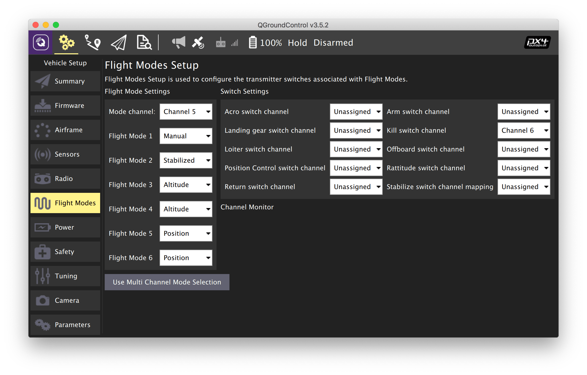

# Полетные режимы

**Режим** полетного контроллера PX4 определяет, как именно коптер (или другое ТС) должно себя вести: каким образом интерпретировать входящие команды и сигналы с пульта. Режим переключается одним из переключателей на пульте радиоуправления.

Чтобы настроить полетные режимы:

1. Зайдите во вкладку *Vehicle Setup*.
2. Выберите меню *Flight Modes*.
3. Установите переключатель режимов на переключатель SwC (Channel 5).
4. Выберите необходимые полетные режимы.

    Рекомендуемые полетные режимы:

    * Flight Mode 1: *Stabilized*.
    * Flight Mode 4: *Altitude*.
    * Flight Mode 6: *Position*.

5. Проверьте корректность переключения режимов, переключая переключатель на пульте.
6. Назначьте аварийное отключение моторов (*Kill switch*) на переключатель SwA (Channel 6).

## Подробное описание полетных режимов

### Ручное управление

При ручном управлении пилот управляет квадрокоптером напрямую. GPS, данные с компьютерного зрения и барометр не используются. Для полетов в этих режимах необходимы хорошие навыки пилотирования мультикоптеров.

* **MANUAL** — сигналы с пульта идут напрямую в миксер и на моторы. Управление газом и соотношением скорости вращения передней/задней, правой/левой парой моторов. Этот режим практически не используется для полетов, так как поддерживать стабильное состояние коптера слишком сложно.
* **ACRO** — управление газом и угловой скоростью коптера по тангажу, крену и рысканью. Используется дрон-рейсерами и в шоу 3D-пилотирования для выполнения трюков.
* **STABILIZED** — режим стабилизации горизонтального положения. Управление газом, углами наклона коптера по тангажу и крену, угловой скоростью по рысканью.
* **RATTITUDE** — в центре правый стик аналогичен STABILIZED, по краям переходит в режим ACRO.

### С использованием дополнительных датчиков

* **ALTCTL** (*Altitude*) — управление скоростью изменения высоты полета, углами по тангажу и крену и угловой скоростью по рысканью. Используется барометр (или иной датчик высоты).
* **POSCTL** (*Position*) — управление скоростями набора высоты, скоростью движения вперед/назад и вправо/влево, угловой скоростью по рысканью. Наиболее простой для полетов режим. Используется барометр, GPS, компьютерное зрение, другие датчики.

### Автоматический полет

В этих режимах квадрокоптер игнорирует сигналы с пульта и летает по какой-либо автоматической программе.

* **OFFBOARD** — управление полетом с внешнего компьютера (например, Raspberry Pi). Этот режим используется в Клевере для [программирования автономных полетов](simple_offboard.md).
* **AUTO.MISSION** – квадрокоптер выполняет заранее загруженную в квадрокоптер миссию. Миссия загружается при помощи QGroundControl, или по [MAVLink](mavlink.md). Этот режим чаще всего применяется для автоматических полетов по точкам с использованием GPS, например, для фотограмметрии.
* **AUTO.RTL** – коптер автоматически возвращается в точку взлета.
* **AUTO.LAND** – коптер выполняет посадку.

Дополнительная информация: https://dev.px4.io/en/concept/flight_modes.html.

**Далее**: [Калибровка регуляторов](esc.md).
