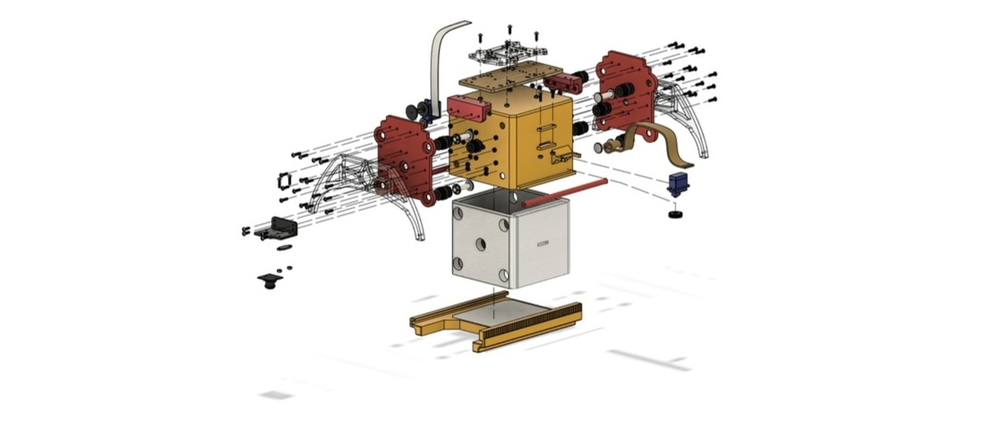
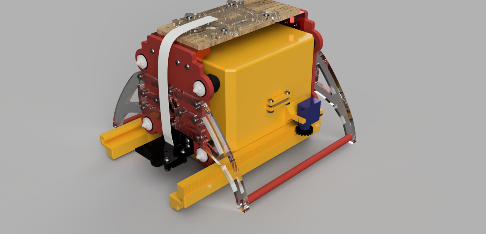

# Олимпиада НТИ 2020 – Летательная робототехника (P4DF2)

Решение задания командного зачёта на финале Олимпиады НТИ 2020 по треку Летательная робототехника командой P4DF2.

<iframe width="560" height="315" src="https://www.youtube.com/embed/W5iCv9bvDKo" frameborder="0" allow="accelerometer; autoplay; encrypted-media; gyroscope; picture-in-picture" allowfullscreen></iframe>

## Авторы

Команда P4DF2:

* Игорь Сидорин (<a href="https://t.me/maerans">@maerans</a>)
* Даниил Руфин (<a href="https://t.me/Daniil_P4R">@Daniil_P4R</a>)

## Описание задачи финала

Глобальные эпидемии всегда застают человечество врасплох, и заставляют менять привычный образ жизни. Но в этот раз на борьбу с распространением вируса встали современные технологии! На фоне эпидемии в Китае начали использовать дроны, которые патрулируют улицы и отчитывают прохожих, которые гуляют, не надевая защитную маску, а также повсеместно доставляют медикаменты.

Пока тесты на наличие вируса только начинают массово распространяться, а вакцина от вируса находится в разработке – самое время задуматься о том, как быстро и безопасно производить распространение вакцины. Помочь в этом смогут, конечно же, дроны.

Своевременное выявление вируса у жителей планеты и вакцинация позволит спасти тысячи жизней. Так, на финале участникам предлагается проработать решение для БПЛА и используя БПЛА. Используя БПЛА, разработать решение для следующих задач:

1. Получение данных о наличии людей на улицах (камеры в общественных местах позволяют определить места массового скопления людей, а сервер передать БПЛА координаты мест, где они находятся).
2. Выявление заболевших среди прохожих. Определение людей с повышенной температурой (зависит от цвета объекта расположенного под коптером, это зелёный, жёлтый или красный цвет). Обеспечение заболевших людей экспресс-тестами.
3. Обработка информации, собранной в пункте 2.
4. Сбор результатов экспресс-теста (для этого мы используем QR-коды) на наличие вируса и возвращение БПЛА на точку взлета.

## Программная часть

Для распознавания [QR-кодов][qr] мы использовали библиотеку [pyZBar][zb]. Она уже установлена в последнем [образе для Raspberry Pi](image.md).

Скрипт будет занимать 100% процессора. Для искусственного замедления работы скрипта можно запустить throttling кадров с камеры, например, в 5 Гц (`main_camera.launch`):

```xml
 <node pkg="topic_tools" name="cam_throttle" type="throttle"
    args="messages main_camera/image_raw 5.0 main_camera/image_raw_throttled"/>
```

Топик для подписчика в этом случае необходимо поменять на `main_camera/image_raw_throttled.`

Для распознавания цвета мы использовали [OpenCV][cv].

## Проблемы

Обратите внимание:

1. Пока коптер не увидит QR-код, он не полетит дальше.
2. На распознание цвета влияет освещение, поэтому желательно избавиться от солнечного света в помещении, так как солнечный свет делает изображение с неправильной цветопередачей.


## Код

```python
from __future__ import print_function
import rospy
import cv2 as cv
from clever import srv
from std_srvs.srv import Trigger
from cv_bridge import CvBridge
from sensor_msgs.msg import Image
from clever.srv import SetLEDEffect
from pyzbar.pyzbar import decode as qr_read
from threading import Thread

# inits
rospy.init_node('flight')
bridge = CvBridge()

# proxys
set_effect = rospy.ServiceProxy('led/set_effect', SetLEDEffect)
get_telemetry = rospy.ServiceProxy('get_telemetry', srv.GetTelemetry)
navigate = rospy.ServiceProxy('navigate', srv.Navigate)
navigate_global = rospy.ServiceProxy('navigate_global', srv.NavigateGlobal)
set_position = rospy.ServiceProxy('set_position', srv.SetPosition)
set_velocity = rospy.ServiceProxy('set_velocity', srv.SetVelocity)
set_attitude = rospy.ServiceProxy('set_attitude', srv.SetAttitude)
set_rates = rospy.ServiceProxy('set_rates', srv.SetRates)
land = rospy.ServiceProxy('land', Trigger)

# pubs
color_debug = rospy.Publisher("/color_debug", Image)
qr_debug = rospy.Publisher("/qr_debug", Image)


def lenta():
    print('blink purple')
    set_effect(effect='blink', r=255, g=0, b=255)
    rospy.sleep(5)
    set_effect(r=0, g=0, b=0)
    print('blink off')


def lenta_r():
    print('blink red')
    set_effect(effect='blink', r=255, g=0, b=0)
    rospy.sleep(5)
    set_effect(r=0, g=0, b=0)
    print('blink off')


def check_temp(data):
    global cap  # var for waiting the capture
    frame = bridge.imgmsg_to_cv2(data, 'bgr8')[80:160, 100:220]  # get frame
    hsv = cv.cvtColor(frame, cv.COLOR_BGR2HSV)

    # get binarized images in each color
    red = cv.inRange(hsv, (165, 70, 158), (255, 209, 255))
    yellow = cv.inRange(hsv, (10, 80, 88), (49, 220, 225))
    green = cv.inRange(hsv, (26, 28, 60), (135, 162, 225))

    # count non-zero pixels
    color = {'r': cv.countNonZero(red),
             'y': cv.countNonZero(yellow),
             'g': cv.countNonZero(green)}

    temperature[n] = max(color, key=color.get)  # get max key
    print(n, color, '     ', temperature[n])

    # draw circle in centor of colored spot (only need color)
    try:
        if temperature[n] == 'r':
            moments = cv.moments(red, 1)  # get moments for find the center
            dM01 = moments['m01']
            dM10 = moments['m10']
            dArea = moments['m00']
            x = int(dM10 / dArea)
            y = int(dM01 / dArea)
            cv.circle(frame, (x, y), 5, (0, 0, 255), -1)  # draw
        if temperature[n] == 'y':
            moments = cv.moments(yellow, 1)
            dM01 = moments['m01']
            dM10 = moments['m10']
            dArea = moments['m00']
            x = int(dM10 / dArea)
            y = int(dM01 / dArea)
            cv.circle(frame, (x, y), 5, (0, 255, 255), -1)
        if temperature[n] == 'g':
            moments = cv.moments(green, 1)
            dM01 = moments['m01']
            dM10 = moments['m10']
            dArea = moments['m00']
            x = int(dM10 / dArea)
            y = int(dM01 / dArea)
            cv.circle(frame, (x, y), 5, (0, 255, 0), -1)
    except ZeroDivisionError:
        print('zero')

    color_debug.publish(bridge.cv2_to_imgmsg(frame, 'bgr8'))  # publish to topic (for web-video-server)

    # led and print if covid
    if max(color, key=color.get) == 'y' or max(color, key=color.get) == 'r':
        t = Thread(target=lenta)
        t.daemon = True
        t.start()
        print('sbrosheno')

    # unsubscribe from topic (get only one capture)
    image_sub.unregister()
    cap = True


def qr_check(data):
    global cap
    frame = bridge.imgmsg_to_cv2(data, 'bgr8')
    barcodes = qr_read(frame)  # read the barcode using zbar
    if barcodes:
        print(barcodes[0].data)

        # draw rect and publish to topic
        (x, y, w, h) = barcodes[0].rect
        cv.rectangle(frame, (x, y), (x + w, y + h), (0, 255, 0), 3)
        qr_debug.publish(bridge.cv2_to_imgmsg(frame, 'bgr8'))

        if barcodes[0].data == 'COVID - 19' or barcodes[0].data == 'COVID - 2019':
            t = Thread(target=lenta_r)
            t.daemon = True
            t.start()

        cap = True
        image_sub.unregister()


# coords of each point
coords = {1: [0.295, 0.295, 1],
          3: [0.295, 0.885, 1],
          5: [0.295, 1.475, 1],
          7: [0.295, 2.065, 1],
          9: [0.59, 2.655, 1],
          8: [0.885, 2.065, 1],
          6: [0.885, 1.475, 1],
          4: [0.885, 0.885, 1],
          2: [0.885, 0.295, 1]}

# dict for temperatures
temperature = {}

# copter's way
path = [1, 3, 5, 7, 9, 8, 6, 4, 2]

# take off
print()
print('take off')
navigate(x=0, y=0, z=1.5, speed=0.5, frame_id='body', auto_arm=True)
rospy.sleep(1.3)
telem = get_telemetry(frame_id='aruco_map')
navigate(x=telem.x, y=telem.y, z=1.5, frame_id='aruco_map')
rospy.sleep(13)

# go using our way
for n in path:
    cap = False
    print()
    print('flight to', n, coords[n])
    navigate(x=coords[n][0], y=coords[n][1], z=coords[n][2], frame_id='aruco_map')  # go to point
    rospy.sleep(4)
    image_sub = rospy.Subscriber('main_camera/image_raw', Image, check_temp, queue_size=1)  # get capture
    while not cap:  # wait the capture
        rospy.sleep(0.5)
    rospy.sleep(3)

# home
print()
print('flight to home')
navigate(x=0, y=0., z=1.5, frame_id='aruco_map')
rospy.sleep(4)
print('land')
land()

print()
print(temperature)

print()
print('wait 2m')
rospy.sleep(120)

# take off
print()
print('take off')
navigate(x=0, y=0, z=1.5, speed=0.5, frame_id='body', auto_arm=True)
rospy.sleep(1.3)
telem = get_telemetry(frame_id='aruco_map')
navigate(x=telem.x, y=telem.y, z=1.5, frame_id='aruco_map')
rospy.sleep(3)

for n in path:
    if temperature[n] == 'r' or temperature[n] == 'y':  # if was temperatute high or middle
        cap = False
        print()
        print('flight to', n, coords[n])
        # flight to this point
        navigate(x=coords[n][0], y=coords[n][1], z=coords[n][2], frame_id='aruco_map')  # 1
        rospy.sleep(3)
        image_sub = rospy.Subscriber('main_camera/image_raw', Image, qr_check, queue_size=1)  # try to read qr
        rospy.sleep(4)
        if not cap:
            print('spusk')
            navigate(x=coords[n][0], y=coords[n][1], z=0.7, speed=0.5, frame_id='aruco_map')  # go down for better qr view
            while not cap:
                rospy.sleep(0.5)
        image_sub.unregister()  # unsubscribe of topic in each situation
        rospy.sleep(3)

    else:  # it it was good we won't fly there
        print()
        print(n, 'healthy at first')

# home
print()
print('flight to home')
navigate(x=0, y=0., z=1.5, frame_id='aruco_map')
rospy.sleep(5)
print('land')
land()
```

> **Hint** Если вы хотите использовать эту программу с другими координатами, то их можно изменить в coords, а последовательность полёта по ним, задать в `path`.

## Инженерная часть

Все чертежи, модели и программу для тестирования можно найти в [архиве](https://drive.google.com/file/d/1DoIsrYuoatBri0x2BP3WNkEkgRSVj1Kp/view?usp=sharing).

### Наименование выполняемых работ

Разработка дополнительного, модульного устройства для транспортировки и доставки хрупкого, малогабаритного груза (экспресс-теста).

#### Цель выполнения работ

Цель выполнения работ – расширение функциональных возможностей программируемого квадрокоптера “COEX Клевер 4 Code”, при помощи устройства транспортировки груза, для возможности оперативной, бесконтактной доставки квадрокоптером экспресс-тестов и вакцины. Целевая аудитория – скорая помощь, эпидемиологи, МЧС, лица с риском заболевания.

#### Минимальные требования к устройству

* Модульность;
* возможность изготовления посредством 3D печати;
* возможность осуществления сборки устройства посредством винтового/шпоночного соединения;
* способность вмещать/захватывать груз 10x10x10 см., весом не менее 200 г.;
* возможность транспортировки хрупкого груза при помощи данного устройства;
* возможность реализации бесконтактной доставки груза, не нарушая его целостности, при помощи данного устройства;
* совместимость с программируемым квадрокоптером “COEX Клевер 4 Code”;
* возможность монтажа на нижнюю деку.

## Инструкция по созданию устройства





### 3D-Печать

#### 1. Боковое крепление блока

Функция: Крепление.
Материал: PLA/ABS (или аналог). Линии стенки 2. Заполнение 10%.
Количество: 2шт.
Примечание: Можно вырезать на лазере или на фрезере.

#### 2. Демпфер

Функция: Амортизация.
Материал: TPU/FLEX (или аналог). Заполнение 100%.
Количество: 10шт.

#### 3. Штифт

Материал: PLA/ABS(или аналог). Заполнение 100%.
Количество: 8шт.
Примечания: Вы можете купить их отдельно.

#### 4. Крышка штифта

Материал: PLA/ABS(или аналог). Заполнение 100%.
Количество: 8шт.
Примечания: Вы можете купить их отдельно.

#### 5. Крепления камеры

Функция: Крепление камеры и датчика к захвату груза.
Материал:  PLA/ABS(или аналог). Заполнение 100%.
Количество: 1шт.

#### 6. Крышка

Функция: Подвижная крышка захвата.
Материал:  PLA/ABS (или аналог). Линии стенки 2. Заполнение 10%.
Количество: 1шт.

#### 7. Внутренний куб

Функция: Основная часть захвата в которую помешается груз.
Материал: PLA/ABS (или аналог). Линии стенки 2. Заполнение 10%.
Количество: 1шт.

#### 8. Распорка

Функция: Помогает удерживать ножки.
Материал: PLA/ABS (или аналог). Заполнение 50%.
Количество: 2шт.
Примечание: Лучше использовать деревянный пруток. Высверлив в нем с двух сторон отверстия под винты м3.

#### 9. Катушка

Функция: Для затягивания ленты.
Материал: PLA/ABS (или аналог). Заполнение 100%.
Количество: 1шт.

#### 10. Шестерня

Функция: Насадка на сервопривод для открытия крышки.
Материал: PLA/ABS (или аналог). Заполнение 100%.
Количество: 1шт.

#### 11. Уголки

Функция: Соединение между верхнем креплением и боковым креплением .
Материал: PLA/ABS (или аналог). Заполнение 50%.
Количество: 2шт.

### Лазерная резка

#### 1. Верхнее крепление

Функция: Переходное крепления захвата.
Материал: Дерево 4мм.
Количество: 1шт.

#### 2. Боковое крепление

Функция: Переходное крепления захвата.
Материал: Дерево 5мм.
Количество: 2шт.

#### 3. Ножка левая

Функция: Опорный элемент.
Материал: Поликарбонат 6мм.
Количество: 2шт.

#### 4. Ножка правая

Функция: Опорный элемент.
Материал: Поликарбонат 6мм.
Количество: 2шт.

#### 5. Зажим ремня

Функция: Зажим ремня.
Материал: Поликарбонат 3мм.

## Дополнительные материалы и устройства

### Крепеж

* Винт M3-12mm - 28
* Винт M3-14mm - 8
* Винт M3-10mm - 8
* Винт M2-8mm - 1
* Винт M2-6mm - 4
* Гайка 3mm - 44
* Гайка 2mm - 4

### Оборудование

1. **[Лента тканевая ширина 18мм](https://kamuflage.ru/product/lenta_bigaccessories_kipernaja_usilennaja_18_mm_chernaja.html)**.
Примечание- можно использовать любой кусок ткани порезанный на полоски толщиной в 18мм.
Длина - 30см.
2. **[Штифт и крышка для него](https://aliexpress.ru/item/32880260192.html?spm=a2g0o.productlist.0.0.5045494byPRuTJ&algo_pvid=9773d49c-235d-43ed-babd-619bd5107890&algo_expid=9773d49c-235d-43ed-babd-619bd5107890-32&btsid=0b8b036315864387585608208e95b9&ws_ab_test=searchweb0_0,searchweb201602_,searchweb201603_)**.
Количество - 8шт.
3. **[Монолитный поликарбонат прозрачный](https://narodmag.ru/shop/goods/monolitnyiy_polikarbonat_prozrachnyiy-37097)**.
размер листа - 200 мм × 200 мм × 6 мм
4. **[Поролон толщиной 10мм](https://mebel-pokupay.ru/komplektuyushie/porolon/porolon-10mm-st1825-detail)**.
Примечание - можно просто обрезать бытовую губку по нужным размерам.
5. **[Сервоприводы Feetech FS90R 360   degrees](https://aliexpress.ru/item/32984667875.html?spm=a2g0o.cart.0.0.7e193c00aJuyTp&mp=1)**.
Количество - 2шт.
6. **[Демпфер 17.5x7x20mm](https://aliexpress.ru/item/4000774099080.html?spm=a2g0o.cart.0.0.7e193c00aJuyTp&mp=1)**.
Количество - 10шт.

### Сборка

Теперь когда у вас есть все нужные части захвата, можно начинать сборку.
Все винтовые соединения рекомендуется фиксировать с помощью синего loctite.

* В первую очередь нужно вырезать из губки или поролона прокладки подходящие по размеру. Для этого можно напечатать на листе А4 приложенный чертеж и аккуратно вырезать деталь.
* Далее при помощи клея четыре губки вклеиваются внутрь куба как показано на чертеже.
* Оставшиеся губка вклеивается в крышку.
* При помощи гаек, винтов м3-12мм прикручиваем ножки к боковым креплениям
* Крепление камеры прикрутить к боковому креплению как показано на чертеже. Теперь это будет передняя часть захвата.
* Прикрутите уголки к боковым пластинам используя винты 14мм.
* Вставьте демпферы в специализированные отверстия центрального куба.
* Закрепите на демпферах боковые пластины
* Закрепите демпферы при помощи штифтов (проденьте штифт в демпфер  с внутренней стороны и закрепите его крышечкой)
* Проденьте ленту через куб закрепив в зажиме.
* Проденьте ленту в катушку и прихватите клеем.
* Прикрутите сервопривод с катушкой к специальному креплению как показано на чертеже. И вкрутите винт м2 с другой стороны.
* Прикрутите ко второму сервоприводу шестерню.
* Присоедините крышку к кубу.
* Прикрутите второй сервопривод к специальному креплению.
* Прикрепите камеру и датчик высоты.
* Прикрепите нижнюю пластину Клевера к верхней пластине захвата.
* Прикрутите верхнюю пластину к уголкам.
* Подключите сервоприводы. Красные провода подключаем к 5V, черные к GND, сигнальный провод от сервопривода, отвечающего за открытие крышки к GPIO27, а сервопривод отвечающий за натяжение ленты к GPIO22.


Если вы хотите использовать захват при полете в автономном режиме, то следует поменять параметры в `main_camera.launch` на следующие:

```xml
<node pkg="tf2_ros" type="static_transform_publisher" name="main_camera_frame" args="0.102 0 -0.175 1.5707963 0 3.1415926 base_link main_camera_optical"/>
```

[zb]: https://pypi.org/project/pyzbar/
[qr]: https://drive.google.com/open?id=1EXVQuKLtFaBl3T1LEd1jgbjL2j6t8ySo
[cv]: https://opencv.org/
