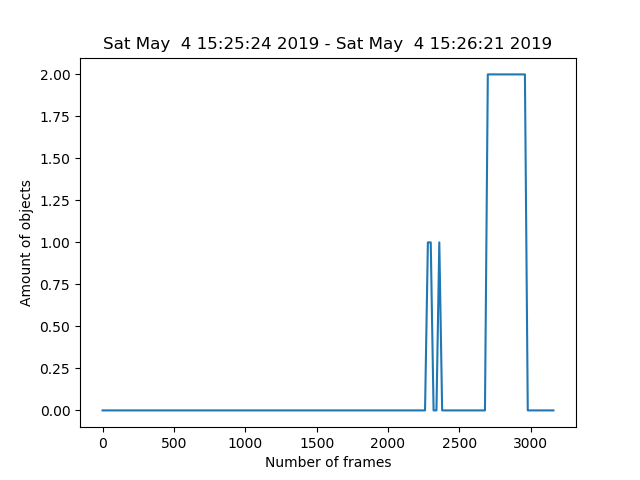

# Система распознавания и подсчета количества объектов

## Введение

Системы компьютерного зрения все шире используются для решения повседневных задач в самых различных сферах, начиная от промышленности, заканчивая медициной. Алгоритмы распознавания образов позволяют идентифицировать объекты, определять их тип, предоставляют необходимую качественную и количественную информацию. Целью данного проекта было создание системы подсчета количества объектов (людей, машин), используя технологии компьютерного зрения.

## Установка

Для начала нужно установить все необходимые библиотеки:

```bash
pip install opencv-contrib-python imutils matplotlib dlib
```

***Библиотека dlib устанавливается достаточно долго, так что не стоит пугаться того, что процесс зависает.***

Затем скачать программу из репозитория:

```bash
git clone https://github.com/mmkuznecov/objects_counting_from_clever.git
```

## Примеры работы

Система может быть адаптирована для разных условий, съёмка может производиться как из статичного положения,


так и в динамическом полёте.


## Использование

Подключитесь к Клеверу и проверьте, передается ли изображение с камеры. Для использования скрипта просто перейдите в папку, куда был скачан скрипт и пропишите в консоли, где op - название выходного видео:

```bash
python count.py -o op.avi
```

По умолчанию программа будет считать количество людей. Для того чтобы прописать распознавание только определенного объекта, нужно приписать в конце тип объекта для распознавания, например, следующая команда позволит распознавать машины:

```bash
python count.py -o op.avi -t car
```

Полный список распознаваемых объектов приведен ниже:

background, aeroplane, bicycle, bird, boat,
bottle, bus, car, cat, chair, cow, diningtable,
dog, horse, motorbike, person, pottedplant, sheep,
sofa, train, tvmonitor

Итогом работы программы будет записанное видео с метками, отмечающими распознавание объектов и их номер, а также .png изображение, на котором показана информация о времени записи видео, количестве распознанных объектов в разное время.



По вопросам пишите в Telegram @mmkuznecov.
