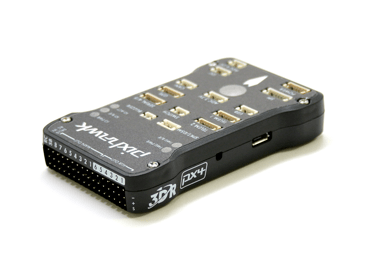
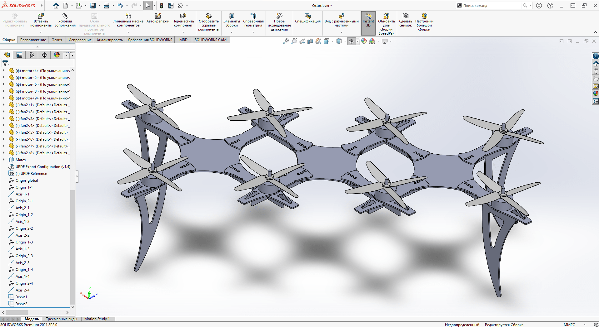

# Октокоптер со специфичным расположением пропеллеров

[CopterHack-2021](copterhack2021.md), команда **PаD30DЖ**.


## Введение

Наверное каждый, когда видит впервые летающий дрон, задается рядом вопросов типа:"А сколько он может летать так?","А как далеко он может улететь?","А сколько он может поднять?". Наша команда, проявила интерес к последнему из них, а именно к вопросу грузоподъёмности квадрокоптера компании COEX - Clover 4. Имея на руках сопутствующее оборудование и тягу к полетам, мы экспериментально выяснили, что полезная нагрузка данной модели коптера является масса от 800 до 1000 грамм. Но почему так мало и что с этим делать? Ведь в недалеком будующем уже должна развиться повсеместная доставка товаров на дронах и данное направление не должно ограничиваться 1 килограммом полезной нагрузки. Пребывая в поисках решений этой проблемы, мы решили реализовать самое элементарное что может прийти в голову - просто присоединить к одному дрону второй! Изучая список рекомендованных организаторами тем на конкурс CopterHack2021, мы нашли такую тему как "Два дрона в твердой связке", что являлось 100-процентным попаданием в интересующую нас область летательной робототехники.


## Разработка

В результате поиска решения, удовлетворяющего всем нашим требованиям, мы остановились на нескольких вариантах. Было решено для начала сделать октокоптер со специфичным расположением пропеллеров, собственно как если бы два дрона соединили вместе на стандартном расстоянии двух парных пропеллеров квадрокоптера. Промежуточную часть было решено делать из стандартных соединительных деталей дрона (центральная дека, 4 луча, 2 крестовины), которые идут в базовой комплектации Clover 4.


В качетве полетного контролера был выбран Pixhawk v.4, т.к. он, в отличии от стандартных на Клеверах Pixracer и CoexPix имеет больше сигнальных портов для движков.



В качестве радиоприемника и радиопередатчика использовались стандартное оборудование FlySky.

Чтобы не отходить от темы "двух дронов в твердой связке", было принято решение использовать для одного октокптера две стандартные платы распределения питания. Вопрос питания временно остается открытым. Сейчас к двум отдельным PDB подсоединяются два отдельных аккумулятора, провода к контроллеру идут только от одной из плат распределения питания. Можно было бы использовать специализированную PDB и один обычный акквмулятор на 5200 mA/h, но тогда бы наш проект потерял свою "изюминку" и основную идею для развития.

## Прошивка

https://drive.google.com/drive/folders/1Zc878JuDw_4FKSvvzibzGLVOnaxFhiqL?usp=sharing - ссылка на прошивку октокоптера с расширением PX4.

https://github.com/matveylapin/PX4-Autopilot - ссылка на прошивку октокоптера со всеми исходниками.

Основное отличие нашей прошивки, от прошивки Clover 4, не считая того, что первый окто-, а второй квадро-коптер, является наличие нескольких новых особых файлов, они и будут описаны ниже.

Первый файл - это файл геометрии.В нем прописываются координаты моторов в локальной системе координат дрона. Это требуется для составления обратной кинематической модели.

```python
# Firmware/src/lib/mixer/geometries/MultirotorMixer/octa_h.toml

[info]
key = "8h"
description = "the coolest geometry on the planet"

[rotor_default]
axis      = [0.0, 0.0, -1.0]
Ct        = 1.0
Cm        = 0.05

[[rotors]]
name      = "front_right"
position  = [0.5, 1, 0.0]
direction = "CCW"

[[rotors]]
name      = "rear_left"
position  = [-0.5, -1, 0.0]
direction = "CCW"

[[rotors]]
name      = "mid_front_right"
position  = [0.5, 0.5, 0.0]
direction = "CW"

[[rotors]]
name      = "rear_right"
position  = [-0.5, 1, 0.0]
direction = "CW"

[[rotors]]
name      = "front_left"
position  = [0.5, -1, 0.0]
direction = "CW"

[[rotors]]
name      = "mid_rear_left"
position  = [-0.5, -0.5, 0.0]
direction = "CW"

[[rotors]]
name      = "mid_front_left"
position  = [0.5, -0.5, 0.0]
direction = "CCW"

[[rotors]]
name      = "mid_rear_right"
position  = [-0.5, 0.5, 0.0]
direction = "CCW"
```

Вторым файлом является миксер. В нем можно задать ограничения как всех моторов сразу, так и для отдельных групп.

```python
# Firmware/ROMFS/px4fmu_common/mixers/octo_h.main.mix
# Octo H

R: 8h 10000 10000 10000 0
```

Третий и последний файл является основным файлом эирфпейма. В нем записываются дефолтные конфиги самой прошивки PX4. Также прописывается сам миксер и выход

```python
#!/bin/sh
# Firware/ROMFS/px4fmu_common/init.d/airframes/8111_octo_h

sh /ect/init.d/rc.mc_defaults

set MIXER octo_h

set PWM_OUT 12345678
```

## 3D-модель

Изначально, при принятии решения взяться за проект, нашим программистом был предложен вариант протестить все в симуляторе Gazebo. Ввиду недостатка времени над работой связанной с проектом, реализация предложения оттянута на неопределенный срок. Но, не смотря на этот факт, для более лучшей визуализации проекта, была сделана 3D-модель октокоптера. Все детали для сборки можно скачать по ссылке - https://drive.google.com/drive/folders/1TuxiSWmiPWIslp03GDKJL4yQ729Cn70I?usp=sharing.



## Ожидание

Изначально у команды имелось намерение реализовать все в очень короткие сроки, сделав акцент на презентации и дальнейшем развитии.

## Реальность

Ввиду многих отвлекающих факторов, таких как: учеба, работа, проживание в условиях пандемии, невозможность собраться всем сокомандникам вместе на одной площадке, выполнение проекта долго оттягивалось и конкретика по этому вопросу каждый раз переносилась на следующую неделю. За достаточно малый промежуток времени, а именно за три недели до финала конкурса, мы взялись за дело. Вплоть до дня проведения финала CopterHack2021 команда будет работать над рабочим прототипом, чтобы 20-21 марта 2021 года показать реализованный проект. Данная статья также подлежит редактированию, по мере нашего прогресса.

С наилучшими пожеланиями и воодушевленным настроем, команда PаD30DЖ!
