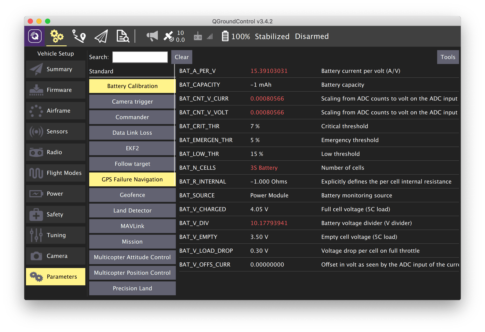

# Параметры PX4

Основная статья: https://dev.px4.io/en/advanced/parameter_reference.html

> **Note** Это описание некоторых, наиболее важных параметров PX4 по состоянию на версию 1.8.0. Полный список см. по ссылке выше.

Для изменения параметров PX4 можно воспользоваться программой QGroundControl, [подключившись к Клеверу по Wi-Fi](gcs_bridge.md):

## Основные параметры

Наиболее важные параметры вынесены в этот параграф.

`SYS_MC_EST_GROUP` – выбор модуля estimator'а.

Это группа модулей, которая вычисляет текущее состояние (state) коптера, используя показания с датчиков. В состояние коптера входит:

* угловая скорость коптера – pitch_rate, roll_rate, yaw_rate;
* ориентация коптера (в локальной системе координат) – pitch (тангаж), roll (крен), yaw (рысканье) (одно из представлений);
* позиция коптера (в локальной системе координат) – x, y, z;
* скорость коптера (в локальной системе координат) – vx, vy, vz;
* глобальные координаты коптера – latitude, longitude, altitude;
* высота над поверхностью;
* другие параметры (дрейф гироскопов, скорость ветра и пр.).

`SYS_AUTOCONFIG` – сброс всех параметров (при установке в значение 1).

## EKF2

`EKF2_AID_MASK` – выбор датчиков, которые используются EKF2 для вычисления состояния коптера.

`EKF2_HGT_MODE` – основной источник данных о высоте (z в локальной системе координат):

* 0 – давление с барометра.
* 1 – GPS.
* 2 – дальномер (например, vl53l1x).
* 3 – данные с VPE.

Вариант 2 является наиболее точным, но его корректно использовать, только если поверхность, над которой летает коптер – плоская. В противном случае начало координат по Z будет двигаться вверх и вниз с изменением высоты поверхности.

## Multicopter Position Control (полет по позиции)

Данные параметры настраивают полет коптера по позиции (режимы POSCTL, OFFBOARD, AUTO).

`MPC_THR_HOVER` – газ висения. Данный параметр необходимо установить на примерный процент газа, необходимый для того, чтобы коптер удерживал высоту. Если коптер имеет тенденцию набирать или терять высоту в режиме удержания высоты – можно уменьшить или увеличить это значение.

`MPC_XY_P` – коэффициент *P* регулятора по позиции. Этот параметр влияет на то, насколько резко коптер будет выполнять заданные команды по позиции. Слишком большое значение может вызвать перестрелы.

`MPC_XY_VEL_P` – коэффициент *P* регулятора по скорости. Данный параметр также влияет на точность и резкость выполнения коптером заданной позиции. При слишком большом значении возможны перестрелы.

`MPC_XY_VEL_MAX` – максимальная горизонтальная скорость в режимах POSCTL, OFFBOARD, AUTO.

`MPC_Z_P`, `MPC_Z_VEL_P` – коэффициенты *P* регуляторов по вертикальной позиции и скорости. Влияют на удерживание коптером необходимой высоты.

`MPC_LAND_SPEED` – вертикальная скорость посадки в режиме LAND.

## LPE + Q attitude estimator

Данные параметры настраивают поведение модулей `lpe` и `q`, которые вычисляют состояние (ориентацию, позицию) коптера. Эти параметры применяются **только** если параметр `SYS_MC_EST_GROUP` установлен в значение `1` (local_position_estimator, attitude_estimator_q)

TODO

## Commander

Преарм-чеки, переключение режимов и состояний коптера.

## Sensors

Включение, выключение и настройка различных датчиков.

TODO
