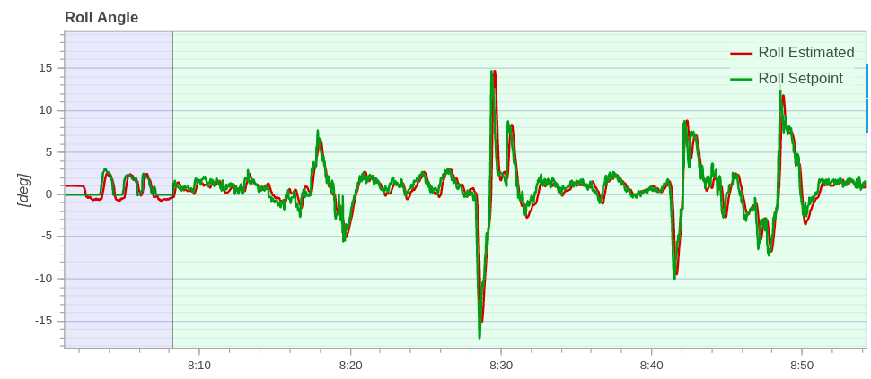

# Настройка PID регуляторов

Основная статья: https://docs.px4.io/v1.9.0/en/config_mc/pid_tuning_guide_multicopter.html.

В этой статье описаны методы и основные технологии настройки каскадного ПИД-регулятора. Приведенные советы и методики подходят для любых видов рам (Квадрокоптеров, Гексакоптеров, Октокоптеров и т.д.).

Усредненные рекомендованные настройки для комплектов Клевер приведены в статье "[Первоначальная настройка](setup.md)".

> **Caution** Эта статья только для продвинутых пользователей. Плохая или неполная настройка ПИД регуляторов может привести к сильным поломкам вашего дрона.

## Введение

В PX4 используются Пропорционально-Интегрально-Дифференцирующий (ПИД) регулятор, являющийся одним из самых распространенных методов управления.

Регулятор реализованный в PX4 является каскадным. Это подразумевает, что он состоит из нескольких элементов, которые по очереди (каскадно) передают свои значения элементам находящимся ниже. Соответственно регуляторы более высокого уровня передает свой результат регулятору более низкого уровня.

Регулятор самого низкого уровня, это регулятор угловых скоростей, далее регулятор положения и последние, регуляторы скорости и позиции. Настройка ПИД-регулятора должна выполняться в том же порядке, начиная с регулятора угловой скорости, поскольку это повлияет на все остальные уровни.

## Шаги настройки

В случае, если у вас нет опыта настройки ПИД регуляторов, придерживайтесь представленных ниже особенностей настройки.

* Все изменения значений регулятора должны быть постепенными, в противном случае могут появится сильные осцилляции и вы совершенно потеряете контроль над аппаратом. Увеличивайте значения регулятора не более чем на 25-30% от настоящего значения, уменьшайте на 5-10% до окончательной настройки.
* Сажайте аппарат перед следующей итерацией смены коэффициентов. Перед следующим взлетом очень медленно увеличивайте стик газа для проверки аппарата на сильные осцилляции.

## Регулятор угловых скоростей

Регулятор угловых скоростей является самым низкоуровневым в каскаде, он состоит из трех независимых ПИД-регуляторов, управляющих угловыми скоростями коптера по трем осям (крен, тангаж, рысканье).

* Регулятор угловых скоростей по крену (`MC_ROLLRATE_P`, `MC_ROLLRATE_I`, `MC_ROLLRATE_D`)
* Регулятор угловых скоростей по тангажу (`MC_PITCHRATE_P`, `MC_PITCHRATE_I`, `MC_PITCHRATE_D`)
* Регулятор угловых скоростей по рысканью (`MC_YAWRATE_P`, `MC_YAWRATE_I`, `MC_YAWRATE_D`)

> **Note** Хорошая настройка коэффициентов регулятора угловых скоростей очень важна и влияет на все режимы полета. В то время как плохая настройка регуляторов будет заметна во всех режимах полета, к примеру в режиме Position вы можете видеть подергивания во время зависания аппарата.

Регулятор угловых угловых скоростей можно настраивать как в режиме ACRO, так и в режиме STABILIZED.

Предпочтительнее настраивать регуляторы в режиме ACRO, поскольку вам будет легче визуально заметить произведенные изменения коэффициентов. Если вы собираетесь использовать этот режим отключите Expo-параметры и снизьте чувствительность стиков для облегчения управления.

* `MC_ACRO_EXPO` = 0, `MC_ACRO_EXPO_Y` = 0, `MC_ACRO_SUPEXPO` = 0, `MC_ACRO_SUPEXPOY` = 0
* `MC_ACRO_P_MAX` = 200, `MC_ACRO_R_MAX` = 200
* `MC_ACRO_Y_MAX` = 100

Режим STABILIZED легче для управления но также в нем вам будет сложнее заметить изменения поведения вашего аппарата при настройке коэффициентов.

Если ваш аппарат вообще не летает обратите внимание на две основные вещи:

* Если вы видите сильные осцилляции при попытке взлета, уменьшайте все коэффициенты *P* и *D* до тех пор, пока аппарат не поднимется в воздух.
* С другой стороны, если аппарат почти не реагирует на управление передаваемое с пульта, увеличивайте коэффициент *P*.

Концепция настройки регуляторов одинакова как в режиме STABILIZED, так и в режиме ACRO. Итеративно с указанным шагом настраиваете коэффициенты *P* и *D* для крена и тангажа, а затем изменяете *I*. Первоначально вы можете использовать одинаковые значения для крена, когда регуляторы настроены достаточно хорошо вы можете точно донастроить их по крену и тангажу отдельно (если ваш аппарат симметричен, можете оставить коэффициенты одинаковыми). Идея настройки регулятора рыскания идентична настройке крена и тангажа, за исключением того, что коэффициент *D* может оставаться нулевым.

<!-- TODO написать про настройку в Position -->

### Настройка коэффициента *P*

Коэффициент *P* (пропорциональный) используется для минимизации ошибки отслеживания и отвечает за скорость отклика, по этому должен быть установлен как можно выше, но без осцилляций.

При настройке коэффициента *P* пользуйтесь двумя основными наблюдениями:

* Если *P* слишком большой: вы увидите высокочастотные осцилляции.
* Если *P* слишком маленький:
    1. Аппарат медленно реагирует на входящее управление
    2. В режиме ACRO аппарат будет постоянно дрейфовать и вам нужно будет его корректировать, чтобы сохранить его уровень.

### Настройка коэффициента *D*

Коэффициент *D* (дифференциальный) используется для демпфирования. Этот коэффициент должен быть как можно выше, но таким образом, что бы не было "перестрелов" по управлению.

При настройке коэффициента *D* пользуйтесь двумя основными наблюдениями:

* Если *D* слишком большой: моторы могут подергиваться и сильно нагреваться во время полета, поскольку коэффициент *D* увеличивает шумы управления.
* Если *D* слишком маленький: возникнут "перестрелы" по входящему управляющему сигналу.

### Настройка коэффициента *I*

Коэффициент *I* сохраняет "воспоминания" об ошибке. Это значит, что элемент *I* увеличивается в случае, если желаемая скорость не устанавливается в течении некоторого времени. Этот параметр важен для режима ACRO, а также оказывает достаточно сильное влияние на режимы POSITION и OFFBOARD.

* Если *I* слишком большой: вы можете увидеть медленные осцилляции
* Если *I* слишком маленький: можно заметить ошибку по выполнению управляющего воздействия. Также заниженный коэффициент *I* заметен на логах, это характеризуется тем, что на графиках желаемая скорость длительное время отличается от фактической.

## Процедура тестирования

После изменения коэффициентов регулятора, для того, чтобы протестировать новые значения, подайте на вход аппарата быстрый ступенчатый ввод. Для этого быстро наклоните стик радиоаппаратуры в сторону, при этом коптер точно должен выполнять переданное управление, без осцилляций и "перестреливания". Поскольку обычно стики радиоаппаратуры подпружинены, в случае если их отпустить, они начинают колебаться, хорошо настроенный аппарат будет колебаться вместе со стиком.

## Конфигурация логгера

Для получения более полной информации с графиков вы можете настроить логгер удобным вам образом. Для его настройки вы можете пользоваться параметрами:

* `SDLOG_PROFILE` - включение большого количества функций приводит к увеличению размера файла лога, а также к увеличению требований по скорости записи, перед начало работой убедитесь, что используете накопитель с достаточной пропускной способностью.
    1. default set - запись общих логов системы
    2. estimator replay (EKF2) - более подробное логирование при использовании EKF2
    3. thermal calibration - высокочастотные данные с IMU и барометра
    4. system identification - высокочастотные данные приводов и IMU
    5. high rate - высокочастотные данные радио, угловых скоростей и приводов
    6. debug - для записи пользовательских отладочных топиков
    7. sensor comparison - низкочастотные данные IMU, барометра и компаса, для сравнения показаний датчиков
* SDLOG_MODE
    1. when armed until disarm - лог записывается с момента арма коптера, до момента дизарма коптера
    2. from boot until disarm - лог записывается с момента запуска системы, до момента дизарма коптера
    3. from boot until shutdown - лог записывается с момента запуска системы, до момента выключения системы

## Анализ логов

> **Note** Настройка параметров с использованием логов сильно сложнее чем визуальная настройка и при неправильных действиях вы можете ухудшить качество полета вашего коптера.

Просмотр логов сильно помогает в настройке и позволяет более точно оценивать качество произведенной настройки.

Среди представленных графиков, больше всего вам могут понадобиться:

* Roll/Pitch/Yaw Angular Rate - графики угловых скоростей
* Roll/Pitch/Yaw Angle - графики углов наклона
* Local Position X/Y/Z - позиция вашего коптера в пространстве
* Step Response for Roll/Pitch/Yaw Rate - отклик коптера на входящее управление

Ниже представлены графики угловых скоростей и углов при хороших настройках регулятора.

На графиках красной линией отмечено рассчитанное значение, а зеленой требуемое.

Качество настройки характеризуется тем, что рассчитанное значение должно быть максимально близким к требуемому. Если оба графика совпадают, это значит, что ваш коптер точно выполняет все переданные ему команды, если же графики сильно отличаются, во время полета вы заметите, что коптер неправильно выполняет ваши команды управления.

## Регулятор положения

Данный регулятор является вторым уровнем каскада и настраивается после регуляторов угловых скоростей. Он отвечает за угол наклона коптера и настраивается с помощью параметров:

* Регулятор угла по крену (`MC_ROLL_P`).
* Регулятор угла по тангажу (`MC_PITCH_P`).
* Регулятор угла по рысканью (`MC_YAW_P`).

В данном регуляторе настраиваемыми являются только пропорциональные значения и в большинстве случаев их стоит оставить со стандартными значениями.

Идея настройки данных параметров точно такая же, как и настройки P параметров регуляторов угловых скоростей. При высокочастотных осцилляциях уменьшите значение, пре медленном выполнение команды увеличьте его.
