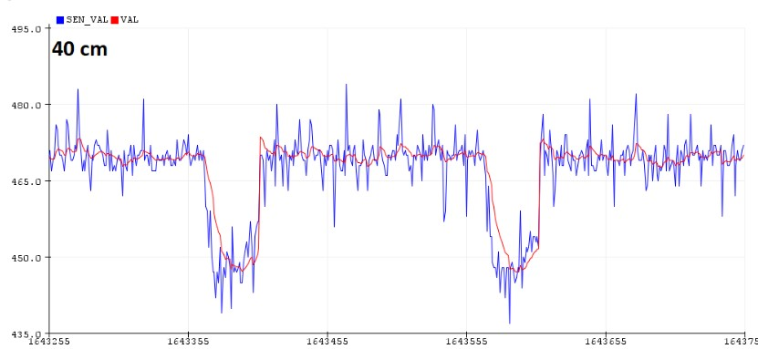
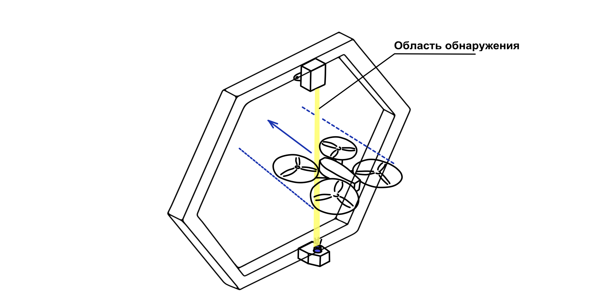
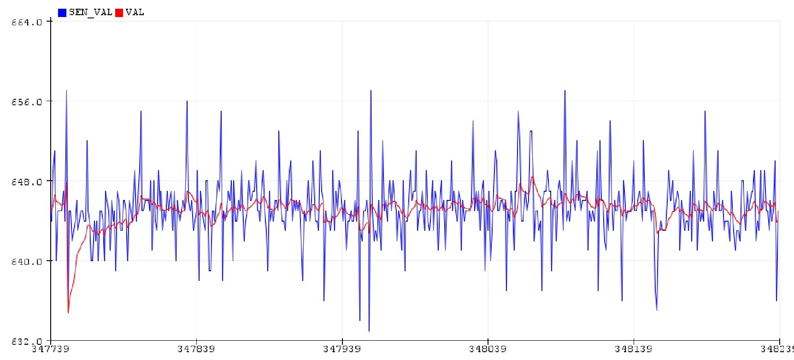

# Система засечки (хронометража) для дронов

[CopterHack-2021](copterhack2021.md), команда **Atomic Ferrets**.

Наша команда состоит из двух человек - Стецкий Сергей и Давлетшин Денис.

По всем вопросам обращаться на почту (bashirianboy@gmail.com) или [Телеграм](https://t.me/DenisNoLimit).

## Идея

На сегодняшний день существует множество засечек для дронов, но тех, которые производят в России, мало, а таких, которые бы имели приемлемую цену, еще меньше. Поэтому было решено сделать собственную систему засечки, которая давала бы весь нужный функционал, и производство которого было бы не столь затратным.

Ознакомиться с кодом проекта вы можно через репозиторий: https://github.com/stinger000/CopterHack2020_IR_LED.

## Принцип работы

Прелесть нашей системы в том, что ее концепция проста - использование чувствительного фотодатчика - фотодиода, и светодиода. Фотодатчик и ИК светодиод крепятся на ворота друг напротив друга, и светодиод все время направлен на датчик. Когда дрон пролетает через ворота, он на какое-то время перекрывает собой светодиод, и показания на датчике тут же меняются. На этом и основан принцип работы. Остается только подключить датчик к схеме, способной считывать световой поток, падающий на него, и затем отправлять сигнал о детектировании пролета на компьютер. Для наших целей мы использовали Arduino.

Для Arduino написан код, который обрабатывает постоянно поступающие на него сигналы с фотодиода. Затем используется имитация фильтра низких частот, сглаживающий шумы, которые по сравнению с реальным сигналами более низкочастотные. Фильтрация шумов помогает в том случае, когда датчик и светодиод разнесены далеко друг от друга, и световой поток в этом случае может смешаться с шумом.

На рисунке ниже изображена типичная временная диаграмма сигнала. "Ямы" образуются во время пролета через засечку. Синим цветом показан "сырой" сигнал, а красным - обработанный с помощью low-pass фильтра. Подбором параметров фильтра можно добиться того, чтобы принципиальный вид сигнала не менялся, а шумы сглаживались.



Алгоритм работает так, что пролет засчитывается поле того, как будет обнаружен спад и последующий подъем сигнала, а также амплитуда сигнала должна больше некоторого выставленного вручную минимума (зависит от шумов собранной системы).

Затем по Serial-порту Arduino отправляет специальный символ, который обозначает обнаружение пролета.

Компьютер, к которому подключена засечка, может считывать этот сигнал, и затем выводить на любой интерфейс.

## Результат работы

Вы можете посмотреть короткую видеопрезентацию:

<iframe width="640" height="480"src="https://www.youtube.com/embed/MEJdM9arz5c" frameborder="0" ; autoplay; encrypted-media; gyroscope; picture-in-picture"> </iframe>

## Использование

Данный проект можно использовать для любых квадрокоптеров достаточно больших размеров. Условие, которое необходимо выполнить, это то, чтобы дрон при пролете перекрывал собой светодиод. То есть дрон должен попадать в довольно узкий диапазон. Это наглядно проиллюстрировано на рисунке ниже:



Для начала работы скачайте репозиторий с кодом обработки пролетов и репозиторий с пользовательским интерфейсом:

```bash
git clone https://github.com/stinger000/CopterHack2020_IR_LED
git clone https://github.com/stinger000/CopterHack2020_IR_LED_Desktop_GUI
```

Зайдите в папку Signal_handler репозитория `CopterHack2020_IR_LED` и откройте в Arduino IDE файл `AnalogReadSerial_filtered_v2.ino`.

Надо раскомментировать строки:

```cpp
//debug in plotter
//Serial.print(sensorValue);   // uncomment this 4 rows
//Serial.print(" ");
//Serial.println(value);
//...
```

и закомментировать строку вывода символа в Serial-порт:

```cpp
// ...
if ( rising_edge & falling_edge  )
{
    // ...
    // Send time by serial port to GUI
    Serial.println(millis()); //comment this line
    //...
}
```

Перепрошейте ваше Arduino этим файлом. Затем проверьте сигнал в плоттере.



По нему задать величину шума, получившуюся для вашей системы: за это отвечает переменная `noise`.

Например на рисунке ниже величина шумов (для отфильтрованного красного сигнала) достигает 10 единиц.

Затем закомментируйте и раскомментируйте обратно строки кода и перепрошейте Arduino.

В терминале запустите файл с графическим интерфейсом (# такой то файл):

```bash
cd CopterHack2020_IR_LED_Desktop_GUI
python main.py
```

Затем подключите Arduino через USB-кабель в ваш компьютер и нажмите "Connect".

Начало и конец отсчета замеров производится кнопками "start" и "stop".
